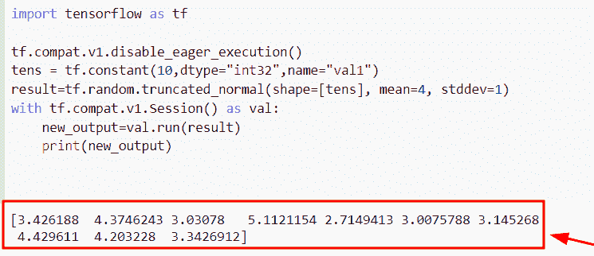
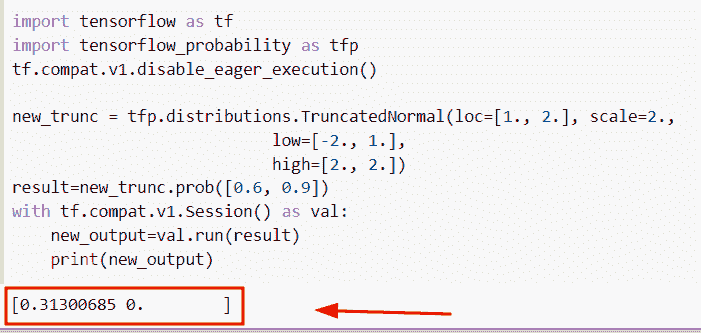
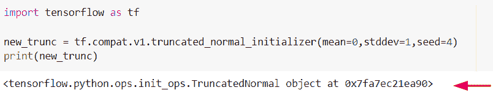
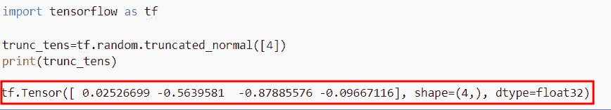
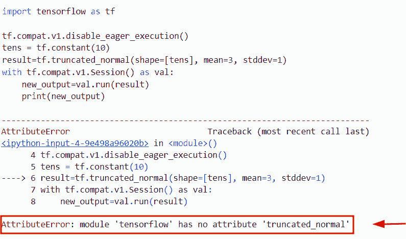
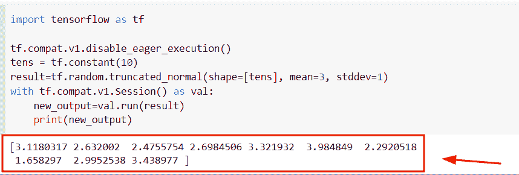
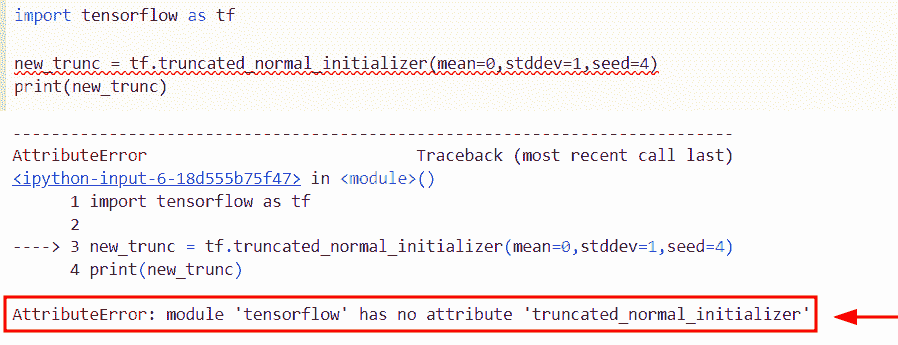

# Python 张量流截断法线

> 原文：<https://pythonguides.com/tensorflow-truncated-normal/>

[](https://sharepointsky.teachable.com/p/python-and-machine-learning-training-course)

在本 [Python 教程](https://pythonguides.com/learn-python/)中，我们将学习**如何在 TensorFlow 中使用截断法线**函数。此外，我们将讨论以下主题。

*   张量流分布截断 _ 正态
*   tensor flow truncated _ normal _ initailizer
*   张量流截断正态示例
*   张量流没有属性“truncated_normal”
*   TensorFlow 没有属性“truncated_normal_initializer”

目录

[](#)

*   [Python TensorFlow 截断法线](#Python_TensorFlow_Truncated_normal "Python TensorFlow Truncated normal")
*   [张量流分布截断 _ 正态](#TensorFlow_distribution_truncated_normal "TensorFlow distribution truncated_normal")
*   [tensor flow truncated _ normal _ initailizer](#TensorFlow_truncated_normal_initailizer "TensorFlow truncated_normal_initailizer")
*   [张量流截断正态例子](#TensorFlow_truncated_normal_example "TensorFlow truncated normal example")
*   [张量流没有属性‘truncated _ normal’](#TensorFlow_has_no_attribute_truncated_normal "TensorFlow has no attribute ‘truncated_normal’")
*   [TensorFlow 没有属性“truncated _ normal _ initializer”](#TensorFlow_has_no_attribute_truncated_normal_initializer "TensorFlow has no attribute ‘truncated_normal_initializer’")

## Python TensorFlow 截断法线

*   在这一节中，我们将讨论如何在 [Python TensorFlow](https://pythonguides.com/tensorflow/) 中使用截断正态函数。
*   为了执行这个特定的任务，我们将使用`TF . random . truncated _ normal()`函数，该方法用于从正态分布生成随机值，正态分布是指在许多事件中出现的概率分布。
*   在本例中，我们将使用一个正常的常量变量，它将被视为张量的形状，并应用于`TF . random . truncated _ normal()`函数。

**语法:**

我们先来看看语法，了解一下`TF . random . truncated _ normal()`函数的工作原理。

```py
tf.random.truncated_normal
                          (
                           shape,
                           mean=0.0,
                           stddev=1.0,
                           dtype=tf.dtypes.float32,
                           seed=None,
                           name=None
                          )
```

*   它由几个参数组成
    *   **shape:** 该参数表示给定张量的输出，它必须是包含唯一整数值的一维张量。
    *   **mean:** 默认情况下，它采用 `0` 值，并指定我们必须找到给定正态分布的平均值。
    *   **stddev:** 该参数表示我们必须找到给定正态分布的标准偏差，默认情况下，它取一个 `1.0` 值。
    *   **dtype:** 默认取 `tf.dtypes.float32()` 值，表示输出的数据类型。
    *   **name:** 这是一个可选参数，定义操作的名称(truncate name)。

**举例:**

我们举个例子，检查一下如何使用`TF . random . truncated _ normal()`函数。

**源代码:**

```py
import tensorflow as tf

tf.compat.v1.disable_eager_execution()
tens = tf.constant(10,dtype="int32",name="val1")
result=tf.random.truncated_normal(shape=[tens], mean=4, stddev=1)
with tf.compat.v1.Session() as val:
    new_output=val.run(result)
    print(new_output)
```

在上面的代码中，我们已经导入了 Tensorflow 库，然后使用`TF . compat . v1 . disable _ eager _ execution`函数来创建会话。

之后，我们应用常量函数来创建张量形状，然后使用`TF . random . truncated _ normal()`函数，在这个函数中，我们将**形状、平均值、标准偏差**指定为参数。一旦执行了这段代码，输出将显示正态分布的随机值。

下面是下面给出的代码的截图。



Python TensorFlow Truncated normal

阅读: [TensorFlow Tensor to NumPy](https://pythonguides.com/tensorflow-tensor-to-numpy/)

## 张量流分布截断 _ 正态

*   这里我们要讨论的是如何在 Python TensorFlow 中使用**分布 truncated_normal()** 函数。
*   在 Python 中，该函数是正态分布，它在低参数和高参数之间的界限内，而概率密度在这些界限之外是 `0` 。

**语法:**

我们先来看看语法，了解一下`TFP . distribution . truncated normal()`函数在 Python TensorFlow 中的工作原理。

```py
tfp.distribution.TruncatedNormal
                                (
                                 loc,
                                 scale,
                                 low,
                                 high,
                                 validate_args=False,
                                 allow_nan_stats=True,
                                 name='TruncatedNormal'
                                )
```

*   它由几个参数组成
    *   **loc:** 该参数表示正态分布的均值，值必须是浮点数。
    *   **标度:**该参数指定正态分布的标准差。
    *   **低:**是正态分布的下限，代表浮动值。
    *   **高:**是正态分布的上限，表示浮动值。
    *   **validate_args:** 默认情况下，它接受一个 `false` 值，如果为 true，则在运行时检查分布参数。
    *   **allow_nan_stats:** 默认情况下，它接受一个 `true` 值，如果它是**‘false’**，如果统计 nan 值未定义，则会引发一个异常。

**举例:**

我们举个例子，检查一下如何在 Python 中使用**分布 truncated_normal()函数**。

**源代码:**

```py
import tensorflow as tf
import tensorflow_probability as tfp
tf.compat.v1.disable_eager_execution()

new_trunc = tfp.distributions.TruncatedNormal(loc=[1., 2.], scale=2.,
                           low=[-2., 1.],
                           high=[2., 2.])
result=new_trunc.prob([0.6, 0.9])
with tf.compat.v1.Session() as val:
    new_output=val.run(result)
    print(new_output)
```

在下面给出的代码中，我们导入了别名为‘TFP’的 `tensorflow_probability()` 库。

之后，我们使用了`TFP . distribution . truncated normal()`函数，在这个函数中，我们将 **loc、scale、low 和 high** 指定为参数。

下面是以下给定代码的实现



TensorFlow distribution truncated_normal in Python

阅读:[张量流得到形状](https://pythonguides.com/tensorflow-get-shape/)

## tensor flow truncated _ normal _ initailizer

*   在本期节目中，我们将讨论如何在 TensorFlow Python 中使用`truncated _ normal _ initializer()`函数。
*   在 Python 中，初始化器意味着我们必须生成正态分布的张量。

**语法:**

下面是 Python TensorFlow 中`TF . compat . v1 . truncated _ normal _ initializer()`函数的语法。

```py
tf.compat.v1.truncated_normal_initializer
                                         (
                                          mean=0.0,
                                          stddev=1.0,
                                          seed=None,
                                          dtype=tf.dtypes.float32
                                         )
```

**举例:**

我们举个例子，检查一下如何在 Python 中使用`truncated _ normal _ initializer()`函数。

**源代码:**

```py
import tensorflow as tf

new_trunc = tf.compat.v1.truncated_normal_initializer(mean=0,stddev=1,seed=4)
print(new_trunc)
```

你可以参考下面的截图。



Python TensorFlow truncated_normal_initailizer

阅读:[Python tensor flow reduce _ sum](https://pythonguides.com/python-tensorflow-reduce_sum/)

## 张量流截断正态例子

*   在本例中，我们将讨论如何在 TensorFlow Python 中从截断的正态分布生成随机值。
*   为了执行这个特定的任务，我们将使用`TF . random . truncated _ normal()`函数，该函数用于从截断正态分布中生成随机值。

**语法:**

下面是 Python TensorFlow 中`TF . random . truncated _ normal()`函数的语法。

```py
tf.random.truncated_normal
                          (
                           shape,
                           mean=0.0,
                           stddev=1.0,
                           dtype=tf.dtypes.float32,
                           seed=None,
                           name=None
                          )
```

**举例:**

```py
import tensorflow as tf

trunc_tens=tf.random.truncated_normal([4])
print(trunc_tens)
```

在上面的代码中，我们导入了 Tensorflow 库，然后使用了`TF . random . truncated _ normal()`函数，在这个函数中，我们指定了输出张量的形状。

下面是以下给定代码的执行。



Python TensorFlow truncated normal example

阅读:[Python tensor flow reduce _ mean](https://pythonguides.com/python-tensorflow-reduce_mean/)

## 张量流没有属性‘truncated _ normal’

这里我们要讨论的是错误属性 error: **模块' TensorFlow '在 Python 中没有属性' truncated_normal'** 。基本上，当我们使用 `tf.truncated_normal()` 函数时，就会出现这个错误语句。

**举例:**

```py
import tensorflow as tf

tf.compat.v1.disable_eager_execution()
tens = tf.constant(10)
result=tf.truncated_normal(shape=[tens], mean=3, stddev=1)
with tf.compat.v1.Session() as val:
    new_output=val.run(result)
    print(new_output)
```

下面是以下代码的截图



TensorFlow has no attribute truncated_normal

**现在让我们看看这个错误的解决方案**

```py
import tensorflow as tf

tf.compat.v1.disable_eager_execution()
tens = tf.constant(10)
result=tf.random.truncated_normal(shape=[tens], mean=3, stddev=1)
with tf.compat.v1.Session() as val:
    new_output=val.run(result)
    print(new_output)
```

在上面的代码中，我们使用了`TF . random . truncated _ normal()`函数，而不是 t `f.truncated_normal()` 函数。在 Python 中，`TF . random . truncated _ normal()`函数用于从正态截断分布中生成随机值。

下面是以下给定代码的输出



Solution of TensorFlow has no attribute truncated_normal in Python

阅读:[导入错误没有名为 TensorFlow](https://pythonguides.com/import-error-no-module-named-tensorflow/) 的模块

## TensorFlow 没有属性“truncated _ normal _ initializer”

在本节中，我们将讨论错误属性错误模块**‘tensor flow’在 Python 中没有属性‘truncated _ normal _ initializer**。基本上，当我们使用`TF . truncated _ normal _ initializer()`函数时，就会出现这个错误语句。

**举例:**

```py
import tensorflow as tf

new_trunc = tf.truncated_normal_initializer(mean=0,stddev=1,seed=4)
print(new_trunc)
```

下面是以下给定代码的实现



TensorFlow has no attribute truncated_normal_initializer

**现在让我们看看这个错误的解决方案**

要得到这个错误的解决方法，可以参考我们之前的话题`tensor flow truncated _ normal _ initailizer`。

在 Python TensorFlow 中，最新版本 `2.8` 更新了大部分功能。如果您使用的是 TensorFlow 的最新版本，那么您可以应用`TF . compat . v1 . truncated _ normal _ initializer()`函数来解决这个错误。

此外，请查看以下 TensorFlow 教程:

*   [Tensorflow 迭代张量](https://pythonguides.com/tensorflow-iterate-over-tensor/)
*   [张量流图-详细指南](https://pythonguides.com/tensorflow-graph/)
*   [TensorFlow 稀疏张量+示例](https://pythonguides.com/tensorflow-sparse-tensor/)
*   [模块“张量流”没有属性“会话”](https://pythonguides.com/module-tensorflow-has-no-attribute-session/)
*   [模块' TensorFlow '没有属性' get_default_graph'](https://pythonguides.com/module-tensorflow-has-no-attribute-get_default_graph/)

在这个 Python 教程中，我们已经学习了**如何在 Python 中使用截断的普通**函数。此外，我们还讨论了以下主题。

*   张量流分布截断 _ 正态
*   tensor flow truncated _ normal _ initailizer
*   张量流截断正态示例
*   张量流没有属性“truncated_normal”
*   TensorFlow 没有属性“truncated_normal_initializer”

[Bijay Kumar](https://pythonguides.com/author/fewlines4biju/)

Python 是美国最流行的语言之一。我从事 Python 工作已经有很长时间了，我在与 Tkinter、Pandas、NumPy、Turtle、Django、Matplotlib、Tensorflow、Scipy、Scikit-Learn 等各种库合作方面拥有专业知识。我有与美国、加拿大、英国、澳大利亚、新西兰等国家的各种客户合作的经验。查看我的个人资料。

[enjoysharepoint.com/](https://enjoysharepoint.com/)[](https://www.facebook.com/fewlines4biju "Facebook")[](https://www.linkedin.com/in/fewlines4biju/ "Linkedin")[](https://twitter.com/fewlines4biju "Twitter")