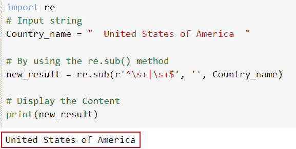
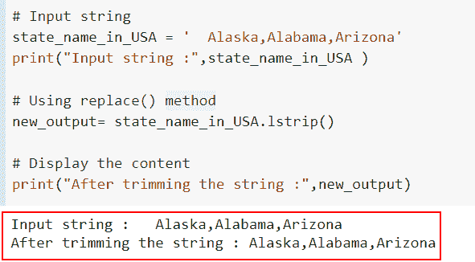
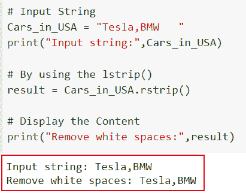
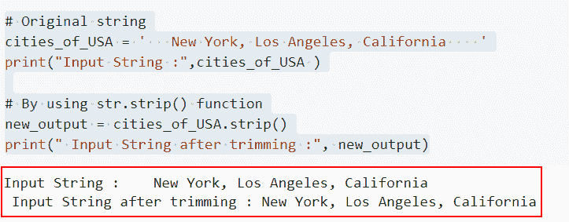
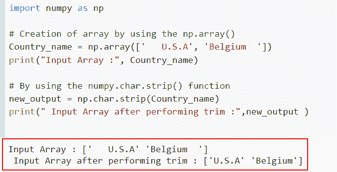
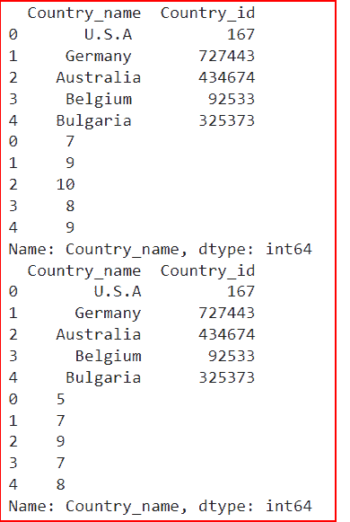
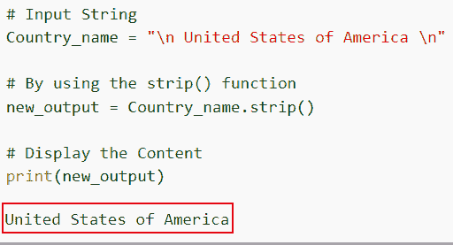

# 如何在 Python 中修剪字符串

> 原文：<https://pythonguides.com/trim-a-string-in-python/>

[](https://sharepointsky.teachable.com/p/python-and-machine-learning-training-course)

修剪字符串是什么意思，它在 Python 中是如何工作的？在本文中，我们将讨论如何修剪字符串中的空白。

从技术上来说，修剪字符串是指从文本字符串中删除空白。Python 中的三个内置函数 strip、rstrip、lstrip 和正则表达式方法可用于从字符串中移除空格。要删除空格，所有这些技术都不需要参数。

*   如何使用正则表达式方法在 Python 中修剪字符串
*   如何使用 lstrip 方法在 Python 中修剪字符串
*   如何使用 rstrip 方法在 Python 中修剪字符串
*   如何使用 strip()方法在 Python 中修剪字符串
*   如何在 NumPy Python 中修剪字符串
*   如何在熊猫 Python 中修剪字符串
*   如何在 Python 中从字符串中修剪换行符

目录

[](#)

*   [如何使用正则表达式方法在 Python 中修剪字符串](#How_to_trim_a_string_in_Python_by_using_the_regular_expression_method "How to trim a string in Python by using the regular expression method")
*   [如何使用 lstrip 方法在 Python 中修剪字符串](#How_to_trim_a_string_in_Python_by_using_the_lstrip_method "How to trim a string in Python by using the lstrip method")
*   [如何使用 rstrip 方法在 Python 中修剪字符串](#How_to_trim_a_string_in_Python_by_using_the_rstrip_method "How to trim a string in Python by using the rstrip method")
*   [如何使用 strip()方法在 Python 中修剪字符串](#How_to_trim_a_string_in_Python_by_using_the_strip_method "How to trim a string in Python by using the strip() method")
*   [如何在 NumPy Python 中修剪字符串](#How_to_trim_a_string_in_NumPy_Python "How to trim a string in NumPy Python")
*   [如何在 Pandas Python 中修剪字符串](#How_to_trim_a_string_in_Pandas_Python "How to trim a string in Pandas Python")
*   [如何在 Python 中修剪字符串的换行符](#How_to_trim_a_newline_from_a_string_in_Python "How to trim a newline from a string in Python")

## 如何使用正则表达式方法在 Python 中修剪字符串

*   regex 模块的' re '类具有函数`re sub()`。要去除字符串中的空白，我们可以很容易地使用这个方法。
*   Python 正则表达式(re)包包含了 `re.sub()` 方法。匹配的给定模式的所有实例都由返回字符串中的替换字符串替换。
*   Python 的`re sub()`函数可以用来修剪字符串。使用内置函数`re()`，字符串被修剪，其前导和尾随空格被删除。

**语法**:

让我们看一下语法并理解 Python 中的`re sub()`方法的工作原理。

```py
re.sub(pattern, repl, string, count=0, flags=0)
```

*   它由几个参数组成
    *   **模式**:该参数定义了我们想要替换的字符串/模式。
    *   `repl` :该参数用于定义替换花样的花样。
    *   `Count` :默认情况下，取值为 0，它定义了应该发生的替换次数。

**举例**:

让我们举一个例子，检查如何使用正则表达式方法在 Python 中修剪字符串。

**源代码**:

```py
import re
# Input string 
Country_name = "  United States of America  "

# By using the re.sub() method
new_result = re.sub(r'^\s+|\s+$', '', Country_name)

# Display the Content
print(new_result)
```

因此，我们将首先导入 re 库来验证 re 模块中的函数，然后生成一个名为`Country _ name = " United States of America "`的输入字符串。

现在我们想通过使用`re sub()`函数来删除字符串中的空白，在这个函数中，我们指定了符号 **\s** ，它表示空白。

下面是以下给定代码的实现。



How to trim a string in Python by using the regular expression method

这就是如何使用正则表达式方法在 Python 中修剪字符串。

阅读:[当前日期和时间的 Python 程序](https://pythonguides.com/python-program-for-current-date-and-time/)

## 如何使用 lstrip 方法在 Python 中修剪字符串

*   在本节中，我们将讨论如何使用 Python 中的 lstrip 方法来修剪字符串。
*   一个名为 `lstrip()` 的内置 Python 函数修剪所有空白字符的字符串的左侧，并返回结果新字符串。 `lstrip()` 方法不接受任何参数。
*   方法返回字符串的一个副本。如果没有给定参数，默认情况下会删除前导空格。

**语法**:

下面是 Python 中 `lstrip()` 方法的语法。

```py
str.lstrip(characters)
```

注意:从字符串的左边删除了一个字符串。

以下示例代码显示了如何使用 Python 中的 lstrip 方法来修剪字符串。

```py
# Input string
state_name_in_USA = '  Alaska,Alabama,Arizona'
print("Input string :",state_name_in_USA )

# Using replace() method
new_output= state_name_in_USA.lstrip()

# Display the content
print("After trimming the string :",new_output)
```

在这个例子中，字符串**“Alaska，Alabama，Arizona”**被用作输入字符串。在返回修改后的字符串后，我们删除了原来的字符串**“阿拉斯加、阿拉巴马、亚利桑那”**。在这段代码中必须使用 `lstrip()` 函数:

当对输入字符串使用 `lstrip()` 函数时，没有传递可选参数。因此，空格会自动修剪。**‘阿拉斯加州、阿拉巴马州、亚利桑那州’**将因左边的空格被移除而产生。

你可以参考下面的截图



Remove whitespace from the left side by using the lstrip method

正如你在截图中看到的，我们已经讨论了如何使用 lstrip 方法在 Python 中修剪字符串。

阅读:[Python 中如何在数字前加零](https://pythonguides.com/add-zeros-before-a-number-in-python/)

## 如何使用 rstrip 方法在 Python 中修剪字符串

*   让我们讨论如何使用 rstrip 方法在 Python 中修剪字符串。
*   一个名为 `rstrip()` 的内置 Python 函数修剪所有空白字符的字符串右侧，并返回结果新字符串。 `rstrip()` 方法不接受任何参数。
*   这是一种去除空白的附加技术。与 **lstrip 相比，rstrip()** 用于移除右边的空格，它清除了所有的空白。

**语法**:

下面是 Python 中 `rstrip()` 方法的语法。

```py
str.rstrip(characters)
```

注意:从字符串的右边删除了一个字符串。

**举例**:

让我们举一个例子，看看如何使用 rstrip 方法在 Python 中修剪字符串。

**源代码:**

```py
# Input String
Cars_in_USA = "Tesla,BMW   "
print("Input string:",Cars_in_USA)

# By using the lstrip()
result = Cars_in_USA.rstrip()

# Display the Content
print("Remove white spaces:",result)
```

在下面给定的代码中，我们创建了一个名为 Cars_in_USA 的输入字符串，然后使用了 `rstrip()` 函数，该函数用于删除字符串右侧的空白。

字符串的右边没有空格。因此**的输出是“特斯拉，宝马”。**如果字符串包含换行符(/n)、回车符(/r)或制表符(/t)，

下面是以下代码的截图



Remove whitespace from the right side by using the lrstrip method

在这个例子中，我们已经理解了如何使用 lrstrip 方法从右侧移除空白。

阅读:[二分搜索法的 Python 程序](https://pythonguides.com/python-program-for-binary-search/)

## 如何使用 strip()方法在 Python 中修剪字符串

*   本节介绍如何使用 Python 中的 `strip()` 方法在 Python 中修剪字符串。
*   Python 有一个内置的库函数叫做 `strip()` 。通过删除提供给 `strip()` 方法的前导和尾随空格、字母和符号，它用于返回原始字符串的副本。
*   换句话说，通过将一组字符作为参数传递给 `strip()` 方法，Python string 函数从字符串的左端和右端删除字符。如果没有输入提供给 `strip()` 函数，它默认从字符串的开头和结尾删除空白。

**语法**:

```py
string.strip(character)
```

**注**:可选参数。当一个字符被传递给 `strip()` 函数时，它将从字符串的两端被移除。

**举例**:

让我们举一个例子，检查如何通过使用 Python 中的 `strip()` 方法在 Python 中修剪一个字符串。

**源代码**:

```py
# Original string
cities_of_USA = '   New York, Los Angeles, California    '
print("Input String :",cities_of_USA )

# By using str.strip() function
new_output = cities_of_USA.strip()
print(" Input String after trimming :", new_output)
```

在这个程序中，我们将**‘New York，Los Angeles，California’**作为输入字符串，然后使用 `strip()` 函数来修剪输入字符串中的空白。

下面是以下给定代码的实现



By using the strip method trimmed whitespaces from both sides

在这个例子中，我们已经理解了如何使用 `strip()` 方法在 Python 中修剪字符串。

阅读:[在 Python 中从一个字符串中移除一个特定的字符](https://pythonguides.com/remove-specific-character-from-string-in-python/)

## 如何在 NumPy Python 中修剪字符串

*   在这里，我们将讨论如何在 NumPy Python 中删除输入字符串中的空白。
*   为了执行这个特定的任务，我们将使用 `numpy.char.strip()` 函数。
*   使用 `strip()` 函数移除数组中每一项的前导和尾随字符。默认情况下，除非指定了特定字符，否则该函数会修剪字符串中任何不必要的前导空格和尾随空格。

**语法**:

让我们看一下语法并理解 Python 中的 `numpy.char.strip()` 的工作原理

```py
char.strip(a, chars=None)
```

*   它只包含两个参数
    *   **a:** 这是给定字符串的输入数组。
    *   **chars:**chars 参数有效地指示了应该被删除的字符串。默认情况下，如果未给定此参数或给定为 None，则删除空白。

**举例:**

让我们举一个例子，看看如何在 NumPy Python 中删除输入字符串中的空白。

**源代码:**

```py
import numpy as np

# Creation of array by using the np.array()
Country_name = np.array(['   U.S.A', 'Belgium  '])
print("Input Array :", Country_name)

# By using the numpy.char.strip() function
new_output = np.char.strip(Country_name)
print(" Input Array after performing trim :",new_output )
```

在下面给定的代码中，我们通过使用 `np.array()` 函数创建了输入数组，在这个函数中，我们将国家名称指定为文本字符串。

现在我们想从输入数组中删除空白，为此，我们将使用 `np.char.strip()` 函数。

下面是以下给定代码的实现。



How to trim a string in NumPy Python

这是如何在 NumPy Python 中修剪字符串。

阅读:[如何在 Python 中删除字符串的最后一个字符](https://pythonguides.com/remove-the-last-character-from-a-string-in-python/)

## 如何在 Pandas Python 中修剪字符串

*   在这一节中，我们将讨论如何在 Python Pandas 中修剪字符串。
*   在任何文本数据中，Pandas 提供了三种处理空白的方法。如名字所示，函数 `str.lstrip()` 和 `str.rstrip()` 去除文本左右两边的空格， `str.strip()` 去除两边的空格。
*   在这个例子中，我们将使用 `str.strip()` 函数来修剪列的尾部和前导空格。

让我们看一个例子，看看如何修剪列的前导和尾随空格及其所有空格。

**源代码**:

```py
import pandas as pd
import numpy as np

#Create a DataFrame
data_fr = {
    'Country_name':[' U.S.A ',' Germany ', ' Australia','Belgium ','Bulgaria '],
   'Country_id':[167,727443,434674,92533,325373]}

data_fr = pd.DataFrame(data_fr,columns=['Country_name','Country_id'])
print(data_fr)
print(data_fr['Country_name'].str.len())

data_fr['Country_name'] = data_fr['Country_name'].str.strip()
print (data_fr)
print(data_fr['Country_name'].str.len())
```

在上面的代码中，我们首先导入了 Pandas 库，然后使用 **pd 创建了一个 dataframe。DataFrame()** 函数，在这个数据帧中，我们指定了**国家名称**和**国家标识**，并检查字符串的长度。

下面是下面给出的代码的截图。



Trim right and left side white spaces in Pandas

这是如何在 Python 熊猫中修剪一个字符串。

阅读:[如何将列表追加到另一个列表中](https://pythonguides.com/python-append-list-to-another-list/)

## 如何在 Python 中修剪字符串的换行符

*   在这个例子中，我们将讨论如何在 Python 中从一个字符串中修剪一个换行符。
*   为了执行这个特定的任务，我们将使用 `strip()` 函数，并且使用 `strip()` 函数来修剪字符串中的前导和尾随换行符。此外，它还会删除字符串两边的空白。
*   换句话说，通过将一组字符作为参数传递给 `strip()` 方法，Python string 函数从字符串的左端和右端删除字符。

**举例**:

让我们举一个例子，看看如何在 Python 中从一个字符串中修剪一个换行符。

```py
# Input String
Country_name = "\n United States of America \n"

# By using the strip() function
new_output = Country_name.strip()

# Display the Content
print(new_output)
```

下面是以下代码的截图



Remove the newline from the string

在这个例子中，我们已经了解了如何在 Python 中从一个字符串中修剪一个换行符。

另外，看看更多的 Python 教程。

*   [Python 中的复数](https://pythonguides.com/complex-numbers-in-python/)
*   [如何在 Python 中从列表中找到一个字符串](https://pythonguides.com/find-a-string-from-a-list-in-python/)
*   [如何在 Python 中寻找完全数](https://pythonguides.com/perfect-number-in-python/)
*   [寻找 3 个数最大值的 Python 程序](https://pythonguides.com/python-program-for-finding-greatest-of-3-numbers/)
*   [如何在 Python 中反转一个数字](https://pythonguides.com/reverse-a-number-in-python/)
*   [偶数或奇数的 Python 程序](https://pythonguides.com/python-program-for-even-or-odd/)

在本文中，我们学习了如何用不同的方法从字符串中删除空白。我们还讨论了以下主题。

*   如何使用正则表达式方法在 Python 中修剪字符串
*   如何使用 lstrip 方法在 Python 中修剪字符串
*   如何使用 rstrip 方法在 Python 中修剪字符串
*   如何使用 strip()方法在 Python 中修剪字符串
*   如何在 NumPy Python 中修剪字符串
*   如何在熊猫 Python 中修剪字符串
*   如何在 Python 中从字符串中修剪换行符

[Arvind](https://pythonguides.com/author/arvind/)

Arvind 目前是 TSInfo Technologies 的高级 Python 开发人员。他精通 Python 库，如 NumPy 和 Tensorflow。