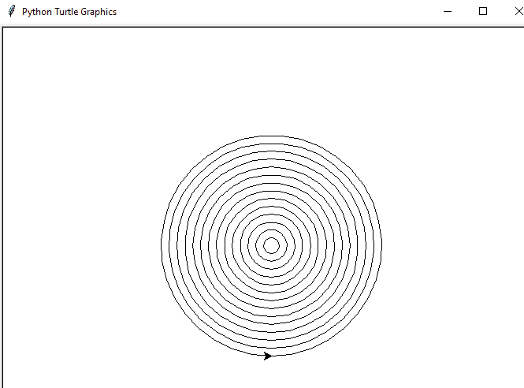

# 如何使用 Turtle 在 python 中绘制形状(Python 中的 Turtle 编程)

> 原文：<https://pythonguides.com/turtle-programming-in-python/>

[](https://sharepointsky.teachable.com/p/python-and-machine-learning-training-course)

想了解更多关于**蟒龟**？在这个 [Python 教程](https://pythonguides.com/python-programming-for-the-absolute-beginner/)中，我们将讨论在 python 中的 **turtle 编程，我们将看到什么是 Python Turtle 以及如何在 Python 中使用它。此外，我们将看到以下主题:**

*   python 中的乌龟是什么？
*   如何在 python 中安装 turtle
*   Python turtle 方法
*   蟒蛇龟速
*   巨蟒龟速度最快
*   改变乌龟大小的蟒蛇
*   蟒蛇龟改变笔的大小
*   变龟形蟒蛇
*   蟒蛇龟屏幕尺寸
*   巨蟒龟如何摆好位置
*   海龟屏幕点击示例 python
*   如何在 python turtle 中获取屏幕坐标
*   在 python turtle 中更改屏幕标题
*   蟒蛇龟清晰屏幕
*   如何用 turtle 在 python 中画一个正方形
*   如何使用 turtle 在 python 中绘制矩形
*   如何用 turtle 在 python 中画圆
*   如何用 turtle 在 python 中画椭圆
*   在 python turtle 中绘制星星的代码
*   使用 turtle 在 python 中绘制五边形
*   在蟒蛇龟上画一个六边形
*   用 turtle 绘制七边形的 Python 程序
*   使用 turtle 在 python 中绘制八角形
*   使用 turtle 在 python 中绘制多边形
*   使用 turtle 在 python 中画一个点
*   Python 使用 turtle 绘制相切圆
*   Python 使用 turtle 绘制螺旋圈
*   Python 使用 turtle 绘制同心圆
*   如何在蟒蛇龟中画螺旋方块
*   在蟒蛇龟中绘制螺旋星
*   在巨蟒龟里画一个螺旋三角形
*   使用 turtle 在 python 中绘制立方体
*   如何在 turtle python 中绘制网格
*   Python 海龟图形没有响应
*   Python turtle 主循环
*   如何激活检查 python turtle 上的按钮是否被按下

目录

[](#)

*   [python 中的龟是什么？](#What_is_Turtle_in_python "What is Turtle in python?")
*   [如何在 python 中安装 turtle](#How_to_install_turtle_in_python "How to install turtle in python")
*   [蟒龟战法](#Python_turtle_methods "Python turtle methods")
*   [蟒龟速度](#Python_turtle_speed "Python turtle speed")
*   [巨蟒龟速度最快](#Python_turtle_speed_fastest "Python turtle speed fastest")
*   [改变乌龟大小的蟒蛇](#Change_turtle_size_python "Change turtle size python")
*   [蟒龟变笔大小](#Python_turtle_change_pen_size "Python turtle change pen size")
*   [变龟形蟒蛇](#Change_turtle_shape_python "Change turtle shape python")
*   [如何在蟒蛇龟中用鼠标移动乌龟](#How_to_move_turtle_with_mouse_in_python_turtle "How to move turtle with mouse in python turtle")
*   [巨蟒龟屏幕尺寸](#Python_turtle_screen_size "Python turtle screen size")
*   [蟒龟如何设定位置](#Python_turtle_how_to_set_position "Python turtle how to set position")
*   [乌龟屏幕点击示例 python](#Turtle_onscreen_click_example_python "Turtle onscreen click example python")
*   [如何在 python turtle 中获取屏幕坐标](#How_to_get_coordinate_of_the_screen_in_python_turtle "How to get coordinate of the screen in python turtle")
*   [更改 python turtle 中的屏幕标题](#Change_the_screen_title_in_python_turtle "Change the screen title in python turtle")
*   [蟒龟清屏](#Python_turtle_clear_screen "Python turtle clear screen")
*   [如何用 turtle 在 python 中画正方形](#How_to_draw_a_square_in_python_using_turtle "How to draw a square in python using turtle")
*   [如何用 turtle 在 python 中绘制矩形](#How_to_draw_a_rectangle_in_python_using_turtle "How to draw a rectangle in python using turtle")
*   [如何用 turtle 在 python 中画圆](#How_to_draw_a_circle_in_python_using_turtle "How to draw a circle in python using turtle")
*   [如何用 turtle 在 python 中画椭圆](#How_to_draw_ellipse_in_python_using_turtle "How to draw ellipse in python using turtle")
*   [如何在巨蟒龟身上画星星](#How_to_draw_a_star_in_Python_turtle "How to draw a star in Python turtle")
*   使用 turtle 在 Python 中绘制五边形
*   [在蟒蛇龟身上画一个六边形](#Draw_a_hexagon_in_Python_turtle "Draw a hexagon in Python turtle")
*   [Python 程序用乌龟画七边形](#Python_program_to_draw_Heptagon_using_turtle "Python program to draw Heptagon using turtle")
*   [用乌龟在 Python 中画八角形](#Draw_octagon_in_Python_using_turtle "Draw octagon in Python using turtle")
*   [用 turtle 在 python 中画一个多边形](#Draw_a_polygon_in_python_using_turtle "Draw a polygon in python using turtle")
*   [用乌龟在 python 中画一个点](#Draw_a_dot_in_python_using_turtle "Draw a dot in python using turtle")
*   [Python 用乌龟画相切的圆](#Python_draw_tangent_circles_using_turtle "Python draw tangent circles using turtle")
*   [Python 用乌龟画螺旋圈](#Python_draw_spiral_circles_using_turtle "Python draw spiral circles using turtle")
*   [Python 用乌龟画同心圆](#Python_draw_concentric_circles_using_turtle "Python draw concentric circles using turtle")
*   [如何在蟒蛇龟中画螺旋方块](#How_to_draw_a_spiral_square_in_python_turtle "How to draw a spiral square in python turtle")
*   [在蟒龟身上画螺旋星](#Draw_spiral_star_in_python_turtle "Draw spiral star in python turtle")
*   [在蟒蛇龟身上画一个螺旋三角形](#Draw_a_spiral_triangle_in_python_turtle "Draw a spiral triangle in python turtle")
*   [使用 turtle 在 python 中绘制立方体](#Draw_cube_in_python_using_turtle "Draw cube in python using turtle")
*   [如何在 turtle python 中绘制网格](#How_to_draw_a_grid_in_turtle_python "How to draw a grid in turtle python")
*   [蟒蛇龟图形没有响应](#Python_turtle_graphics_not_responding "Python turtle graphics not responding")
*   [蟒蛇龟主循环](#Python_turtle_mainloop "Python turtle mainloop")
*   [如何激活检查 python turtle 上的按钮是否被按下](#How_to_activate_check_if_button_is_pressed_on_python_turtle "How to activate check if button is pressed on python turtle")

## python 中的龟是什么？

*   **“乌龟”**是一个类似画板的 python 特性，可以让你命令一只乌龟在上面画个遍。
*   我们可以使用类似 **turtle.forward(…)的函数。)**和 **turtle.left(…)**这将使乌龟四处移动。
*   要使用一个 `turtle` ，我们必须先导入它。
*   只需进入 python 环境，输入**“导入龟”**。
*   python turtle 库包含了我们创建图像所需的所有方法和函数。

你可能也会喜欢 [Python Tkinter 秒表](https://pythonguides.com/python-tkinter-stopwatch/)。

## 如何在 python 中安装 turtle

为了在 python 中安装 turtle ,我们必须在终端中运行下面的命令:

```py
$ pip install turtle
```

## 蟒龟战法

一些最常用的方法是:

*   `forward()`–将海龟向前移动指定的距离
*   **向后()**–它将海龟向后移动指定的距离
*   **右()**–顺时针方向转动乌龟
*   `left()`–逆时针方向转动乌龟
*   `penup()`–停止绘制乌龟围栏
*   `pendown()`–开始绘制乌龟围栏
*   `color()`–改变乌龟笔的颜色

## 蟒龟速度

*   `turtle.speed()` 方法用于改变乌龟的速度。我们可以传递参数的值。它会返回或设置海龟的速度。
*   速度在 0-10 的**范围内。**
*   **速度值**有以下几种方式:
    *   最快–0
    *   快速–10
    *   正常–6
    *   慢速–3
    *   最慢–1
*   龟速使用的语法 `"turtle.speed(number)"`

**举例:**

```py
import turtle 
turtle.speed(1)
turtle.forward(100)
turtle.done()
```

在这个输出中，我们可以看到新的窗口出现了，海龟的速度是“1”，这是最慢的，它向前移动了 100 个单位。


Python turtle speed

*   [蟒龟字体](https://pythonguides.com/python-turtle-font/)

## 巨蟒龟速度最快

`turtle.speed()` 方法用于改变乌龟的速度。我们可以传递参数的值。在这里，速度为“0”是最快的。

**举例:**

```py
import turtle 
turtle.speed(0)
turtle.forward(200)
turtle.done()
```

在这个输出中，我们可以看到新的窗口出现了，海龟的速度是“0”，这是最快的，它向前移动了 200 个单位。


Python turtle speed fastest

## 改变乌龟大小的蟒蛇

在这里，我们将看到如何在 python 中改变海龟的大小

*   要改变乌龟的大小，我们可以增加或减少乌龟的大小，让它变大或变小。这只会改变海龟的大小，而不会影响笔在屏幕上绘制时的输出。
*   改变乌龟大小的语法是**“turtle . shapesize(stretch _ width，stretch_length，outline)”**。

**举例:**

```py
import turtle 
tr = turtle.Turtle()
tr.shapesize(10,5,1)
turtle.done()
```

在这个输出中，我们可以看到我们使用了 **"tr.shapesize(10，5，1)"** 来改变乌龟的大小，您可以根据自己的喜好来改变大小。新的窗口将出现，你可以看到海龟的大小发生了变化。


Change turtle size python

## 蟒龟变笔大小

要增加或减少钢笔大小的粗细，我们可以使用`" tr . penzize()"`。现在你可以看到钢笔的尺寸是原来的**的 4 倍**。

**举例:**

```py
import turtle
tr = turtle.Turtle()
tr.pensize(4)
tr.forward(200)
turtle.done()
```

在此输出中，我们可以看到新窗口出现，并且笔的大小发生了变化。海龟将向前移动 200 个单位。


Python turtle change pen size

## 变龟形蟒蛇

我们知道海龟的最初形状并不是真正的海龟，而是三角形。然而，如果你想把一只乌龟的样子变成任何其他形状，比如圆形、方形、箭头等，那么你可以使用 **"tr.shape("方形")"**。

**举例:**

```py
import turtle 
tr = turtle.Turtle()
tr.shape("square")
turtle.done()
```

在这个输出中，我们可以看到新窗口出现了，乌龟的形状变成了正方形。


Change turtle shape python

## 如何在蟒蛇龟中用鼠标移动乌龟

*   首先，我们需要**【进口龟】**。带有两个参数 x 和 y 的函数将被赋值为画布上选中点的坐标。
*   `turtle.ondrag()` 用于在画布上的乌龟上移动鼠标。
*   **turtle . set heading(turtle . Howard(x，y))** 用于移动乌龟朝向 x 和 y 的角度和方向。
*   这里， `turtle.ondrag(func)` 再次被调用。为了设置龟速，我们使用了**“龟速(10)”**。
*   **sc.setup(600，600)** 用于设置屏幕， `sc.mainloop()` 用于进入主循环。

**举例:**

```py
import turtle
def func(x, y):
    turtle.ondrag(None)
    turtle.setheading(turtle.towards(x, y))
    turtle.goto(x, y)
    turtle.ondrag(func)
turtle.speed(10)
sc = turtle.Screen()
sc.setup(600, 600)
turtle.ondrag(func)
sc.mainloop()
```

在这个输出中，我们可以看到如何在新窗口中用鼠标移动乌龟。


How to move turtle with mouse in python turtle

## 巨蟒龟屏幕尺寸

`"turtle.screensize()"` 方法用于调整海龟正在绘制的画布的大小。如果没有给定参数，函数返回当前值(canvwidth，canvheight)。这里我取了(canvwidth=600，canvheight=600，bg="blue ")。

**举例:**

```py
import turtle 
turtle.screensize(canvwidth=600, canvheight=600, bg="blue") 
turtle.done()
```

在这个输出中，我们可以看到新的窗口出现了，海龟屏幕的大小改变了，屏幕的颜色是蓝色的。


Python turtle screen size

## 蟒龟如何设定位置

让我们看看**如何在 Python 中使用 turtle 设置位置**

*   首先，我们将**导入 turtle** 模块。为了创建一个**屏幕对象**，我们将使用**“tr = turtle。屏幕()"**
*   要随时改变屏幕的颜色，我们可以使用命令 `"turtle.bgcolor(*args)"` 。
*   **tr.setup(width=500，height=450，startx=0，starty=0)** 用于设置尺寸和位置。我们可以通过改变 `startx` 和 `starty` 来改变或设定位置。
*   这里，我的 `startx` 和 `starty` 被设置为“0”。所以位置会在屏幕上方。

**举例:**

```py
import turtle
tr = turtle.Screen()
tr.bgcolor('grey')
tr.setup(width=500, height=450, startx=0, starty=0)
turtle.done()
```

在这个输出中，我们可以看到新的窗口出现了，并且在海龟图形上设置了位置。


Python turtle how to set position

## 乌龟屏幕点击示例 python

*   首先，我们将导入包**乌龟**和**随机**。然后我们会列一个颜色清单。
*   现在，我们将定义调用屏幕单击的方法。我们必须使用 **"scr.bgcolor(color[r])"** 随机设置屏幕颜色。
*   我们已经看到，默认情况下 turtle 总是以白色背景打开屏幕，使用**“turtle . onscreen click(fun)”**将该功能绑定到鼠标点击事件。
*   以上方法用于设置**背景**，点击龟屏时**改变颜色。**

**举例:**

```py
import turtle 
import random 
color = ['purple', 'pink', 'red', 'yellow', 'green', 
       'black', 'blue', 'orange',] 
def fun(x, y): 
    global color
    r = random.randint(0, 7) 
    scr.bgcolor(color[r]) 
scr = turtle.Screen() 
scr.setup(500, 400) 
turtle.onscreenclick(fun)
turtle.done()
```

在这个输出中，我们可以看到新窗口出现了，每当用户点击屏幕时，它会随机改变海龟图形窗口的背景颜色。


Turtle onscreen click example python


Turtle onscreen click example python

## 如何在 python turtle 中获取屏幕坐标

*   首先，我们将**导入 turtle** 模块。turtle()方法用于制作对象。
*   **turtle . onscreen click(button click，1)** 用于向函数发送坐标，1 用于左键单击。
*   这里，**速度**用来增加或减少乌龟的速度。
*   `listen()` 允许服务器监听传入的连接。

**举例:**

```py
import turtle
tr = turtle.Turtle()
def buttonclick(x,y):
    print("Clicked at the coordinate({0},{1})".format(x,y))
turtle.onscreenclick(buttonclick,1)
turtle.listen()
turtle.speed(1)
turtle.done()
```

在下面的输出中，我们可以看到新窗口出现了，通过单击屏幕上的任意位置，我们可以获得屏幕在终端上的坐标。


How to get coordinate of the screen in python turtle

## 更改 python turtle 中的屏幕标题

`turtle.title()` 函数用于设置 turtle 窗口的标题。它只需要一个字符串形式的参数，这个字符串将出现在 turtle 图形窗口的标题栏中。默认情况下海龟图形窗口的标题是“Python 海龟图形”。

**举例:**

```py
import turtle
turtle.title("My turtle window")
turtle.done()
```

在这个输出中，我们可以看到新的窗口出现了，屏幕标题变成了“我的海龟窗口”。


Change the screen title in python turtle

## 蟒龟清屏

`turtle.clear()` 函数用于从屏幕上删除海龟图形。这不需要任何争论。

**举例:**

```py
import turtle 
turtle.forward(100)
turtle.right(90)
turtle.forward(100)
turtle.right(90)
turtle.forward(100)
turtle.clear()
turtle.done()
```

在下面的输出中，我们可以看到新窗口出现了。


Python turtle clear screen

## 如何用 turtle 在 python 中画正方形

我们来讨论一下，**如何用 turtle** 在 python 中画一个正方形。

*   首先，我们需要**【进口龟】**。
*   导入后，我们有了所有可用的 turtle 功能。
*   我们需要创建一个新的画板和一只乌龟。
*   让我们称乌龟为**【tr】**
*   为了让乌龟向前移动，我们使用了**“tr . forward()”**，为了让乌龟向右移动，我们使用了**“tr . right()**的方法，这种方法会原地旋转。
*   `turtle.done()` 告诉编译器程序结束。

**举例:**

```py
import turtle
tr = turtle.Turtle()
for i in range(4):
    tr.forward(60)
    tr.right(90)
turtle.done()
```

在这个输出中，我们可以看到新的窗口出现了，通过使用 for 循环，海龟 tr 向前向右移动。


How to draw a square in python using turtle

## 如何用 turtle 在 python 中绘制矩形

现在，我们将看到**如何使用 turtle** 在 python 中绘制矩形。

*   这里，我们导入了**海龟**模块。现在，让我们把**龟**称为**【tr】**
*   循环的**用于打印代码次数。**
*   为了让乌龟向前移动，我们使用了**“tr . forward(300)”**，它朝它面对的方向移动了 300 个像素，为了让乌龟向右移动，我们使用了**“tr . right(90)】**的方法，它将在原地顺时针旋转 90 度。
*   `turtle.done()` 告诉编译器程序结束。

**举例:**

```py
import turtle 
tr = turtle.Turtle()
for i in range(2):
    tr.forward(300)
    tr.right(90)
    tr.forward(150)
    tr.right(90)
turtle.done()
```

在这个输出中，我们可以看到在新窗口中绘制了矩形。乌龟 tr 在 tr 面对的方向上向前移动`(300)`个像素， `tr.right(90)` 它在**顺时针旋转 90** 度。


How to draw a rectangle in python using turtle

## 如何用 turtle 在 python 中画圆

让我们**用乌龟**在 python 中画一个圆。

*   要画一个圆，我们要用调用**导入海龟**的模块，然后我们会用 `circle()` 的方法。
*   circle 方法以**半径**为自变量。

**举例:**

```py
import turtle 
tr = turtle.Turtle()
rad = 80
tr.circle(rad)
turtle.done()
```

在这个输出中，我们可以看到在新的画板上画出了圆。它画出 80 个单位的**半径的圆。你可以参考下面的截图。**


How to draw a circle in python using turtle

## 如何用 turtle 在 python 中画椭圆

让我们用乌龟在 python 中**画椭圆` `。**

*   要画一个**椭圆**，我们要用调用**导入龟**的模块，然后我们会定义一个函数。
*   循环的**用于绘制一个**椭圆**。分割椭圆，将形状倾斜到负“45 度”。**
*   最后调用 `draw` 方法。

**举例:**

```py
import turtle
def draw(rad):
  for i in range(2):
    turtle.circle(rad,90)
    turtle.circle(rad//2,90)
turtle.seth(-45)
draw(150)
turtle.done()
```

在这个输出中，我们可以看到椭圆被绘制在新的画板上。你可以参考下面的截图。


How to draw ellipse in python using turtle

## 如何在巨蟒龟身上画星星

让我们看看**如何用 Turtle** 在 Python 中画一颗星星。

*   要画一颗星，我们要用名为**的模块导入海龟**，然后我们会用**进行循环**打印代码次数。
*   在这里，海龟将向前移动`80`个单位，然后向右转向**144 度****。**

 ****举例:**

```py
import turtle 
tr = turtle.Turtle()
for i in range(5):
    tr.forward(80)
    tr.right(144)
turtle.done()
```

在这个输出中，我们可以看到在新的绘图板上绘制了星星。此外，我们必须记住，我们必须把海龟只转过 144 度。如果你把它转到其他角度，那么你就不能画出星星。


Code to draw a star in python turtle

## 使用 turtle 在 Python 中绘制五边形

我们来讨论一下，**如何用 turtle** 在 Python 中画五边形。

*   用 turtle 在 python 中画五边形，我们要用名为**的模块导入 turtle** ，然后我们会用**进行循环**打印代码次数。
*   在这里，乌龟将向前移动`80`个单位，然后顺时针向**右转` `72 度**。
*   多边形的外角是 360/(边数)。所以，对五角大楼来说，将是 72。

**举例:**

```py
import turtle 
tr = turtle.Turtle()
for i in range(5):
    tr.forward(80)
    tr.right(72)
turtle.done()
```

在这个输出中，我们可以看到在新的绘图板上绘制了五边形。五边形的外角是 72 度，重复该语句 5 次以获得五边形。


Draw a pentagon in python using turtle

## 在蟒蛇龟身上画一个六边形

让我们看看**如何在蟒蛇龟**中画出一个六边形。

*   为了用 turtle 在 python 中**画一个六边形，我们必须使用名为**导入 turtle** 的模块，然后我们将使用**进行循环**来打印代码次数。**
*   在这里，海龟将向前移动**100 个**单位，假设为六边形的边，然后顺时针向**右转 60 度**。
*   多边形的外角是 360/(边数)。所以，对于六边形，它将是 60。

**举例:**

```py
import turtle 
tr = turtle.Turtle()
for i in range(6):
    tr.forward(100)
    tr.right(60)
turtle.done()
```

在这个输出中，我们可以看到在新的绘图板上绘制了六边形。六边形的外角是 60 度，重复该语句 6 次以获得六边形。


Draw a hexagon in python turtle

## Python 程序用乌龟画七边形

让我们看看**如何在 Python 中用 turtle 画七边形**？

*   为了用 turtle 在 python 中**画一个七边形，我们要使用名为**的模块导入 turtle** ，然后我们会用**进行循环**打印代码次数。**
*   在这里，乌龟会假设七边形的边向前移动`100`个单位，然后顺时针旋转 **51.42 度**转向**右侧。**
*   多边形的外角是 360/(边数)。所以，对于七边形，是 51.42。

**举例:**

```py
import turtle 
tr = turtle.Turtle()
for i in range(7):
    tr.forward(100)
    tr.right(51.42)
turtle.done()
```

在这个输出中，我们可以看到七边形被绘制在新的绘图板上。七边形的外角是 51.42 度，重复 7 次以得到一个七边形。


Python program to draw Heptagon using turtle

## 用乌龟在 Python 中画八角形

在这里，我们将看到**如何用 turtle** 在 Python 中画八角形？

*   用 turtle 在 python 中画一个八边形，我们要用名为**的模块导入 turtle** ，然后我们会用**进行循环**打印代码次数。
*   在这里，乌龟将会假设八角形的边向前移动`100`个单位，然后顺时针旋转 **45 度**转向**右侧。**
*   多边形的外角是 360/(边数)。因此，对于八边形，它将是 45。

**举例:**

```py
import turtle 
tr = turtle.Turtle()
for i in range(8):
    tr.forward(100)
    tr.right(45)
turtle.done()
```

在这个输出中，我们可以看到在新的绘图板上绘制了八边形。八边形的外角是 45 度，重复该语句 8 次，得到一个八边形。


Draw octagon in python using turtle

## 用 turtle 在 python 中画一个多边形

我们来看看**如何用 turtle** 在 python 中画多边形？

*   为了用 turtle 在 python 中**绘制多边形，我们必须使用名为**导入 turtle** 的模块，然后我们将使用**进行循环**打印代码次数。**
*   在这里，海龟将假设多边形的边向前移动`100`个单位，然后顺时针旋转 **40 度**向**右转。**
*   多边形的外角是 360/(边数)。因此，对于多边形，它将是 40。

**举例:**

```py
import turtle 
tr = turtle.Turtle()
for i in range(9):
    tr.forward(100)
    tr.right(40)
turtle.done()
```

在这个输出中，我们可以看到多边形被绘制在新的画板上。一个多边形的外角是 40 度，重复 9 次以得到一个多边形。


Draw a polygon in python using turtle

## 用乌龟在 python 中画一个点

咱们**如何用 turtle** 在 Python 中画一个点？

*   要画一个点，我们得用调用**导入龟**的模块，然后我们再用 `dot()` 的方法。
*   括号内的数字是圆点的直径。
*   我们可以通过改变直径的值来增大或减小尺寸，这里是 `d=30` 。

**举例:**

```py
import turtle 
tr = turtle.Turtle()
d = 30
tr.dot(d)
turtle.done()
```

在这个输出中，我们可以看到在新的绘图板上画了点。它画一个圆点，圆点用圆圈填充，圆点的大小可以通过改变直径来改变。你可以参考下面的截图。


Draw a dot in python using turtle

## Python 用乌龟画相切的圆

我们来看看**如何在 Python** 中用 turtle 画相切的圆？

*   一个相切的圆会有一个以上的圆有一个交点叫做相切。
*   要绘制一个相切的圆，我们必须使用名为**的模块导入龟**，然后我们将使用 `circle()` 的方法。
*   这里，for loop 用于打印相切圆。该循环将从 0 开始，并一直重复到给定的**范围-1** 。

**举例:**

```py
import turtle 
tr = turtle.Turtle()
for i in range(12):
    tr.circle(12*i)
turtle.done()
```

在这个输出中，我们可以看到相切的圆被绘制在新的绘图板上。海龟从开始画圆的地方到达同一点。该圆将比给定范围少重复一次，以获得相切圆。


Python draw tangent circles using turtle

## Python 用乌龟画螺旋圈

现在，我们将看到**如何在 Python 中使用 turtle 绘制螺旋圆？**

*   半径变化的螺旋线叫做螺旋线。
*   要画一个螺旋圆，我们必须使用名为**的模块导入龟**，然后我们将使用 `circle()` 的方法。
*   这里，初始**半径为 10** ，循环的**用于螺旋圆。该循环将从 0 开始，一直重复到给定的**T5 范围。****
*   还有，我们过了 45°作为圆心角，会重复 100 次得到螺旋圆。

**举例:**

```py
import turtle 
tr = turtle.Turtle()
r = 10
for i in range(100):
    tr.circle(r+i, 45)
turtle.done()
```

在此输出中，我们可以看到在新的绘图板上绘制了螺旋圆，并重复 100 次以获得螺旋圆。


Python draw spiral circles using turtle

## Python 用乌龟画同心圆

我们来看看**如何在 Python 中用 turtle 画同心圆？**

*   半径不同但有一个共同中心的圆叫做同心圆。
*   要绘制同心圆，我们必须使用名为**的模块导入海龟**，然后我们将使用 `circle()` 的方法。
*   循环的**用于打印同心圆。**
*   这里我们拿起了龟笔，将龟笔的 y 坐标设置为-1 乘以 `10*i` 。之后，我们放下了笔。
*   这将重复 30 次以获得同心圆。

**举例:**

```py
import turtle 
tr = turtle.Turtle()
r = 10
for i in range(30):
    tr.circle(r*i)
    tr.up()
    tr.sety((r*i)*(-1))
    tr.down()
turtle.done()
```

在这个输出中，我们可以看到用 Python 在新的画板上绘制了同心圆。



Python draw concentric circles using turtle

## 如何在蟒蛇龟中画螺旋方块

让我们看看如何在 python turtle 中绘制一个螺旋正方形

*   要画一个螺旋正方形，我们必须使用名为**的模块导入海龟**。
*   这里边的长度被赋给变量 s .并且 `s = 200` 并且使用 for 循环，该循环使用海龟模块的 `forward()` 和 `right()` 函数。
*   螺旋是通过在每次迭代中将边的长度减少一个固定的数值而形成的。之后，减少一边的长度。

**举例:**

```py
import turtle 
tr = turtle.Turtle()
s = 200
for i in range(100):
    tr.forward(s)
    tr.right(90)
    s = s-2
turtle.done()
```

在这个输出中，我们可以看到螺旋方块是用 Python 在新的画板上绘制的。


How to draw a spiral square in python turtle

## 在蟒龟身上画螺旋星

*   要画一个螺旋星，我们得用名为**导入乌龟**的模块。
*   这里边的长度被赋给变量 s .并且 `s = 200` 并且使用 for 循环，该循环使用海龟模块的 `forward()` 和 `right()` 函数。
*   螺旋星是通过在每次迭代中将边的长度减少一个固定的数而制成的。之后，减少一边的长度。

**举例:**

```py
import turtle 
tr = turtle.Turtle()
s = 200
for i in range(100):
    tr.forward(s)
    tr.right(144)
    s = s-2
turtle.done()
```

在这个输出中，我们可以看到螺旋星是用 Python 在新的画板上绘制的。


Draw spiral star in python turtle

## 在蟒蛇龟身上画一个螺旋三角形

*   要画螺旋三角形，我们得用名为**的模块导入海龟**。
*   这里边的长度被赋给变量 s .并且 `s = 200` 并且使用 for 循环，该循环使用海龟模块的 `forward()` 和 `right()` 函数。
*   螺旋三角形是通过在每次迭代中将边的长度减少一个固定的数值而形成的。之后，使用**“s = s-3”减少边的长度。**

**举例:**

```py
import turtle 
tr = turtle.Turtle()
s = 200
for i in range(70):
    tr.forward(s)
    tr.right(120)
    s = s-3
turtle.done()
```

在这个输出中，我们可以看到螺旋三角形是用 Python 在新的画板上绘制的。


Draw a spiral triangle in python turtle

## 使用 turtle 在 python 中绘制立方体

*   要在 python 中画一个立方体，我们必须使用名为 `import turtle` 的模块。
*   for 循环用于迭代形成前面的方形面。
*   为了移动乌龟，我们使用了函数**向前()**和**向后()**。
*   为了移动乌龟底部左侧，我们使用了 **"pen.goto(50，50)"**
*   同样，回路的**用于形成背面方形面。另外，我们在右下角使用了**“笔.转到(150，50)”**和**“笔.转到(100，0)”**。**
*   对于右上侧，我们使用了**“pen . goto(100，100)”**和**“pen . goto(150，150)”**。对于左上侧，我们使用了**“笔.转到(50，150)”**和**“笔.转到(0，100)”**。

**举例:**

```py
import turtle
tr = turtle.Screen()
pen = turtle.Turtle()
pen.color("purple")
tr = turtle.Screen()
for i in range(4):
    pen.forward(100)
    pen.left(90)
pen.goto(50,50)
for i in range(4):
    pen.forward(100)
    pen.left(90)
pen.goto(150,50)
pen.goto(100,0)
pen.goto(100,100)
pen.goto(150,150)
pen.goto(50,150)
pen.goto(0,100)
turtle.done()
```

在这个输出中，我们可以看到立方体是用 Python 在新的画板上绘制的。


Draw cube in python using turtle

## 如何在 turtle python 中绘制网格

*   要在 turtle python 中绘制网格，我们必须使用名为 `import turtle` 的模块。
*   使用**“SCR = turtle”设置屏幕。**screen()"，然后制作对象。
*   为了画 y 轴的线，我们将定义一个函数，然后用向前的方法画一条线。
*   现在，使用**“tr . setpos(值，300)”**设置位置，然后向后用于另一行。
*   为了画出 x 轴线，我们将再次定义一个函数。
*   现在，我们将通过定义函数和设置位置来标记图形网格。

**举例:**

```py
import turtle 
scr=turtle.Screen() 
tr=turtle.Turtle()
def draw_y(value):
    tr.forward(300) 
    tr.up() 
    tr.setpos(value,300) 
    tr.down() 
    tr.backward(300) 
    tr.up() 
    tr.setpos(value+10,0) 
    tr.down() 
def draw_x(value): 
    tr.forward(300)
    tr.up() 
    tr.setpos(300,value) 
    tr.down() 
    tr.backward(300) 
    tr.up() 
    tr.setpos(0,value+10) 
    tr.down()
def label(): 
    tr.penup() 
    tr.setpos(155,155) 
    tr.pendown() 
    tr.write(0,font=("Verdana", 12, "bold")) 
    tr.penup() 
    tr.setpos(290,155) 
    tr.pendown() 
    tr.write("x",font=("Verdana", 12, "bold")) 
    tr.penup() 
    tr.setpos(155,290) 
    tr.pendown() 
    tr.write("y",font=("Verdana", 12, "bold")) 
scr.setup(800,800)     
tr.speed(10) 
tr.left(90)   
tr.color('green') 
for i in range(30): 
    draw_y(10*(i+1))
tr.right(90) 
tr.up() 
tr.setpos(0,0) 
tr.down()  
for i in range(30): 
    draw_x(10*(i+1)) 
tr.color('green') 
tr.up() 
tr.setpos(0,150) 
tr.down() 
tr.forward(300) 
tr.left(90) 
tr.up() 
tr.setpos(150,0) 
tr.down() 
tr.forward(300)
label() 
tr.hideturtle()
turtle.done()
```

在这个输出中，我们可以看到用 Python 在新的画板上绘制了一个网格。


How to draw a grid in turtle python

## 蟒蛇龟图形没有响应

在 python turtle 中，我们可以面对名为**“python turtle graphics not response”**的问题，最终程序会以没有图形输出而结束。

**举例:**

```py
import turtle
tr = turtle.Turtle()
tr.forward(150)
```

通过运行上面的代码，我们可以看到 turtle 窗口不会被打开。要解决这个问题，请参考下面的例子。

**举例:**

出现这个问题是因为在代码的末尾我们必须说 `"turtle.done()"` 否则你将不会得到 turtle 图形屏幕。

```py
import turtle
tr = turtle.Turtle()
tr.forward(150)
turtle.done()
```

你可以参考下面的截图，现在你将可以通过使用上面的代码看到海龟图形屏幕。


Python turtle graphics not responding

## 蟒蛇龟主循环

python turtle 中的**主循环确保程序继续运行。这是海龟图形程序中的最后一条语句。**

**举例:**

```py
import turtle
tr = turtle.Turtle()
tr.backward(200)
turtle.mainloop()
```

在这个输出中，我们可以看到为交互使用海龟图形绘制了向后的线，程序继续运行。


Python turtle mainloop

## 如何激活检查 python turtle 上的按钮是否被按下

*   为了激活 python 中的检查，我们必须使用名为 `import turtle` 的模块。
*   现在，我们将定义一个函数**“def fun(x，y)”**。
*   这里， `turtle.onclick(fun)` 用于将函数绑定到乌龟上的一个鼠标点击事件。当用户点击海龟时，它就会执行动作。

**举例:**

```py
import turtle 
def fun(x,y):
    turtle.right(90) 
    turtle.forward(150) 
turtle.speed(2) 
turtle.forward(150) 
turtle.onclick(fun)
turtle.done()
```

在这个输出中，我们可以看到这条线是向前画的，当我们点击海龟时，它会再次移动，以此类推。


How to activate check if button is pressed on python turtle

你可以参考下面的输出，激活检查按钮是否按下 python turtle。


您可能会喜欢以下 Python 教程:

*   [Python 要求用户输入](https://pythonguides.com/python-ask-for-user-input/)
*   [蟒蛇龟的颜色](https://pythonguides.com/python-turtle-colors/)
*   [如何将 Python 字符串转换成字节数组并举例](https://pythonguides.com/python-string-to-byte-array/)
*   [Python 通过引用或值传递示例](https://pythonguides.com/python-pass-by-reference-or-value/)
*   [Python 从列表中选择+示例](https://pythonguides.com/python-select-from-a-list/)
*   [Python 复制文件(示例)](https://pythonguides.com/python-copy-file/)
*   [Python 文件方法(附有用例子)](https://pythonguides.com/python-file-methods/)
*   [Python tkinter messagebox +示例](https://pythonguides.com/python-tkinter-messagebox/)
*   [集合的并集 Python +实例](https://pythonguides.com/union-of-sets-python/)

在本教程中，我们学习了如何使用 turtle 在 python 中绘制不同的形状，我们还看到了用 Python 编写的 **Turtle 程序，我们还讨论了以下主题:**

*   python 中的乌龟是什么？
*   如何在 python 中安装 turtle
*   Python turtle 方法
*   蟒蛇龟速
*   巨蟒龟速度最快
*   改变乌龟大小的蟒蛇
*   蟒蛇龟改变笔的大小
*   变龟形蟒蛇
*   蟒蛇龟屏幕尺寸
*   巨蟒龟如何摆好位置
*   海龟屏幕点击示例 python
*   如何在 python turtle 中获取屏幕坐标
*   在 python turtle 中更改屏幕标题
*   蟒蛇龟清晰屏幕
*   如何用 turtle 在 python 中画一个正方形
*   如何使用 turtle 在 python 中绘制矩形
*   如何用 turtle 在 python 中画圆
*   如何用 turtle 在 python 中画椭圆
*   在 python turtle 中绘制星星的代码
*   使用 turtle 在 python 中绘制五边形
*   在蟒蛇龟上画一个六边形
*   用 turtle 绘制七边形的 Python 程序
*   使用 turtle 在 python 中绘制八角形
*   使用 turtle 在 python 中绘制多边形
*   使用 turtle 在 python 中画一个点
*   Python 使用 turtle 绘制相切圆
*   Python 使用 turtle 绘制螺旋圈
*   Python 使用 turtle 绘制同心圆
*   如何在蟒蛇龟中画螺旋方块
*   在蟒蛇龟中绘制螺旋星
*   在巨蟒龟里画一个螺旋三角形
*   使用 turtle 在 python 中绘制立方体
*   如何在 turtle python 中绘制网格
*   Python 海龟图形没有响应
*   Python turtle 主循环
*   如何激活检查 python turtle 上的按钮是否被按下

[Bijay Kumar](https://pythonguides.com/author/fewlines4biju/)

Python 是美国最流行的语言之一。我从事 Python 工作已经有很长时间了，我在与 Tkinter、Pandas、NumPy、Turtle、Django、Matplotlib、Tensorflow、Scipy、Scikit-Learn 等各种库合作方面拥有专业知识。我有与美国、加拿大、英国、澳大利亚、新西兰等国家的各种客户合作的经验。查看我的个人资料。

[enjoysharepoint.com/](https://enjoysharepoint.com/)[](https://www.facebook.com/fewlines4biju "Facebook")[](https://www.linkedin.com/in/fewlines4biju/ "Linkedin")[](https://twitter.com/fewlines4biju "Twitter")**