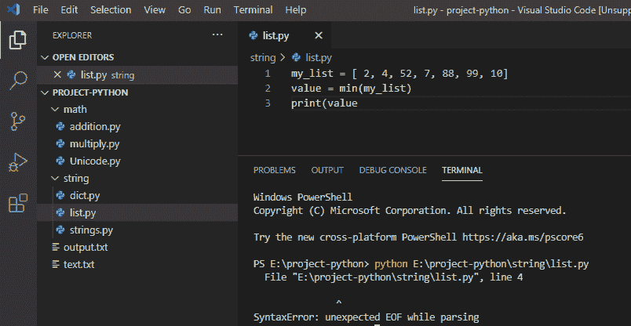
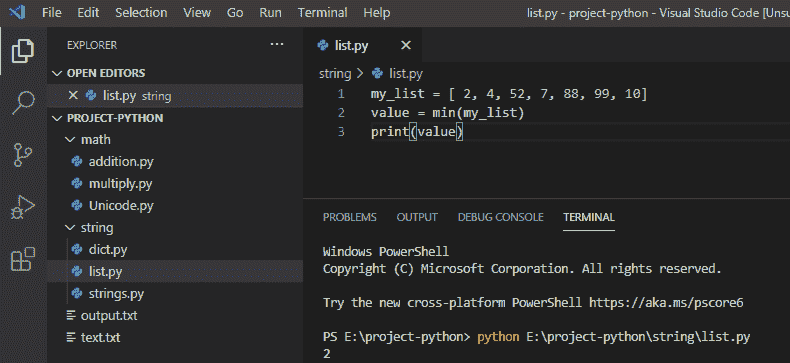
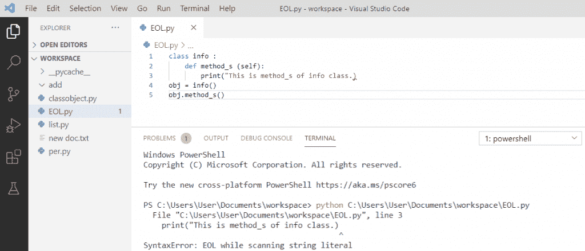
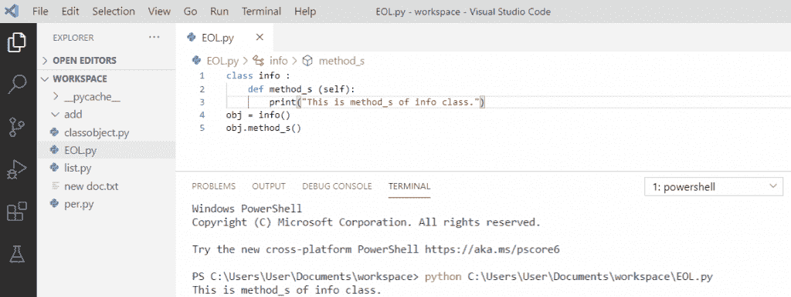

# 解析 Python 时出现意外的 EOF

> 原文：<https://pythonguides.com/unexpected-eof-python/>

[](https://sharepointsky.teachable.com/p/python-and-machine-learning-training-course)

在这个 [Python 教程](https://pythonguides.com/python-download-and-installation/)中，我们将讨论什么是语法错误——在 Python 中解析时意外的 EOF，我们还将看到扫描字符串文字时的 EOL，以及如何解决这些错误。

目录

[](#)

*   [解析 python 时出现意外的 EOF](#Unexpected_EOF_while_parsing_python "Unexpected EOF while parsing python")
*   [扫描字符串文字时 Python EOL](#Python_EOL_while_scanning_string_literal "Python EOL while scanning string literal")

## 解析 python 时出现意外的 EOF

在 python 中，**解析 python 时出现意外的 EOF** ，其中程序的控制到达了末尾。该错误是由于一些不完整的语法或代码中缺少某些内容而导致的。

**举例:**

```py
my_list = [ 2, 4, 52, 7, 88, 99, 10]
value = min(my_list)
print(value
```

写完上面的代码后(解析 python 时意外的 EOF)，您将打印出 `" value"` ，然后错误将显示为 **" SyntaxError:解析时意外的 EOF "**。这里，出现这个错误是因为我们已经创建了一个列表，在打印**值时，右括号“)”丢失了**，它找不到右括号，因此抛出一个错误。

你可以参考下面的截图解析 python 时意外的 EOF



Unexpected EOF

这是**语法错误** : **解析 python 时意外的 EOF。**

为了解决这个**，**，我们需要注意参数和它们的语法，我们还需要检查所有的函数和它们的结束语句。

**举例:**

```py
my_list = [ 2, 4, 52, 7, 88, 99, 10]
value = min(my_list)
print(value)
```

编写上述代码后，解析 python 时的**意外 EOF 通过在值**中给出**右括号“)”得到解决，然后输出将显示为 `" 2 "` ，错误得到解决。因此， **SyntaxError 在解析 python 时被解析为意外的 EOF。****

你可以参考下面的截图，看看如何在解析 python 时解决意外的 EOF



`unexpected EOF`

## 扫描字符串文字时 Python EOL

`EOL` 代表**“行尾”**当 python 解释器在搜索字符串文字或行内字符时到达行尾时，会出现此错误。每个 python 开发人员都会遇到这个错误。这是因为字符串中缺少引号，或者您使用了错误的符号来结束字符串。

**举例:**

```py
class info :
    def method_s (self):
        print("This is method_s of info class.)
obj = info()
obj.method_s()
```

在编写上述代码(扫描字符串文字时的 python EOL)之后，您将打印这些代码，然后错误将显示为**" syntax error:EOL while scanning string literal "**。这里，出现这个错误是因为它到达了一个字符串的末尾，发现缺少了**引号**。

扫描字符串文字时，可以参考下面的截图 python EOL。



Python EOL while scanning string literal

为了解决这个**“行尾”**错误，我们必须检查字符串是否结束，并且你必须检查你是否使用了正确的符号结束了字符串。这里，错误是由于字符串中的**缺少引号造成的。**

**举例:**

```py
class info :
    def method_s (self):
        print("This is method_s of info class.")
obj = info()
obj.method_s()
```

写完上面的代码 python **后，扫描字符串文字**时行尾通过在末尾给**加双引号固定，然后输出将显示为**“这是 info 类的方法”**，错误解决。所以，这样， **SyntaxError 行尾**就解决了。**

你可以参考下面的截图如何在扫描字符串文字时解决行尾问题



Python end of line while scanning string literal

您可能会喜欢以下 Python 教程:

*   [删除 python 中的 Unicode 字符](https://pythonguides.com/remove-unicode-characters-in-python/)
*   [Python 中的注释行](https://pythonguides.com/comment-lines-in-python/)
*   [使用 python 从 URL 下载 zip 文件](https://pythonguides.com/download-zip-file-from-url-using-python/)
*   [Python 字典追加示例](https://pythonguides.com/python-dictionary-append/)
*   [在 Python 中检查列表是否为空](https://pythonguides.com/check-if-a-list-is-empty-in-python/)
*   [Python 将列表转换成字符串](https://pythonguides.com/python-convert-list-to-string/)
*   [Python 方块一号](https://pythonguides.com/python-square-a-number/)
*   [什么是 Python 字典](https://pythonguides.com/create-a-dictionary-in-python/)
*   [无换行符的 Python 打印](https://pythonguides.com/python-print-without-newline/)
*   [python 中的百分号是什么意思](https://pythonguides.com/percent-sign-mean-in-python/)

这是我们如何解决语法错误的****:解析 python** 时的 **意外 EOF，扫描字符串文字**时的 **Python EOL。****

**[Bijay Kumar](https://pythonguides.com/author/fewlines4biju/)

Python 是美国最流行的语言之一。我从事 Python 工作已经有很长时间了，我在与 Tkinter、Pandas、NumPy、Turtle、Django、Matplotlib、Tensorflow、Scipy、Scikit-Learn 等各种库合作方面拥有专业知识。我有与美国、加拿大、英国、澳大利亚、新西兰等国家的各种客户合作的经验。查看我的个人资料。

[enjoysharepoint.com/](https://enjoysharepoint.com/)[](https://www.facebook.com/fewlines4biju "Facebook")[](https://www.linkedin.com/in/fewlines4biju/ "Linkedin")[](https://twitter.com/fewlines4biju "Twitter")**