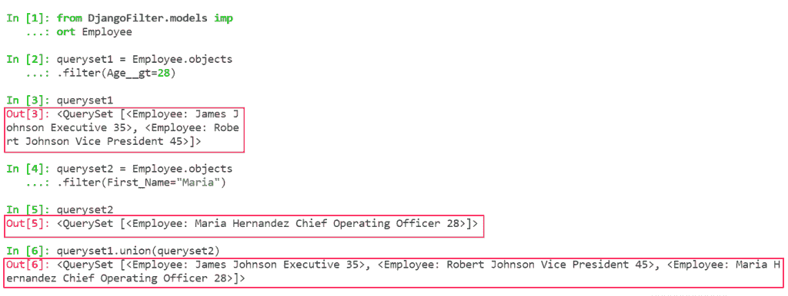
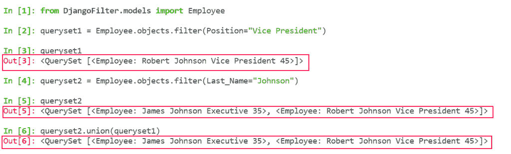
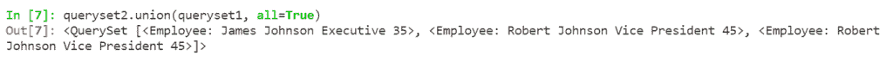
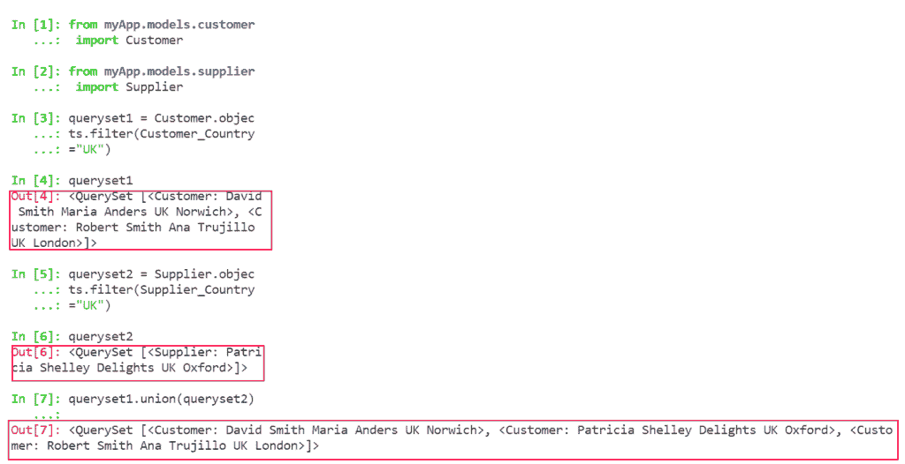
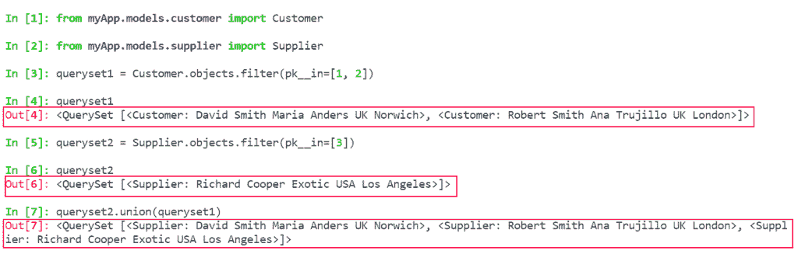
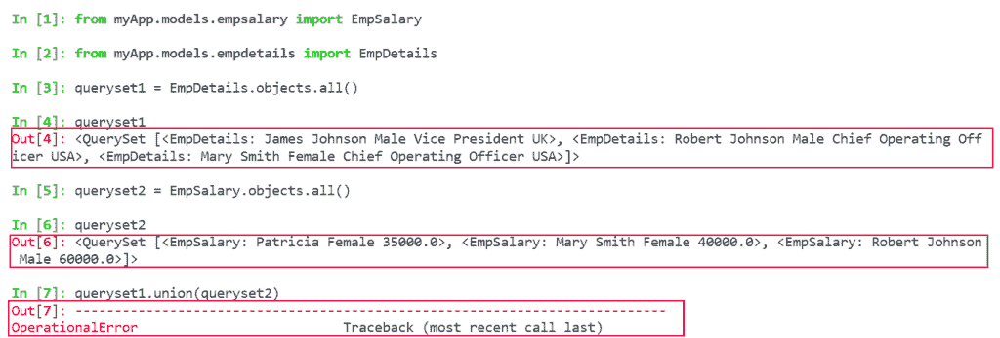
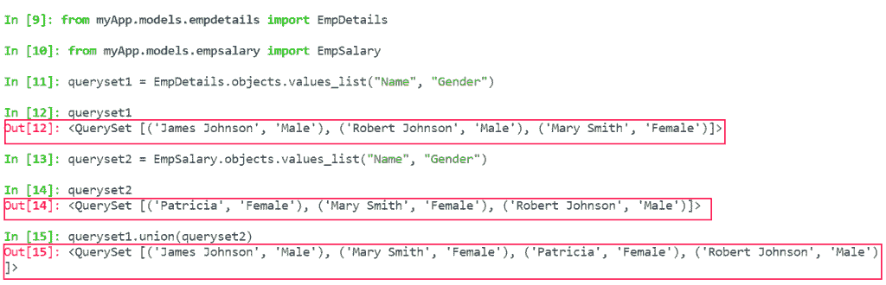

# 争取模特界的联盟行动

> 原文：<https://pythonguides.com/union-operation-on-models-django/>

[](https://sharepointsky.teachable.com/p/python-and-machine-learning-training-course)

在本 [Python Django 教程](https://pythonguides.com/how-to-install-django/)中，我们将了解**对模型 Django** 的联合操作。我们还将讨论与模型上的联合操作相关的示例。这是我们将要涉及的主题列表。

*   争取模特界的联盟行动
*   使用 Django 在相同模型上进行联合操作
*   使用 Django 在不同模型上联合操作
*   限制联合运算中的选定字段

目录

[](#)

*   模型 Django 上的联合操作
*   [使用 Django 对同一模型进行联合操作](#Union_Operation_on_same_model_using_Django "Union Operation on same model using Django")
*   [使用 Django 对不同型号进行联合操作](#Union_Operation_on_different_models_using_Django "Union Operation on different models using Django")
*   [限制联合运算中选择的字段](#Limit_the_selected_fields_in_Union_Operation "Limit the selected fields in Union Operation")

## 模型 Django 上的联合操作

在这一节中，我们将了解联合运算的含义。Django 支持可以在模型上执行的集合操作。集合运算用于在不同的特殊条件下从存储在模型中的字段获得有意义的结果。

现在，我们将讨论集合操作之一，称为**联合操作**。

为了组合两个或更多查询集的结果，我们使用 Union 运算符。默认情况下，Union 运算符只选取单独的值，或者我们可以说是不同的值。如果您希望允许重复值，请使用 `all=True` 参数。

**联合操作**可应用于相同或不同型号。而且，当查询集来自不同的模型甚至来自同一模型时，字段和数据类型应该匹配。

另外，查看:[如何在 Django 中创建模型](https://pythonguides.com/create-model-in-django/)

## 使用 Django 对同一模型进行联合操作

希望你对什么是联盟运营有一个清晰的认识。现在让我们把注意力转向工会行动的实际执行。

在本节中，我们将学习如何在同一个模型上使用 Union 操作。为了更好地理解这个概念，我们来看一些例子。

在我们开始演示之前，我将向您展示模型并解释如何创建它。

首先，我们必须在 app 的 `model.py` 文件中创建模型。

**创建模型的代码:**

```py
from django.db import models

# Create your models here.

class Employee(models.Model):
    First_Name = models.CharField(max_length=200)
    Last_Name = models.CharField(max_length=200)
    Position = models.CharField(max_length=100)
    Age = models.PositiveIntegerField()

    def __str__(self):  
        return "%s %s %s %s" % (self.First_Name, self.Last_Name, self.Position, self.Age) 
```

*   首先，我们将使用 Django 模型创建一个**雇员**数据库。
*   然后将各自的数据字段如**名**、**姓**、**职位、年龄**添加到模型中。

接下来，通过在 `admin.py` 文件中编写以下代码来注册**雇员**模型。

**注册型号代码:**

```py
from django.contrib import admin
from .models import Employee

# Register your models here.

class AdminEmployee(admin.ModelAdmin):
    list_display = ['First_Name', 'Last_Name', 'Position', 'Age']

admin.site.register(Employee, AdminEmployee)
```

现在，我们将在该数据库上运行查询来执行 Union 操作。

**例#1**

在这个例子中，我们将在同一个模型上执行 Union 操作。

```py
**# Import**

from DjangoFilter.models import Employee

**# QuerySet**

queryset1 = Employee.objects.filter(Age__gt=28)
queryset1

queryset2 = Employee.objects.filter(First_Name="Maria")
queryset2

**# Union Operation**

queryset1.union(queryset2)
```

*   在本例中，我们通过使用 querysets，基于诸如年龄大于 28 的**和名字是 Maria** 的过滤器来获取记录。



Union operation on models Django

**例 2**

这里我们将对模型字段 Position 和 Last_Name 执行 Union 操作。

```py
**# Import**

from DjangoFilter.models import Employee

**# QuerySet**

queryset1 = Employee.objects.filter(Position="Vice President")
queryset1

queryset2 = Employee.objects.filter(Last_Name="Johnson")
queryset2

**# Union Operation**

queryset1.union(queryset2)
```

*   在本例中，我们通过使用 querysets，在筛选器的基础上获取记录，如**职位是副总裁，姓氏是 Johnson** 。
*   接下来，我们使用**联合操作**来组合两个查询集中的记录。
*   这里，我们将只获得两个查询集中不同的公共值。



Union Operation on the same model

因此，如果我们也想获得重复的值，可以使用 union 操作的参数 `all=True` 。

```py
**# Union Operation**

queryset1.union(queryset2, all=True)
```

**然后，输出将是:**



Union Operation with duplicate values

阅读: [Python Django vs ReactJS](https://pythonguides.com/django-vs-reactjs/)

## 使用 Django 对不同型号进行联合操作

在本节中，我们将学习如何在不同的模型上使用 Union 操作。为了更好地理解这个概念，我们来看一些例子。

在我们开始演示之前，我将向您展示模型并解释如何创建它们。

首先，我们创建一个**客户**模型。

```py
from django.db import models

# Create your models here.

class Customer(models.Model):
    Customer_Name = models.CharField(max_length=200)
    Customer_Contact_Name = models.CharField(max_length=200)
    Customer_Country = models.CharField(max_length=100)
    Customer_City = models.CharField(max_length=100)

    def __str__(self):  
        return "%s %s %s %s" % (self.Customer_Name, self.Customer_Contact_Name, self.Customer_Country, self.Customer_City) 
```

*   在这里，我们使用 Django 模型创建客户数据库，这些模型分别具有数据字段 Customer_Name、Customer_Contact_Name、Customer_Country 和 Customer_City。

接下来，我们创建一个**供应商**模型。

```py
from django.db import models

# Create your models here.

class Supplier(models.Model):
    Supplier_Name = models.CharField(max_length=200)
    Supplier_Contact_Name = models.CharField(max_length=200)
    Supplier_Country = models.CharField(max_length=100)
    Supplier_City = models.CharField(max_length=100)

    def __str__(self):  
        return "%s %s %s %s" % (self.Supplier_Name, self.Supplier_Contact_Name, self.Supplier_Country, self.Supplier_City) 
```

*   在这里，我们使用 Django 模型创建供应商数据库，这些模型分别具有数据字段 Supplier_Name、Supplier_Contact_Name、Supplier_Country 和 Supplier_City。

成功创建模型后，我们注册它们。

```py
from django.contrib import admin
from .models.customer import Customer
from .models.supplier import Supplier

# Register your models here.

class AdminCustomer(admin.ModelAdmin):
    list_display = ['Customer_Name', 'Customer_Contact_Name', 'Customer_Country', 'Customer_City']

class AdminSupplier(admin.ModelAdmin):
    list_display =  ['Supplier_Name', 'Supplier_Contact_Name', 'Supplier_Country', 'Supplier_City']

admin.site.register(Customer, AdminCustomer)
admin.site.register(Supplier, AdminSupplier) 
```

现在，我们将在数据库上运行查询来执行 Union 操作。

**例#1**

在本例中，我们将对不同的模型执行 Union 操作。

```py
**# Import**

from myApp.models.customer import Customer
from myApp.models.supplier import Supplier

**# QuerySet**

queryset1 = Customer.objects.filter(Customer_Country='UK')
queryset1

queryset2 = Supplier.objects.filter(Supplier_Country='UK')
queryset2

**# Union Operation**

queryset1.union(queryset2)
```

*   在本例中，我们首先通过使用 querysets，基于过滤器 Customer_Country='UK '从 Customer 模型中获取记录。
*   然后，我们通过使用查询集，在过滤器 Supplier_Country='UK '的基础上，从供应商模型中获取记录。
*   接下来，我们使用 Union 操作通过组合两个查询集来获取记录。



Union Operation on different models

**例 2**

打开 Python Shell，对不同的模型执行 Union 操作。

```py
**# Import**

from myApp.models.customer import Customer
from myApp.models.supplier import Supplier

**# QuerySet**

queryset1 = Customer.objects.filter(pk__in=[1, 2])
queryset1

queryset2 = Supplier.objects.filter(pk__in=[3])
queryset2

**# Union Operation**

queryset2.union(queryset1)
```

*   在本例中，首先我们通过使用 querysets 根据过滤器主键值从客户模型中获取记录。
*   然后，我们还通过使用查询集，基于过滤器主键值从供应商模型中获取记录。
*   接下来，我们使用 Union 操作通过组合两个 querysets 来获取记录。



Union Operation on different models in Django

阅读: [Python Django 格式日期](https://pythonguides.com/python-django-format-date/)

## 限制联合运算中选择的字段

在本节中，我们将了解在执行 Union 运算时限制所选字段的含义。

在 Django 中，我们不能总是对 querysets 执行 union 操作。事实上，查询集没有相同的列和数据类型。

然而，在某些情况下，这些模型可能有某些共同的领域。因此，在这种情况下，我们限制所选取的字段，然后执行 union 操作。为此，我们使用 Django values_list 参数。

让我们看一个例子来理解这个概念:

在我们开始演示之前，我将向您展示模型并解释如何创建它们。

首先，我们创建了 `EmpDetails` 模型。

```py
from django.db import models

# Create your models here.

class EmpDetails(models.Model):
    Name = models.CharField(max_length=200)
    Gender = models.CharField(max_length=20)
    Position = models.CharField(max_length=100)
    Country = models.CharField(max_length=100)

    def __str__(self):  
        return "%s %s %s %s" % (self.Name, self.Gender, self.Position, self.Country) 
```

*   在这里，我们使用 Django 模型创建 EmpDetails 数据库，其中包含相应的数据字段 Name、Gender、Position 和 Country。

接下来，我们创建 `EmpSalary` 模型。

```py
from django.db import models

# Create your models here.

class EmpSalary(models.Model):
    Name = models.CharField(max_length=200)
    Gender = models.CharField(max_length=20)
    Salary = models.FloatField()

    def __str__(self):  
        return "%s %s %s" % (self.Name, self.Gender, self.Salary)
```

*   在这里，我们使用 Django 模型创建 EmpSalary 数据库，其中包含相应的数据字段 Name、Gender 和 Country。

成功创建模型后，我们注册它们。

```py
from django.contrib import admin
from .models.empdetails import EmpDetails
from .models.empsalary import EmpSalary

# Register your models here.

class AdminEmpDetails(admin.ModelAdmin):
    list_display = ['Name', 'Gender', 'Position', 'Country']

class AdminEmpSalary(admin.ModelAdmin):
    list_display = ['Name', 'Gender', 'Salary']

admin.site.register(EmpDetails, AdminEmpDetails)
admin.site.register(EmpSalary, AdminEmpSalary)
```

现在，我们将在数据库上运行查询来执行 Union 操作。

**例#1**

在这个例子中，我们将对上面创建的模型执行 union 操作。

```py
**# Import**

from myApp.models.empdetails import EmpDetails
from myApp.models.empsalary import EmpSalary

**# QuerySet**

queryset1 = EmpDetails.objects.all()
queryset1

queryset2 = EmpSalary.objects.all()
queryset2

**# Union Operation**

queryset2.union(queryset1)
```

*   在本例中，首先我们使用 querysets 从 EmpDetails 模型中获取所有记录。
*   然后，我们也通过使用 querysets 从 EmpSalary 模型中获取所有记录。
*   接下来，我们使用 Union 操作通过组合两个 querysets 来获得 all 记录。但是，我们得到一个错误。

**输出如下:**



Limit the selected fields in union operation


Error

现在，为了解决这个错误，我们可以使用 Django 的 values_list 参数来限制所选的字段，然后执行 union。

```py
**# Import**

from myApp.models.empdetails import EmpDetails
from myApp.models.empsalary import EmpSalary

**# QuerySet**

queryset1 = EmpDetails.objects.values_list("Name", "Gender")
queryset1

queryset2 = EmpSalary.objects.values_list("Name","Gender")
queryset2

**# Union Operation**

queryset2.union(queryset1)
```



Limit the selected fields in union operation on models Django

您可能也喜欢阅读下面的 Python Django 教程。

*   [Python 改 Django 版本](https://pythonguides.com/python-change-django-version/)
*   [Python Django vs 金字塔](https://pythonguides.com/python-django-vs-pyramid/)
*   [Django 模板中的 If 语句](https://pythonguides.com/if-statement-in-django-template/)
*   [获取 Django 中的 URL 参数](https://pythonguides.com/get-url-parameters-in-django/)
*   [加密和解密 Django 中的密码](https://pythonguides.com/encrypt-and-decrypt-password-in-django/)
*   [使用 PostgreSQL 的 Django CRUD 示例](https://pythonguides.com/django-crud-example-with-postgresql/)
*   [如何在 Django 中加密和解密密码](https://pythonguides.com/encrypt-and-decrypt-password-in-django/)

在本 Django 教程中，我们已经讨论了模型 Django 上的" **Union 操作"，并且我们还讨论了本教程中的以下主题。**

*   争取模特界的联盟行动
*   使用 Django 在相同模型上进行联合操作
*   使用 Django 在不同模型上联合操作
*   限制联合运算中的选定字段

[Bijay Kumar](https://pythonguides.com/author/fewlines4biju/)

Python 是美国最流行的语言之一。我从事 Python 工作已经有很长时间了，我在与 Tkinter、Pandas、NumPy、Turtle、Django、Matplotlib、Tensorflow、Scipy、Scikit-Learn 等各种库合作方面拥有专业知识。我有与美国、加拿大、英国、澳大利亚、新西兰等国家的各种客户合作的经验。查看我的个人资料。

[enjoysharepoint.com/](https://enjoysharepoint.com/)[](https://www.facebook.com/fewlines4biju "Facebook")[](https://www.linkedin.com/in/fewlines4biju/ "Linkedin")[](https://twitter.com/fewlines4biju "Twitter")