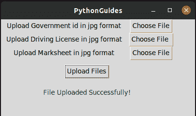

# 用 Python Tkinter 上传文件

> 原文：<https://pythonguides.com/upload-a-file-in-python-tkinter/>

[](https://sharepointsky.teachable.com/p/python-and-machine-learning-training-course)

在本教程中，我们将学习如何在 Python Tkinter 中**上传文件。我们正在 Linux 操作系统上工作，但这段代码可以在 Windows 和 Mac 上执行。所以让我们来看看**如何用 Python Tkinter** 上传文件。**

## 用 Python Tkinter 上传文件

*   这个项目演示了选择和上传文件的功能，也演示了 Python 中进度条的工作方式。要了解更多关于进度条的信息，请点击[此 Url](https://pythonguides.com/python-tkinter-progress-bar/) 。
*   `tkinter.filedialog` 模块用于访问 `askopenfile` 函数。这允许用户使用文件资源管理器选择文件。要了解更多关于 `tkinter filedialog` 的信息，请点击[此 Url](https://pythonguides.com/python-tkinter-read-text-file/)

```py
from tkinter import *
from tkinter.ttk import *
from tkinter.filedialog import askopenfile 
import time

ws = Tk()
ws.title('PythonGuides')
ws.geometry('400x200') 

def open_file():
    file_path = askopenfile(mode='r', filetypes=[('Image Files', '*jpeg')])
    if file_path is not None:
        pass

def uploadFiles():
    pb1 = Progressbar(
        ws, 
        orient=HORIZONTAL, 
        length=300, 
        mode='determinate'
        )
    pb1.grid(row=4, columnspan=3, pady=20)
    for i in range(5):
        ws.update_idletasks()
        pb1['value'] += 20
        time.sleep(1)
    pb1.destroy()
    Label(ws, text='File Uploaded Successfully!', foreground='green').grid(row=4, columnspan=3, pady=10)

adhar = Label(
    ws, 
    text='Upload Government id in jpg format '
    )
adhar.grid(row=0, column=0, padx=10)

adharbtn = Button(
    ws, 
    text ='Choose File', 
    command = lambda:open_file()
    ) 
adharbtn.grid(row=0, column=1)

dl = Label(
    ws, 
    text='Upload Driving License in jpg format '
    )
dl.grid(row=1, column=0, padx=10)

dlbtn = Button(
    ws, 
    text ='Choose File ', 
    command = lambda:open_file()
    ) 
dlbtn.grid(row=1, column=1)

ms = Label(
    ws, 
    text='Upload Marksheet in jpg format '
    )
ms.grid(row=2, column=0, padx=10)

msbtn = Button(
    ws, 
    text ='Choose File', 
    command = lambda:open_file()
    ) 
msbtn.grid(row=2, column=1)

upld = Button(
    ws, 
    text='Upload Files', 
    command=uploadFiles
    )
upld.grid(row=3, columnspan=3, pady=10)

ws.mainloop()
```

**输出:**

这是上面代码的输出。在这个用户需要提交三份 jpeg 格式的文件。该界面有 3 个按钮用于选择文档，一个按钮用于上传文档。


Upload Files in Python Tkinter

一旦用户可以选择文件，然后他/她需要点击上传文件按钮发送文件到服务器上。我们尚未将此应用程序与任何服务器连接。用户将看到一个进度条，显示正在上传。


File upload in preogress

一旦所有的文件都被上传，应用程序将显示成功消息，如下图所示。



Upload Files in Python Tkinter

您可能会喜欢以下 Python 教程:

*   [文件不存在 Python](https://pythonguides.com/file-does-not-exist-python/)
*   [如何在 Python 中读取视频帧](https://pythonguides.com/read-video-frames-in-python/)
*   [Python 程序打印数组中的元素](https://pythonguides.com/python-program-to-print-element-in-an-array/)
*   [Python 连接列表与示例](https://pythonguides.com/python-concatenate-list/)
*   [Python Tkinter 拖拽](https://pythonguides.com/python-tkinter-drag-and-drop/)
*   [Python 程序打印质数](https://pythonguides.com/python-program-to-print-prime-numbers/)
*   [Python Tkinter 测验](https://pythonguides.com/python-tkinter-quiz/)

在这个 Python 教程中，我们学习了**如何在 Python Tkinter** 中上传文件。

[Bijay Kumar](https://pythonguides.com/author/fewlines4biju/)

Python 是美国最流行的语言之一。我从事 Python 工作已经有很长时间了，我在与 Tkinter、Pandas、NumPy、Turtle、Django、Matplotlib、Tensorflow、Scipy、Scikit-Learn 等各种库合作方面拥有专业知识。我有与美国、加拿大、英国、澳大利亚、新西兰等国家的各种客户合作的经验。查看我的个人资料。

[enjoysharepoint.com/](https://enjoysharepoint.com/)[](https://www.facebook.com/fewlines4biju "Facebook")[](https://www.linkedin.com/in/fewlines4biju/ "Linkedin")[](https://twitter.com/fewlines4biju "Twitter")