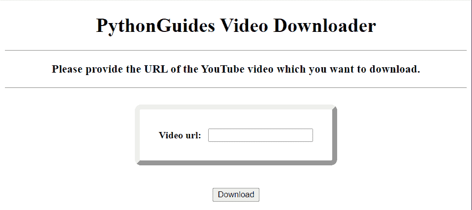
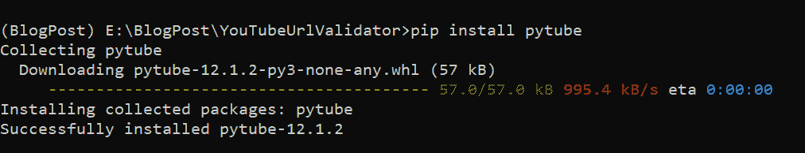
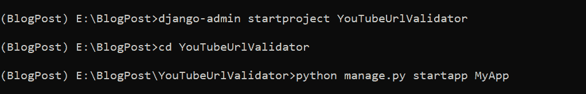
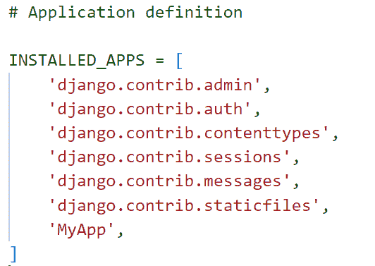
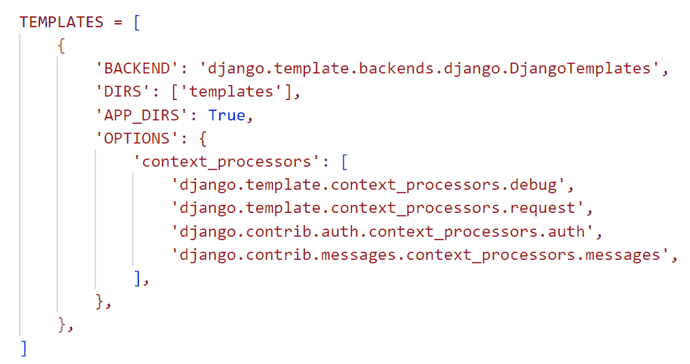
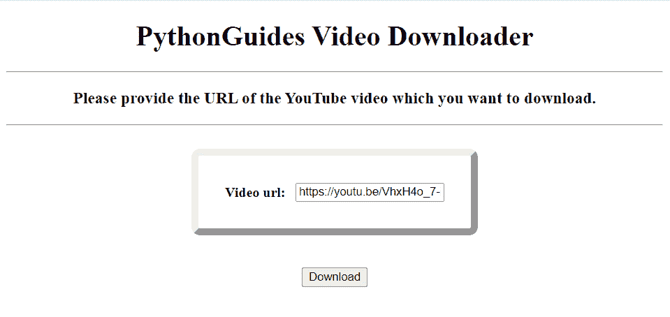
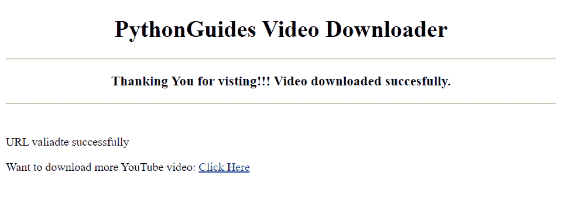
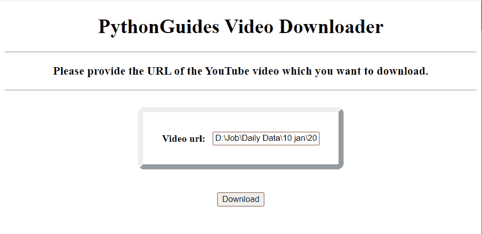
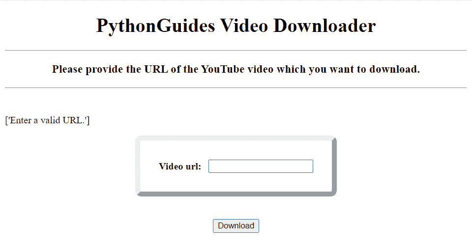

# 在 Python Django 中验证 URL 字符串

> 原文：<https://pythonguides.com/validate-url-string-in-python-django/>

[](https://sharepointsky.teachable.com/p/python-and-machine-learning-training-course)

在这个 [Python Django 教程](https://pythonguides.com/what-is-python-django/)中，我将解释**如何用简单的步骤在 Python Django** 中验证 URL 字符串。

我最近一直在使用 Django web 框架开发一个网站来下载 YouTube 视频。此外，我必须在 Python Django 项目中验证 URL 字符串。

为了将 YouTube 视频下载到您的内部系统并验证其 URL 字符串，我进行了研究并构建了逻辑。

在这里，我们将看到:

*   pytube 库是什么？
*   如何使用 pytube
*   使用 Django web 框架设置项目
*   如何在 Python Django 中验证 URL 字符串
*   使用 Python Django 下载 YouTube 视频

在本文的最后，您还可以下载在 Python Django 中验证 URL 字符串的代码。

这是我们将在这里建造的。



Validate URL string and YouTube video downloader

目录

[](#)

*   [如何在 Python Django 中验证 URL 字符串](#How_to_validate_URL_string_in_Python_Django "How to validate URL string in Python Django")
    *   [pytube 库](#pytube_library "pytube library")
    *   [如何设置 pytube 库](#How_to_set_up_pytube_library "How to set up pytube library")
    *   [如何验证 URL 字符串并构建 YouTube 视频下载器](#How_to_validate_URL_string_and_built_YouTube_video_downloader "How to validate URL string and built YouTube video downloader")
        *   [在 Django web 框架中建立项目](#Set_up_Project_in_Django_web_framework "Set up Project in Django web framework")
        *   [使用 Python Django 创建表单](#Create_Form_using_Python_Django "Create Form using Python Django")
        *   [Django 模板验证 Python Django 中的 URL 字符串并下载 YouTube 视频](#Django_Template_to_validate_URL_string_in_Python_Django_and_download_YouTube_video "Django Template to validate URL string in Python Django and download YouTube video")
        *   [定义 Django 视图](#Define_Django_View "Define Django View")
        *   [执行 Django 项目](#Execute_Django_Project "Execute Django Project")
*   [下载验证 URL 字符串的 Python Django 完整代码](#Download_Validate_URL_string_in_Python_Django_complete_code "Download Validate URL string in Python Django complete code")
*   [结论](#Conclusion "Conclusion")

## 如何在 Python Django 中验证 URL 字符串

现在，让我们先来了解一下 pytube 库，并一步一步地学习在 Python Django 中下载 YouTube 视频和验证 URL 字符串。

### pytube 库

`YouTube` 是一个知名的视频分享平台。从 YouTube 上下载一段视频需要付出努力。使用 Python Django 完成这项任务相当简单

有一个叫做 `pytube` 的 Python 库可以做到这一点。这是一个轻量级、无依赖性的 Python 库，用于处理 YouTube 视频下载。

### 如何设置 pytube 库

pytube 不是一个内置的库，我们需要在激活的虚拟环境中使用它之前安装它。现在，使用下面给出的命令安装它。

```py
pip install pytube
```



Download pytube using pip

### 如何验证 URL 字符串并构建 YouTube 视频下载器

现在，我们将看到一个在 Python Django 中验证 URL 字符串和下载 YouTube 视频的示例。

阅读: [Python Django 表单验证](https://pythonguides.com/django-form-validation/)

#### 在 Django web 框架中建立项目

要启动 Django 项目，请打开终端并输入以下命令。这里， `YouTubeURLValidator` 是 Django 项目的名称。

```py
django-admin startproject YouTubeURLValidator
```

它将创建一个名为 `YouTubeURLValidator` 的文件夹，并在终端中输入下面的命令。

```py
cd YouTubeURLValidator
```

通过在终端中键入下面的命令，在这个项目文件夹中创建一个名为 `MyApp` 的 Django 应用程序。

```py
python manage.py startapp MyApp
```



Project setup in Django

将应用名称添加到位于 `settings.py` 文件中的 `INSTALLED_APP` 列表中，以激活该应用。



Install App in Django

Django 在项目目录中包含了一个 `urls.py` 文件，默认情况下，它将新构建的应用程序映射到其中。为此，在其中添加以下代码。

```py
from django.contrib import admin
from django.urls import path,include

urlpatterns = [
    path('admin/', admin.site.urls),
    path('',include('MyApp.urls')),
]
```

阅读:[如何在 Django 中创建模型](https://pythonguides.com/create-model-in-django/)

#### 使用 Python Django 创建表单

为了在 Django 中创建从用户那里获取 YouTube URLs 的表单，以验证 URL 字符串并下载视频，我们创建了 `forms.py` 文件和下面给出的代码。

```py
from django import forms

class YouTubeForm(forms.Form):
    video_url = forms.CharField()
```

*   这里，我们使用名为 `YouTubeForm` 的表单类创建表单。
*   它由名为 `video_url` 的 `CharField` 组成，用于获取 YouTube 视频的 url。

#### Django 模板验证 Python Django 中的 URL 字符串并下载 YouTube 视频

因为 Django 应用程序的前端被指定为模板。在主项目目录中创建一个名为 `Templates` 的子目录来存储所有的项目模板文件。

打开 `settings.py` 文件更新 `DIRS` 使用模板文件夹的路径。



Set DIRS Path Template

创建一个`home.html`文件，在模板文件夹中添加下载 YouTube 视频的 HTML 代码。

```py
<!DOCTYPE html>
<html lang="en">

<head>
    <meta charset="UTF-8">
    <meta http-equiv="X-UA-Compatible" content="IE=edge">
    <meta name="viewport" content="width=device-width, initial-scale=1.0">
    <title>Video Downloader</title>
    <style>
        table {
            border: 8px outset;
            border-radius: 10px;
            border-spacing: 10px;
            padding: 20px;
            margin-left: auto;
            margin-right: auto;
        }
    </style>
</head>

<body>
    <h1 align="center">PythonGuides Video Downloader</h1>
    <hr>
    <h3 align="center">Please provide the URL of the YouTube video which you want to download.</h3>
    <hr>
    <br>
    
    
    <div class="alert alert-primary" role="alert">
        <p class="" >{{ message }}</p>
    </div>
    
    
    <form method="post">
        
        <table>
            {{form.as_table}}
        </table>
        <br><br>
        <div style="text-align:center">
            <button type="submit">Download</button>
        </div>
    </form>
</body>

</html>
```

*   表格的样式首先在 `head` 标签中定义。
*   HTML 标签 `h1` 和 `h3` 然后被用来在**主体**标签内添加表单的标题。
*   分别使用 `br` 和 `hr` 标签来断开线条并绘制一条水平线。
*   我们利用 if 和 for 语句中的**消息**标签来输出无效的 URL 错误消息。
*   接下来，我们使用表单元素中包含的 `csrf_token` 来保护表单免受网络攻击，并允许我们安全地传递数据。
*   然后使用 `form.as_table` 标签将表单呈现为**表**中的一个表。
*   最后添加一个**提交**按钮，允许用户下载 YouTube 视频。

创建一个`success.html`文件，在 Template 文件夹中添加 HTML 代码，用于显示 URL 验证成功的消息和下载 YouTube 视频。

```py
<!DOCTYPE html>
<html lang="en">

<head>
    <meta charset="UTF-8">
    <meta http-equiv="X-UA-Compatible" content="IE=edge">
    <meta name="viewport" content="width=device-width, initial-scale=1.0">
    <title>Success</title>
</head>

<body>
    <h1 align="center">PythonGuides Video Downloader</h1>
    <hr>
    <h3 align="center">Thanking You for visting!!! Video downloaded succesfully.</h3>
    <hr>
    <br>
    
    
    <div class="alert alert-primary" role="alert">
        <p class="" >{{ message }}</p>
    </div>
    
    
    <p>
        Want to download more YouTube video: <a href="">Click Here</a>
    </p>
</body>

</html>
```

*   HTML 标签 `h1` 和 `h3` 然后被用来在**主体**标签内添加表单的标题。
*   分别使用 `br` 和 `hr` 标签来断开线条并绘制一条水平线。
*   我们利用 if 和 for 语句中的**消息**标签输出视频下载成功的消息。
*   接下来，我们使用 `p` 标签中的 `a href` 标签添加链接以返回到另一个视频下载的主页。

阅读: [Python Django MySQL CRUD](https://pythonguides.com/python-django-mysql-crud/)

#### 定义 Django 视图

要定义应用程序的主要逻辑，打开 `views.py` 文件并添加下面给出的代码。

```py
from django.shortcuts import render
from pytube import YouTube
from django.core.validators import URLValidator
from django.core.exceptions import ValidationError
from django.contrib import messages
from .forms import YouTubeForm

# Create your views here.

def urlvalidate(request):
        if request.method == 'POST':
            form = YouTubeForm(request.POST)
            if form.is_valid():
                video_url = form.cleaned_data['video_url']
                valiadte = URLValidator()
                try:
                    valiadte(video_url)
                    messages.info(request,'URL valiadte successfully')
                    video = YouTube(video_url)
                    download_video = video.streams.get_lowest_resolution()
                    download_video.download()
                    return render(request, "success.html")
                except ValidationError as exception:
                    print(exception)
                    messages.info(request,exception)
        form = YouTubeForm()
        return render(request, "home.html", {'form':form})
```

*   在这里，我们创建了一个名为 `urlvalidate` 的视图，它从表单中检索 `video_url` ，使用 `validate` 函数对其进行检查，如果验证成功，则输出成功消息，否则输出验证错误。
*   此外，验证成功后，我们使用 `YouTube` 函数下载我们在 `video_url` 字段中输入链接的 YouTube 视频。然后使用 `get_lowest_resolution` 方法来传输视频。
*   我们还使用 `download` 方法在内部下载视频，视频下载成功后渲染到成功页面。

现在，我们必须用 URL 映射视图以便调用它，因此我们必须在 app 目录中创建一个名为 `urls.py` 的文件。包括下面的代码。

```py
from django.urls import path
from . import views

urlpatterns = [
path('', views.urlvalidate, name='urlvalidate'),
]
```

这就是我们如何在 Python Django 中验证 URL 字符串并构建 YouTube 下载器。

阅读:[创建与 Django 和 SQLite 的联系表单](https://pythonguides.com/contact-form-with-django-and-sqlite/)

#### 执行 Django 项目

要启动开发服务器，请在终端中键入下面给出的命令。

```py
python manage.py runserver
```

它成功地打开了 Django 页面，在 Python Django 中输入 URL 字符串。然后，点击下载。



Validate and Pass URL of video

它成功地将我们重定向到显示验证成功消息的成功页面。如果你想下载更多的 YouTube 视频到你的内部存储器，只需点击点击这里链接。



URL validates success message


Video Downloader

如果我们输入了不正确的 URL，它会向我们显示 URL 无效的错误消息。



Incorrect URL passed



Validation Error Message

阅读:[创建一个 Django 联系表单，并附上电子邮件](https://pythonguides.com/build-a-django-contact-form-with-email/)

## 下载验证 URL 字符串的 Python Django 完整代码

这是代码。

[Valiadte URL string and Download YouTube Videos](https://pythonguides.com/wp-content/uploads/2023/01/YouTubeUrlValidator.zip)

## 结论

这样，我们已经成功地学会了在 Python Django 中检查一个字符串是否是有效的 URL。我们还学习了 pytube 库，并使用 Django web 框架构建了一个 YouTube 下载网站。

此外，我们还讨论了以下主题。

*   pytube 库是什么？
*   如何使用 pytube
*   使用 Django web 框架设置项目
*   如何在 Python Django 中验证 URL 字符串
*   使用 Python Django 下载 YouTube 视频

您可能也喜欢阅读下面的 Python Django 教程。

*   [获取 Django 中的 URL 参数](https://pythonguides.com/get-url-parameters-in-django/)
*   [Django 从 POST 请求中获取所有数据](https://pythonguides.com/django-get-all-data-from-post-request/)
*   [Django 模板中的 If 语句](https://pythonguides.com/if-statement-in-django-template/)
*   [Python Django 随机数](https://pythonguides.com/django-random-number/)

[Bijay Kumar](https://pythonguides.com/author/fewlines4biju/)

Python 是美国最流行的语言之一。我从事 Python 工作已经有很长时间了，我在与 Tkinter、Pandas、NumPy、Turtle、Django、Matplotlib、Tensorflow、Scipy、Scikit-Learn 等各种库合作方面拥有专业知识。我有与美国、加拿大、英国、澳大利亚、新西兰等国家的各种客户合作的经验。查看我的个人资料。

[enjoysharepoint.com/](https://enjoysharepoint.com/)[](https://www.facebook.com/fewlines4biju "Facebook")[](https://www.linkedin.com/in/fewlines4biju/ "Linkedin")[](https://twitter.com/fewlines4biju "Twitter")