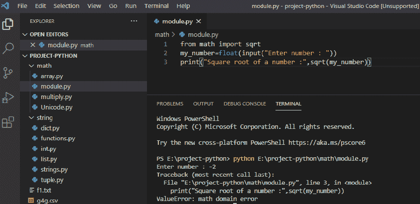
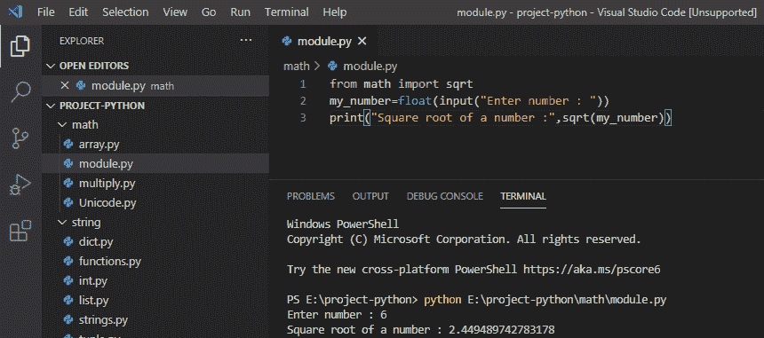
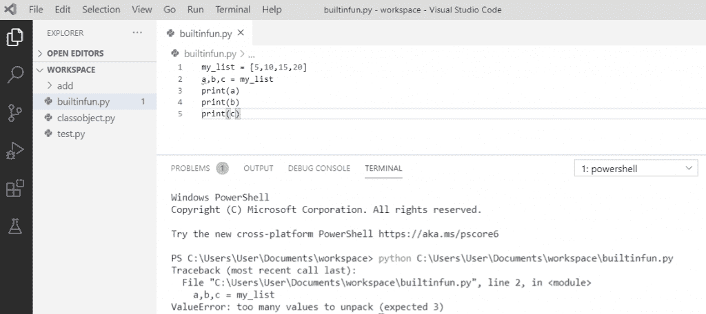
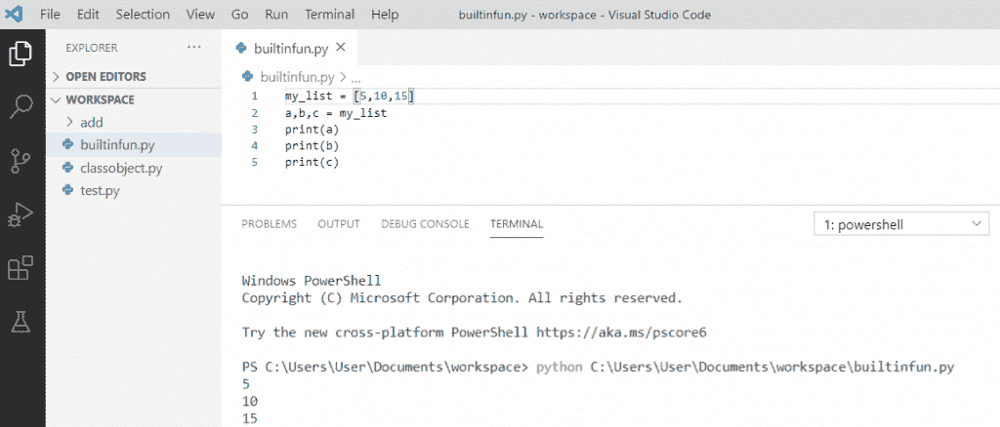

# value error:Python 中的数学域错误

> 原文：<https://pythonguides.com/valueerror-math-domain-error/>

[](https://sharepointsky.teachable.com/p/python-and-machine-learning-training-course)

在本 [Python 教程](https://pythonguides.com/python-download-and-installation/)中，我们将讨论如何修复 Python 中的数学领域错误。我们将检查如何修复名为**值错误:数学域错误**和**值错误:` `解包 python 的值太多**。

目录

[](#)

*   [值错误:数学域错误](#ValueError_math_domain_error "ValueError: math domain error")
*   [值错误:解包 python 的值太多](#ValueError_too_many_values_to_unpack_python "ValueError: too many values to unpack python")

## 值错误:数学域错误

在 python 中，我们在使用 python 中的数学函数时会得到这个错误。当我们试图在 python 中找出负数的平方根时，通常会出现这种类型的错误。

**举例:**

```py
from math import sqrt
my_number=float(input("Enter number : "))
print("Square root of a number :",sqrt(my_number))
```

写完上面的代码后，你将打印出 `" sqrt(my_number) "` ，然后错误将显示为"**value error:math domain error**"。在这里，发生这个错误是因为我们正在寻找一个负数的平方根。

你可以看到下面这个错误的截图



valueerror math domain error in python

为了解决这个 **python 数学域错误**,我们可以给数学函数正确的值，也可以避免负值，因为它没有真正的平方根。

**举例:**

```py
from math import sqrt
my_number=float(input("Enter number : "))
print("Square root of a number :",sqrt(my_number))
```

写完上面的代码后，你将打印出`"`sqrt(my _ number)`"`，然后输出将显示为一个数字的**平方根:2.44989742783178**。这里，通过给出一个正数来解决错误。

你可以参考下面的截图，我的错误是如何解决的。



valueerror math domain error sqrt

## **值错误:解包 python** 的值太多

由于列表元素的数量大于变量的数量，赋值时会出现 **valueerror:` `太多值无法解包**错误。

**举例:**

```py
my_list = [5,10,15,20]
a,b,c = my_list
print(a)
print(b)
print(c)
```

在编写了上面的代码之后，您将打印这些代码，然后错误将显示为" **valueerror:太多的值要解包"**。这里，当我们在列表中声明的值多于变量的数量时，就会出现这个错误。

你可以看到下面这个错误的截图



**ValueError: too many values to unpack python**

这个**误差是通过给一个**相等数量的对象**来解决的**。因此，我们通过分配匹配数量的变量来解包列表中的元素。

**举例:**

```py
my_list = [5,10,15]
a,b,c = my_list
print(a)
print(b)
print(c)
```

写完上面的代码后，您将打印输出，输出将显示为 `" 5 10 15"` 。这里，列表元素的数量和变量的数量是匹配的。所以，通过这种方式，我们可以避免这种错误。

你可以看到下面的截图是如何解决 Python 中的 valueerror 的



**ValueError: too many values to unpack python**

您可能会喜欢以下 Python 教程:

*   [检查一个数是否是素数 Python](https://pythonguides.com/check-if-a-number-is-a-prime-python/)
*   [Python pip 不被识别为内部或外部命令](https://pythonguides.com/python-pip-is-not-recognized/)
*   [Python 将元组转换为列表](https://pythonguides.com/python-convert-tuple-to-list/)
*   [python 中的百分号是什么意思](https://pythonguides.com/percent-sign-mean-in-python/)
*   [Python 内置函数示例](https://pythonguides.com/python-built-in-functions/)
*   [获取当前目录 Python](https://pythonguides.com/get-current-directory-python/)
*   [Python if else with examples](https://pythonguides.com/python-if-else/)
*   [Python 类型错误:“列表”对象不可调用](https://pythonguides.com/python-typeerror-list-object-is-not-callable/)

这是如何修复 python 中的 ValueError 或**value error:Python 中的数学域错误**和 **valueerror:` `太多值无法解包 python** 。

[Bijay Kumar](https://pythonguides.com/author/fewlines4biju/)

Python 是美国最流行的语言之一。我从事 Python 工作已经有很长时间了，我在与 Tkinter、Pandas、NumPy、Turtle、Django、Matplotlib、Tensorflow、Scipy、Scikit-Learn 等各种库合作方面拥有专业知识。我有与美国、加拿大、英国、澳大利亚、新西兰等国家的各种客户合作的经验。查看我的个人资料。

[enjoysharepoint.com/](https://enjoysharepoint.com/)[](https://www.facebook.com/fewlines4biju "Facebook")[](https://www.linkedin.com/in/fewlines4biju/ "Linkedin")[](https://twitter.com/fewlines4biju "Twitter")