# 值错误:用序列设置数组元素

> 原文：<https://pythonguides.com/valueerror-setting-an-array-element-with-a-sequence/>

[](https://sharepointsky.teachable.com/p/python-and-machine-learning-training-course)

在本 Python 教程中，我们将讨论用序列设置数组元素的概念，还将了解如何修复错误， **Valueerror:用序列设置数组元素**:

*   不同维度的数组
*   用序列熊猫设置数组元素
*   值在 Sklearn 中用序列设置数组元素时出错
*   值在 Tensorflow 中用序列设置数组元素时出错
*   在 np.vectorize 中用序列设置数组元素时出错
*   在二进制文本分类中用序列设置数组元素

目录

[](#)

*   [什么是 ValueError？](#What_is_ValueError "What is ValueError?")
*   [用序列设置数组元素](#Setting_an_array_element_with_a_sequence "Setting an array element with a sequence")
*   [值使用序列 python 设置数组元素时出错](#valueerror_setting_an_array_element_with_a_sequence_python "valueerror setting an array element with a sequence python")
*   [解决方案](#Solution "Solution")
*   [用序列熊猫设置数组元素](#Setting_an_array_Element_with_a_sequence_Pandas "Setting an array Element with a sequence Pandas")
*   [解决方案](#Solution-2 "Solution")
*   [值在 Sklearn 中用序列设置数组元素时出错](#ValueError_Setting_An_Array_Element_with_a_Sequence_in_Sklearn "ValueError Setting An Array Element with a Sequence in Sklearn")
*   [解决方案](#Solution-3 "Solution")
*   [value 在 Tensorflow 中用序列设置数组元素时出错](#Valueerror_Setting_An_Array_Element_with_a_Sequence_in_Tensorflow "Valueerror Setting An Array Element with a Sequence in Tensorflow")
*   [解决方案](#Solution-4 "Solution")
*   [value 用序列 np.vectorize 设置数组元素出错](#valueerror_setting_an_array_element_with_a_sequence_npvectorize "valueerror setting an array element with a sequence np.vectorize")
*   [解决方案](#Solution-5 "Solution")
*   [值使用 tfidfvectorizer 在二进制文本分类中用序列设置数组元素时出错](#Valueerror_Setting_An_Array_Element_with_a_Sequence_in_binary_text_classification_with_tfidfvectorizer "Valueerror Setting An Array Element with a Sequence in binary text classification with tfidfvectorizer")
*   [解决方案](#Solution-6 "Solution")

## 什么是 ValueError？

当函数传递正确类型的参数但未知值时，会引发 ValueError。此外，这种情况不应被更精确的异常(如索引错误)所阻止。

## 用序列设置数组元素

*   在 Python 中，错误为 ValueError:用一个序列设置一个数组元素是我们大部分时候使用 numpy 库的时候。当您试图创建一个包含多维形状的列表的数组时，通常会出现此错误。

## 值使用序列 python 设置数组元素时出错

**不同维度的数组**

*   在这个例子中，我们将从具有不同维度的元素的列表中创建一个 numpy 数组，这将抛出一个错误，作为用序列设置数组元素的值错误
*   让我们看看并讨论这个错误及其解决方案

这是一个不同维度的数组的代码

```py
import numpy as np

print(np.array([[4, 5,9], [ 7, 9]],dtype = int))
```

**解释**

*   首先，我们将导入 numpy 库。
*   然后，我们将使用函数 np.array 创建两个不同维度的数组。
*   下面是以下代码的截图

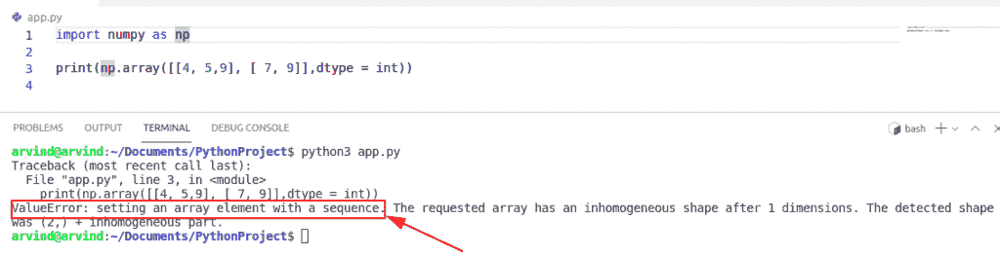

Value error array of a different dimension

您可以很容易地在显示中看到数值错误。这是因为 numpy 数组的结构不正确。

## 解决方案

在这个解决方案中，我们将声明两个数组的大小和长度相等，并修复值错误。

```py
import numpy as np

print(np.array([[4, 5,9], [ 4,7, 9]],dtype = int))
```

下面是以下代码的截图

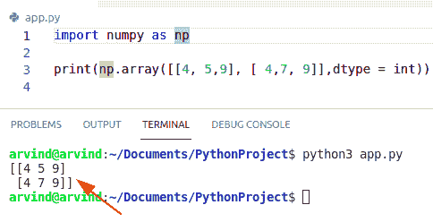

valueerror setting an array element with a sequence python

这就是如何通过用序列 python 设置数组元素**来修复值错误。**

## 用序列熊猫设置数组元素

在这个例子中，我们将导入 Python 熊猫模块。然后我们将创建一个变量，并使用库 pandas dataframe 来赋值。现在，我们将打印输入，然后它将更新列表中的值，并得到一个值错误。

这是熊猫的价值代码错误

```py
import pandas as pd
out = pd.DataFrame(data = [[600.0]], columns=['Sold Count'], index=['Assignment'])
print (out.loc['Assignment', 'Sold Count'])

out.loc['Assignment', 'Sold Count'] = [200.0]
print (out.loc['Assignment', 'Sold Count'])
```

**解释**

基本问题是，我想在数据帧中设置一行和一列为列表。使用了 loc 方法并得到一个值错误

下面是以下代码的截图

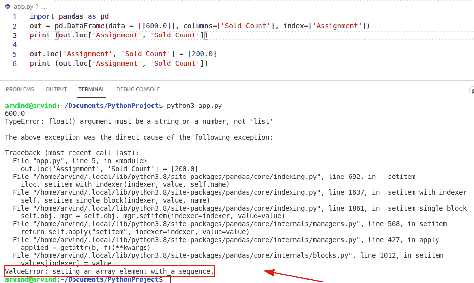

Python Setting an array element with a sequence pandas

## 解决方案

在此解决方案中，如果您想要解决此错误，您将创建一个非数字的 dtype 作为对象，因为它只存储数字值。

这是代码

```py
import pandas as pd
out = pd.DataFrame(data = [[600.0]], columns=['Sold Count'], index=['Assignment'])
print (out.loc['Assignment', 'Sold Count'])

out['Sold Count'] = out['Sold Count'].astype(object)
out.loc['Assignment','Sold Count'] = [1000.0,600.0]
print(out)
```

下面是以下代码的截图

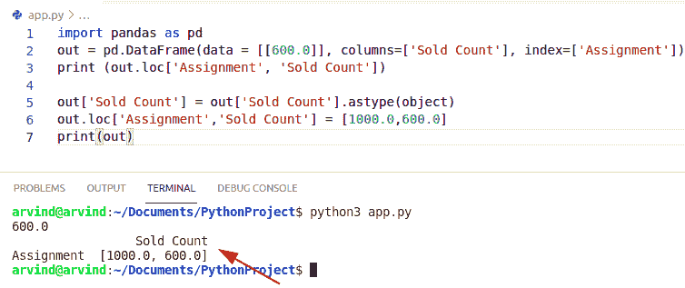

valueerror: setting an array element with a sequence pandas

这是如何修复错误，值错误:设置一个序列熊猫数组元素。

阅读 [Python 熊猫掉行示例](https://pythonguides.com/python-pandas-drop-rows-example/)

## 值在 Sklearn 中用序列设置数组元素时出错

*   在这个方法中，我们将讨论 sklearn 中一个可迭代序列的错误。
*   Scikit-learn 是一个免费的 Python 机器学习模块。它具有各种算法，如 SVM、随机森林和 k-neighbors，它还生成 Python 数值和科学库，如 NumPy 和 SciPy。
*   在机器学习模型中，有时 numpy 数组在代码中得到一个值错误。
*   在这个方法中，我们可以很容易地使用函数 SVC()并导入 sklearn 库。

下面是用序列设置数组元素的值错误代码

```py
import numpy as np
from sklearn.pipeline import make_pipeline
from sklearn.preprocessing import StandardScaler
from sklearn.svm import SVC
X = np.array([[-3, 4], [5, 7], [1, -1], [3]])
y = np.array([4, 5, 6, 7])
clf = make_pipeline(StandardScaler(), SVC(gamma='auto'))
clf.fit(X, y)
```

**解释**

*   在上面的代码中，我们将导入一个 numpy 库和 sklearn。现在我们将创建一个数组 X 和 numpy 数组 X 的结束元素长度为 1，而另一个值的长度为 2。
*   这将显示带有序列的数组元素的值错误的结果。

下面是以下代码的截图

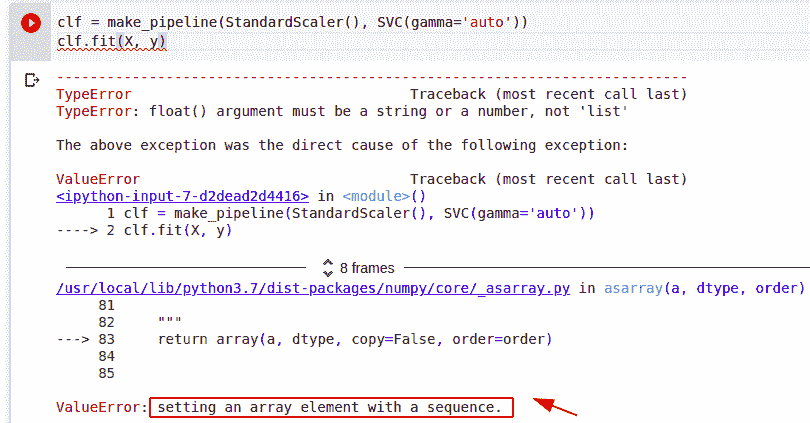

value error: setting an array element with a sequence sklearn

## 解决方案

*   在这个解决方案中，我们将改变给定数组中结束元素的大小。
*   我们将给所有元素相同的长度。

这是代码

```py
import numpy as np
from sklearn.pipeline import make_pipeline
from sklearn.preprocessing import StandardScaler
from sklearn.svm import SVC
X = np.array([[-3, 4], [5, 7], [1, -1], [3,2]])
y = np.array([4, 5, 6, 7])
clf = make_pipeline(StandardScaler(), SVC(gamma='auto'))
clf.fit(X, y)
```

下面是以下代码的截图

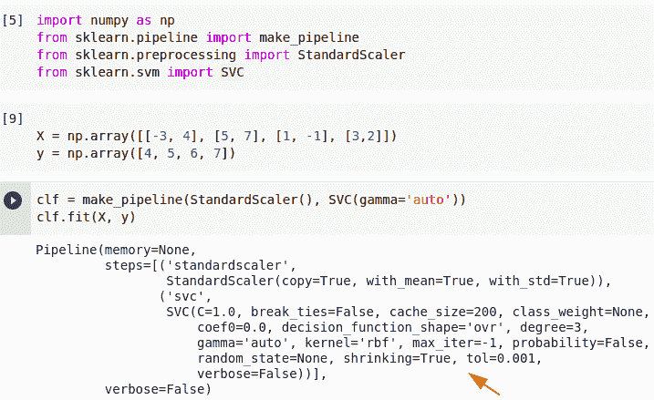

Solution of an array element with a sequence in Sklearn

这是如何修复错误， **valueerror 用序列 sklearn** 设置数组元素。

阅读[从字符串 Python 中移除字符](https://pythonguides.com/remove-character-from-string-python/)

## value 在 Tensorflow 中用序列设置数组元素时出错

*   在这个方法中，我们将学习和讨论 Tensorflow 中一个序列的错误。
*   张量的形状是张量模的秩，并且每个维度的长度可能不总是完全已知的。在 tf.function 中，形状只是部分已知的。
*   在这个方法中，如果给定 numpy 数组中每个元素的形状都不等于 size，那么就会得到一个错误消息。

下面是 Tensorflow 中带有序列的值错误数组元素的代码。

```py
import tensorflow as tf
import numpy as np

x = tf.constant([4,5,6,[4,1]])
y = tf.constant([9,8,7,6])

res = tf.multiply(x,y)
tf.print(res)
```

**解释**

在本例中，我们将导入一个 TensorFlow 模块，然后创建一个 numpy 数组，并分配不同长度的值。现在我们创建一个变量并使用函数 tf。倍增。

下面是以下代码的截图

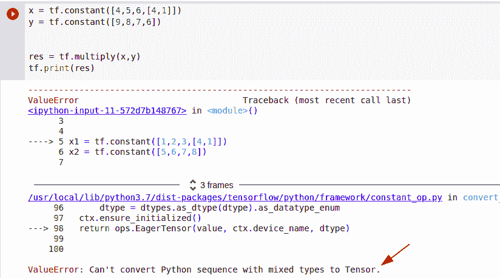

Value error array of different sequences with TensorFlow

## 解决方案

*   在这个解决方案中，我们将显示和更改给定数组中结束元素的长度。
*   我们将给所有的值相同的长度，所有的值都是相同的形状。

这是代码

```py
import tensorflow as tf
import numpy as np

x = tf.constant([4,5,6,4])
y = tf.constant([9,8,7,6])

res = tf.multiply(x,y)
tf.print(res)
```

下面是以下代码的截图

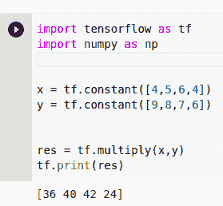

Solution of an array element with a sequence in Tensorflow

这是如何通过用序列 TensorFlow 设置数组元素来修复错误值 error。

## value 用序列 np.vectorize 设置数组元素出错

*   在这种方法中，我们将学习和讨论 np.vectorize 中的序列错误
*   np.vectorize 的主要目的是将不支持 numpy 的函数转换成能够提供和操作(并返回)numpy 数组的函数。
*   在这个例子中，给定的函数已经被矢量化，因此对于输入数组 t 中的每个值，numpy 数组都是一个输出。

下面是 `np.vectorize` 中带有序列的数组元素的代码。

```py
import numpy as np

def Ham(t):
    d=np.array([[np.cos(t),np.sqrt(t)],[0,1]],dtype=np.complex128)
    return d
print(Ham)
```

**解释**

在上面的代码中，当 NumPy 和 python 之间存在更精确和冲突时，会出现此错误。如果未给出 dtype，可能会显示错误。

下面是以下代码的截图

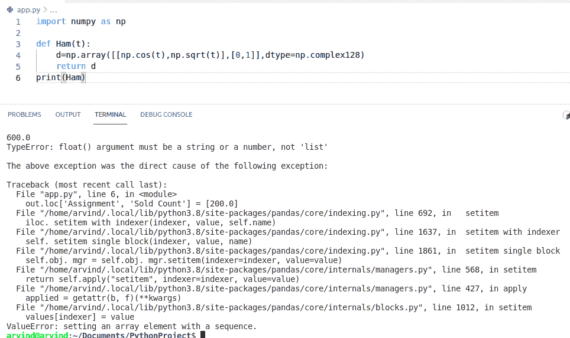

Valueerror array different sequence with vectorize

## 解决方案

*   在这个方法中，问题是 np.cos(t)和 np.sqrt()计算长度为 t 的 numpy 数组，而第二行([0，1])保持相同的大小。
*   要在函数中使用 np.vectorize，必须声明输出类型。
*   在这个方法中，我们可以很容易地使用 hamvec 作为方法。

这是代码

```py
import numpy as np
def Ham(t):
    d=np.array([[np.cos(t),np.sqrt(t)],[0,1]],dtype=np.complex128)
    return d

HamVec = np.vectorize(Ham, otypes=[np.ndarray])
x=np.array([1,2,3])
y=HamVec(x)
print(y)
```

下面是以下代码的截图

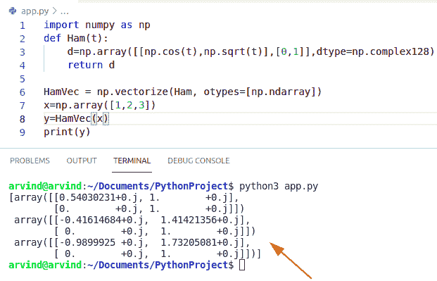

Solution of an array element with a sequence in np.vectorize

这是如何修复错误，value error **用序列 np.vectorize** 设置数组元素。

## 值使用 tfidfvectorizer 在二进制文本分类中用序列设置数组元素时出错

*   在本节中，我们将学习和讨论使用 tfidfvectorizer 进行二进制文本分类时出现的序列错误。
*   TF-IDF 代表词频逆文档频率。这种方法是一种数字统计，用于测量文档中单词的重要性。
*   Scikit-Learn 提供 tfidf 矢量器的结果。
*   我正在使用 pandas 和 scikit——学习在数据帧上使用 TfidfVectorizer 编码的文本特征进行二进制文本分类。

以下是使用 tfidfvectorizer 进行二进制文本分类的代码

```py
import pandas as pd
from sklearn.model_selection import train_test_split
from sklearn.svm import LinearSVC
from sklearn.feature_extraction.text import TfidfVectorizer
data_dict = {'tid': [0,1,2,3,4,5,6,7,8,9],
         'text':['This is the first.', 'This is the second.', 'This is the third.', 'This is the fourth.', 'This is the fourth.', 'This is the fourth.', 'This is the nintieth.', 'This is the fourth.', 'This is the fourth.', 'This is the first.'],
         'cat':[0,0,1,1,1,1,1,0,0,0]}
df = pd.DataFrame(data_dict)
tfidf = TfidfVectorizer(analyzer='word')
df['text'] = tfidf.fit_transform(df['text'])
X_train, X_test, y_train, y_test = train_test_split(df[['tid', 'text']], df[['cat']])
clf = LinearSVC()
clf.fit(X_train, y_train)
```

下面是以下代码的截图

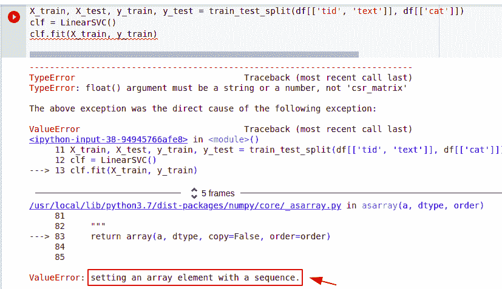

Value error Setting An Array Element with a Sequence in binary text classification

## 解决方案

*   Tfidfvectorizer 返回一个二维数组。如果不增加维度，就不能将列 df['text']设置为矩阵。
*   尝试在健身程序中仅使用训练数据，并尝试扩展数据并设置更多值。

这是代码

```py
import pandas as pd
from sklearn.model_selection import train_test_split
from sklearn.svm import LinearSVC
from sklearn.feature_extraction.text import TfidfVectorizer
data_dict = {'tid': [0,1,2,3,4,5,6,7,8,9],
         'text':['This is the first.', 'This is the second.', 'This is the third.', 'This is the fourth.', 'This is the fourth.', 'This is the fourth.', 'This is the nintieth.', 'This is the fourth.', 'This is the fourth.', 'This is the first.'],
         'cat':[0,0,1,1,1,1,1,0,0,0]}
df = pd.DataFrame(data_dict)
tfidf = TfidfVectorizer(analyzer='word')
df_text = pd.DataFrame(tfidf.fit_transform(df['text']).toarray()) 
X_train, X_test, y_train, y_test = train_test_split(pd.concat([df[['tid']],df_text],axis=1), df[['cat']])
clf = LinearSVC()
clf.fit(X_train, y_train)
```

下面是以下代码的截图

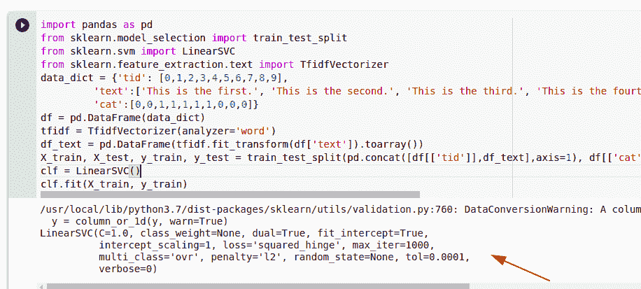

Solution of the array element with a sequence in binary text classification

以下是修复错误的方法，**value 使用 tfidfvectorizer** 在二进制文本分类中用序列设置数组元素时出错。

您可能会喜欢以下 Python 教程:

*   [Python 熊猫中的 group by](https://pythonguides.com/groupby-in-python-pandas/)
*   [如何在 Python 中使用 Pandas drop()函数](https://pythonguides.com/pandas-drop/)
*   [Python NumPy 平均值与示例](https://pythonguides.com/python-numpy-average/)
*   [Python NumPy 绝对值](https://pythonguides.com/python-numpy-absolute-value/)
*   [检查一个列表是否存在于另一个列表中 Python](https://pythonguides.com/check-if-a-list-exists-in-another-list-python/)

在本教程中，我们学习了如何修复错误，用序列 python 设置数组元素的值错误**。**

*   不同维度的数组
*   值使用序列 python 设置数组元素时出错
*   用序列熊猫设置数组元素
*   值在 Sklearn 中用序列设置数组元素时出错
*   值在 Tensorflow 中用序列设置数组元素时出错
*   在 np.vectorize 中用序列设置数组元素时出错
*   在二进制文本分类中用序列设置数组元素

[Bijay Kumar](https://pythonguides.com/author/fewlines4biju/)

Python 是美国最流行的语言之一。我从事 Python 工作已经有很长时间了，我在与 Tkinter、Pandas、NumPy、Turtle、Django、Matplotlib、Tensorflow、Scipy、Scikit-Learn 等各种库合作方面拥有专业知识。我有与美国、加拿大、英国、澳大利亚、新西兰等国家的各种客户合作的经验。查看我的个人资料。

[enjoysharepoint.com/](https://enjoysharepoint.com/)[](https://www.facebook.com/fewlines4biju "Facebook")[](https://www.linkedin.com/in/fewlines4biju/ "Linkedin")[](https://twitter.com/fewlines4biju "Twitter")