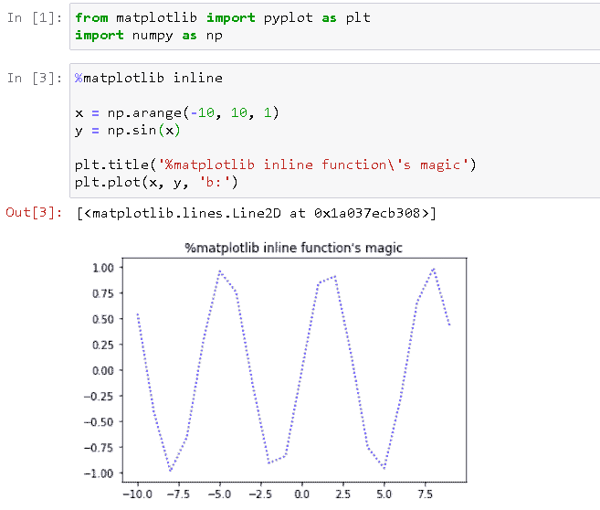
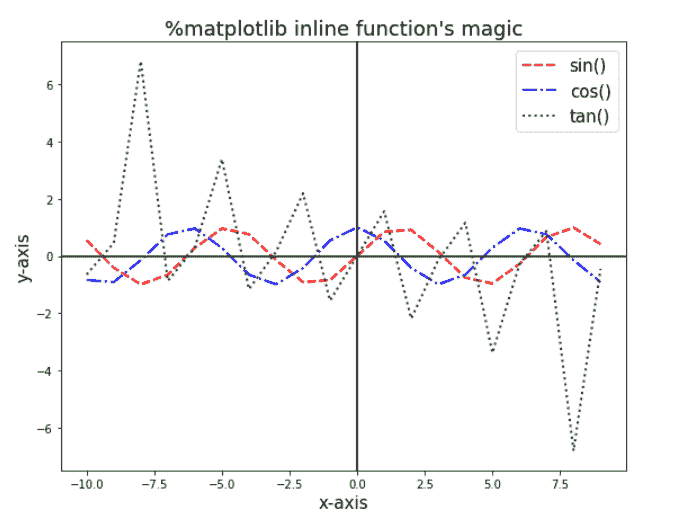
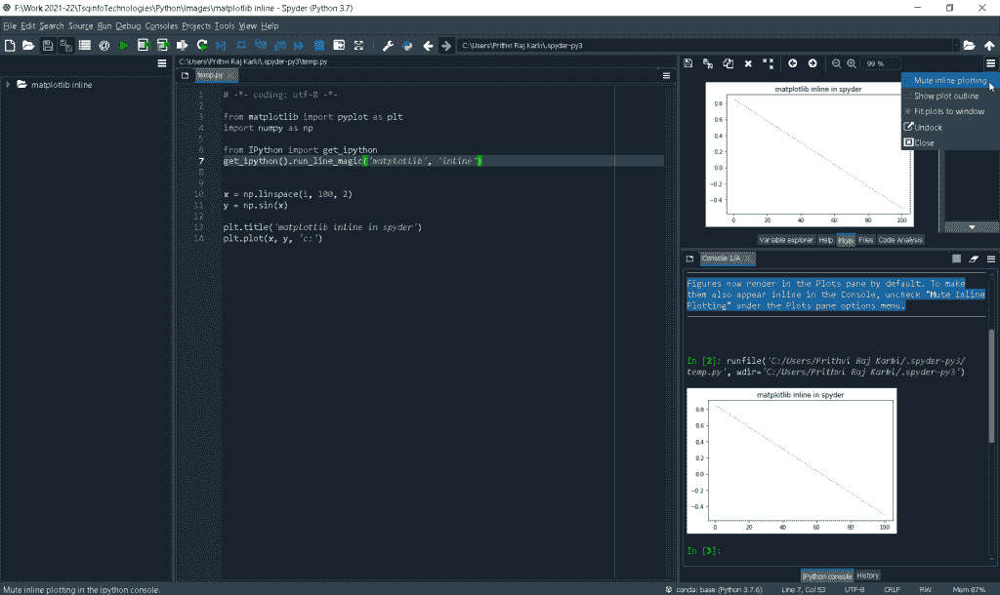
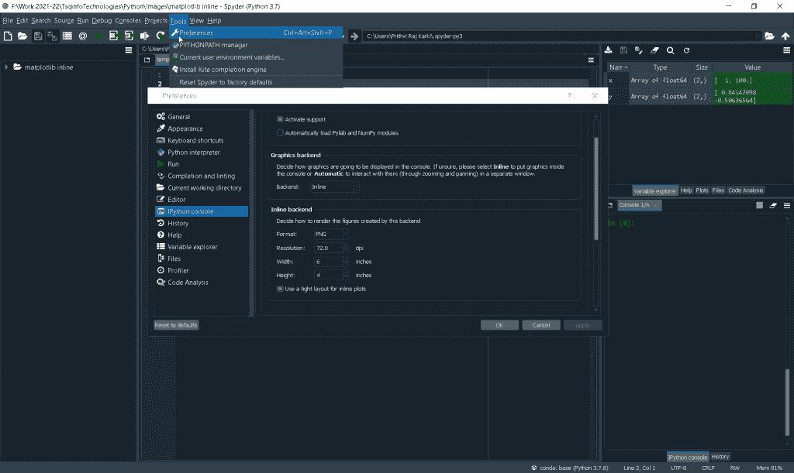
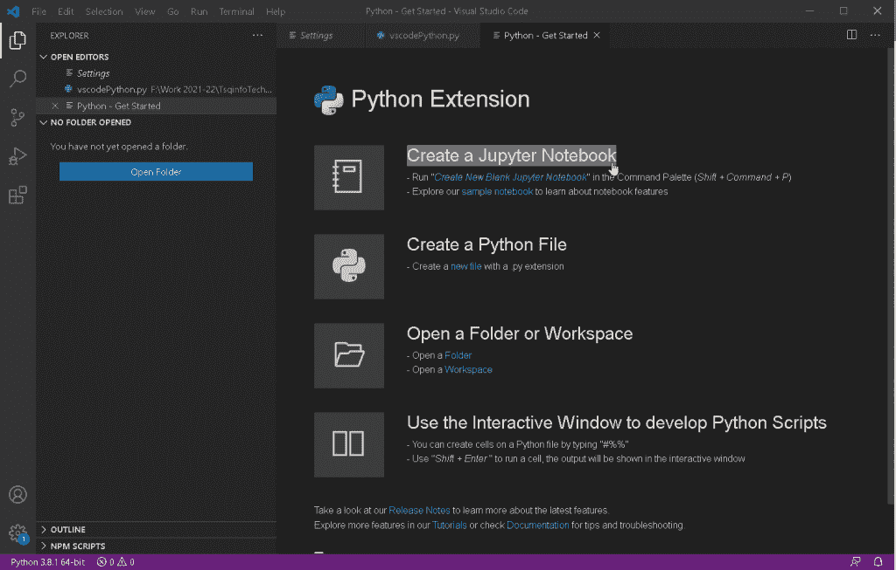
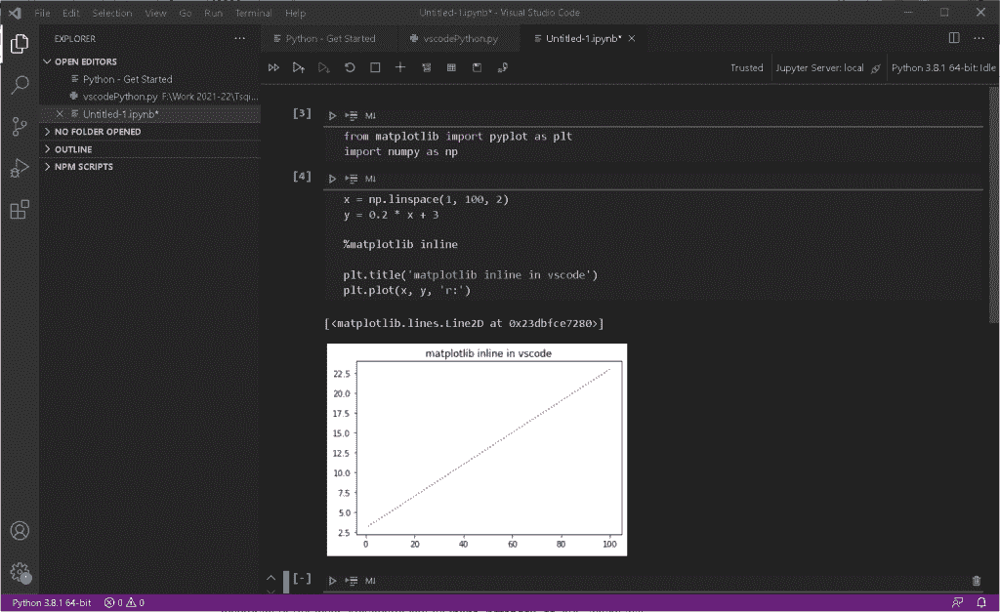
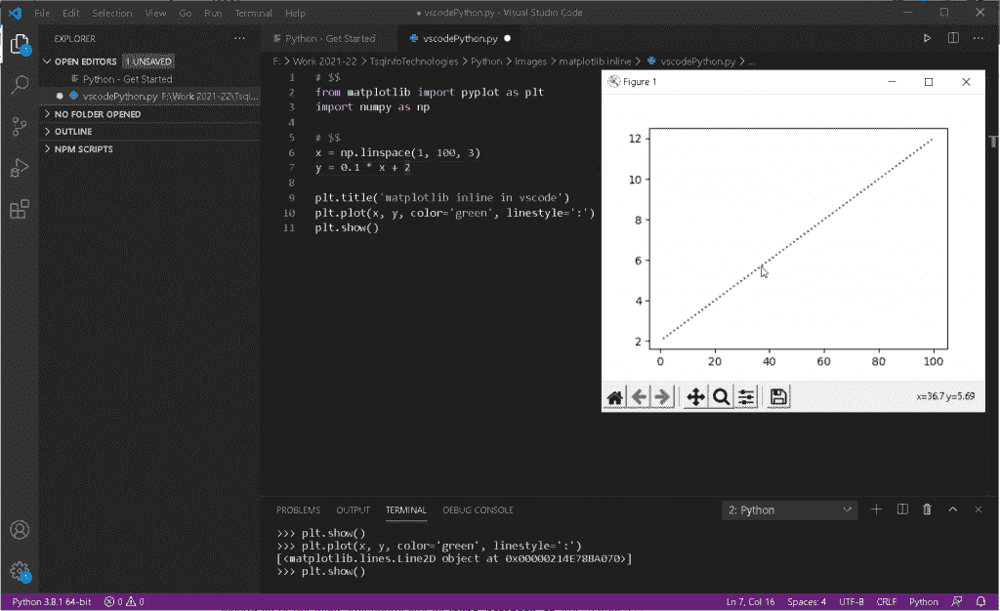
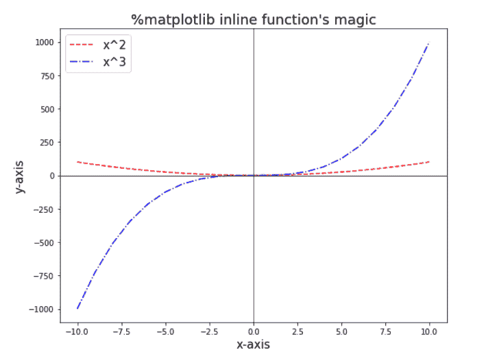

# Python 中的 Matplotlib 内联是什么

> 原文：<https://pythonguides.com/what-is-matplotlib-inline/>

[](https://sharepointsky.teachable.com/p/python-and-machine-learning-training-course)

在本 [Python 教程](https://pythonguides.com/)中，我们将讨论什么是 Python 中的 `matplotlib inline` ，我们还将涉及以下主题:

*   python 中的 matplotlib 内联是什么
*   为什么使用 matplotlib 内联
*   如何内联使用 matplotlib
*   matplotlib inline jupyter
*   matplotlib inline in pycharm
*   spyder 中的 matplotlib 内联
*   vscode 中的 matplotlib 内联
*   matplotlib 内联与笔记本

目录

[](#)

*   [python 中什么是 matplotlib 内联](#What_is_matplotlib_inline_in_python "What is matplotlib inline in python")
*   [为什么使用 matplotlib 内联](#Why_matplotlib_inline_is_used "Why matplotlib inline is used")
*   [如何使用 matplotlib 内联](#How_to_use_matplotlib_inline "How to use matplotlib inline")
*   [matplotlib 内联 jupyter](#matplotlib_inline_jupyter "matplotlib inline jupyter")
*   [py charm 中的 matplotlib 内联](#matplotlib_inline_in_pycharm "matplotlib inline in pycharm")
*   [spyder 中的 matplotlib 内联](#matplotlib_inline_in_spyder "matplotlib inline in spyder")
*   [vs code 中的 matplotlib 内联](#matplotlib_inline_in_vscode "matplotlib inline in vscode")
*   [matplotlib 内联 vs 笔记本](#matplotlib_inline_vs_notebook "matplotlib inline vs notebook")

## python 中什么是 matplotlib 内联

IPython 提供了几个预定义函数的集合，称为 `magic functions` ，可以通过命令行风格的语法来使用和调用。基本上有两种神奇的功能，**面向行**和**面向单元格**。

*   **面向行的魔法函数**(也称为**行魔法**)以一个百分号( **%** )开始，后跟行中其余部分的参数，没有任何引号或括号，就像操作系统命令行调用函数一样。这些函数返回一些结果，因此可以通过写在赋值语句的右边来存储。

一些**行魔法** : %alias、%autowait、%colors、%conda、%config、%debug、%env、%load、 **%matplotlib** 、%notebook 等。,

*   **面向单元格的魔法函数**(也称为**单元格魔法**)以两个百分号( **%%** )开始，后面是整个单元格中的参数，即该行的其余部分以及它下面的行中的一个单独的参数。

一些**单元格魔术** : %%bash，%%html，%%javascrit，%%python2，%%ruby，%%sh，%%script，%%perl 等。,

现在，tet 说说 **%matplotlib** 魔法函数:这个函数设置 matplotlib 交互工作。它可以让你在一个 `IPython` 会话中的任何地方激活 matplotlib 交互支持(就像在 jupyter 笔记本中一样)。调用该函数的语法如下所示:

```py
%matplotlib [gui]
```

在上面的语法中:

*   `gui` 是通过调用函数启用的 **matplotlib 后端**的名称。
*   它提供后端:**内联**，笔记本，qt，qt4，qt5，tk，osx，pdf 等。,

您可以通过以下方式列出可用的 matplotlib 后端:

```py
%matplotlib -l

# OR

%matplotlib --list
```

当您启用**‘inline’**matplotlib 后端时，所写绘图命令的输出将在 `jupyter notebook` 等前端内联显示。也就是说，绘图/图形将直接显示在单元格(写入绘图命令的位置)的下方，生成的绘图/图形也将包含(存储)在您的笔记本文档中。

阅读:[如何安装 matplotlib python](https://pythonguides.com/how-to-install-matplotlib-python/)

## 为什么使用 matplotlib 内联

您可以使用神奇的函数 **%matplotlib inline** 来启用内嵌绘图，其中绘图/图形将显示在编写绘图命令的单元格的正下方。

它在前端中提供与后端的交互，就像 jupyter 笔记本一样。它还提供了一个功能，即前一个图的输出单元格下方的绘图命令不会影响前一个图，这意味着它可以分隔不同的图。

例如，在前一个绘图输出单元格下方的单元格中通过色彩映射表更改调色板不会更改该绘图的色彩映射表。

**注意-**如果您没有处于交互模式，并且使用 matplotlib 绘制图形，那么只有在以前版本的 jupyter notebook 中调用 `matplotlib.pyplot.show()` 函数时，图形才会出现。

在当前版本的 `IPython` 笔记本和 jupyter 笔记本中，不需要使用 **%matplotlib inline** 函数。因为，无论你是否调用 `matplotlib.pyplot.show()` 函数，图形输出都会显示出来。

读取 [Matplotlib savefig 空白图像](https://pythonguides.com/matplotlib-savefig-blank-image/)

## 如何使用 matplotlib 内联

在笔记本(jupyter 笔记本)中绘制命令之前，在单元格的开始处写入 **%matplotlib inline** 。

```py
%matplotlib inline
...
...                  # Plotting commands
...
```

**举例:**

```py
from matplotlib import pyplot as plt
import numpy as np

%matplotlib inline

x = np.arange(-10, 10, 1)
y = np.sin(x)

plt.title('%matplotlib inline function's magic')
plt.plot(x, y, 'b:')
```



How to use matplotlib inline

阅读: [Matplotlib 绘制一条线](https://pythonguides.com/matplotlib-plot-a-line/)

## matplotlib 内联 jupyter

我们已经在上面的主题中讨论了在 jupyter 中使用%matplotlib 内联函数。这和我们在那里讨论的是一样的。

所以，我们来练习一个例子，让概念更清晰。

```py
from matplotlib import pyplot as plt
import numpy as np

%matplotlib inline

x = np.arange(-10, 10, 1)
y1 = np.sin(x)
y2 = np.cos(x)
y3 = np.tan(x)

plt.figure(figsize=[9, 7])

plt.title('%matplotlib inline function\'s magic', fontsize=18)
plt.plot(x, y1, 'r--', linewidth=2, label='sin()')
plt.plot(x, y2, 'b-.', linewidth=2, label='cos()')
plt.plot(x, y3, 'g:', linewidth=2, label='tan()')

plt.axvline(x=0, color='black')
plt.axhline(y=0, color='black')

plt.xlabel('x-axis', fontsize=15)
plt.ylabel('y-axis', fontsize=15)
plt.legend(fontsize=15)
```



matplotlib inline jupyter

## py charm 中的 matplotlib 内联

Matplotlib 图不显示在 Pycharm 中。

**%** 符号用于使用 python 中可用的神奇函数， **%matplotlib inline** 表示神奇函数 **%matplotlib** ，它指定 matplotlib 的后端，使用参数 `inline` 您可以显示图形并使图形交互。

但是 **%matplotlib inline** 只对 IPython notebook 会话有意义，如果在普通的 Python 会话中使用(比如在 pycharm 中)，会得到**语法错误**。

通过使用 `matplotlib.pyplot.show()` 函数，您可以在普通 python 会话的交互式窗口中显示您的绘图。

阅读: [Python 情节多行](https://pythonguides.com/python-plot-multiple-lines/)

## spyder 中的 matplotlib 内联

正如我们在上面的主题中所讨论的， **%matplotlib inline** 在脚本和普通 python 会话(如 pycharm、spyder 等)中不起作用。，)，仅在 IPython 笔记本会话中有效。

有两种方法可以导入 **%matplotlib inline** 函数的特性:

*   您可以导入 IPython 并使用神奇的函数 **%matplotlib inline** 。为此，请遵循以下代码:

```py
from IPython import get_ipython

get_ipython().run_line_magic('matplotlib', 'inline')
```

**举例:**

```py
from matplotlib import pyplot as plt
import numpy as np

from IPython import get_ipython
get_ipython().run_line_magic('matplotlib', 'inline')

x = np.linspace(1, 100, 2)
y = np.sin(x)

plt.title('matplotlib inline in spyder')
plt.plot(x, y, 'c:')
```



matplotlib inline in spyder

*   您可以在 spyder 中将图形后端设置为**内嵌**或**自动**，如下所示:
    *   浏览:工具>>首选项>> IPython 控制台> >图形->内嵌/自动
    *   然后，重启控制台，现在您将能够通过使用 `get_ipython()` 命令绘制图形并在交互窗口中显示它，而无需重启控制台。



matplotlib inline in spyder automatically

Read: [modulenotfounderror:没有名为“matplotlib”的模块](https://pythonguides.com/no-module-named-matplotlib/)

## vs code 中的 matplotlib 内联

Visual Studio 代码还提供了一个普通的 python 会话，在这个会话中，您不能使用 **%matplotlib inline** 函数。

*   但是，您可以安装并使用可用于 vscode 的 jupyter notebook 扩展，在这里您可以像在 jupyter notebook 中一样编写代码，并可以使用 **%matplotlib inline** 命令。并且，使用这个神奇的功能将会和我们在 jupyter 笔记本上做的一样。



Jupyter Notebook extension for vs code

**举例:**

```py
from matplotlib import pyplot as plt
import numpy as np

x = np.linspace(1, 100, 2)
y = 0.2 * x + 3

%matplotlib inline

plt.title('matplotlib inline in vscode')
plt.plot(x, y, 'o:')
```



matplotlib inline in jupyter notebook extension for vs code

*   或者，您可以在交互模式下使用 vscode，它会将您的代码拆分成单独的单元，这些单元可以像在 IPython 笔记本中一样单独运行。您可以使用 **# %%** 将您的代码分割成单独的单元格，它告诉 vscode 将下面的代码与上面的代码分开。当您以这种方式运行代码时，vscode 会自动打开一个交互式窗口，以内联方式显示绘图。

**举例:**

```py
# $$
from matplotlib import pyplot as plt
import numpy as np

# $$
x = np.linspace(1, 100, 2)
y = 0.1 * x + 2

plt.title('matplotlib inline in vscode')
plt.plot(x, y, color='green', linestyle=':')
plt.show()
```



matplotlib inline in vscode

阅读: [Python 元组排序列表](https://pythonguides.com/python-sort-list-of-tuples/)

## matplotlib 内联 vs 笔记本

当你想在你的 IPython 笔记本(jupyter notebook)中添加一个情节时，那么你可以根据需要使用带有不同参数的神奇函数 **%matplotlib** 。论据可以是**内联**、**笔记本**、 `qt` 等。，这将在一个窗口中打开图形。

**%matplotlib inline** :您可以使用该命令显示符合代码的图形(静态图形)。

```py
from matplotlib import pyplot as plt
import numpy as np

%matplotlib inline

x = np.arange(-10, 11, 1)
y1 = np.square(x)
y2 = np.power(x, 3)

plt.figure(figsize=[9, 7])
plt.title('%matplotlib inline function\'s magic', fontsize=18)
plt.plot(x, y1, 'r--', label='x^2')
plt.plot(x, y2, 'b-.', label='x^3')

plt.axvline(x=0, color='black', linewidth=0.7)
plt.axhline(y=0, color='black', linewidth=0.7)

plt.xlabel('x-axis', fontsize=15)
plt.ylabel('y-axis', fontsize=15)
plt.legend(fontsize=15)
```



matplotlib inline vs notebook

**%matplotlib notebook** :您可以使用该命令在一个交互窗口中显示图形，您可以在该窗口中缩放或调整图形大小。

**注意——**IPython notebook 新版本不支持 **%matplotlib notebook** 并返回错误:Javascript 错误:IPython 未定义。

你可以使用另一种方法来显示交互式图表，我们将在另一篇文章中讨论。

你也喜欢阅读我们的最新文章。

*   [Matplotlib 绘图条形图](https://pythonguides.com/matplotlib-plot-bar-chart/)
*   [什么是 Python Django](https://pythonguides.com/what-is-python-django/)
*   [Matplotlib 条形图标签](https://pythonguides.com/matplotlib-bar-chart-labels/)
*   [如何安装 Django](https://pythonguides.com/how-to-install-django/)
*   [Matplotlib 子情节 _adjust](https://pythonguides.com/matplotlib-subplots_adjust/)

在本 Python 教程中，我们已经讨论了 matplotlib 中的 **%matplotlib inline** ，并且我们还涵盖了以下主题:

*   python 中的 matplotlib 内联是什么
*   为什么使用 matplotlib 内联
*   如何内联使用 matplotlib
*   matplotlib inline jupyter
*   matplotlib inline in pycharm
*   spyder 中的 matplotlib 内联
*   vscode 中的 matplotlib 内联
*   matplotlib 内联与笔记本

[Bijay Kumar](https://pythonguides.com/author/fewlines4biju/)

Python 是美国最流行的语言之一。我从事 Python 工作已经有很长时间了，我在与 Tkinter、Pandas、NumPy、Turtle、Django、Matplotlib、Tensorflow、Scipy、Scikit-Learn 等各种库合作方面拥有专业知识。我有与美国、加拿大、英国、澳大利亚、新西兰等国家的各种客户合作的经验。查看我的个人资料。

[enjoysharepoint.com/](https://enjoysharepoint.com/)[](https://www.facebook.com/fewlines4biju "Facebook")[](https://www.linkedin.com/in/fewlines4biju/ "Linkedin")[](https://twitter.com/fewlines4biju "Twitter")