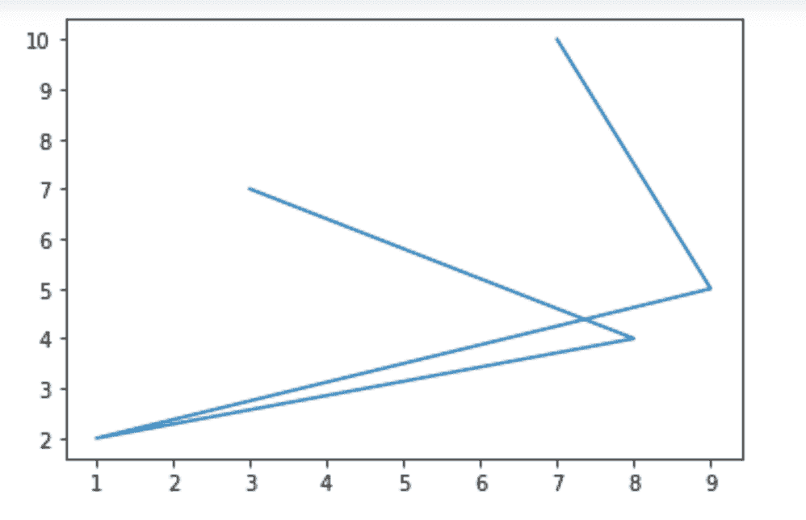
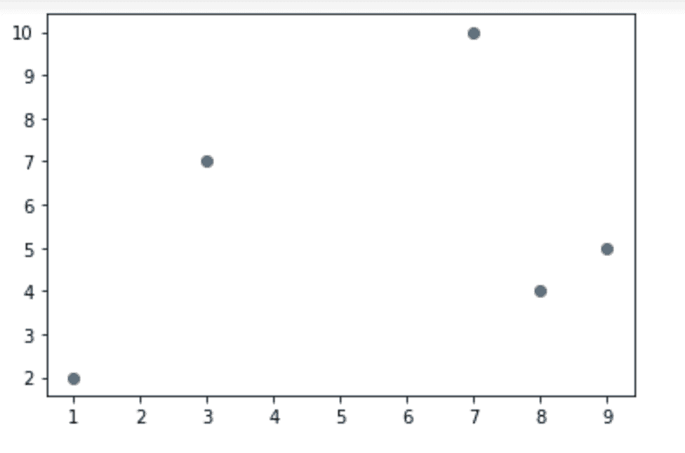
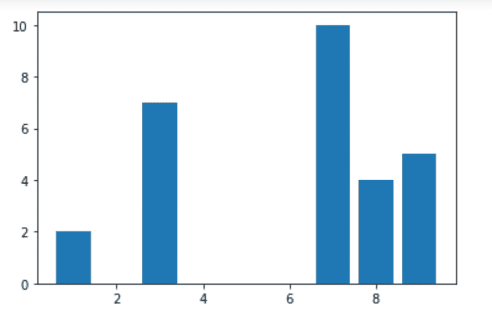
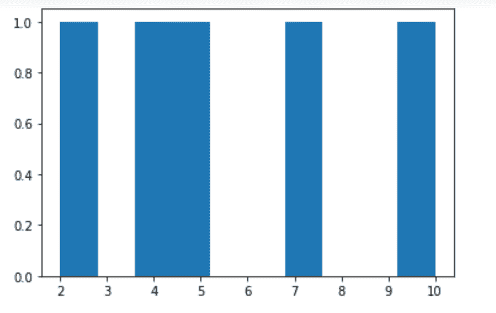
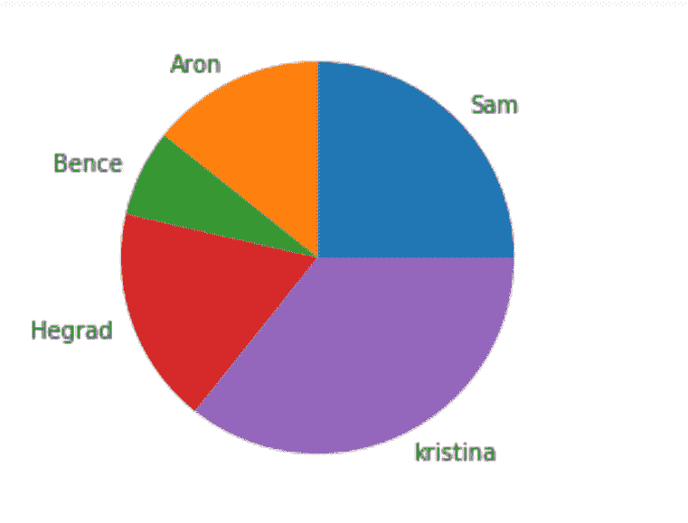

# 什么是 Matplotlib，如何在 Python 中使用它

> 原文：<https://pythonguides.com/what-is-matplotlib/>

[](https://sharepointsky.teachable.com/p/python-and-machine-learning-training-course)

在本 [Python 教程](https://pythonguides.com/learn-python/)中，我们将讨论 `matplotlib` 库、**什么是 matplotlib** 、**如何使用它**，我们还将涉及以下主题:

*   什么是 matplotlib
*   matplotlib 的特性
*   Matplotlib 环境设置
*   导入 matplotlib 库
*   Matplotlib pyplot API
*   matplotlib 中的绘图类型
*   matplotlib 中的图像函数
*   matplotlib 中的轴函数
*   matplotlib 中的图形函数

目录

[](#)

*   [什么是 matplotlib](#What_is_matplotlib "What is matplotlib")
*   [matplotlib 的特性](#Features_of_matplotlib "Features of matplotlib")
*   [Matplotlib 环境设置](#Matplotlib_environment_setup "Matplotlib environment setup")
*   [导入 matplotlib 库](#Importing_matplotlib_library "Importing matplotlib library")
*   [Matplotlib pyplot API](#Matplotlib_pyplot_API "Matplotlib pyplot API")
*   [matplotlib 中的绘图类型](#Types_of_plots_in_matplotlib "Types of plots in matplotlib")
*   [matplotlib 中的图像函数](#Image_functions_in_matplotlib "Image functions in matplotlib")
*   [matplotlib 中的轴函数](#Axis_functions_in_matplotlib "Axis functions in matplotlib")
*   [matplotlib 中的图形函数](#Figure_functions_in_matplotlib "Figure functions in matplotlib")

## 什么是 matplotlib

在 `Python` 中有许多库。并且 `Matplotlib` 是最成功和最常用的库之一，它提供了各种工具用于 Python 中的数据可视化。

它是 Python 中最强大的绘图库之一。它是一个**跨平台**库，提供了各种工具来从 python 中的列表或数组中的数据创建 2D 图。

它是由约翰·d·亨特在 2003 年用 T2 的 Python 编程语言编写的。matplotlib 目前的稳定版本是 `3.4.2` ，发布于 2021 年 5 月 8 日**。它利用了 `NumPy` ，一个为 Python 提供数字数学扩展的库。**

 **它还提供了一个面向对象的 API，使其能够通过使用各种可用的 [Python GUI](https://pythonguides.com/python-gui-programming/) 工具包(Tkinter、PyQt 等)来扩展将静态图放入应用程序的功能。

它为用户提供了使用各种不同类型的图来可视化数据，以使数据易于理解。您可以使用这些不同类型的图(散点图、直方图、条形图、误差图、箱线图等。)通过用 python 写几行代码。

您可以使用任何 `Python shell` 、 `IPython shell` 、 `Jupyter notebook` 、 `jupyter lab` 、`cloud`(`IBM Watson studio`、 `Google collab` 等)、以及 **web 应用服务器** ( `flask` 、 `Django` 使用 pycharm 或

读取 [Matplotlib 增加绘图大小](https://pythonguides.com/matplotlib-increase-plot-size/)

## matplotlib 的特性

*   它被用作 Python 编程语言的数据可视化库。
*   它提供了用 python 绘制数据的最简单和最常见的方法。
*   它提供了这样的工具，可用于跨平台以各种导出格式和各种环境(pycharm、jupyter notebook)创建出版标准的绘图和图表。
*   它提供了一个叫做 `Pylab` 的**程序接口**，用来设计让它像 `MATLAB` 一样工作，一种科学家、研究人员使用的编程语言。MATLAB 是一个付费的应用软件，不是开源的。
*   它类似于 `MATLAB` 中的绘图，因为它允许用户像 MATLAB 一样完全控制字体、线条、颜色、样式和轴属性。
*   Matplotlib 和 `NumPy` 可以被看作是 `MATLAB` 的开源等价物。
*   它提供了产生高质量静态可视化的极好方法，可用于出版物和专业演示。
*   它还提供了与各种其他第三方库和包的兼容性，扩展了它的功能。例如， `seaborn` 、 `ggplo` t 提供更多的绘图功能，以及**底图**和 `cartopy` ，用于绘制地理空间数据。
*   Matplotlib 是一个跨平台的库，可用于各种 python 脚本、任何 python shell(在 IDLE、pycharm 等中可用)和 IPython shell(cond、jupyter notebook)、web 应用服务器(Django、flask)和各种 GUI 工具包( [Tkinter](https://pythonguides.com/category/python-tutorials/python-tkinter/) 、PyQt、WxPythonotTkinter)。
*   显然， `matplotlib` 及其各种兼容的第三方库为用户提供了可视化各种数据的强大工具。

读取 [Matplotlib 1.3.1 需要未安装的 nose】](https://pythonguides.com/matplotlib-1-3-1-requires-nose-which-is-not-installed/)

## Matplotlib 环境设置

`Matplotlib` 及其依赖包在标准 python 包存储库中以 wheel 包的形式提供，一旦在系统中安装了 Python，您就可以使用 **pip 包管理器**在 `Windows` 、 `Linux` 和 `macOS` 系统中轻松安装它们。您可以通过执行以下命令来实现这一点:

```py
pip3 install matplotlib
```

如果没有为系统中的所有用户安装 Python 包，则必须安装 Microsoft Visual c++ 2008(Python 2.7 为 64 位或 32 位)或 Microsoft Visual c++ 2010(Python 3.4 为 64 位或 32 位)。

*   在 `windows` 中，你可以从任何浏览器轻松下载安装上述依赖包。
*   如果您在 `MacOS` 上使用 Python 2.7，那么执行以下命令:

```py
xcode-select –install
```

当执行上述命令时，可以编译包的依赖关系，**子进程 32** 。

*   如果你正在使用安装了 Python 2.7 的旧版本 Linux，你必须安装主版本的 T2 子进程。

以上步骤针对各种 OS，设置 matplotlib 包要安装使用的环境。

阅读[什么是 add_axes matplotlib](https://pythonguides.com/add_axes-matplotlib/)

## 导入 matplotlib 库

您可以使用 matplotlib，并通过将它导入到您的环境(Jupiter notebook、google collab、IDLE 等)中来利用它在 python 中的功能。**导入 matplotlib** 的代码如下:

```py
-- Importing the matplotlib library
import matplotlib

-- Importing the matplotlib library and alias it with a shorter name
import matplotlib as plt
```

在上面的代码中，引用名(别名)可以是你的任何选择，但是最常用的名字是 `plt` 。所以，我们也会用它。引用名给了库一个方便和容易的使用，你必须键入更少的代码来引用它。

无论何时使用 python 中的 matplotlib 绘图，都要记住两件重要的事情:

*   图形类型:你可以定义图形的类型，可以是条形图，折线图，柱状图等。
*   并显示图表:在这里，您将显示图表。

读取 [Matplotlib 未知投影‘3d’](https://pythonguides.com/matplotlib-unknown-projection-3d/)

## Matplotlib pyplot API

matplotlib.pyplot 是 matplotlib 的基于状态的接口。它是一个命令式函数的集合，使得 `matplotlib` 像 `MATLAB` 一样工作。每个 `pyplot` 函数都会对绘图进行一些更改(如图)。

*   一个函数可以创建一个图形:matplotlib.pyplot.figure()，另一个在图形中创建绘图区域的函数:matplotlib.pyplot.plot()。
*   在绘图区域中绘制一些线，
*   用标签、注释等来修饰情节。

您可以通过以下代码导入 python 中的 pyplot API:

```py
import matplotlib.pyplot as plt

-- OR

from matplotlib import pyplot as plt
```

在上面的代码中，matplotlib 库中的 pyplot API 被导入到程序中，并被引用为 `plt` 。您可以给出任何名称，但是 `plt` 是标准的并且是最常用的。

阅读: [Matplotlib 二维表面图](https://pythonguides.com/matplotlib-2d-surface-plot/)

## matplotlib 中的绘图类型

matplotlib 中有多种可用的绘图，以下是一些最常用的绘图:

| 没有。 | 绘图功能 | 描述 |
| --- | --- | --- |
| one | 绘图() | 您可以在轴上绘制标记和/或线条。 |
| Two | 散布() | 它创建了 x 对 y 的散点图。 |
| three | 酒吧() | 它创建了一个条形图。 |
| four | 巴尔赫() | 它创建了一个水平条形图。 |
| five | 历史() | 它绘制了一个直方图。 |
| six | hist2d() | 它创建了一个 2D 直方图。 |
| seven | boxplot() | 它创建了一个有胡须的盒子图。 |
| eight | 饼图() | 它绘制了一个饼图。 |
| nine | 堆栈图() | 它创建堆积面积图。 |
| Ten | 极坐标() | 它创造了一个极坐标图。 |
| Eleven | 茎() | 它创建了一个 stem 图。 |
| Twelve | 步骤() | 它创建了一个阶梯图。 |
| Thirteen | 颤动() | 它描绘了一个 2D 箭场。 |

Types of plots in matplotlib

图是理解所提供数据的模式、趋势和相关性的一种方式。我们可以说，这些是洞察一些定量信息的工具。

让我们看看如何在一些样本数据上实现上面提到的一些基本情节，所以**打开 jupyter notebook** 或任何 `Ipython shell` ，让我们做一些例子:

*   线形图:

```py
# Importing the pyplot API from matplotlib library
from matplotlib import pyplot as plt

# x-axis values in a list
x = [3, 8, 1, 9, 7]

# y-axis values in a list
y = [7, 4, 2, 5, 10]

# function to plot line in matplotlib
plt.plot(x, y)

# Function to show the plot
plt.show()
```



Line plot in matplotlib

*   散点图:

```py
# Importing the pyplot API from matplotlib library
from matplotlib import pyplot as plt

# x-axis values in a list
x = [3, 8, 1, 9, 7]

# y-axis values in a list
y = [7, 4, 2, 5, 10]

# function to plot scatter in matplotlib
plt.scatter(x, y)

# Function to show the plot
plt.show()
```



Scatter plot in matplotlib

*   Bar plot:

```py
# Importing the pyplot API from matplotlib library
from matplotlib import pyplot as plt

# x-axis values in a list
x = [3, 8, 1, 9, 7]

# y-axis values in a list
y = [7, 4, 2, 5, 10]

# function to plot bar graph in matplotlib
plt.bar(x, y)

# Function to show the plot
plt.show()
```



Bar plot in matplotlib

*   直方图:

```py
# Importing the pyplot API from matplotlib library
from matplotlib import pyplot as plt

# y-axis values in a list
y = [7, 4, 2, 5, 10]

# function to plot histogram in matplotlib
plt.hist(y)

# Function to show the plot
plt.show()
```



Histogram in matplotlib

*   饼图:

```py
# Importing the pyplot API from matplotlib library
from matplotlib import pyplot as plt

# x-axis values in a list
x = [7, 4, 2, 5, 10]

# y-axis values in a list
names = ['Sam', 'Aron', 'Bence', 'Hegrad', 'kristina']

# function to plot pie chart in matplotlib
plt.pie(y, labels=names)

# Function to show the plot
plt.show()
```



Pie chart in matplotlib

阅读: [Matplotlib 当前正在使用 agg 一个非 gui 后端](https://pythonguides.com/matplotlib-is-currently-using-agg-a-non-gui-backend/)

## matplotlib 中的图像函数

matplotlib 中可用的图像函数如下:

| 没有。 | 图像功能 | 描述 |
| --- | --- | --- |
| one | imread() | 它将图像从文件读入数组。 |
| Two | imsave() | 它将数组保存为图像文件。 |
| three | imshow() | 它在轴上显示图像。 |

Image functions in matplotlib

## matplotlib 中的轴函数

您可以使用 matplotlib 中可用的图像函数自定义轴属性，如下所述:

| 没有。 | 轴功能 | 描述 |
| --- | --- | --- |
| one | 坐标轴() | 它为图形添加了轴。 |
| Two | 文本() | 它向轴添加文本。 |
| three | 标题() | 它为当前轴设置一个标题。 |
| four | xlabel() | 它设置当前轴的 x 轴的标签。 |
| five | 伊拉贝尔() | 它设置当前轴的 y 轴的标签。 |
| six | xlim() | 它获取或设置当前轴的 x 轴限制。 |
| seven | 超集() | 它获取或设置当前轴的 y 轴限制。 |
| eight | xscale() | 它设置当前轴的 x 轴的缩放比例。 |
| nine | yscale() | 它设置当前轴的 y 轴的缩放比例。 |
| Ten | xticks() | 它获取或设置当前刻度位置和标签的 x 界限。 |
| Eleven | yticks() | 它获取或设置当前刻度位置和标签的 y 界限。 |

Axis functions in matplotlib

读取 [Matplotlib 时间序列图](https://pythonguides.com/matplotlib-time-series-plot/)

## matplotlib 中的图形函数

通过使用以下给定的函数，可以在 matplotlib 中创建、保存和显示图形:

| 没有。 | 图形功能 | 描述 |
| --- | --- | --- |
| one | 图() | 它创造了一个新的形象。 |
| Two | 显示() | 它显示特定的图形。 |
| three | figtext() | 它向图形添加文本。 |
| four | savefig() | 它保存当前的数字。 |
| five | 关闭() | 它关闭一个图形窗口。 |

Figure functions in matplotlib

您可能会喜欢以下 Python Matplotlib 教程:

*   [模块“matplotlib”没有属性“artist”](https://pythonguides.com/module-matplotlib-has-no-attribute-artist/)
*   [Matplotlib 设定 y 轴范围](https://pythonguides.com/matplotlib-set-y-axis-range/)
*   [模块‘matplotlib’没有属性‘plot’](https://pythonguides.com/module-matplotlib-has-no-attribute-plot/)
*   [Matplotlib xlim](https://pythonguides.com/matplotlib-xlim/)
*   [Matplotlib 更新循环中的绘图](https://pythonguides.com/matplotlib-update-plot-in-loop/)
*   [Matplotlib 饼图教程](https://pythonguides.com/matplotlib-pie-chart/)

在本 Python 教程中，我们讨论了什么是 `matplotlib` 库，以及如何在 Python 中使用它，还涵盖了以下主题:

*   什么是 matplotlib
*   matplotlib 的特性
*   Matplotlib 环境设置
*   导入 matplotlib 库
*   Matplotlib pyplot API
*   matplotlib 中的绘图类型
*   matplotlib 中的图像函数
*   matplotlib 中的轴函数
*   matplotlib 中的图形函数

[Bijay Kumar](https://pythonguides.com/author/fewlines4biju/)

Python 是美国最流行的语言之一。我从事 Python 工作已经有很长时间了，我在与 Tkinter、Pandas、NumPy、Turtle、Django、Matplotlib、Tensorflow、Scipy、Scikit-Learn 等各种库合作方面拥有专业知识。我有与美国、加拿大、英国、澳大利亚、新西兰等国家的各种客户合作的经验。查看我的个人资料。

[enjoysharepoint.com/](https://enjoysharepoint.com/)[](https://www.facebook.com/fewlines4biju "Facebook")[](https://www.linkedin.com/in/fewlines4biju/ "Linkedin")[](https://twitter.com/fewlines4biju "Twitter")**