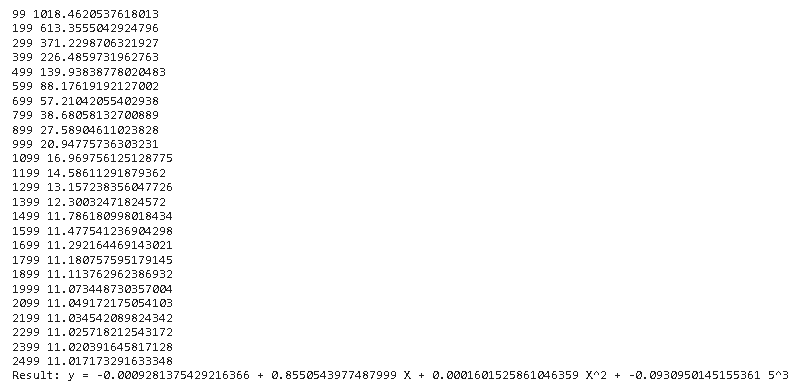
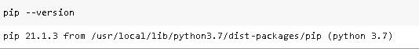
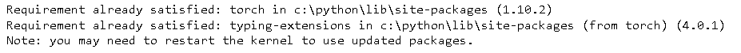
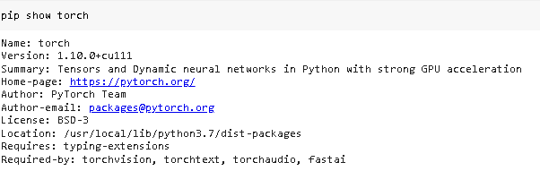
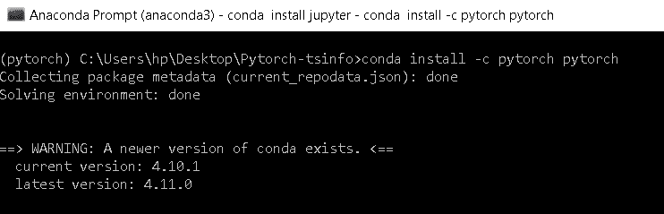
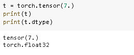
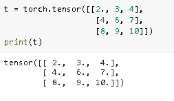
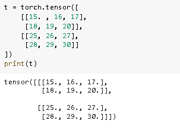

# PyTorch 是什么以及如何使用它

> 原文：<https://pythonguides.com/what-is-pytorch/>

[](https://sharepointsky.teachable.com/p/python-and-machine-learning-training-course)

在这个 [Python 教程](https://pythonguides.com/learn-python/)中，我们将学习**什么是 Python** 中的 PyTorch，我们还将涵盖与 PyTorch 相关的不同例子。此外，我们还将涉及以下主题。

*   PyTorch 是什么
*   使用 Pip 安装 PyTorch
*   如何使用 conda 安装 PyTorch
*   PyTorch 的优缺点
*   如何使用 PyTorch
*   PyTorch 的组件
*   PyTorch 的应用

目录

[](#)

*   [py torch 是什么](#What_is_PyTorch "What is PyTorch")
*   [使用 Pip 安装 py torch](#Installation_of_PyTorch_using_Pip "Installation of PyTorch using Pip")
*   [如何使用 conda 安装 py torch](#How_to_install_PyTorch_using_conda "How to install PyTorch using conda")
*   [py torch 的优缺点](#Advantages_and_disadvantages_of_PyTorch "Advantages and disadvantages of PyTorch")
*   [如何使用 PyTorch](#How_to_use_PyTorch "How to use PyTorch")
*   [py torch 的部件](#Components_of_PyTorch "Components of PyTorch")
*   [py torch 的应用](#Applications_of_PyTorch "Applications of PyTorch")

## py torch 是什么

在本节中，我们将了解什么是 PyTorch 以及 PyTorch 在 Python 中的实现。


What is PyTorch

*   PyThon 是一个开源免费的[机器学习](https://pythonguides.com/machine-learning-using-python/)库。PyTorch 是在修改后的 BSD 许可证下发布的。
*   PyTorch 用于计算机视觉和自然语言处理应用。
*   计算机视觉被定义为我们的计算机如何能够容易地理解并获得图像的重要信息的过程。
*   PyTorch 用于计算机版本，由脸书人工智能研究实验室开发，具有 `C++` 接口。

**举例:**

在这个例子中，我们将学习 PyTorch 的实现。

PyTorch 给出了两个重要特征。

*   它提供了类似于 numpy 的 n 维张量。
*   它还提供了在构建和训练神经网络方面的差异。

```py
import numpy as num
import math

X = num.linspace(-math.pi, math.pi, 2500)
y = num.sin(X)

**# Randomly initialize weights**
i = num.random.randn()
j = num.random.randn()
k = num.random.randn()
l = num.random.randn()

learning_rate = 1e-6
for t in range(2500):
    **# Forward pass: compute predicted y**

    y_pred = i + j * X + k * X ` 2 + l * X ` 3

    loss = num.square(y_pred - y).sum()
    if t % 100 == 99:
        print(t, loss)

 **   # Backprop to compute gradients of i, j, k, l with respect to loss**
    gradient_y_pred = 2.0 * (y_pred - y)
    gradient_a = gradient_y_pred.sum()
    gradient_b = (gradient_y_pred * X).sum()
    gradient_c = (gradient_y_pred * X ** 2).sum()
    gradient_d = (gradient_y_pred * X ** 3).sum()

   ** # Update weights**
    i -= learning_rate * gradient_a
    j -= learning_rate * gradient_b
    k -= learning_rate * gradient_c
    l -= learning_rate * gradient_d

print(f'Result: y = {i} + {j} X + {k} X^2 + {l} 5^3')
```

在上面的代码中，我们将导入 NumPy 和 math 库来增加数学函数列表。

*   **X = num.linspace(-math.pi，math.pi，2500)** 用于创建输入输出数据。
*   `math.pi` 函数用于返回 pi 的值为 3.14。
*   **loss = num . square(y _ pred–y)。sum()** 用于计算损失。
*   **print(t，loss)** 用于打印损失。

**输出:**

在下面的输出中，我们可以看到屏幕上显示了更新后的重量结果。



What is PyTorch with example

另外，检查:Python 中的[tensor flow](https://pythonguides.com/tensorflow/)

## 使用 Pip 安装 py torch

在本节中，我们将学习如何使用 Python 中的 Pip 命令安装 PyTorch。

PyTorch 用于计算机版本和自然语言处理应用程序。

在安装 PyTorch 之前，我们需要检查 Pip 是否已经安装，如果已经安装，不需要再次安装。

只需使用这个命令检查 Pip 的版本。

```py
pip --version
```



Pip version

检查完 Pip 的版本后，我们希望安装 PyTorch 的最新版本。

```py
pip install torch
```



Installation of PyTorch

安装 Pytorch 后，我们可以使用以下命令检查 Pytorch 是否成功安装。

```py
pip show torch
```



PyTorch installed successfully

阅读:[Python 中的 Scikit 学的是什么](https://pythonguides.com/what-is-scikit-learn-in-python/)

## 如何使用 conda 安装 py torch

在本节中，我们将学习如何在 Python 中使用 conda 安装 PyTorch。

*   Conda 是一个运行在 Windows、Linux 和 Mac 上的开源环境管理系统。

这里我们可以使用 conda 命令在 windows 中安装 PyTorch。

*   首先，我们将启动 anaconda 命令提示符来运行 conda 命令。
*   启动 anaconda 命令后，激活 conda 激活 pytorch。
*   之后，导航到您创建文件夹的文件夹。
*   到达该文件夹后，只需输入 jupyter-Notebook 并运行 conda 命令来安装 pytorch。

```py
conda install -c pytorch pytorch
```



Installation of PyTorch using conda

## py torch 的优缺点

在本节中，我们将了解 Python 中 PyTorch 的**优点和缺点。**

**优点:**

1.  PyTorch 是一个易于学习和编码的库。
2.  它更快，并提供改进。
3.  PyTorch 同时支持 GPU 和 CPU。
4.  使用调试工具很容易进行调试。
5.  它有计算图形支持。
6.  它支持云平台。

**缺点:**

1.  PyTorch 库并不为所有人所知，使用这个库的用户很少。
2.  与其他社区相比，Pytorch 开发人员的社区非常小。
3.  在 PyTorch 中，没有像张量板这样的监控工具。

阅读: [PyTorch 保存模型](https://pythonguides.com/pytorch-save-model/)

## 如何使用 PyTorch

在这一节中，我们将学习如何在 Python 中使用和实现 PyTorch 。

*   PyTorch 是一个开源的机器学习库，用于计算机视觉和自然语言处理。
*   PyTorch 是一个用于处理 n 维张量的库，类似于 NumPy。
*   张量被定义为数据的基本单位，可以是数字、矩阵、向量等。

为了使用 PyTorch 库，我们将首先导入 Torch 模块。

```py
import torch
```

导入火炬模块后，我们将创建一个单一的数字张量。

```py
t = torch.tensor(7.)
print(t)
print(t.dtype)
```



Use of PyTorch with tensor

在创建了作为数据的单个数字之后，现在我们正在创建一个带有 2d 张量的 PyTorch。

```py
t = torch.tensor([[2., 3, 4],
                   [4, 6, 7],
                   [8, 9, 10]])
print(t)
```



Use of PyTorch with 2d tensor

创建二维张量后，我们将创建一个三维张量 PyTorch。

```py
t = torch.tensor([
    [[15\. , 16, 17],
     [18, 19, 20]],
    [[25, 26, 27],
     [28, 29, 30]]
])
print(t)
```



Use of PyTorch with 3d tensor

阅读:[Python 中的 NumPy 是什么](https://pythonguides.com/numpy/)

## py torch 的部件

在本节中，我们将学习 Python 中 PyTorch 的**组件。**

在 PyTorch 中，有几个最重要的组件帮助 Torch 实现。

PyTorch 的五个最重要的组成部分是:

*   张量
*   因素
*   模块
*   变量
*   功能

1.  **张量:**张量是一个 n 维数组，类似于 numpy，也是数据的基本单位，可以是数字、矩阵等。
2.  **参数:**当我们希望参数作为某些分量的张量时，使用它，而当我们使用变量时，这是不可能的。参数基本上包含在变量周围。
3.  **模块:**定义为可以携带其他模块、参数等的组件。模块也称为所有神经网络的基类。
4.  **变量:**变量定义为包含在张量周围的分量，用于携带梯度。它存在于火炬之下。
5.  **函数:**它被定义为一个表达式和沃特变量之间的关系。它没有记忆来存储任何状态。

阅读:[交叉熵损失 PyTorch](https://pythonguides.com/cross-entropy-loss-pytorch/)

## py torch 的应用

在本节中，我们将了解 Pytorch 在 Python 中的**应用。**

众所周知，PyTorch 用于计算机视觉和自然语言处理应用。

Pytorch 的三个最重要的应用是:

*   计算机视觉
*   自然语言处理
*   强化学习

1.  **计算机视觉:**它被定义为我们的计算机如何从图像中轻松理解并获取重要信息的过程。程序员可以用图像来扩展高度精确的计算机版本模型。
2.  自然语言处理(Natural Language Processing):它被定义为赋予计算机理解文本或单词的能力的过程，就像理解人类一样。它被用来开发一个聊天框和语言翻译器。
3.  **强化学习:**它被定义为一种基于反馈的机器学习技术。代理通过执行动作和查看动作的结果来学习在环境中的行为。它被用来开发自动化机器人。

你可能也喜欢阅读下面的教程。

*   [蟒蛇里的熊猫](https://pythonguides.com/pandas-in-python/)
*   [什么是 Python Django](https://pythonguides.com/what-is-python-django/)
*   [Python GUI 编程](https://pythonguides.com/python-gui-programming/)

因此，在本教程中，我们讨论了**什么是 PyTorch，它是如何使用的**,我们还讨论了与其实现相关的不同示例。这是我们已经讨论过的例子列表。

*   pytorch 是什么
*   使用 Pip 安装 PyTorch
*   如何使用 conda 安装 PyTorch
*   PyTorch 的优缺点
*   如何使用 PyTorch
*   PyTorch 的组件
*   PyTorch 的应用

[Bijay Kumar](https://pythonguides.com/author/fewlines4biju/)

Python 是美国最流行的语言之一。我从事 Python 工作已经有很长时间了，我在与 Tkinter、Pandas、NumPy、Turtle、Django、Matplotlib、Tensorflow、Scipy、Scikit-Learn 等各种库合作方面拥有专业知识。我有与美国、加拿大、英国、澳大利亚、新西兰等国家的各种客户合作的经验。查看我的个人资料。

[enjoysharepoint.com/](https://enjoysharepoint.com/)[](https://www.facebook.com/fewlines4biju "Facebook")[](https://www.linkedin.com/in/fewlines4biju/ "Linkedin")[](https://twitter.com/fewlines4biju "Twitter")