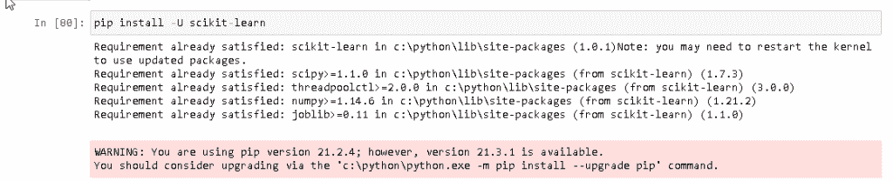

# Scikit 在 Python 中学到了什么

> 原文：<https://pythonguides.com/what-is-scikit-learn-in-python/>

[](https://sharepointsky.teachable.com/p/python-and-machine-learning-training-course)

想学习 Python 中的 Scikit learn？我们先从`Python`中的 Scikit 学的是什么？如何安装 scikit-learn 库？如何更新 scikit-learn 库？我们将讨论这些话题。

*   scikit 在 Python 中学到了什么
*   scikit 学习历史
*   scikit 学习的好处
*   scikit 学习优点和缺点
*   如何在 Python 中使用 Scikit Learn 的示例
*   如何安装 scikit 学习库
*   如何更新 scikit 学习库
*   scikit learn 的功能

目录

[](#)

*   [Python 中的 scikit 学的是什么](#What_is_scikit_learn_in_Python "What is scikit learn in Python")
*   [sci kit 学习的历史](#History_of_scikit_learn "History of scikit learn")
*   [sci kit 学习的好处](#The_benefit_of_scikit_learn "The benefit of scikit learn")
*   [scikit 学习的优缺点](#Advantage_and_disadvantages_of_scikit_learn "Advantage and disadvantages of scikit learn")
    *   [优点:](#Advantages "Advantages:")
    *   [劣势:](#Disadvantage "Disadvantage:")
*   [Scikit 在 Python 中学习示例](#Scikit_learn_in_Python_Example "Scikit learn in Python Example")
*   [如何安装 scikit 学习](#How_to_install_scikit_learn "How to install scikit learn")
*   [如何更新 scikit learn](#How_to_update_scikit_learn "How to update scikit learn")
*   [scikit learn 的特性](#Features_of_scikit_learn "Features of scikit learn")
*   [结论](#Conclusion "Conclusion")

## Python 中的 scikit 学的是什么

Scikit learn 是一个用于**机器学习**的库，它专注于数据建模。它只是简单地关注建模，而不是加载和操作数据。

静态建模包括通过 python 中的恒定性接口进行分类、回归和聚类。

阅读[sci kit-学习逻辑回归](https://pythonguides.com/scikit-learn-logistic-regression/)

## sci kit 学习的历史

在本节中，我们将了解 scikit learn 的**历史，scikit learn 是在哪一年出现的。这是谁做的，我们简单地了解所有的事情。**

*   Scikit learn 也称为 sklearn。python 中的 Scikit learn 最初是由 David Cournapeau 在 2007 年开发的。
*   这是谷歌代码之夏项目的一部分。Scikit learn 在 2010 年公开发布了 v0.1 测试版，这对程序员非常有帮助。
*   scikit learn 的最新版本是 0.23.1，于 2020 年 5 月发布。在最新版本发布后，一个受驱动的项目诞生了，任何人都可以为他的开发做出贡献。
*   scikit learn 是最有用的开源且易于使用的库之一，它简化了编码任务并帮助了程序员。
*   python 中的 Scikit learn 在 python 中主要用于关注建模。它只是关注建模，而不是加载数据。

**从这个例子中，我们可以看到 scikit 是如何学习库工作的:**

*   `n_sample = 5000` 用于生成样本数据。
*   **centers_init，indexes = k means _ plus plus(X，n_clusters=4，random_state=0)** 用于计算 k mean plus plus 的种子。
*   `plot.figure(1)` 用于在屏幕上绘制种子。
*   `plot . title(" K-Mean Clustering ")`用于给屏幕上正在绘制的图形命名。

```py
from sklearn.cluster import kmeans_plusplus
from sklearn.datasets import make_blobs
import matplotlib.pyplot as plot

n_sample = 5000
n_component = 4

X, y_true = make_blobs(
    n_samples=n_sample, centers=n_component, cluster_std=0.60, random_state=0
)
X = X[:, ::-1]

centers_init, indices = kmeans_plusplus(X, n_clusters=4, random_state=0)

plot.figure(1)
colors = ["red", "blue", "green", "yellow"]

for k, col in enumerate(colors):
    cluster_data = y_true == k
    plot.scatter(X[cluster_data, 0], X[cluster_data, 1], c=col, marker=".", s=10)

plot.scatter(centers_init[:, 0], centers_init[:, 1], c="b", s=50)
plot.title("K-Mean Clustering")
plot.xticks([])
plot.yticks([])
plot.show()
```

**输出:**

运行上面的代码后，我们得到了下面的输出，从中我们可以看到种子根据需要被放在不同的集群中。KMean_Plusplus 是 KMean 的默认初始化。


scikit learn K Mean plusplus clustering

阅读:[Scikit-learn Vs tensor flow–详细对比](https://pythonguides.com/scikit-learn-vs-tensorflow/)

## sci kit 学习的好处

在本节中，我们将了解 Python 中 scikit learn 的**优势。**

scikit learn 的主要好处是它是开源的，任何人都可以在任何时候使用这个库，并且它很容易使用。

**sci kit learn 的好处有:**

*   开放源码
*   使用方便
*   自由的
*   正确记录
*   用途广泛

**以下是 scikit learn 的优势简介:**

1.  **开源:** scikit learn 是一个开源库，可供公众使用。这是公开可用的，甚至在这种情况下，用户可以修改或重定向整个代码。
2.  **易于使用:**众所周知，scikit learn 是一个开源库，任何人都可以随时使用。许多研究机构在其运作中使用 scikit learn，他们一致认为 scikit learn 库易于使用。
3.  免费: scikit learn library 是免费使用的，人们不需要任何许可证就可以运行这个库。用户在应用程序上工作时不必担心。
4.  **正确记录:**在 scikit 中了解任务的记录是以正确的方式完成的。Scikit 学习库内容丰富，具有定义明确的 API 文档，可从其网站上获得。
5.  用途广泛:Scikit library 是一个用户友好且方便的工具，它可以做多种事情，如识别用户行为，预测客户行为，这证明了它在本质上是多功能的。

读取 [Scikit 学习准确度 _ 分数](https://pythonguides.com/scikit-learn-accuracy-score/)

## scikit 学习的优缺点

这里我们将说明在 python 中使用 scikit learn 库的优点和缺点。

### 优点:

*   scikit 学习库是一个用户友好和方便的工具，它可以做多种事情，如预测客户行为，创建神经图像等。
*   很好用，免费使用。
*   Scikit 学习库由贡献者和国际在线社区更新。
*   Scikit learn library 为希望将算法与其平台集成的用户提供了 API 文档。
*   scikit learn 库是在 BSD 许可下传播的，这使得它在法律和许可限制下是免费的，用户可以在任何时候毫不犹豫地使用它，并在他们的平台上运行这个库。
*   在 scikit learn 中，任务中的文档是以正确的方式完成的，这个库非常广泛。

### 劣势:

`Scikit learn` 不是深度学习的最佳选择这是这个库的缺点。

阅读: [Scikit 学习决策树](https://pythonguides.com/scikit-learn-decision-tree/)

## Scikit 在 Python 中学习示例

在这个例子中，我们将使用 [sklearn 库](https://scikit-learn.org/)。正如我们所知，sklearn 用于数据建模。它只关注数据建模，而不关注数据操作。

*   **从 sklearn.datasets 导入 load_iris** 用于加载 iris 数据集，该 iris 数据集已经包含在 scikit-learn 中。
*   `X = iris.data` 用于存储特征矩阵(X)。
*   `y = iris.target` 用于响应向量(y)。
*   `feature _ names = iris . feature _ names`用于存储特征名称。
*   `target _ names = iris . target _ names`用于存储目标名称。
*   **print("Feature names:"，feature_names)** 用于打印我们数据集的特征。
*   **print("Target names:"，target_names)** 用于打印我们数据集的目标。
*   **print("\nType of X is:"，type(X))** 在这个 X 和 y 是 numpy 数组。
*   **打印(" \n 前 5 行 X:\n "，X[:5])** 用于打印前 5 个输入行。

```py
 from sklearn.datasets import load_iris
iris = load_iris()

X = iris.data
y = iris.target

feature_names = iris.feature_names
target_names = iris.target_names

print("Feature names:", feature_names)
print("Target names:", target_names)

print("\nType of X is:", type(X))

print("\nFirst 5 rows of X:\n", X[:5])
```

**输出:**

在下面的输出中，我们可以看到在 sklearn 库的帮助下建模的数据被生成。这里我们可以看到 X 的前五行打印在屏幕上。


Scikit learn example

阅读: [Scikit 学习功能选择](https://pythonguides.com/scikit-learn-feature-selection/)

## 如何安装 scikit 学习

我们知道 `scikit learn` 用于关注建模数据。为了对我们的数据建模，我们可以安装 `scikit learn` 库。

在安装 scikit 之前，我们可以安装 Numpy 和 scipy。

以下命令可用于安装[编号](https://pythonguides.com/numpy/)。

```py
pip install numpy
```

在下图中，我们可以看到 NumPy 已经安装，它可以满足所有要求。


NumPy installation

以下命令可用于安装 scipy。

```py
pip install scipy
```

在下面的输出中，我们可以看到已经安装了 scipy，并且收集了 scipy 的所有包。


如果已经安装了这两个库，则无需再次安装它们，然后进入下一步，安装 scikit 学习库。

```py
pip install scikit-learn
```

在下面的输出中，我们可以看到我们使用 pip 安装了 scikit-learn 库，它满足了所有的要求。


如果所有的库都已经安装了，当我们不需要再次安装它们时，我们可以根据需要简单地使用和运行这个命令。

## 如何更新 scikit learn

正如我们所知，scikit 学习库主要用于数据建模。我们可以简单地通过输入 `pip install scikit-learn` 命令来安装这个库。安装 scikit-learn 库后，我们还可以更新它，以便为该库提供最新版本。

以下命令用于更新 scikit-learn

```py
pip install -U scikit-learn
```

在下面的输出中，我们可以看到 scikit-learn 库已经更新，并且满足了所有要求。



Updating scikit learn

另外，检查:[什么是 PyTorch 以及如何使用它](https://pythonguides.com/what-is-pytorch/)

## scikit learn 的特性

正如我们所知，scikit 学习库用于**专注于建模数据**而不是专注于操作或汇总数据。

这里我们将讨论 scikit 学习库的特性。**特征**是一个部分吸引力或者我们可以说是重要特征。

以下是 scikit learn 库的特性，我们将在下面进一步讨论:

*   监督学习
*   无监督学习
*   使聚集
*   降维
*   集成方法
*   交互效度分析
*   特征抽出
*   特征选择
*   开放源码

1.  **监督学习**:监督学习是预测建模，它有一个目标变量，数据带有我们想要预测的附加质量。

监督学习进一步分为两类:

*   分类
*   回归

**分类**:当我们有分类的输出，如“黑”、“白”、“教”、“不教”时，这个问题就叫做分类问题。分类也是一种预测模型，它可以将给定的数据集分类。

**回归:**一个问题被称为回归问题，其中输出具有连续输出，或者我们可以说它只能预测连续输出。例如“距离”、“公里”等。

2.**无监督学习**:无监督学习不提供任何上级提供任何种类的指导。在无监督学习中，数据是没有标签的。这里我们有一个输入变量 x，那么就没有相应的输出变量，就像在监督学习中一样。模型需要允许它自己发现信息。

3.**聚类**:一个聚类问题被定义为你想在哪里发现内在的，或者我们可以说是数据中的永久分组，比如按照购买行为对客户进行分组。

4.**降维:**数学中的维度已经度量了一个物体的大小或距离。降维是预测建模，它可以减少数据集中输入变量的数量，或者说降维可以减少输入特征。

5.**集成方法:**集成模型的定义是，它也是一种机器学习技术，将多个模型组合起来形成预测模型，或者我们可以说，它也是多个监督模型的预测的组合。

6.**交叉验证**:交叉验证是 scikit learn 的特性，它用于研究监督模型的准确性，因为我们知道监督学习是一种预测建模，它有一个目标变量，数据以我们希望对未知数据进行预测的附加质量出现。

7.**特征提取:**顾名思义从数据集中提取特征，保护原始数据集中的信息或解释文本数据的属性。

8.**特征选择:**用于从数据集中选择特征，并调整模型使用的预测变量，也用于识别属性以建立监督模型。

9.**开源:**在这里，开源被定义为任何可以自由或公开使用的特性或程序代码，即使在这里，用户也可以修改或重定向整个代码。它基本上是为公众使用而制造的。开源软件是可供公众使用的计算机软件。

## 结论

`Scikit learn` 对于想要解决监督学习问题等预测问题的初学者很有帮助。 `scikit learn` 能够以简单易行的方式解决所有典型问题。所有的学术机构、研究所和工业组织都使用 `scikit learn` 库，以一种简单而容易的方式执行各种操作。

因此，在本教程中，我们讨论了 `Scikit learn` ，我们还讨论了与该库相关的不同示例。这是我们已经讨论过的例子列表。

*   scikit 在 Python 中学到了什么
*   scikit 学习历史
*   scikit 学习的好处
*   scikit 学习优点和缺点
*   如何在 Python 中使用 Scikit Learn 的示例
*   如何安装 scikit 学习库
*   如何更新 scikit 学习库
*   scikit learn 的功能

[Bijay Kumar](https://pythonguides.com/author/fewlines4biju/)

Python 是美国最流行的语言之一。我从事 Python 工作已经有很长时间了，我在与 Tkinter、Pandas、NumPy、Turtle、Django、Matplotlib、Tensorflow、Scipy、Scikit-Learn 等各种库合作方面拥有专业知识。我有与美国、加拿大、英国、澳大利亚、新西兰等国家的各种客户合作的经验。查看我的个人资料。

[enjoysharepoint.com/](https://enjoysharepoint.com/)[](https://www.facebook.com/fewlines4biju "Facebook")[](https://www.linkedin.com/in/fewlines4biju/ "Linkedin")[](https://twitter.com/fewlines4biju "Twitter")