# Python 中的 Scipy 是什么

> 原文：<https://pythonguides.com/what-is-scipy-in-python/>

[](https://sharepointsky.teachable.com/p/python-and-machine-learning-training-course)

在本 [Python 教程](https://pythonguides.com/learn-python/)中，我们将通过 Scipy 的**安装来了解“`Python`中的 Scipy 是什么”及其特点。此外，我们将讨论以下主题。**

*   Python 中的 Scipy 是什么？
*   为什么我们在 Python 中使用 Scipy
*   SciPy 和 NumPy 的区别
*   Scipy 的安装
*   使用 PIP 安装 Scipy
*   使用 Anaconda 安装 Scipy
*   如何在 Python 中导入 Scipy
*   Pip 更新副本
*   将副本导入为

目录

[](#)

*   [Python 中的 Scipy 是什么？](#What_is_Scipy_in_Python "What is Scipy in Python?")
*   [为什么我们在 Python 中使用 Scipy](#Why_we_use_Scipy_in_Python "Why we use Scipy in Python")
*   【Scipy 和 NumPy 的区别
*   [安装 Scipy](#Installation_of_Scipy "Installation of Scipy")
    *   [在 Windows 上使用 pip 安装 Scipy】](#Installation_of_Scipy_using_pip_on_Windows "Installation of Scipy using pip on Windows")
    *   [如何在 Python 中导入 scipy](#How_to_import_scipy_in_Python "How to import scipy in Python")
    *   [在 Linux 上使用 pip 安装 Scipy】](#Installation_of_Scipy_using_pip_on_Linux "Installation of Scipy using pip on Linux")
*   [使用 Anaconda 安装 Scipy】](#Installation_of_Scipy_Using_Anaconda "Installation of Scipy Using Anaconda")
    *   [#1 命令行](#1_Command_Line "#1 Command Line")
    *   [#2 巨蟒领航员](#2_Anaconda_Navigator "#2 Anaconda Navigator")
*   [Pip 更新 Scipy](#Pip_Update_Scipy "Pip Update Scipy")
*   [将 Scipy 导入为](#Import_Scipy_As "Import Scipy As")

## Python 中的 Scipy 是什么？

Scipy(科学 Python)是一个开源库，有助于计算复杂的数学或科学问题。它有一个内置的数学函数和库，可以在科学和工程中用来解决不同类型的问题。

此外，它还内置了优化算法，特征值问题，微分方程，积分，插值，代数方程，统计等。

Scipy 是 Numpy(数值 Python)的扩展，数据处理速度极快，效率极高。科学是书面语言。

高级命令和类为数据操作和可视化提供了一种简单的方法。它可以与许多不同的环境集成，并拥有大量科学领域的子包。

阅读:[Python 中的 tensor flow](https://pythonguides.com/tensorflow/)

## 为什么我们在 Python 中使用 Scipy

Scipy 包含用于数据科学和其他工程领域的优化函数，它是 Numpy 的扩展。它可以执行许多不同种类的科学计算，处理不同的科学问题。

## 【Scipy 和 NumPy 的区别

Scipy 和 Numpy 是非常重要的库，在 Python 中有大量的函数或方法。下面给出了 Scipy 和 Numpy 的区别。

| 差异基于 | 我的天啊 | Numpy |
| --- | --- | --- |
| 功能 | 它有不同种类的功能，非常详细。 | 它有不同种类的功能，但细节较少。 |
| 操作 | 它执行复杂的运算，如数值算法和代数函数。 | 它做基本的操作，如索引、排序等。 |
| 速度和语言 | Scipy 是用 *`Python`* 编写的，所以速度较慢，功能巨大。 | Numpy 的基础语言是 *`C`* ，所以计算速度更快。 |
| 数组 | 它是一个基于函数的库，所以这里没有数组的概念。 | Numpy 中有数组的概念，它可以构建包含同类数据的对象的多维数组。 |

Difference between Scipy and Numpy

## 安装 Scipy

在这里，我们将按照下面的步骤在 Windows 和 Linux 两个系统上安装 Scipy。

在安装 Scipy 之前，请确保 Python 已经安装在您的系统上，如果您想安装，请访问我们的另一个教程**[“Python 下载和安装步骤(Windows 10/Unix/Mac/Ubuntu/CentOS)”](https://pythonguides.com/python-download-and-installation/)**。

### 在 Windows 上使用 pip 安装 Scipy】

首先，我们将使用 Python 包管理器`***'pip'***`在 Windows 上安装 Scipy，它有助于修改现有的包、安装包和删除不必要的包。

打开命令行并运行下面显示的命令来安装 Scipy。

```py
pip install scipy
```

运行以上命令后，Scipy 成功安装在您的系统上，如下图所示。

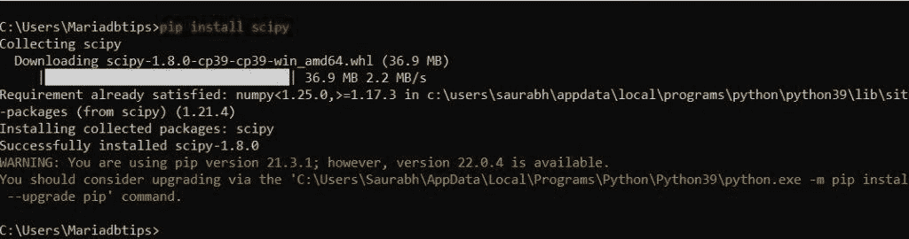

What is Scipy and installation on windows

要检查 Scipy 的版本，请打开命令行，在 python 解释器中输入以下代码。

```py
python
```

读取 [Scipy 优化](https://pythonguides.com/scipy-optimize/)

### 如何在 Python 中导入 scipy

现在，一旦成功安装了 Scipy 包，下一步就是开始使用它。对于这个任务，首先，我们需要导入它。我们可以使用下面的命令导入包 Scipy。

```py
import scipy
```

检查安装的 Scipy 的版本。

```py
scipy.version.version
```

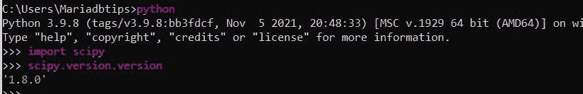

Scipy installation on windows version

输出显示 Scipy 的当前版本是`*`1.8.0`*`。

### 在 Linux 上使用 pip 安装 Scipy】

这里我们将使用 Python 包管理器`*`pip`*`在 Linux 系统上安装 Scipy。

首先，通过在终端中运行下面的命令来安装`pip`。

```py
sudo apt install python3-pip
```

同样，打开一个终端或在同一个终端中输入下面的命令来安装 Scipy。

```py
pip install scipy
```

这里，上面的代码在我们的系统上安装了 Scipy。

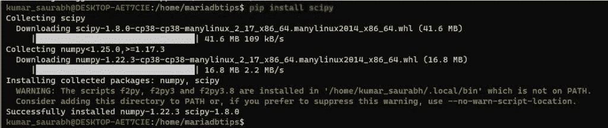

Scipy installation on Linux

要检查 Scipy 的版本，请打开命令行，在 python 解释器中输入以下代码。

```py
python3
```

导入软件包 Scipy。

```py
import scipy
```

检查安装的 Scipy 的版本。

```py
scipy.version.version
```

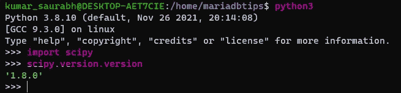

Scipy installation on Linux version

上面的输出显示 Scipy 的安装版本是`*`1.8.0`*`。

阅读:[py torch 是什么以及如何使用它](https://pythonguides.com/what-is-pytorch/)

## 使用 Anaconda 安装 Scipy】

在这里，我们将使用两种方法命令行和 Anaconda Navigator 在 Anaconda 中安装 Scipy。

### #1 命令行

在您的系统上使用 Windows 的搜索栏搜索 ***`Anaconda Prompt`*** ，点击如下图所示。


Installation of Scipy using anaconda prompt

通过在提示符下键入以下命令来检查 python 版本。

```py
python --version
```

然后使用下面的命令安装 Scipy。

```py
pip install scipy
```

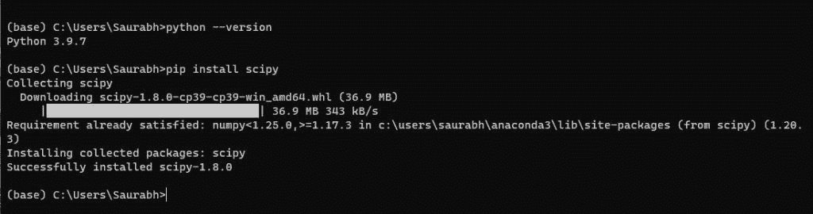

Installation of Scipy using anaconda

要检查 Scipy 的版本，请打开命令行，在 python 解释器中输入以下代码。

```py
python3
```

导入软件包 Scipy。

```py
import scipy
```

检查安装的 Scipy 的版本。

```py
scipy.version.version
```

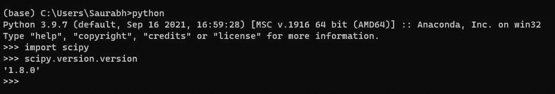

Installation of Scipy using anaconda prompt version

### #2 巨蟒领航员

打开系统上的搜索栏，在搜索栏中键入 anaconda navigator，然后单击它打开，如下面的输出所示。


Installation of Scipy using anaconda navigator

打开``*Anaconda Navigator*``后，点击左侧面板的`Environment`选项卡，选择您的主环境，如这里选择的``*base (root)*``。

然后选择选项``Not installed``，如下图所示。

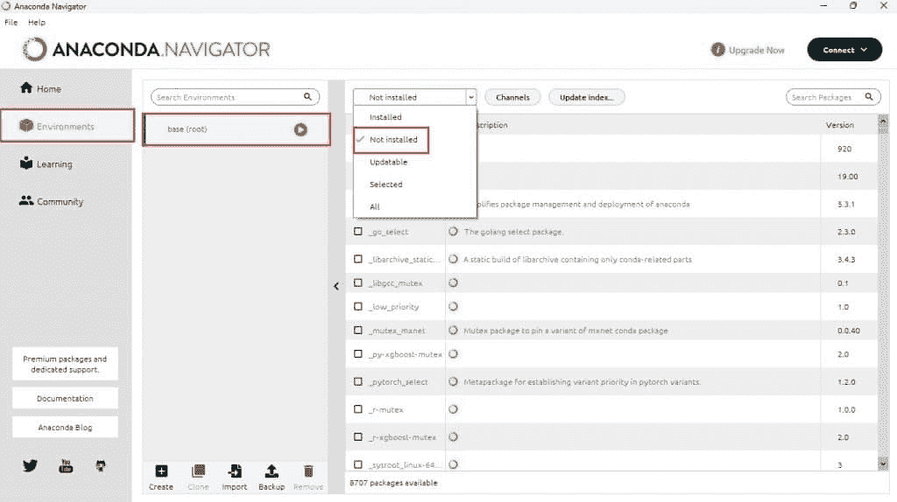

Installation of Scipy using anaconda navigator interface

执行上述步骤后，通过在右上角的 ***搜索包*** 栏中键入并选择如下输出所示的包来搜索`*`Scipy`*`。


Installation of Scipy using anaconda navigator example

选择后，软件包点击应用按钮，如下图所示。

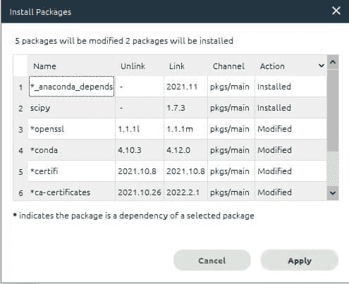

Installation of Scipy using anaconda navigator tutorial

点击`*`Apply`*`按钮后，安装了一个 Scipy 包，如下图所示。

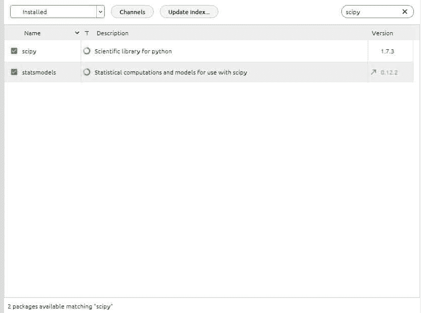

Installation of Scipy using anaconda navigator installation successful

## Pip 更新 Scipy

当我们在 windows 上运行命令``*pip update scipy*``将 SciPy 版本更新到最新版本时，它显示一个错误``*unknown command update*``。

要将 SciPy 更新到最新版本，请使用下面显示的正确命令。

```py
pip install --upgrade scipy
```

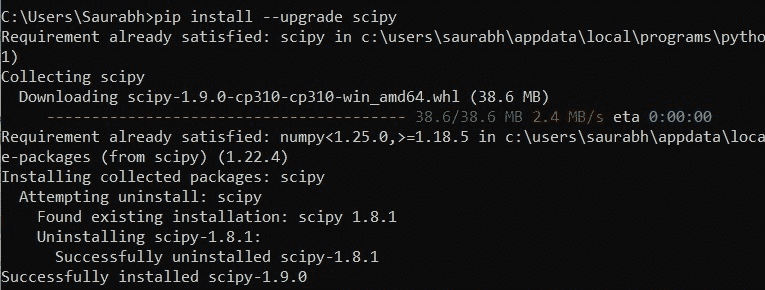

Pip Update Scipy

这就是如何使用命令``*pip install --upgrade scipy*``将 SciPy 版本更新到最新版本。

## 将 Scipy 导入为

要使用 SciPy 库或方法，首先，我们需要导入 SciPy 模块，导入 SciPy 库有不同的方法。

第一种是使用下面的代码所示的`*`import`*`命令直接导入库。

```py
import scipy
```

现在使用下面的代码访问 SciPy 库中存在的任何模块。

```py
scipy.linalg.inv
```

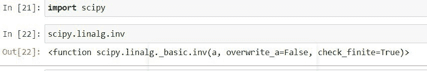

Import Scipy As

使用下面的代码再次导入不同名称的 SciPy 库。

```py
import scipy as sp
```

在上面的代码中，我们导入了名为`sp`的库 SciPy，这个名字叫做别名。我们可以选择任何名字。

让我们使用别名访问 SciPy 的模块或方法。

```py
sp.linalg.inv
```

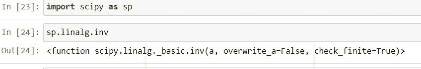

Import Scipy As Example

这就是如何使用命令`import scipy as sp`导入 SciPy 库。

另外，看看更多的 Python 教程。

*   [Python Django 是什么，用于](https://pythonguides.com/what-is-python-django/)
*   [Scipy 常量–多个示例](https://pythonguides.com/scipy-constants/)
*   [Scipy Sparse–有用的教程](https://pythonguides.com/scipy-sparse/)
*   [Scipy 旋转图像+示例](https://pythonguides.com/scipy-rotate-image/)
*   [Python 中的熊猫是什么](https://pythonguides.com/pandas-in-python/)
*   [Python 中的 NumPy 是什么](https://pythonguides.com/numpy/)

在本 Python 教程中，我们讨论了什么是 Python 中的 Scipy，我们还讨论了以下主题。

*   Python 中的 Scipy 是什么？
*   为什么我们在 Python 中使用 Scipy
*   SciPy 和 NumPy 的区别
*   Scipy 的安装
*   使用 PIP 安装 Scipy
*   使用 Anaconda 安装 Scipy
*   如何在 Python 中导入 Scipy
*   Pip 更新副本
*   将副本导入为

[Bijay Kumar](https://pythonguides.com/author/fewlines4biju/)

Python 是美国最流行的语言之一。我从事 Python 工作已经有很长时间了，我在与 Tkinter、Pandas、NumPy、Turtle、Django、Matplotlib、Tensorflow、Scipy、Scikit-Learn 等各种库合作方面拥有专业知识。我有与美国、加拿大、英国、澳大利亚、新西兰等国家的各种客户合作的经验。查看我的个人资料。

[enjoysharepoint.com/](https://enjoysharepoint.com/)[](https://www.facebook.com/fewlines4biju "Facebook")[](https://www.linkedin.com/in/fewlines4biju/ "Linkedin")[](https://twitter.com/fewlines4biju "Twitter")