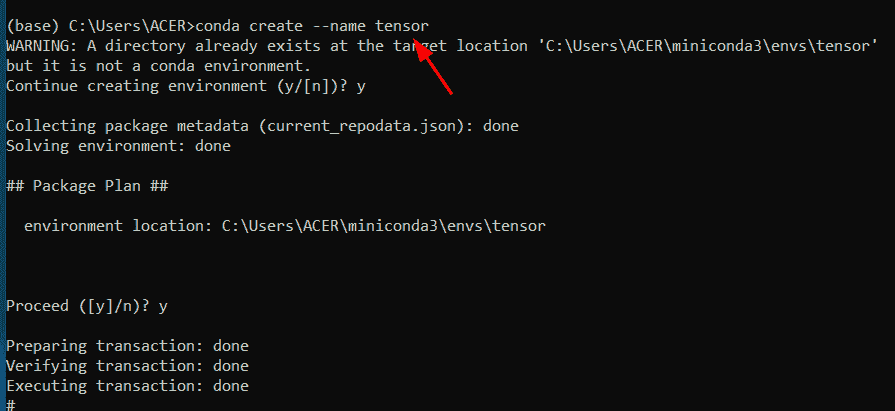
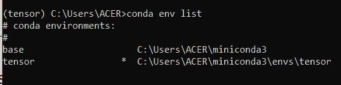
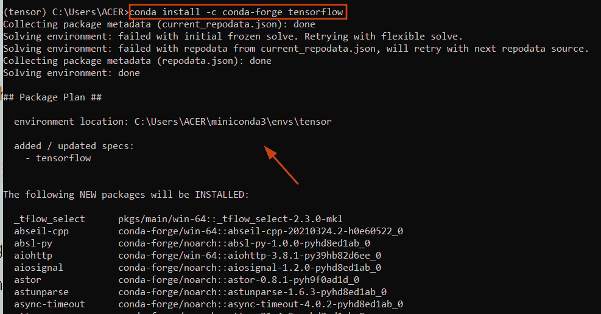
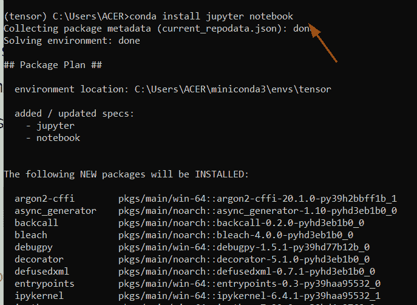
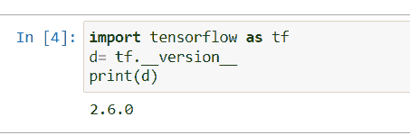
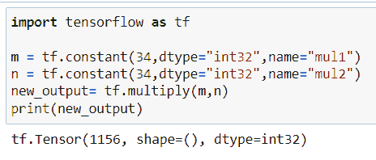
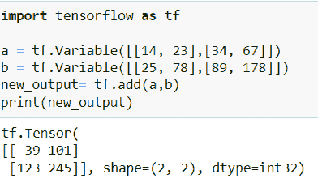

# Tensorflow in Python

> 原文：<https://pythonguides.com/what-is-tensorflow/>

[](https://sharepointsky.teachable.com/p/python-and-machine-learning-training-course)

在本 [Python 教程](https://pythonguides.com/learn-python/)中，我们将讨论 `Tensorflow` 库、**什么是** `Tensorflow` 、**如何在 Python** 中使用它，我们还将涉及以下主题:

*   What is Tensorflow
*   张量流的特征
*   如何安装 Tensorflow Python
*   Tensorflow 环境设置
*   如何在 Python 中使用 Tensorflow 的示例
*   张量流的优缺点

目录

[](#)

*   [Python 中的 Tensorflow 是什么](#What_is_Tensorflow_in_Python "What is Tensorflow in Python")
*   [张量流的特征](#Features_of_Tensorflow "Features of Tensorflow")
*   [Tensorflow 环境设置](#Tensorflow_environment_setup "Tensorflow environment setup")
*   [如何在 Python 中使用 Tensorflow 的示例](#Example_of_how_to_use_Tensorflow_in_Python "Example of how to use Tensorflow in Python")
*   [tensor flow 的优缺点](#Advantages_and_Disadvantages_of_Tensorflow "Advantages and Disadvantages of Tensorflow")

## Python 中的 Tensorflow 是什么

*   `Tensorflow` 是一个用于[机器学习](https://pythonguides.com/machine-learning-using-python/)的库，是一个用于数值计算的开源库。
*   它用于开发机器学习应用程序，这个库最初是由 **Google brain 团队**创建的，它是最常见和最成功使用的库，为机器学习应用程序提供了各种工具。
*   Tensorflow 库在 `Airbnb` 等行业的很多公司都有使用。这家公司使用 TensorFlow 应用机器学习来检测对象并对图像进行分类。
*   在 Python 中，如果你想在图中移动数据，那么你可以很容易地使用 TensorFlow 库来创建数据流图。基本上，张量是一个 n 维矩阵，表示输入类型，流基于具有边和节点的流图工作。
*   它由谷歌大脑团队创建和编码，建立在移动操作系统和多个 GPU 和 CPU 上。Tensorflow 目前的稳定版本是 2021 年 11 月 1 日发布的 2.6.1。
*   第一个稳定版本在 **Apache 开源许可**下于 `2015` 发布，随后在【2019 年 9 月发布，命名为 `Tensorflow 2.0` 。
*   它被用在许多编程语言中，如 `Python` 、 `R` 、 `C++` 。它为用户提供了一个数据流图，使数据可以理解。
*   你可以在任何 **Jupyter 笔记本**、 `google collab` 、 `Python shell` ，以及使用 anaconda 的 **[Django](https://pythonguides.com/what-is-python-django/)** 等 web 应用服务器中使用 Tensorflow 包。

## 张量流的特征

*   它被用作 [Python 编程语言](https://pythonguides.com/learn-python/)的图形库的可视化。
*   它是一个用于复杂分析的开源库，并且易于构建神经网络。
*   为了处理大量的数据，我们可以很容易地使用 TensorFlow 库。它支持多种编程语言，如 Python、c++和 java。
*   它通过减少开发时间来定义抽象层次，并且很容易在像 CPU 和 GPU 这样的架构上进行训练。
*   它用于显示图像、图表以及部署机器学习模型。它也适用于任何环境，如 Android 和 IOS。
*   张量秩有三种结构，形状和类型。在 Python 中，如果你想训练神经网络模型，那么你可以很容易地使用 TPU(张量处理单元)。

同样，检查:[张量流得到形状](https://pythonguides.com/tensorflow-get-shape/)

## Tensorflow 环境设置

*   大家来讨论一下，Tensorflow 在 Windows 10 中的下载安装。要下载 tensorflow 库，您必须安装 conda 软件包管理器。
*   要下载这个软件包，你必须在你的系统中安装 miniconda。打开 [Miniconda 官方网站](https://docs.conda.io/en/latest/miniconda.html)下载 conda 更新版本。
*   一旦你安装了 conda 软件包，然后在 windows 10 中打开开始菜单。之后，打开 conda 提示符创建一个环境。

**步骤 1:** 在 Conda 提示符下创建一个环境，默认情况下，它采用基本环境。现在检查如何创建一个环境。您可以通过执行以下命令来做到这一点

```py
conda create --name tensor
```

这里我们必须使用环境名'张量'你可以选择任何名称



Tensorflow environment setup

**步骤 2:** 要激活这个环境，您可以实现下面的代码

```py
conda activate tensor
```

上面的命令激活环境

**步骤 3:** 现在，通过执行以下命令来检查“Tensor”环境是否已成功安装在您的系统上

```py
conda env list
```



environment setup of Tensorflow

**步骤 4:** 现在在您环境中的所有 [Numpy](https://pythonguides.com/numpy/) 、 [pandas](https://pythonguides.com/pandas-in-python/) 和 [matplotlib](https://pythonguides.com/what-is-matplotlib/) 库中，使用下面的命令

```py
conda install numpy pandas matplotlib scikit-learn
```

**第 5 步:**现在从您的开发环境中的 all Tensorflow 库中。您可以通过执行以下命令来做到这一点

```py
conda install -c conda-forge tensorflow
```



TensorFlow install

为了测试一切是否正常，让我们使用下面的命令进行测试

```py
conda list
```

通过使用这个命令，可以很容易地检查 TensorFlow 库在环境路径中是否可用

**步骤 6:** 现在让我们尝试导入 Tensorflow 库，但在导入库之前，您必须安装 jupyter 笔记本。在你的系统中安装 Jupyter 笔记本。您可以很容易地使用下面给出的命令

```py
conda install jupyter notebook
```



install jupyter

**步骤 7:** 使用以下命令打开系统中的 jupyter 笔记本

```py
jupyter notebook
```

现在，您可以通过在 jupyter 笔记本中执行以下命令来检查 Tensorflow 库是否已成功安装在您的系统上:

```py
import tensorflow as tf
d= tf.__version__
print(d)
```

这是检查 TensorFlow 库在我们的系统中是否可用的最简单的方法。

屏幕上显示程序运行的图片



check version of Tensorflow

另外，检查:[模块“TensorFlow”没有属性“session”](https://pythonguides.com/module-tensorflow-has-no-attribute-session/)

## 如何在 Python 中使用 Tensorflow 的示例

*   在这个程序中，我们首先要导入 TensorFlow 库，然后使用 constant 函数声明变量。
*   在我们的例子中，可以很容易地使用不同类型的张量，比如 tf.constant，tf.variable 等。
*   在这个例子中，我们将使用简单的运算，比如乘法和加法。为了完成这项任务，我们将使用常量函数，在 Python 中，该函数基本上初始化了一个对象，如数组或列表，在该函数中，我们可以轻松地使用-value dtype 参数。
*   使用 tf.variable 时，指示值可以互换，并且它还包含多个参数。当你要训练或设计机器学习的模型时，你必须应用所有这些参数。

**语法:**

让我们看一下语法，了解一下 `tf.constant` 和 `tf.variables` 的工作原理

```py
tf.constant
           (
            value,
            dtype=None,
            shape=None,
            name='const'
           )
```

*   它由几个参数组成
    *   value:此参数表示缩放值
    *   dtype:默认情况下，它不接受任何参数，但是您可以在其中添加 dtype=int、float 值，
    *   shape:该参数指定数组形状(3，3)的维数。

**举例:**

```py
import tensorflow as tf

m = tf.constant(34,dtype="int32",name="mul1")
n = tf.constant(34,dtype="int32",name="mul2")
new_output= tf.multiply(m,n)
print(new_output)
```

下面是以下代码的截图



tf constant Python

现在让我们以 Tensorflow Python 中的 `tf.variable` 为例

**语法:**

```py
tf.variable
           (
            initial_value=None,
            trainable=None,
            validate_shape=True,
            caching_device=None,
            name=None,
            variable_def=None,
            dtype=None,
            import_scope=None,
            constraint=None,
            synchronization=tf.VariableSynchronization.Auto,
            aggregation=tf.compat.v1.VariableAggregation.None,
            shape=None
           )
```

**举例:**

```py
import tensorflow as tf

a = tf.Variable([[14, 23],[34, 67]])
b = tf.Variable([[25, 78],[89, 178]])
new_output= tf.add(a,b)
print(new_output)
```

下面是以下给定代码的实现



tf variable python

阅读: [Python TensorFlow 随机均匀](https://pythonguides.com/tensorflow-random-uniform/)

## tensor flow 的优缺点

**优点:**

*   这是一个开源库，意味着用户可以很容易地从官方网站下载文件。
*   它的优点是可以很容易地修改性能，还可以更新版本和功能。
*   它是一个通用和兼容的库，可以在 C++、Python、CUDA 等平台上运行。它是一个开源平台，可以在 Linux、Mac o.s 和移动操作系统上运行。
*   它设计后端软件，如(GPU，ASIC)。

**缺点:**

*   在这个库中，很难得到错误和调试，因为与其他库相比，它是一个更容易和更兼容的库。
*   它每 2-3 个月修改一次版本，最新版本是 Tensorflow 2.0。问题是许多 tf 函数在最新版本中不工作，比如 session 属性。
*   没有对 OpenCL 的支持，我们使用了 GPU 和 TPU。最新的 GPU 是 NVIDIA，它只支持 Python 语言。

您可能也喜欢阅读以下 Python TensorFlow 教程。

*   [张量流自定义损失函数](https://pythonguides.com/tensorflow-custom-loss-function/)
*   [TensorFlow Sparse Tensor](https://pythonguides.com/tensorflow-sparse-tensor/)
*   [Python TensorFlow 占位符](https://pythonguides.com/tensorflow-placeholder/)
*   [TensorFlow 全球平均池](https://pythonguides.com/tensorflow-global-average-pooling/)
*   [Tensorflow 嵌入 _ 查找](https://pythonguides.com/tensorflow-embedding_lookup/)

在本 Python 教程中，我们讨论了 `Tensorflow` 库、**什么是** `Tensorflow` 、**如何在 Python** 中使用它，我们还讨论了以下主题:

*   What is Tensorflow
*   张量流的特征
*   如何安装 Tensorflow Python
*   Tensorflow 环境设置
*   如何在 Python 中使用 Tensorflow 的示例
*   张量流的优缺点

[Bijay Kumar](https://pythonguides.com/author/fewlines4biju/)

Python 是美国最流行的语言之一。我从事 Python 工作已经有很长时间了，我在与 Tkinter、Pandas、NumPy、Turtle、Django、Matplotlib、Tensorflow、Scipy、Scikit-Learn 等各种库合作方面拥有专业知识。我有与美国、加拿大、英国、澳大利亚、新西兰等国家的各种客户合作的经验。查看我的个人资料。

[enjoysharepoint.com/](https://enjoysharepoint.com/)[](https://www.facebook.com/fewlines4biju "Facebook")[](https://www.linkedin.com/in/fewlines4biju/ "Linkedin")[](https://twitter.com/fewlines4biju "Twitter")