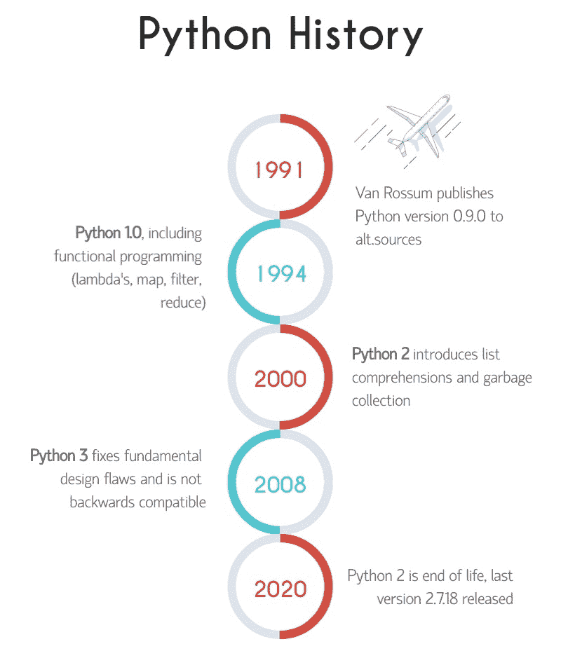

# 免费的 Python 初学者教程:学习 Python

> [https://python.land/python 教程](https://python.land/python-tutorial)

你想学习 Python 吗？不要再看了。这个免费的 Python 教程包含 100 多篇精心制作的免费 Python 文章，其中充满了信息、实用建议和 Python 实践！我们将深入基础知识，然后逐步学习高级概念。我会给你提供许多例子来解释清楚所有的概念。

目录


*   [急着学 Python？](#In_a_hurry_to_learn_Python "In a hurry to learn Python?")
*   [为什么要这个免费的 Python 教程？](#Why_this_free_Python_tutorial "Why this free Python tutorial?")
*   [互动示例代码](#Interactive_example_code "Interactive example code")
*   [你将从这个免费的 Python 教程中学到什么](#What_youll_learn_from_this_free_Python_tutorial "What you’ll learn from this free Python tutorial")
*   我是谁？
*   [关于 Python](#About_Python "About Python")
*   [Python 的主要特性](#Pythons_major_features "Python’s major features")
*   [Python 历史](#Python_history "Python history")
*   [浏览免费 Python 教程](#Navigating_the_free_Python_tutorial "Navigating the free Python tutorial")
*   你能帮我什么？


## 急着学 Python？

如果你急着学习 Python，我现在就给你一些捷径，让你快速入门。

首先，如果您需要安装 Python，请查看关于[安装 Python](https://python.land/installing-python) 的部分。

安装 Python 后，您可以做两件事:

1.  直接进入[Python 简介](https://python.land/introduction-to-python)开始学习这门语言吧！从那里，您可以使用导航链接和菜单来学习免费的 Python 教程。
2.  支持我的工作，参加高级课程 [Python 基础 I](https://python.land/product/python-course?mtm_campaign=onsite&mtm_source=pythontutorial&mtm_placement=inarticle) 。它旨在快速而正确地学习 Python，没有干扰，有许多测验、练习和可以添加到简历中的结业证书。

## 为什么*这个*免费的 Python 教程？

这就是为什么你应该读这本书而不是其他的:

*   这个免费的 Python 教程**易于阅读**,对于初级程序员来说非常理想。我尽最大努力用简单的语言解释事情，让每个人都容易理解。
*   我是一名**经验丰富的作家兼导师**，我非常注意学习材料及其呈现的顺序。
*   本教程包含**交互式示例代码**您可以编辑和运行。这很有趣，而且可以帮助你更快地学习概念。
*   本教程是 **实用** 。我将枯燥的理论保持在最低限度，而是专注于在现实世界中完成事情。但与此同时，我试着解释事情是如何运作的，而不是教你技巧。
*   我在大多数页面上为你提供**经过仔细审查的链接**来加深你的知识。
*   我有没有提到它是完全免费的，没有任何附加条件？我确实为那些寻求优质体验、额外练习和良好结业证书的人提供了[高级 Python 课程](/shop)。

## 互动示例代码

这里有一个例子，说明我是如何在整个教程中包含交互式的、可运行的代码的。请随意使用这个“Hello World”示例。您可以编辑并运行它:

[https://crumb.sh/embed/6FPiVq8p6J2](https://crumb.sh/embed/6FPiVq8p6J2)

Python 的“Hello world”示例。像这样的代码遍布整个教程。

## 你将从这个免费的 Python 教程中学到什么

你将学习使用世界上最流行的编程语言进行计算机编程。我的目标是让你理解语言和生态系统。读完这篇教程，你可以继续自己探索 Python。你不会再感到失落；相反，当你试图解决一个问题时，你会知道去哪里找。

这篇 Python 初学者教程涵盖了广泛的主题，可以让你很快学会 Python。我不会只教你基础知识，但我们也会尝试一些高级主题，比如部署你的代码，正确使用虚拟环境和包管理。

## 我是谁？

让我自我介绍一下。毕竟，你应该问自己这样一个问题:是什么让我有资格通过这个教程教你 Python？

我是 Erik，作为一名专业软件工程师，我已经工作了超过 25 年。在我的职业生涯中，我使用了许多编程语言，但 Python 是我的绝对最爱！我喜欢编程和构建复杂的系统，但我也喜欢写作。这就是为什么我决定将这两者结合起来，为初学者编写这个免费的 Python 教程。之后，我开始学习我的高级课程:Python 基础 I 和 II。他们相当成功，到目前为止，已经获得了一些好评！

最终，我受够了有限的复制和粘贴代码示例，并希望示例代码可以在页面中编辑和运行。它产生了一个附带项目( [crumb.sh](https://crumb.sh) )，提供了一种通用的方法来实现这一点。它还在开发中，但是教程和课程已经有很多有用的代码了！

如果你在 Twitter 上，你可以[关注我(@erikyan)](https://twitter.com/erikyan) 获取新内容的更新。如果你喜欢电子邮件，也可以试试我的 [Python 时事通讯](https://python.land/newsletter)！我试着定期分享有趣的代码片段、练习和测验。

## 关于 Python

让我们从定义 Python 到底是什么开始。Python 是一种计算机编程语言。或者，换句话说，**用于指示计算机执行任务的词汇和语法规则集**。它的原创者吉多·范·罗苏姆以英国广播公司电视节目“巨蟒剧团的飞行马戏团”命名因此，您会发现 Python 书籍、代码示例和文档有时会引用这个电视节目。

Python 被认为是容易学习的，它是围绕一组明确定义的原则(Python 的[禅)设计的，这些原则鼓励 Python 核心开发人员开发一种明确且易于使用的语言。](https://python.land/the-zen-of-python)

### Python 是用来做什么的？

人们在很多地方使用 Python。其丰富的基础库使其非常适合各种小助手脚本。但是它同样适用于大型系统。举例来说，YouTube 最初的创建者大部分都使用了 Python！据我所知，Dropbox 主要是用 Python 写的。而且你知道 Instagram 的整个后端和网站也是用 Python 写的吗？

您可以使用 Python 来自动化任务、执行计算、创建用户界面、创建网站后端、访问数据库、从互联网下载信息等。它是一种通用的语言，易于学习和编写，虽然对于初级程序员来说非常完美，但对于经验丰富的专业人员来说也同样有用和强大。

Python 在一个快速发展的专业领域非常受欢迎，这个领域叫做数据科学。许多数据科学家在日常工作中使用 Python。这些只是几个例子。如果你开始仔细观察，Python 是非常普遍的。

很多人说 **Python 自带电池**。这是一种有趣的方式来说明它包括一个全面的基础库。除此之外，您还可以找到由庞大的社区贡献的成千上万的外部软件包。您会发现支持您想要完成的几乎任何事情的基础库和包。

### Python 的流行

很难衡量编程语言的受欢迎程度，并且有许多不同的顶级列表和排名系统。例如，自 2021 年 1 月以来，Python 在著名的流行编程语言排行榜上名列第二。由于其作为 web 开发语言的优势，Javascript 经常是第一名。这与您在浏览器语言方面几乎没有选择的事实有关。

Python 的流行是一个很大的优势。有大量的教程、书籍、 [Python 课程](https://python.land/shop)、示例代码和帮助可用。Python 已经存在，所以如果你想学习 Python:这是一个安全的赌注！Python 的工作在薪酬等级中排名很高。这个免费的 Python 初学者教程将为你彻底学习 Python 和推进你的职业生涯提供一个良好的开端。

## Python 的主要特性

那么是什么让 Python 成为如此受欢迎的编程语言呢？当你阅读这个 Python 初学者教程时，你会发现，但是我已经可以向你展示一些好处来吊你的胃口了！

### 读和写都很容易

Python 最显著的特性之一是为了可读性而强制使用缩进的方式。没有适当的缩进，你的代码甚至不能运行。我们需要将 Python 中的所有代码块缩进到相同的级别。这是一个工作中的例子。如果您还不理解代码，不要担心:

```py
def bigger_than_five(x):
  # The contents of a function are indented
  if x > 5:
    # This is another, even more indented block of code
    print("X is bigger than five")
  else:
    # And one more!
    print("x is 5 or smaller")
```

因为需要缩进，所以 Python 语言不需要花括号来像 Java、C 和 C#一样对代码块进行分组。这个事实本身就消除了代码中的许多混乱和符号。虽然很主观，但人们普遍认为它让 Python 看起来更舒服。

### 你不需要手动编译你的程序

许多语言在运行程序之前需要一个手动编译步骤，而其他语言是所谓的解释语言:它们可以由解释器直接运行。Python 介于这两个世界之间。

创建 Python 程序时，可以直接运行它，无需手动编译步骤。所有的解释型语言都是如此，这也是为什么大多数人会告诉你它是一种解释型语言。然而，Python 在内部将代码编译成低级代码，称为字节码。这段代码并不特定于某个系统架构(比如 Intel vs. ARM)，但是它的读取和解析速度比纯文本文件要快。

Thank you for reading my tutorials. I write these in my free time, and it requires a lot of time and effort. I use ads to keep writing these *free* articles, I hope you understand! **Support me by disabling your adblocker on my website** or, alternatively, **[buy me some coffee](https://www.buymeacoffee.com/pythonland)**. It's much appreciated and allows me to keep working on this site!

在某些情况下，这个字节码缓存在磁盘上以*结尾的文件中。pyc 扩展。但是当作为脚本语言使用时，Python 不会缓存字节码。对我们来说，这无关紧要。我们可以直接运行我们的代码，而不用担心字节码，因为 Python 会自动处理这一切。这有几个优点:

*   您可以在文本编辑器中编写代码并直接执行。不需要像编译和链接这样的额外步骤。
*   因为它是纯文本，你可以简单地打开一个程序并检查它的内容。相比之下，编译后的代码是不可读的。你将不得不查找源代码(如果有的话)。
*   它是平台无关的。只要平台有 Python 解释器，你的代码就能工作。编译后的代码通常绑定到特定的平台，如 Windows 和 Linux，以及特定的处理器架构，如 Intel 或 ARM(除非它被编译成中间字节码，如 Java 和。网)。

这些优点中的一些也可能是缺点。如前所述，解释语言不是高性能语言。此外，源代码易于阅读和修改的事实对于想要保护其版权的供应商来说并不是一个优势。

### 动态类型化

解释语言的另一个优点是它为动态类型打开了大门。那是什么意思？我将用一些简单的代码来演示它。

以下是 Java 中的一些变量声明:

```py
String myName = "Erik";
int myAge = 37;
float mySalary = 1250.70;
```

在强类型语言中，你需要指定每个变量的确切类型，比如`String`、`int`和`float`。当涉及到物体时，情况变得更糟。

现在我们来看看 [Python 变量](https://python.land/introduction-to-python/variable)。在 Python 中，我们可以在没有类型的情况下做同样的事情:

```py
my_name = "Erik"
my_age = 37
my_salary = 1250.70
```

正如你所看到的，Python 的变体看起来更干净、更舒服！

运行这段代码时，Python 动态地找出变量的类型。比方说，我想知道我的年收入，用我的工资乘以 12。我需要做以下事情:

```py
my_income = my_salary * 12
```

Python 将查看`my_salary`，发现它是一个浮点值，并执行数学运算。如果`my_salary`是一个字符串，Python 也不会抱怨。它会检测一个字符串，然后创建一个新的，由该字符串的 12 个重复组成！然而，在这种情况下，Java 会因出错而失败。

动态类型有很多优点。总的来说，这样更容易快速上手。有些人会告诉你这更容易出错。当有类型错误时，像 Java 这样的强类型语言将无法编译。Python 可能会继续运行，但输出将是意外的。根据我的经验，这种事不常发生。此外，您将在测试期间很快发现问题，并在软件投入生产之前修复错误。

### Python 确实支持类型化

不过，我并不是说打字是件坏事。从 Python 3.5 开始，Python 就支持类型提示。这是一个可选的特性，但是许多程序员接受它，因为它有几个优点，比如在你的 [Python IDE](https://python.land/creating-python-programs/using-a-python-ide) 中更好的自动完成。我喜欢打字，因为它消除了猜测。显式键入是文档的一种形式，我在自己的日常工作中适当的时候使用它。

### 碎片帐集

Python 有变量的概念。变量允许你存储任何值，比如一个数字，一串文本，甚至更大的对象。

你声明的每个变量都会占用你计算机的内存空间。这可能会很快累积起来，尤其是当您创建长时间运行的程序时。所以你需要一种方法来清理你不再使用的变量。

在某些语言中，您需要显式地执行这种清理。这容易导致一种称为内存泄漏的错误。如果你犯了一个小错误，忘记清理，你的软件就会慢慢地耗尽可用内存。幸运的是，Python 的垃圾收集器会自动清理未使用的变量！

我在这里不打算深入细节，但是你可以放心，Python 会做得很好，绝不会不小心清理掉你仍然需要的变量。

## Python 历史

我们已经稍微触及了这个主题，但是让我们探索一下 Python 为什么会出现。这一切开始于 1987 年 12 月一个寒冷多雾的夜晚，一位名叫吉多·范·罗苏姆的荷兰科学家在半夜醒来。他只是做了一个深刻的梦，虽然他当时并不知道，但这个梦最终会改变他的生活和许多其他人的生活。

所以他下了床，穿上了他的童装。在把一些木头扔进几乎窒息的壁炉后，他开始尽可能多地记下这个梦。一种新的编程语言诞生了:Python。

### Python 的诞生

好吧，我有点失控了。上述故事的唯一真相是吉多·范·罗苏姆的名字和开始的日期。1987 年，Guido 在荷兰的一个国家数学和计算机科学研究所 CWI 工作，开发一个大型分布式操作系统。在那个项目中，他有一些自由去从事副业。凭借他多年前积累的知识和经验，他开始编写 Python 编程语言。

### 可扩张的

在 2003 年对比尔·凡纳斯的采访中，圭多提到了这种新语言最大的创新:

> 我认为我对 Python 的成功最具创新性的贡献是使它易于扩展。这也源于我对 ABC 的失望。ABC 是一个非常单一的设计。有一个语言设计团队，他们就是上帝。他们设计了每一个语言细节，没有办法再添加了。你可以写你自己的程序，但是你不能轻易地添加底层的东西。
> 
> <cite>Guido van Rossum</cite>

他认为应该能够以两种方式扩展这种语言:通过编写 Python 模块或完全用 c 编写模块。这很成功，因为他在 CWI 的同事、用户和 Guido 本人立即开始编写他们自己的扩展模块。扩展模块允许您做各种事情。只是目前存在的一小部分模块:

*   图形库，
*   数据处理和[数据科学](https://python.land/data-science)图书馆、
*   库可以处理各种文件格式(像 [JSON](https://python.land/data-processing/working-with-json) ， [YAML](https://python.land/data-processing/python-yaml) )，
*   通过网络通信
*   建立网站和网站后端
*   …等等

从一开始，Guido 就积极参与 Python 的开发，直到今天。短暂退休后，他又回来工作了。微软目前雇佣了他，他的主要工作是提高 Python 的速度。

### 时间表

下图显示了 Python 历史上最具定义性的版本的全球时间表:



Python 的历史

### Python 2 对 Python 3

正如您在 Python 历史时间表中看到的，Python 2 和 3 已经并行开发和维护了很长一段时间。主要原因是 Python 3 代码并不完全向后兼容 Python 2 代码。这种不兼容性导致了长时间的采用率。许多人对版本 2 很满意，也看不出升级的理由。最重要的是，Python 3 最初比 Python 2 慢。随着 Python 3 不断改进和接受新特性，最终，它开始腾飞。

本指南主要关注 Python 3，因为它现在是默认且唯一受支持的版本。在现实世界中，你可能会遇到 Python 2 代码。我在章节[从 Python 2 迁移到 3](https://python.land/migrating-from-python-2-to-3) 中分享了一些从这些代码中迁移的技巧。如有疑问:如果你想学 Python，就去学 Python 3。

## 浏览免费 Python 教程

我尽我所能让浏览免费 Python 教程变得尽可能简单！首先，您可以使用菜单。此外，在每个页面的顶端和末端都有导航链接，引导您进入下一个主题或返回上一个主题。我也链接到相关网页来加深你的知识。

教程主题经过仔细排序，以便您可以从头开始，一步步学习。不过，随便逛逛吧！

## 你能帮我什么？

*你*，对，就是你，可以帮我完善一下这个 Python 初学者教程。你可以做几件事来帮忙。

### 1.如果你……请联系我

*   发现任何错误，
*   认为有些事情可以改进，
*   或者有些事情你不清楚。

### 2.捐赠或购买课程

我已经在这个网站上工作了大约三年，大部分业余时间都在这里全心全意地工作。我希望它显示出来，并且我真诚地希望你在这里学习 Python 有很多乐趣。

支持我工作的最好方式是购买课程，但我能理解不是每个人都有这个预算。如果你还想表达你的感激，你可以[请我喝咖啡](https://www.buymeacoffee.com/pythonland)。到目前为止我得到的所有支持都是鼓励我继续写作和不断更新内容的东西！

### 3.禁用广告拦截器

如果你屏蔽广告，你不想捐赠或购买课程，我恳请你在这个免费的 Python 教程上禁用你的广告屏蔽器。你可能认为这不会有什么帮助，但请意识到，作家们正因为如此而努力工作。我只投放值得信赖的广告，这些广告通常也非常针对网站的主题。

### 4.跟我来

您可以[关注我(@erikyan)](https://twitter.com/erikyan) 获取新内容更新。我也倾向于偶尔发布有趣的代码片段和测验。该网站还有一个专门的邮件列表；点击[这里订阅我的简讯](https://python.land/newsletter)。它的容量很小，主要包含我写的新文章，有趣的阅读链接，以及我的高级课程的偶尔折扣！

```py
if ready:
    print("Let's learn Python programming!")
```