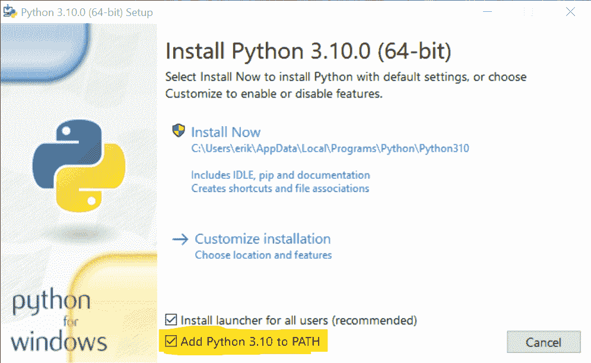

# 安装 Python:windows、Mac 和 Linux 的详细说明

> 原文:[https://python.land/installing-python](https://python.land/installing-python)

在本章中，您将学习如何在 MacOS、Windows 和 Linux 上安装 Python。我们将查看每个平台的多种安装方法，并讨论我认为的最佳选择。

大多数时候，使用 python.org 网站上的官方安装程序是不明智的。相反，最好使用操作系统打包的版本。操作系统提供的版本的优势是你将获得自动更新。

目录


*   [在 Windows 上安装 Python](#Install_Python_on_Windows "Install Python on Windows")
*   [在 MacOS 上安装](#Installation_on_MacOS "Installation on MacOS")
*   [在 Linux 上安装 Python](#Install_Python_on_Linux "Install Python on Linux")
*   [浏览器中的 Python](#Python_in_your_browser "Python in your browser")
*   [了解更多信息](#Learn_more "Learn more")


## 在 Windows 上安装 Python

在 Windows 上有三种方法可供选择。

### 使用微软商店

微软在微软商店中托管了 Python 3 的社区版本。这是在 Windows 上安装 Python 的推荐方式，因为它可以自动处理更新，也可以轻松卸载。

要使用这种方法:

*   [打开微软商店，搜索 Python](https://www.microsoft.com/en-us/search?q=python)
*   选择最新版本并安装它

### 使用官方安装程序

你也可以从官方的 [Python 下载网站](https://www.python.org/downloads/)下载 Python 安装程序。这种方法不会给你自动更新，只有当你没有访问微软商店的权限时，我才推荐它。当您使用此安装程序时，请确保选中“将 Python 添加到路径”复选框:



确保选中复选框“**将 Python 添加到路径**

### WSL 内部

如果您熟悉 Linux 的 Windows 子系统，您也可以考虑这个选项。这是我自己用的，我真的很喜欢它。它为我提供了 Windows 必须提供的优势(主要是强大的硬件支持)，同时仍然喜欢 Linux，在我看来，Linux 是 Python 开发的最佳平台。

要在 WSL 中安装，您首先需要[安装 WSL](https://www.google.com/search?q=install%20wsl2) 本身。如果可以，请使用 WSL2。好多了。之后，只需按照下面的 Linux 安装说明！

## 在 MacOS 上安装

在 Catalina 之前的大多数 MacOS 版本中，已经包含了 Python 的发行版。不幸的是，它几乎肯定是一个旧版本，Python 2.7。幸运的是，有两种方法可以轻松地在 Mac 上安装 Python 3。

### 公司自产自用

首先也是最重要的一点，我建议调查一下[家酿](https://brew.sh/)。它允许你轻松地安装几乎任何东西。额外的好处:

*   自制软件包通常是最新的。
*   以后升级到新版本也很容易。

Thank you for reading my tutorials. I write these in my free time, and it requires a lot of time and effort. I use ads to keep writing these *free* articles, I hope you understand! **Support me by disabling your adblocker on my website** or, alternatively, **[buy me some coffee](https://www.buymeacoffee.com/pythonland)**. It's much appreciated and allows me to keep working on this site!

然而，要使用自制软件，你需要熟悉使用[命令行 shell](https://python.land/the-unix-shell) 。如果这对你来说是全新的，我现在推荐下一个选择:使用官方安装程序。

如果您选择安装 Homebrew，那么在 MacOS 上安装 Python 非常简单:

```py
$ brew install python
```

### 官方安装人员

或者，你可以从 [Python 下载网站](https://www.python.org/downloads/)下载一个安装程序。这很简单，就像安装任何其他 MacOS 软件程序一样。这种方法的缺点是你不会得到自动更新。就像 Windows 一样，您应该确保将 Python 添加到您的系统路径中。

## 在 Linux 上安装 Python

在 Linux 上安装 Python 有几种方法，如果你需要安装的话！

### 先检查安装了什么

大多数 Linux 发行版都包含 Python。许多将包括 Python 2 和 Python 3。

如果你在命令行输入`python --version`，你会看到版本号。大概是 2.7 版本:

```py
$ python --version
Python 2.7.16
```

你不想要 Python 2，但不幸的是，一些操作系统仍然附带它。

现在试试`python3 --version`。如果你得到一个“找不到命令”，你需要安装 Python 3。如果您的输出如下所示，那么您很幸运:

```py
$ python3 --version
Python 3.8.5
```

### 使用包管理器

根据您运行的 Linux 发行版，您可以使用默认的包管理器来安装 Python:Yum、APT 等等。您需要找出哪个包管理器用于您的特定 Linux 发行版，以及如何使用它。

如果你使用的是 Ubuntu、Linux Mint 或者 Debian，你可以使用 apt 来安装:

```py
$ apt install python3 python-is-python3
```

这也安装了一个名为`python-is-python3`的包，使命令`python`指向`python3`。相信我，我说这会让你以后省去很多麻烦。

### 公司自产自用

Linux 的另一个有趣的选择是使用[自制](https://brew.sh/)。没错，MAC 版的包管理器也能在 Linux 上工作。

使用自制软件的主要优势:

*   您将获得最新版本的 Python，而不是您的操作系统附带的版本
*   您不需要 root 用户访问您的系统。所有随家酿一起安装的软件都安装在您的主目录中

我发现自己在 Linux 下工作时越来越多地使用自制软件——试试吧！

## 浏览器中的 Python

如果你不想安装 Python，或者因为某种原因无法安装，我也可以提供一个替代方案:你可以直接从浏览器使用[Python；无需安装！](https://python.land/installing-python/python-in-the-browser)

## 了解更多信息

所有 Python 安装方法还会安装一个名为 pip 的工具。Pip 用于安装默认 Python 安装中没有的 Python 包。在本教程的后面，我们将广泛地研究[如何使用 Pip](https://python.land/virtual-environments/installing-packages-with-pip) 和一些提供更多功能的替代品，如 [Pipenv](https://python.land/virtual-environments/pipenv) 。