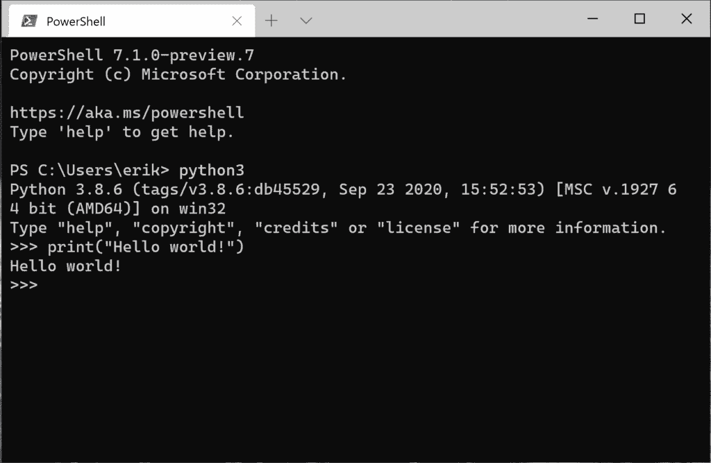
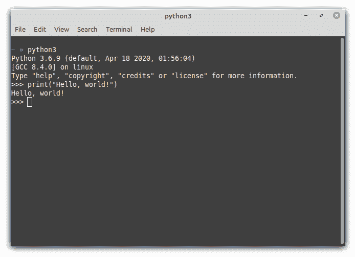

# 如何在 Windows、Mac、Linux 上打开 Python

> 原文:[https://python.land/installing-python/starting-python](https://python.land/installing-python/starting-python)

现在，您将学习如何在 Linux、Windows 和 MacOS 上打开 Python。首先，你要知道使用 Python 有两种方式:

1.  启动一个交互式 shell，也称为 REPL，是读取-评估-打印-循环的缩写。
2.  使用启动存储在一个或多个文件中的 Python 程序。py 扩展名。

在本教程中，我们将从交互式 shell 开始，因为它是探索语言的理想选择。但是在某种程度上，使用 REPL 不再有用，你必须开始创建 Python 文件。

如果您[在本地机器上安装了 Python](https://python.land/installing-python) ，您首先需要启动一个终端或命令提示符，然后才能启动 Python 交互式 shell。在所有平台上，您应该能够用命令`python3`(或者有时只是`python`)启动 Python 3。只是[确保你运行的是 Python 3，而不是 2](https://python.land/migrating-from-python-2-to-3/how-to-check-your-python-version) ，因为有些系统可以安装两个版本。

目录

*   [如何在 Windows 上打开 Python](#How_to_open_Python_on_Windows "How to open Python on Windows")
*   [如何在 Mac 上打开 Python](#How_to_open_Python_on_Mac "How to open Python on Mac")
*   [如何在 Linux 上打开 Python](#How_to_open_Python_on_Linux "How to open Python on Linux")
*   [如何关闭 REPL](#How_to_close_the_REPL "How to close the REPL")

## 如何在 Windows 上打开 Python

在 Windows 上，可以从终端启动 Python。例如，要启动 PowerShell，只需点击 Windows 键并开始键入“PowerShell”。如果您没有 PowerShell，可以使用“命令提示符”程序。在 shell 或命令提示符下，输入以下命令之一(按给定顺序尝试):

1.  巴拉圭
2.  `python3`
3.  大蟒

第一个命令(`py`)是一个包装器脚本，允许您启动最新版本的 Python。如果成功了，那太好了。只要记住我会在教程中经常提到`python`或`python3`。在这些情况下，您需要使用`py`。

Thank you for reading my tutorials. I write these in my free time, and it requires a lot of time and effort. I use ads to keep writing these *free* articles, I hope you understand! **Support me by disabling your adblocker on my website** or, alternatively, **[buy me some coffee](https://www.buymeacoffee.com/pythonland)**. It's much appreciated and allows me to keep working on this site!

Python 从 Windows PowerShell 开始

## 如何在 Mac 上打开 Python

在 MacOS 上，搜索一个名为 terminal 的程序。你可以通过按下**命令键(⌘)** + **空格键**来完成。这将打开 Spotlight 搜索栏，您可以在其中输入单词“终端”。

启动终端后，输入`python3`打开 Python REPL。如果不起作用，试着输入`python`(不带 3)。

## 如何在 Linux 上打开 Python

在 Linux 上，首先需要启动一个终端。这通常可以通过快捷键**`ctrl`+`alt`+`T`+**来实现。或者，您可以在开始菜单中搜索终端程序。每个发行版的名称和位置都不一样。一旦运行了终端，输入`python3`启动 Python REPL。如果不起作用，试试`python`(不带 3)。

Python 在 Linux 终端上运行

## 如何关闭 REPL

既然你知道了如何打开 REPL，那么正确地关闭它也是很好的。如果您简单地关闭终端窗口，您也可以关闭 REPL。然而，这不会是一个干净的出口，你的终端通常也会警告你。那么，如何干净利落地退出 REPL 呢？

在每个操作系统上起作用的是下面的命令:`exit()`

如果你在 Linux 或 MacOS 上，你也可以使用一个小技巧。按下 **control + d** ，REPL 将立即退出。Control + d 将“文件结束”字符发送到终端，REPL 将此解释为退出 Python 的请求。在 Windows 上，你可以通过按下 **control + z** 然后按 enter 来做类似的事情。