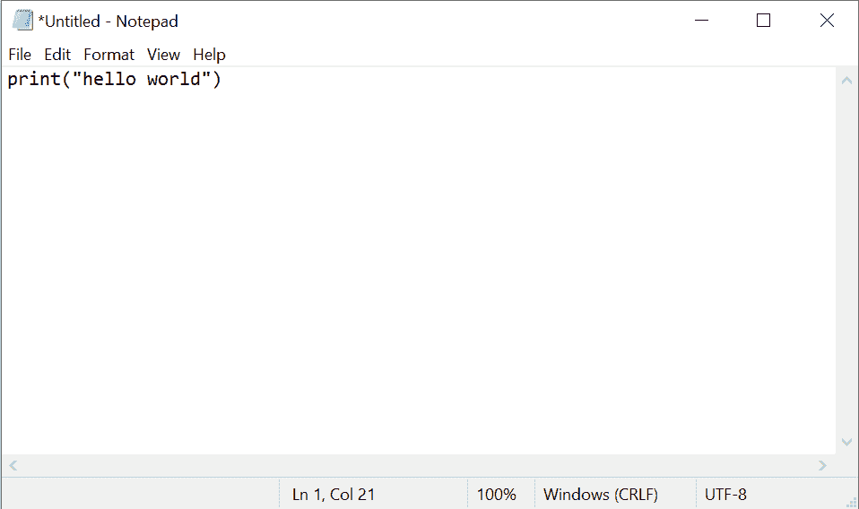
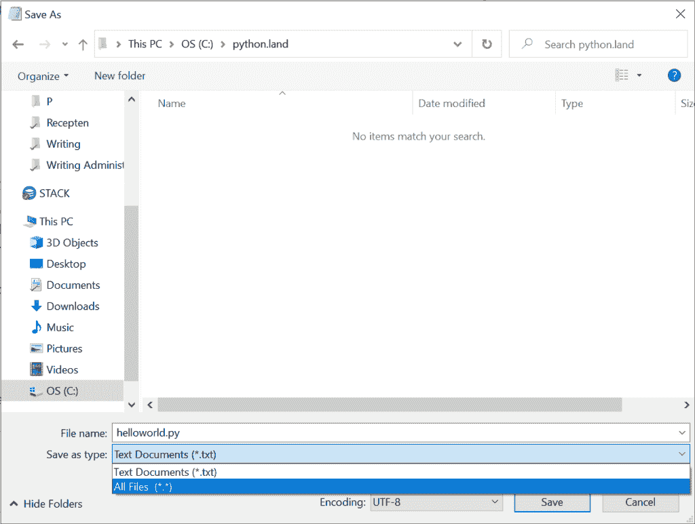
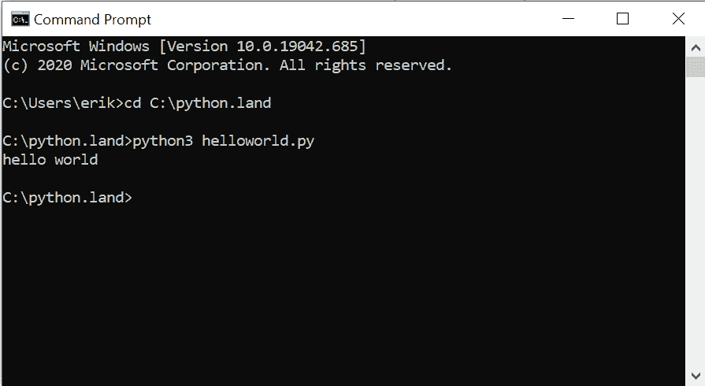

# 创建 Python 程序

> 原文:[https://python.land/creating-python-programs](https://python.land/creating-python-programs)

到目前为止，在阅读完 [Python 教程](https://python.land/python-tutorial)之后，你应该对 Python 和 REPL 有了基本的了解。尽管后者可能非常有用，但在上一个例子中，您可能已经注意到 REPL 有其局限性。这对于快速实验来说很好，但是:

*   输入几行以上真的很难
*   很难回到以前的路线
*   没有语法突出显示
*   我们不能存储我们的程序，以后再使用它们

如果我们想存储我们的程序并使用一个像样的编辑器，我们只需要简单地:

1.  创建一个文件，
2.  输入该文件中的代码，
3.  省省吧，
4.  …并执行它！

“等等，什么？怎么样！”

别担心，我们会一步一步来。

目录


*   [1。创建一个 Python 文件](#1_Create_a_Python_file "1\. Create a Python file")
*   [2。输入代码](#2_Enter_the_code "2\. Enter the code")
*   [3。保存文件](#3_Save_the_file "3\. Save the file")
*   [4。执行一个 Python 程序文件](#4_Execute_a_Python_program_file "4\. Execute a Python program file")


## 1。创建一个 Python 文件

我们需要创建一个所谓的纯文本文件，这意味着这个文件没有什么特别之处。只是文字而已。听起来很简单，其实不然。例如，如果你启动 Word 或类似的程序，输入一些文本，并保存它，你不会得到纯文本。

像 Word 这样的文本处理软件会添加各种额外的代码来定义标记，允许包含图像等等。看起来有点像 HTML，其实是用来创建网站的(介绍见本 [HTML 教程](https://wd.land/html-tutorial))。

### 那么我们应该用什么呢？

如果你用的是 Windows，试试记事本。这是一个不添加任何标记的纯文本编辑器。这是创建 Python 程序的一种可怕方式，但是我们将在以后探索更好的选择。

Thank you for reading my tutorials. I write these in my free time, and it requires a lot of time and effort. I use ads to keep writing these *free* articles, I hope you understand! **Support me by disabling your adblocker on my website** or, alternatively, **[buy me some coffee](https://www.buymeacoffee.com/pythonland)**. It's much appreciated and allows me to keep working on this site!

如果你在 Linux 上，你可以打开一个终端，尝试一个文本编辑器，比如`nano`或`vim`(如果你没有读过手册，最后一个很难使用)。许多 Linux 安装也包括 GUI 文本编辑器，如 gedit。

MacOS 自带一个名为 **TextEdit** 的程序。

## 2。输入代码

现在该输入一些代码了。我们暂时保持简单。只需输入如下内容:

```py
print("Hello world")
```

在 Windows 上，它应该是这样的:



在新的纯文本文件中输入 Python 代码

## 3。保存文件

保存文件。最需要注意的是文件扩展名。Python 文件以`.py`扩展名结尾。调用你的文件`helloworld.py`。在记事本中，您需要单击名为“保存类型”的下拉列表，然后选择`All files (*.*`:



用记事本保存 Python 文件(你很快会学到更好的方法)

## 4。执行一个 Python 程序文件

现在您已经保存了文件，我们可以执行它了。有两种选择，通常你会选择第一种:

1.  打开终端或命令提示符，转到文件的目录，用`python3`命令执行它
2.  用 Windows 资源管理器找到文件，右键单击，用 Python 3。x '。

如果你尝试选项二，你会发现程序在屏幕上闪了一下，你看不到输出，因为文本打印到屏幕后窗口直接自己关闭了。所以现在你知道你为什么想要第一个选项了吧！如果您创建更高级的程序，使其持续运行而不是直接退出，选项二可能是启动 Python 脚本的一种不错的方式。

**注意:**我将使用 Windows 进行演示，但这在 Linux 和 MacOS 上是一样的。您打开的不是命令提示符或 Windows 终端，而是 MacOS 终端或 Linux 终端。

1.  打开“开始”菜单，键入“命令提示符”如果您的操作系统配置了英语以外的其他语言，它的名称可能会有所不同。提示:用英语设置创建新的配置文件。这可能会有所帮助，因为网上和书中的大多数例子都采用了英语设置。
2.  `cd`保存文件的目录。在我的例子中，它是`C:\python.land`
3.  用命令`python3 helloworld.py`运行程序

输出应该如下所示:



从命令提示符或终端运行 Python 程序文件

恭喜，你做到了。你写了一个 Python 程序，保存到一个文件里，像老板一样执行！不过，不要庆祝得太过火。你*不想*用记事本或其他简单的文本编辑器开发 Python 软件。你真正想要的是一个 [Python IDE](https://python.land/creating-python-programs/the-best-python-ide) :一个集成开发环境。听起来很吓人，其实不然！