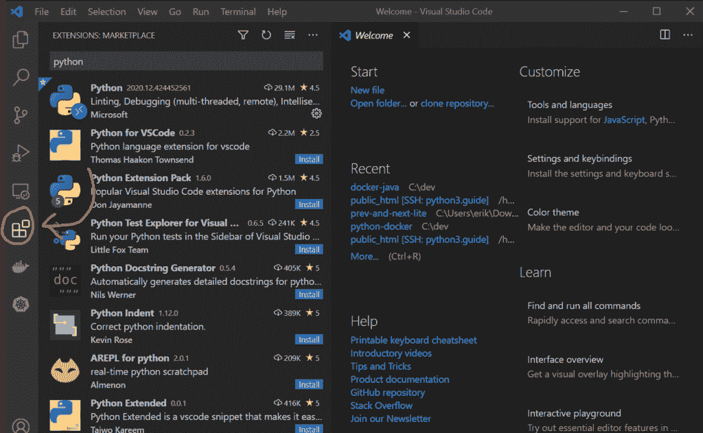

# VSCode Python 扩展

> 原文:[https://python . land/creating-python-programs/vs code-python-extensions](https://python.land/creating-python-programs/vscode-python-extensions)

现在您已经安装了 VSCode 并知道如何打开它，在您开始创建 Python 程序之前，我们需要讨论最后一个主题:VSCode Python 扩展。您应该将 VSCode 视为一个基本框架。它可以做的事情有:

*   打开、编辑和保存文件
*   允许您处理项目
*   启动应用内终端，将所有东西放在一起
*   管理扩展

目录

*   [关于扩展](#About_Extensions "About Extensions")
*   [如何安装扩展](#How_to_install_extensions "How to install extensions")
*   [最好的 VSCode Python 扩展](#The_Best_VSCode_Python_Extensions "The Best VSCode Python Extensions")

## 关于扩展

正是这些扩展让 VSCode 开始大放异彩。它有你能想到的几乎任何东西的扩展。通过这些扩展，VSCode 支持特定的语言，比如 Python，还有 Java、Kotlin、Javascript、Typescript 等等。但它也提供了如下功能:

*   高级代码完成，它建议了一些有用的方法来继续您正在键入的内容，并考虑了上下文
*   与 Git 等版本控制系统的集成
*   与基于云的服务集成，如 GitHub、Docker Hub 等。

VSCode 的强大之处在于它可以一次完成所有这些工作。它不仅仅是一个 Python IDE，还是一个很棒的 HTML 编辑器，非常擅长编写 Javascript，当然，它对 Python 代码也很棒！最棒的是:你可以决定你希望它能做什么。所以你可以保持精简，或者安装任何你需要的插件。看你的口味了！

## 如何安装扩展

要在 VSCode 中安装扩展，可以按左边的大扩展按钮，如下图所示:

在 VSCode 中安装扩展很容易

这将打开扩展市场。在那里，在搜索栏中输入 Python 来查找所有与 Python 有关的扩展。您可以点击扩展来阅读更多关于它们的信息，并按下**安装**按钮来安装扩展。

Thank you for reading my tutorials. I write these in my free time, and it requires a lot of time and effort. I use ads to keep writing these *free* articles, I hope you understand! **Support me by disabling your adblocker on my website** or, alternatively, **[buy me some coffee](https://www.buymeacoffee.com/pythonland)**. It's much appreciated and allows me to keep working on this site!

## 最好的 VSCode Python 扩展

### 计算机编程语言

你至少要为 Python 编程安装官方的 [Python](https://marketplace.visualstudio.com/items?itemName=ms-python.python) 扩展。它提供了许多您需要的功能，如智能感知、林挺、调试、代码导航、代码格式化、重构、变量资源管理器、测试资源管理器、代码片段等等。

### 索纳林特

Sonarlint 插件检测常见错误和 bug。它检测到许多安全问题和代码质量问题，并且不止一次地拯救了我。我强烈推荐。它只支持 Python，但也支持 Java、JavaScript、TypeScript、PHP 等通用语言。

### 魔力神话

[MagicPython](https://marketplace.visualstudio.com/items?itemName=magicstack.MagicPython) 是 VSCode 中默认 Python 语法高亮器的前沿版本。你不*需要*它，但我总是安装它只是为了确保安全。

### Visual Studio 智能代码

[Intellicode 扩展](https://visualstudio.microsoft.com/services/intellicode/)是一个智能的、人工智能辅助的代码完成扩展，由微软构建。它支持 Python、Java、JavaScript 和 TypeScript。