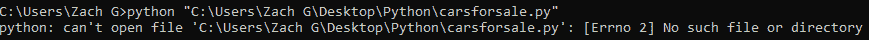

# VSCode GUI 教程:探索这个强大的 IDE 的元素

> 原文:[https://python . land/creating-python-programs/vs code-GUI-tour](https://python.land/creating-python-programs/vscode-gui-tour)

当您第一次启动 VSCode 时，它可能看起来让人不知所措。让我一步一步地向您介绍 GUI，这样您就可以从这个强大的 IDE 中获得最大的收益。

目录

*   [vs code 工作区的主要部分](#Main_sections_of_the_VSCode_workspace "Main sections of the VSCode workspace")
*   [发现并消灭 bug](#Finding_and_squashing_bugs "Finding and squashing bugs")

## vs code 工作区的主要部分

VSCode 中的主工作区分为五个主要部分，如数字所示:

1.菜单栏

2.VSCode 侧栏

3.VSCode Explorer

4.调试控制台/终端

5.文档显示/编辑器

VSCode 概述

让我们从详细查看这些部分开始！

### 菜单栏

菜单来自 VSCode 的菜单栏

菜单栏是用户界面的一部分，但对你的项目至关重要。

*   在“**文件**部分，您可以保存和打开项目，但是您也可以将文件夹添加到您的工作区。
*   “ **Edit** ”选项卡包含标准的复制/粘贴选项，当您需要对某一行稍加修改进行复制时，这些选项会派上用场。查找和替换选项也隐藏在这里。
*   在“**选择**下，有一些选项允许您更容易地选择和移动代码。
*   “**视图**”选项卡上的选项可以让您更改 VSCode 的外观，并显示调试控制台等窗口。
*   我个人并不经常使用“ **Go** ”，但是这一节可以让你更容易地浏览代码。
*   “**运行**选项卡提供了调试代码和添加配置的选项。
*   “**终端**”窗口允许您创建终端窗口和编辑任务。
*   我们工具箱的最后一个工具是“ **Help** ”窗口，它会引导您找到关于 VSCode 的更多信息和文档。

### 侧栏

仔细观察侧栏，有五个主要元素。第一个是“资源管理器”选项卡，我将在后面更详细地介绍它，但要知道它是您工作区中组织的基础。

VSCode 侧栏面板

“搜索”选项卡用于搜索任何字符串。最棒的是，您的工作区中的任何文件都将被搜索，这意味着您可以在所有源代码中找到特定的文本。

“源代码控制”选项卡允许您在 GitHub 存储库上发布和维护代码。这使得您的代码可以公开，供其他程序员使用和构建他们的项目。虽然对于经验丰富的程序员来说这是一个很好的特性，但是如果你还在学习 VSCode，你就不需要它了。

最后一个选项卡“扩展”，允许您查看当前安装的扩展，并找到其他可添加的扩展。如您所见，我为 Java 和 Python 编程语言安装了一些。如果您还没有这样做，请确保您已经安装了 Python 的 [essential VSCode 扩展。](https://python.land/creating-python-programs/vscode-python-extensions)

### 文件浏览器

文件资源管理器面板

文件资源管理器的工作方式与任何文件资源管理器一样。您可以从这里创建、组织和删除文件。使用上面显示的工具，您可以创建一个新文件夹或刷新目录。对目录的任何更改几乎都会立即显示在这里，但是您可能需要不时地强制刷新。

Thank you for reading my tutorials. I write these in my free time, and it requires a lot of time and effort. I use ads to keep writing these *free* articles, I hope you understand! **Support me by disabling your adblocker on my website** or, alternatively, **[buy me some coffee](https://www.buymeacoffee.com/pythonland)**. It's much appreciated and allows me to keep working on this site!

最后一个窗口图标允许您一次最小化所有文件夹。当您开始构建更大的项目(如网站)时，您必须同时管理几个文件。这个按钮可以清除混乱，将所有内容折叠成一个简单的视图。

跳过第一个图标并非偶然，因为我想在 VSCode 中展示一个很酷的特性。这个小图标让你在当前目录下创建一个文件。

您可以创建许多包含源代码并将被 VSCode 识别的文件。例如，在。csv 文件扩展名通常用于存储逗号分隔的数据。的。py 文件包含 Python 代码，而。html 文件是网页文件。这个功能中我最喜欢的部分是它根据你的文件类型创建的小图标。它给你视觉提示，让你快速找到你要找的东西。

### 调试控制台和终端窗口

底部的小窗口通常是为终端窗口保留的。将终端集成到您的工作区可以节省时间和点击。如果你想浏览其他目录或运行一个脚本，这通常是通过终端完成的，这就是为什么在底部有一个嵌套窗口是很好的。

使用终端在 VSCode 中运行脚本非常简单。假设您的目录中保存了一个名为`thisisavirus.py`的脚本。如果您想运行它，只需在控制台中键入 `python thisisavirus.py`。

您可能希望在不同于工作空间的目录中运行 python 文件。在这种情况下，将终端指向文件名，仍然使用 python 命令，如下所示。如果路径中有空格，使用逗号很重要。这将防止弹出下面显示的错误。

终端还可以很好地查看代码中可能出现错误的地方，如上所示。回溯向您显示哪里出错了，以及导致错误的代码在哪里。

本节中我最喜欢的工具被简单地称为“问题”它会检查工作区中每个打开的文件是否有错误和其他问题。正如这里看到的，我有一个“EOF”错误，这只是一个语法错误，因为命令`print(name)`中缺少括号。

### 文档编辑器

看看那些漂亮的颜色！在我为一个类构建的代码中，大约有六种不同的颜色，每种颜色代表另一种类型的代码。例如，紫色文本突出显示了本机 Python 命令，如“import”和循环中的单词。字符串将突出显示为橙色，以便与其他文本区分开来。

VSCode 的另一个优秀特性是迷你文本覆盖。当处理多行代码时，不可避免地会出现错误。VSCode 在右侧为您提供了一个较小版本的代码，如果发现错误，它会用红色突出显示一行，而不是滚动数百行。

VSCode 允许您通过简单地点击它们，然后点击靠近顶部的这个小图标来查看多个文件。每个文件都是可滚动的，并且依赖于另一个文件。

双屏按钮的左边是一个小小的绿色箭头。我希望经过多年的研究，你会发现这个箭头只是运行代码，事实也的确如此。

最后，想想那些同时打开十个浏览器标签的人。你可能会鄙视他们的方式，但是 VSCode 也没有设置打开标签的限制。现在这确实派上了用场，因为你知道你可以一次分割屏幕和编辑多个文件。

## 发现并消灭 bug

我们还没有谈到第四个图标。带有一个小 bug 的 play 按钮以调试模式运行您的脚本。进入调试模式时，VSCode 的底部会变成橙色。您的脚本正在调试模式下运行。

使用 VSCode 调试软件

在调试模式下，VSCode 会在运行时检查每一行的错误。如果发现了一个 bug，你会看到一个亮红色的窗口，指出错误发生的位置。这使得查找错误和调试代码比依靠终端告诉您哪一行出错要容易得多。

VSCode 突出显示代码中的错误

调试模式还允许您单步调试代码。这意味着逐行运行它，在每一行之后停止。这使您有机会在代码运行时检查[变量](https://python.land/introduction-to-python/variables)和[对象](https://python.land/objects-and-classes)的当前状态。这是一个强大的方法来粉碎那些难以发现的错误，并更好地了解正在发生的事情。

要更深入地了解在 VSCode 中运行和调试 Python 代码，请继续阅读下一篇文章。

*特别感谢[扎克·戈雷兹尼](https://zgoreczny.medium.com/)对本文的贡献。你也想为 Python Land 做贡献吗？请[联系我们](https://python.land/contact)。*