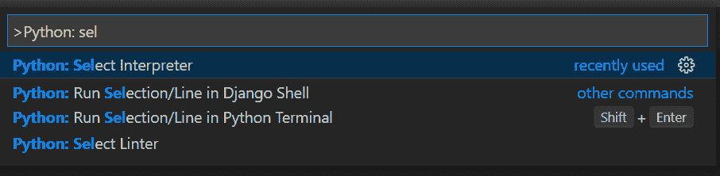
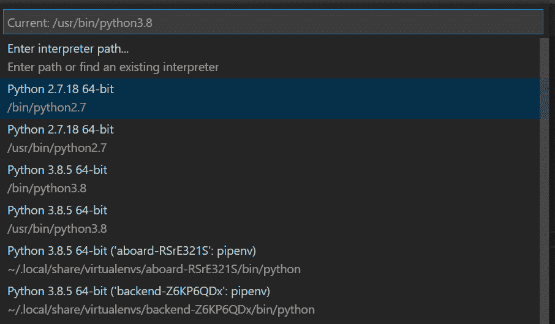
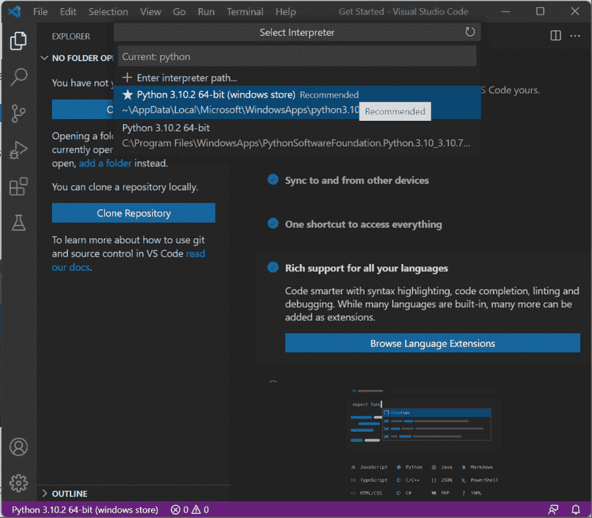
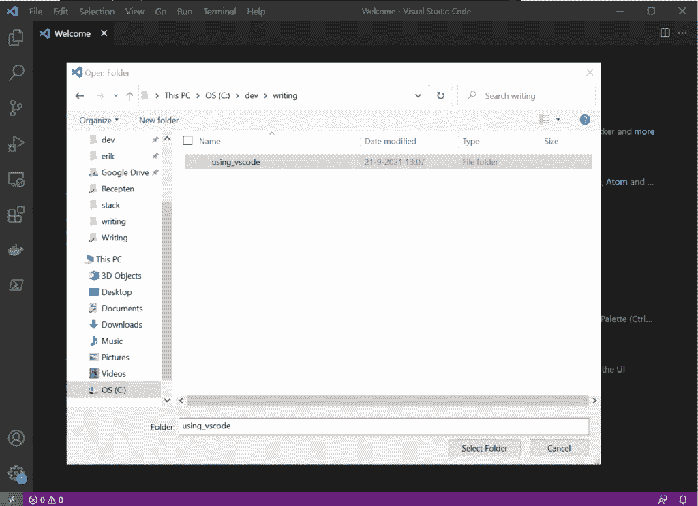
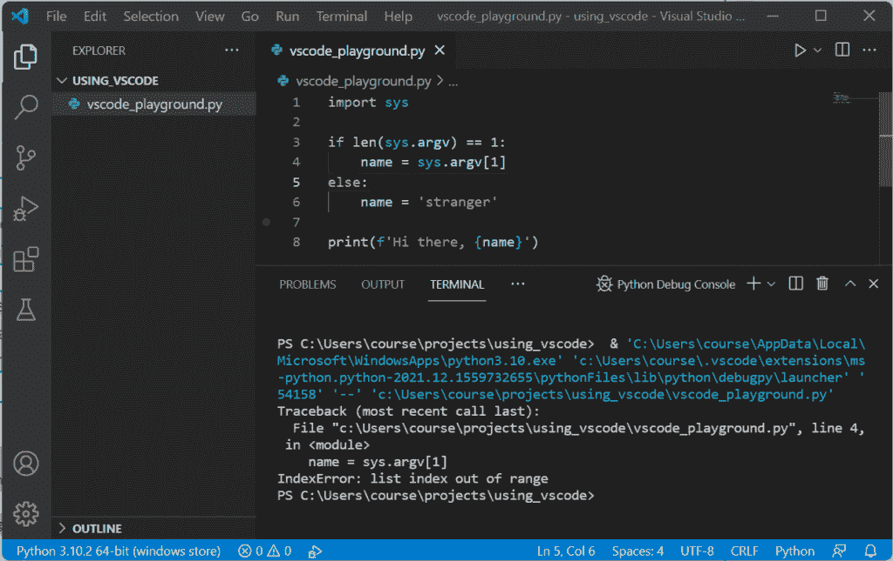
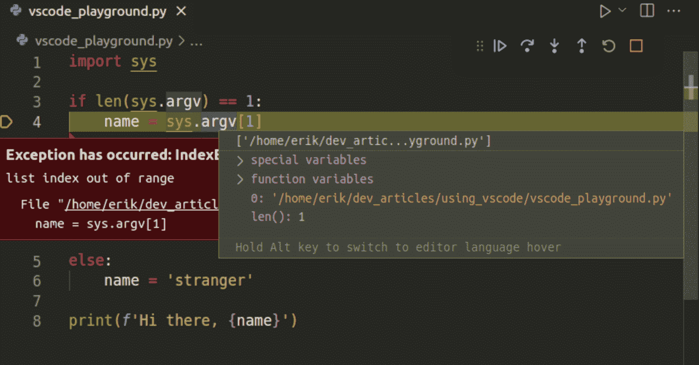
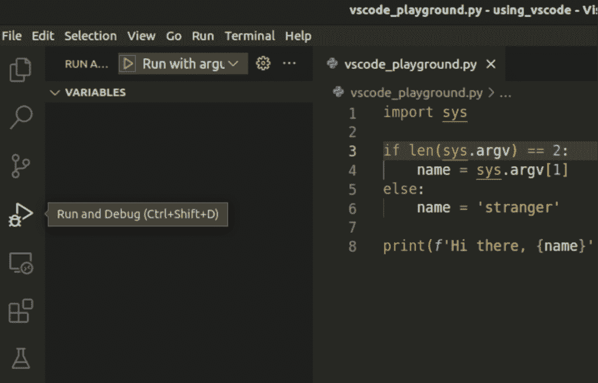
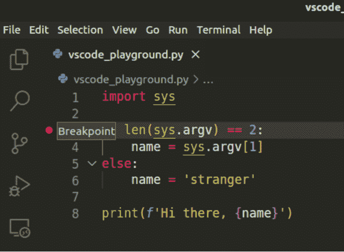
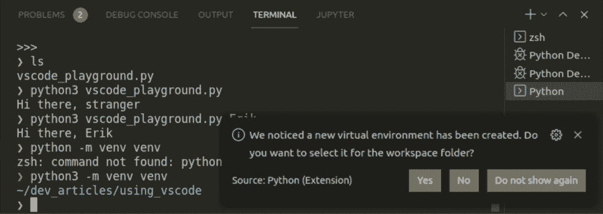

# VSCode 中的 Python:运行和调试

> 原文:[https://python . land/creating-python-programs/python-in-vs code](https://python.land/creating-python-programs/python-in-vscode)

本文向您展示了如何在 VSCode 中使用 Python。您将学习如何运行和调试 Python 程序，以及如何充分利用 VSCode 中的命令行。如果您遵循了本教程，那么您已经阅读了许多关于 ide 和 VSCode 的内容。如果没有，您可能希望从这些页面开始:

*   如何[用记事本写一个简单的 Python 程序](https://python.land/creating-python-programs)
*   [为什么应该使用 IDE 进行 Python 编程](https://python.land/creating-python-programs/using-a-python-ide)
*   [如何安装 VSCode](https://python.land/creating-python-programs/installing-and-starting-vscode)
*   写 Python 程序需要哪些 [VSCode Python 扩展](https://python.land/creating-python-programs/vscode-python-extensions)
*   VSCode GUI 之旅

目录


*   [在 VSCode 中创建或打开一个 Python 项目](#Create_or_open_a_Python_project_in_VSCode "Create or open a Python project in VSCode")
*   [在 VSCode 中运行 Python](#Run_Python_in_VSCode "Run Python in VSCode")
*   [在 VSCode 中调试 Python](#Debug_Python_in_VSCode "Debug Python in VSCode")
*   [运行选择或当前行](#Run_selection_or_current_line "Run selection or current line")
*   [终端运行代码](#Running_code_from_the_terminal "Running code from the terminal")
*   [VSCode 和 Python Virtualenv](#VSCode_and_Python_Virtualenv "VSCode and Python Virtualenv")
*   [在 VSCode 中格式化 Python](#Formatting_Python_in_VSCode "Formatting Python in VSCode")
*   [保存工作空间](#Saving_a_workspace "Saving a workspace")
*   [继续学习](#Keep_learning "Keep learning")


## 在 VSCode 中创建或打开一个 Python 项目

VSCode 窗口总是显示一个工作区。如果您愿意，一个工作区可以依次显示多个文件夹(或者:项目)。您可以打开多个工作区，每个工作区都有自己的窗口。然而，你通常一次只做一个项目。这样做时，一个窗口一个工作区就足够了。

创建项目很简单；这是一个用 VSCode 打开的目录。如果您在一个终端上，无论是在 Linux、MacOS 还是 Windows 上，您都可以创建一个新项目并用 VSCode 打开它，如下所示:

```py
$ mkdir myproject
$ cd myproject
$ code .
```

code 命令是打开 VSCode 窗口的便捷快捷方式。如果您愿意，也可以从菜单中打开文件夹:`**File -> Open Folder**`。

第一次使用 VSCode 打开项目时，IDE 会使用项目特定的设置创建一个新文件`.vscode/settings.json`。如果使用版本控制系统，您可能希望添加。因为您的同事可能有自己的设置和偏好，甚至使用完全不同的 IDE。

## 在 VSCode 中运行 Python

以下分步指南可帮助您正确设置 VSCode 以运行 Python 代码。

### 步骤 1:选择 python 解释器

一个系统可以有多个 Python 解释器。为您的项目使用正确的解释器非常重要，因为 VSCode 使用它来运行和调试您的代码，并提供自动完成等功能。VSCode 通常会尽力自动检测可用的 Python 解释器。事实上，VSCode 甚至在你的项目文件夹中检测到一个 [virtualenv](https://python.land/virtual-environments/virtualenv) 。例如，virtualenv 还包含一个 Python 解释器，VSCode 可以使用它。此外，它还支持增强的虚拟环境管理器，如 [Pipenv](https://python.land/virtual-environments/pipenv) 。

#### 命令选项板

我们将使用一个叫做命令面板的特性来设置解释器。命令面板使您可以快速访问 VSCode 提供的所有功能。它允许你只用键盘做几乎所有的事情。它很棒，而且真正节省时间，所以我建议你尽早习惯它。

快捷键**' Control+shift+P '**(Windows/Linux)或者 **cmd + shift + P** (MacOS)可以让你快速打开命令托盘。如果你需要学习一条捷径，那就是这条！或者，您可以使用菜单:**“视图**->-**命令托盘……**”

在命令面板打开的情况下，开始键入‘Python:select interpreter’。你会很快发现自动完成功能会帮你解决问题；您不必键入整个文本:



使用命令托盘快速找到您要查找的内容

如果你使用的话，最好从你的[虚拟环境](https://python.land/virtual-environments/virtualenv)中选择解释器。如果没有，选择一个合适的版本。如果不知道选哪个，就选最新版本的 Python 3。

如果你别无选择，确保你的系统上已经安装了 Python，并选择手动输入你的解释器的路径。你不应该有；VSCode 应该能够检测到正确安装的 Python 解释器。



选择适合您项目的 Python 版本

在 Windows 中，这看起来像这样:



在 Windows 中选择 Python 解释器

### 步骤 2:在 VSCode 中创建新的 Python 项目

当您第一次打开 VSCode 时，您将从一个空的工作区开始。我们先打开一个文件夹，在里面可以开始实验。我事先创建了一个，但是你也可以使用“打开文件夹”对话框来创建一个。具体工作方式因操作系统而异。在 Windows 中，您可以单击“新建文件夹”，例如:



### 步骤 3:在 VSCode 中创建和运行 Python 文件

配置好解释器后，我们现在可以运行 Python 程序了。让我们创建一个简单的测试程序。通过点击左侧浏览器中的“新建文件”按钮或使用“文件”菜单创建一个新文件。随便你怎么称呼它，我把我的叫做`vscode_playground.py`。如果您还没有这样做，VSCode 可能会要求您选择一个 Python 解释器。去选一个吧。

将以下程序复制并粘贴到新创建的文件中:

```py
import sys

if len(sys.argv) == 1:
    name = sys.argv[1]
else:
    name = 'stranger'

print(f'Hi there, {name}')
```

这段代码将查看脚本是否收到了一个参数。如果是这样，它将把它赋给`name`变量。如果不是，它会叫你陌生人。我故意犯了一个错误，我们稍后将尝试调试。

要运行这个文件，你可以使用菜单 **Run - > Run 不调试**或者按 **Control + F5** (Windows 和 Linux)或者 **cmd + F5** (MacOS)。接下来发生的是 VSCode 打开一个运行该文件的集成终端窗口。由于我们故意犯了一个错误，您应该会看到类似于以下内容的错误:

```py
Traceback (most recent call last):
  File "vscode_playground.py", line 4, in <module>
    name = sys.argv[1]
IndexError: list index out of range
```

这是它在 Windows 上的样子:



我们的程序在 VSCode 中运行(故意出错)

## 在 VSCode 中调试 Python

调试是使 IDE 比简单的编辑器更强大的特性之一。这并不难做到，并且可以为您节省大量的时间来疯狂地向代码中添加 print 语句。因此，让我们现在就花一点时间来学习基础知识吧！

Thank you for reading my tutorials. I write these in my free time, and it requires a lot of time and effort. I use ads to keep writing these *free* articles, I hope you understand! **Support me by disabling your adblocker on my website** or, alternatively, **[buy me some coffee](https://www.buymeacoffee.com/pythonland)**. It's much appreciated and allows me to keep working on this site!

### 调试当前文件

我们不再使用“不调试就运行”选项，而是选择“**运行- >开始调试**”选项。或者，你可以简单地按下 **F5** 。VSCode 会问你想做什么。因为我们想运行当前文件，选择“Python 文件”。

程序将再次因出错而崩溃。但是调试器没有停止，而是进来并突出显示发生错误的那一行。既然它抱怨列表索引超出范围，让我们更仔细地检查一下`sys.argv`列表！

当悬停在文本`sys.argv`上时，您会看到一个弹出窗口，允许您详细检查变量。当悬停在`sys`上时，您会看到 sys 模块的许多内部组件。当鼠标悬停在`argv`上方时，你会看到`argv`的内容:



检查 argv 的含量

即使我们没有提供参数，`argv`仍然包含一个元素:当前脚本的完整路径。一些我们没有预料到的事情！操作系统总是给我们程序的名字作为 argv 的第一个参数。我们现在需要做的就是将比较改为:if len(sys.argv) == 2。按下右上角的重启按钮或按下 **Control + Shift + F5** 或 **cmd + shift + F5** 重启程序。它现在应该输出“你好，陌生人”并正常退出。

### 创建运行配置

您已经学习了通过运行当前文件开始调试的快速方法。但是，如果需要更多选项，可以创建一个或多个运行配置。这样的配置允许你存储特定的参数等等，所以我们可以完全按照我们想要的方式来启动程序。

要创建运行配置，点击**运行- >添加配置**。再次选择“Python 文件”选项。VSCode 将在。vscode 文件夹。该文件预填充了一个示例配置。修改 JSON，如下所示:

```py
{
    "version": "0.2.0",
    "configurations": [
        {
            "name": "Run with argument",
            "type": "python",
            "request": "launch",
            "program": "vscode_playground.py",
            "console": "integratedTerminal",
            "args": ["Erik"]
        }
    ]
}
```

这个配置为脚本提供了一个参数:名称“Erik”。注意，它还专门启动了`vscode_playground.py`而不是当前文件。现在，您可以使用此配置启动调试器。但是首先，让我们打开左边面板中的运行/调试视图，通过点击上面有小 bug 的大运行按钮，或者点击 **Ctrl+Shift+D** 或者 **Cmd+Shift+D** :



通过单击按钮或按 Ctrl+Shift+D 打开运行和调试视图

在这个视图的顶部，您应该会看到新创建的配置。点击旁边的播放按钮开始播放。现在输出应该是“你好，Erik”。

### 断点

在某些时候，你想使用所谓的断点:在程序中的某一行，你想显式地暂停执行，或者休息一下，这样你就有机会检查程序在该点的状态。添加断点非常容易。在所谓的“装订线”中，即文件左侧显示行号的地方，您可以在行号前单击鼠标右键。当您悬停在那里时，应该会出现一个模糊的红点，一旦您单击它，它就会变成鲜红色:



断点，执行将在此处暂停

如果您现在运行程序，它将在断点处暂停，允许您在该时间点检查变量。要继续，您可以单击继续按钮或按下 **F5** 。调试器将继续执行，直到遇到另一个断点或程序完成。

或者，您可以使用“单步跳过”(F10)、“单步进入”(F11)和“单步退出”(F12)按钮从这里开始逐步执行程序。这样，您可以一行一行地执行程序，并有选择地进入和退出 [Python 函数](https://python.land/introduction-to-python/functions)调用。

现在，您已经具备了在 VSCode 中开始调试的坚实基础知识。要了解更多细节，我想让您参考 VSCode 文档的[调试部分，这应该是我到目前为止所教授内容的一个很好的延续。](https://code.visualstudio.com/docs/editor/debugging)

## 运行选择或当前行

另一个有用的特性是运行代码选择或当前行的能力。这并不总是有用的:通常，一行代码或代码选择很大程度上取决于它的上下文。但有时，它会派上用场。要运行代码选择或当前行，按下 **Shift+Enter** 或使用命令调板并搜索“在终端中运行选择”。

代码在一个 [Python REPL](https://python.land/introduction-to-python/the-repl) 中运行，一旦完成，这个 REPL 就保持打开，这样你就可以实验、检查变量等等。例如，如果您“运行”一个函数，现在您可以从 REPL 调用该函数，因为它是在那里定义的。

一个很酷的特性是，运行选择或当前行的所有后续命令都在同一个 REPL 中执行，保持状态不变。因此，如果您更改函数并再次“运行”它，函数会在 REPL 中重新定义。这是一个测试你刚刚写的代码的好方法，但是它不能代替适当的单元测试。

## 终端运行代码

VSCode 有一个集成的终端，非常有用。有的人从来不用，有的人一直用。我属于最后一类人:我从命令行运行我的代码，除非我在调试。我也在命令行上做版本控制。我发现熟悉所有命令行工具非常有用。它允许我在没有 IDE 的情况下执行关键任务，例如，在其他人的 PC 上、远程终端上，或者仅仅是快速打开的终端窗口，而不是打开完整的 IDE。

除了我个人的偏好之外，还有几个使用终端比 GUI 更容易的用例。例如:当您使用命令行选项进行测试时。您可以在运行配置文件中添加选项，但是如果这些选项不断变化，使用终端会更快。

因此，让我们也探索一下如何从集成的终端窗口运行您的代码。

### 第一步:打开内置终端

使用命令面板运行**终端:创建新的集成终端**，或者使用快捷键 **Ctrl+Shift+`** (那是一个反勾)。屏幕底部应该会打开一个终端。通过再次按下该组合键，您可以创建更多的终端窗口。重复按 **Ctrl+`** 可以快速显示和隐藏终端面板。

### 步骤 2:运行您的代码

不要忘记[激活你的虚拟环境](https://python.land/virtual-environments/virtualenv#Python_venv_activation)，如果你有一个的话。接下来，像处理任何其他文件一样运行 Python 文件:

```py
$ python3 vscode_playground.py Erik
Hi there, Erik
```

## VSCode 和 Python Virtualenv

使用 Python [虚拟环境](https://python.land/virtual-environments)时，需要让 VSCode 知道。如前所述，这样做的方法是从您的虚拟环境中选择解释器，而不是从系统范围内选择。

为了测试这一点，让我们先[创建一个虚拟环境](https://python.land/virtual-environments/virtualenv#Creating_a_Python_venv):

`python3 -m venv venv`

从截图中可以看出，VSCode 几乎立刻就注意到我们创建了这个 venv，并提供使用它:



点击是，就大功告成了！或者，你可以在命令面板(Ctrl+Shift+P)中通过输入“选择解释器”并点击“Python:选择解释器”来手动选择这个 venv

## 在 VSCode 中格式化 Python

您可以在 VSCode 中格式化 Python，如果您点击:

*   Windows: **Shift + alt + F**
*   Mac: **Shift + Option + F**
*   Linux: **Ctrl+Shift+I** (那是大写的 I)。
*   或者打开命令调板(ctrl + shift + p)开始输入‘格式化文档’。

默认情况下，VSCode 格式化当前文档。如果您还没有这样做，它会询问您是否要安装 autopep8、black 或 yapf 之类的格式化程序。选择一个(默认，如果你不确定)，让它安装。

从现在开始，如果您在编辑 Python 文件时按下 format 快捷键，您会注意到您的文件会根据格式化程序的默认规则进行格式化。如果你想定制这些规则，你将需要查找(例如，在 Google 上)如何为你选择的特定格式化程序定制规则。通常，您可以通过在项目的主目录中创建特定文件来添加或修改规则。

## 保存工作空间

最后，您可能想要保存您的工作空间。不过，这不是必须的。您可以简单地再次打开该文件夹。像启动配置这样的定制保存在(隐藏的)中。vscode 目录，如果打开该文件夹，VSCode 会找到它。然而，如果你在你的工作空间中打开了多个文件夹，并且不想连续重复这些步骤，你可以使用**文件- >保存工作空间为..**菜单。

## 继续学习

阅读这些文章以了解有关 Visual Studio 代码及其功能的更多信息:

*   [正确安装 Python](https://python.land/installing-python)
*   [为什么应该使用 IDE 进行 Python 编程](https://python.land/creating-python-programs/using-a-python-ide)
*   [如何安装 VSCode](https://python.land/creating-python-programs/installing-and-starting-vscode)
*   VSCode GUI 之旅
*   [VSCode Python 扩展](https://python.land/creating-python-programs/vscode-python-extensions)

以下外部链接可能也有帮助:

*   [官方 VSCode 文档](https://code.visualstudio.com/docs)