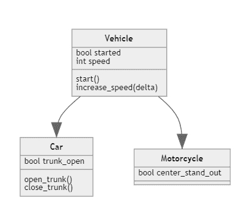

# Python 继承

> 原文:[https://python.land/objects-and-classes/python-inheritance](https://python.land/objects-and-classes/python-inheritance)

在编程中，尽可能多地重用代码被认为是一种好的风格。这种做法甚至有一个很好的首字母缩略词，叫做 DRY:不要重复自己。类有助于避免重复代码，因为您可以一次编写一个类，然后基于它创建许多对象。然而，当使用 Python 继承时，它们也以另一种方式帮助你。

目录


*   [Python 中的继承](#Inheritance_in_Python "Inheritance in Python")
*   [Python 继承示例](#Python_inheritance_example "Python inheritance example")
*   [覆盖 Python 方法](#Overriding_Python_methods "Overriding Python methods")
*   [覆盖其他方法](#Overriding_other_methods "Overriding other methods")
*   [继续学习](#Keep_learning "Keep learning")


## Python 中的继承

我们已经看到了遗传在起作用，但是你可能还没有意识到。还记得我告诉过你关于 [Python 构造函数](https://python.land/objects-and-classes/python-constructors)以及每个类都有一个构造函数(`__init__`)，即使你没有定义一个。这是因为每个类都继承了 Python 中最基本的类，叫做`object`:

```py
>>> dir(object)
['__class__', '__delattr__', '__dir__', 
'__doc__', '__eq__', '__format__', 
'__ge__', '__getattribute__', '__gt__', 
'__hash__', '__init__', '__init_subclass__', 
'__le__', '__lt__', '__ne__', '__new__', 
'__reduce__', '__reduce_ex__', '__repr__', 
'__setattr__', '__sizeof__', '__str__', 
'__subclasshook__']
```

当我告诉你 Python 中的一切都是对象’时，我指的是一切。这包括类，如你所见，我们也可以在类上使用`dir()`；`object`级。它揭示了`object`有一个`__init__`方法。很酷，不是吗？

## Python 继承示例

类可以从其他类继承属性和函数，所以不必重复。比方说，我们希望我们的 Car 类从 Vehicle 类继承一些更通用的函数和变量。当我们这样做的时候，让我们也定义一个摩托车类。示意性地看起来是这样的:



Python 类继承

继承映射到许多现实生活中的情况。基于上面的类图，让我们看看继承的实际应用。我们将从一个通用的`Vehicle`类开始:

```py
class Vehicle:
    def __init__(self, started = False, speed = 0):
        self.started = started
        self.speed = speed
    def start(self):
        self.started = True
        print("Started, let's ride!")
    def stop(self):
        self.speed = 0
    def increase_speed(self, delta):
        if self.started:
            self.speed = self.speed + delta
            print("Vrooooom!")
        else:
            print("You need to start me first")
```

现在我们可以使用继承来重新定义我们的汽车类:

```py
class Car(Vehicle):
    trunk_open = False
    def open_trunk(self):
        self.trunk_open = True
    def close_trunk(self):
        self.trunk_open = False
```

我们的汽车继承了 Vehicle 类的所有方法和变量，但是增加了一个额外的变量和两个方法来操作主干。

## 覆盖 Python 方法

有时你想覆盖继承的`__init__`函数。为了演示，我们可以创建一个摩托车类。大多数摩托车都有一个中间支架。我们将增加在初始化时输出或输入的能力:

```py
class Motorcycle(Vehicle):
    def __init__(self, center_stand_out = False):
        self.center_stand_out = center_stand_out
        super().__init__()
```

当您重写构造函数时，我们从父类继承的构造函数根本不会被调用。如果你还想要那个功能，你就要自己调用它。这是用`super()`完成的:它返回一个对父类的引用，所以我们可以调用父类的构造函数。

在这种情况下，我们为中心支架添加了功能，但删除了在构造函数中设置速度和开始状态的选项。如果您愿意，您也可以添加速度和启动状态的选项，并将它们传递给`Vehicle`构造函数。

## 覆盖其他方法

就像`__init__`一样，我们也可以覆盖其他方法。例如，如果您想要实现一辆不能启动的摩托车，您可以重写 start 方法:

```py
class Motorcycle(Vehicle):
    def __init__(self, center_stand_out = False):
        self.center_stand_out = center_stand_out
        super().__init__()
    def start(self):
        print("Sorry, out of fuel!")
```

## 继续学习

这里有一些资源可以更深入地研究这个主题:

*   关于继承的官方 Python 指南。