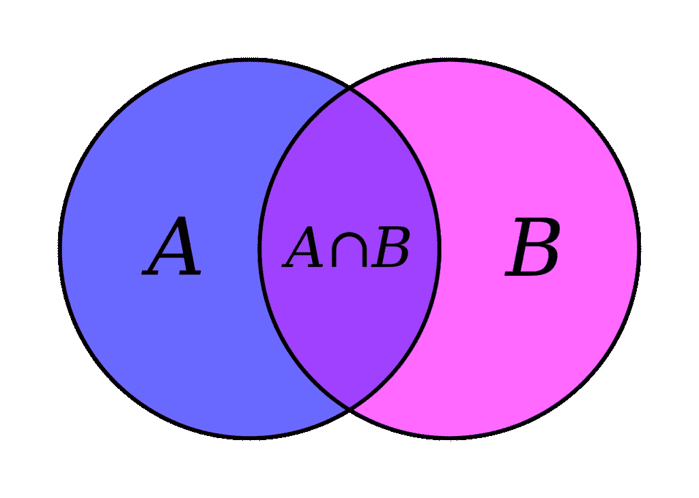

# Python Set:示例代码的原因和方法

> 原文:[https://python.land/python-data-types/python-set](https://python.land/python-data-types/python-set)

Python 集合是不同元素的集合。该集合与列表和元组有一些共同之处，但也有一些重要的区别:

*   一个 Python 集合只能包含**唯一值**
*   集合**未排序**

更正式的说法是:集合是*不同*对象的*无序*集合。在本文中，我们将仔细研究集合以及如何使用它们。我将更多地关注集合必须提供的额外功能，而不是列表和其他序列类型的基本功能。

目录


*   [如何创建一个 Python 集合](#How_to_create_a_Python_set "How to create a Python set")
*   [设置并列出](#Sets_and_lists "Sets and lists")
*   你为什么需要器械包？
*   [数学 Python 集合运算](#Mathematical_Python_set_operations "Mathematical Python set operations")
*   [命名集方法](#Named_set_methods "Named set methods")
*   [Python frozenset](#Python_frozenset "Python frozenset")
*   [所有 Python 集合操作](#All_Python_set_operations "All Python set operations")
*   [设定索引](#Set_indexing "Set indexing")
*   [结论](#Conclusion "Conclusion")


## 如何创建一个 Python 集合

根据具体情况，有几种方法可以创建 Python 集合。要从头开始创建一个集合并直接向其中添加一些元素，可以使用花括号:

```py
names = { "Eric", "Ali", "John" }
# Mixed types are allowed
mixed_set = { 'a', 1, (1, 2) }
```

集合使用与 [Python 字典](https://python.land/python-data-types/dictionaries)相同的花括号，但是它们很容易区分，因为集合总是包含一系列元素，用逗号分隔。相反，字典包含用冒号指定的键值对。

要创建空集，您可以使用`set()`功能:

```py
my_set = set()
my_set.add(1)
my_set.add('Erik')
```

如您所见，您可以使用 set 对象上的`add`方法向集合中添加元素。如果想一次添加多个元素，需要使用 update 方法并提供一个 [iterable](https://python.land/deep-dives/python-iterator) 对象，如 [list](https://python.land/python-data-types/python-list) 、 [range](https://python.land/deep-dives/python-range) 或 [tuple](https://python.land/python-data-types/python-tuple) :

```py
my_set = set()
my_set.update(range(3))
my_set.update(['a', 'b'])
print(my_set)
# {0, 1, 2, 'b', 'a'}
```

您也可以使用`set()`函数将任何可迭代对象转换成集合:

```py
print( set([1, 2, 3]) )
# {1, 2, 3}

print( set(range(3)) )
# {0, 1, 2}
```

最后，您可以使用集合理解来创建集合。集合理解和列表理解完全一样，所以如果你对这个概念不熟悉，我建议你读一下链接的文章。

为了便于演示，这里举一个例子。记住字符串也是序列对象，所以它们是可迭代的。因为我们可以过滤集合理解，所以让我们也过滤标点和空格字符:

```py
my_set = { x for x in 'Hi, my name is...' if x not in '., ' }
print(my_set)
# {'n', 'a', 'e', 'i', 's', 'y', 'H', 'm'}
```

有了这个例子，集合没有顺序就变得非常清楚了！

## 设置并列出

在我们继续之前，我想分享两个很多人搜索的常用技巧。

### 对列表进行重复数据删除

集合只包含唯一的元素，我们可以通过给`set()`函数一个列表来创建一个集合。这些都是对列表进行重复数据删除所需的要素。重复数据删除是删除重复项的过程，将列表转换为集合是 Python 中最简单的方法:

```py
my_list = [1, 1, 1, 2, 3, 4, 4, 4, 4, 2, 2, 2]
my_set = set(my_list)
print(my_set)
# {1, 2, 3, 4}
```

### 将集合转换为列表

要将集合转换为列表，只需用集合作为参数创建一个新列表:

```py
A = { 1, 2, 3 }
my_list = list(A)
print(my_list)
#  [1, 2, 3]
```

## 你为什么需要器械包？

人们使用器械包有很多原因。

*   最常见的方法是从序列中删除重复项(如前面演示的列表)
*   许多人用它们来执行成员测试(这是这个独特元素集中的一个元素)

但是有更多的理由使用集合。如果你不熟悉集合论，你可能想在维基百科上阅读一下。不过，我也会尽我所能解释一些基本的东西。简而言之:集合可用于执行数学集合运算，如:

*   找出两组之间的**差**
*   **联合**:组合集合，只保留唯一元素
*   **交集**:哪些元素在两个集合中都存在
*   寻找**子集**和**超集**

这些操作可以用文氏图可视化。文氏图显示了集合之间的逻辑关系。在你的生活中，你很有可能已经见过下面这些了:



两组的维恩图。来自维基百科的公共领域图片([来源](https://commons.wikimedia.org/wiki/File:Venn_A_intersect_B.svg)

在接下来的示例中，我将参考这张图片，我将使用名称 A 和 b。这里的所有示例都使用两组，但重要的是要知道，它们在两组以上的情况下也同样适用。

Thank you for reading my tutorials. I write these in my free time, and it requires a lot of time and effort. I use ads to keep writing these *free* articles, I hope you understand! **Support me by disabling your adblocker on my website** or, alternatively, **[buy me some coffee](https://www.buymeacoffee.com/pythonland)**. It's much appreciated and allows me to keep working on this site!

## 数学 Python 集合运算

本节将演示和解释所有的数学集合运算。别让数学部分吓到你，没那么难！

### 寻找 Python 集合之间的差异

让我们定义两个集合，A 和 B，并找出它们之间的区别。两套有什么区别？在查看维恩图时，我们希望找到只存在于 A 中的元素。换句话说，我们希望消除也存在于 b 中的任何重叠元素。或者，更具体地说:我们希望所有元素都在 A 中，但不在 A ∩ B 中。

我们可以通过使用减号(减法)运算符来实现:

```py
A = { 1, 2, 3, 4, 5 }
B = { 3, 4, 5, 6, 7 }

print(A-B)
#  {1, 2}

# And the reverse
print(B-A)
# {6, 7}
```

a 和 B 有一些重叠:数字 3、4 和 5 在两组中都有。查看文氏图时，这些数字属于标有 A ∩ B 的部分。如果我们只想要 A 中的唯一数字，我们用 A–B 从 A 中减去 B。当我们只想要 B 中的唯一数字时，我们从 B 中减去 A:B–A。

### 找出 Python 集合之间的对称差异

两个集合之间的对称差由集合 A 或集合 B 中的元素组成，但不是两者都有。换句话说:A 中的所有元素加上 B 中的元素，减去 A ∩ B 部分。为了找到对称差，我们可以使用^算子:

```py
A = { 1, 2, 3, 4, 5 }
B = { 3, 4, 5, 6, 7 }

print(A^B)
#  {1, 2, 6, 7}
```

### 求两个 Python 集合的交集

交集是维恩图中标有 A ∩ B 的部分。交集由两个集合中的元素组成。为了找到交集，我们可以使用&运算符:

```py
A = { 1, 2, 3, 4, 5 }
B = { 3, 4, 5, 6, 7 }

print(A & B)
# {3, 4, 5}
```

### 子集和超集

如果 A 是 B 的子集，这意味着 A 的所有元素也存在于 B 中。然而，子集 A 可以小于集合 B，这意味着 B 中的一些元素可能不存在于 A 中。因此，如果 A 几乎完全重叠，但有一个元素不存在于 B 中，则它不是 B 的子集。我们可以用小于运算符的*来检查 A 是否是 B 的子集:<。*

如果 B 是 A 的超集，这意味着 B 拥有 A 的所有元素，但也可能有额外的元素。我们可以通过*大于*运算符:>来检查 B 是否是 A 的超集。

让我们看一些例子:

```py
A = { 1, 2, 3 }
B = { 1, 2, 3, 4, 5 }
C = { 1, 2, 3, 10 }

# is A a subset of B
print(A < B)
# True

# is C a subset of B? 
print(C < B)
# False
# No, it has a 10 that's not in B

# Is B a superset of A?
print(B > A)
# True

# B is not a superset of C since C has a 10 in it
print(B > C)
# False

print(A < A)
# False
print(A <= A)
# True

print(A >= A)
# True
```

### 真子集和超集

Python 区分了*子集*(在数学中我们写⊂)，也称为真子集，和*子集或等于*(在数学中我们写⊆).

< and >操作符做前者，检查一个适当的子集。如果一个< B, it means A is a subset of B and it’s not itself (A != A). You can check this for yourself too with 【T0】 , which returns 【T1】 . If you want to check for *子集或等于*，则可以使用< =。超集也是如此:使用> =。

### 联盟

最后，我们可以将两个 Python 集合加在一起，只保留唯一的元素。这叫做集合的并集。在数学中，联合的符号是 A ∪ B，但是在 Python 中，我们必须使用管道操作符(`|`)来创建联合:

```py
A = { 1, 2, 3 }
B = { 3, 4, 5 }

print(A|B)
#  {1, 2, 3, 4, 5}
```

来自 A 和 B 的所有元素都出现在新创建的集合中，但是因为集合只包含唯一值，所以重叠元素 3 只出现一次。

## 命名集方法

几乎所有的 set 方法都有命名的等价方法，例如:

*   也可以通过调用 set 对象上的`issubset()`和`issuperset()`方法来使用<= and > =方法。
*   |操作符可以替换为对`union()`方法的调用
*   …等等

在本文末尾的表格中，我将列出所有操作及其等价名称。

使用操作符和使用命名方法的最大区别是**命名方法将任何可迭代对象作为参数**。所以你可以用 A.union(L)来计算集合 A 和列表 L 之间的并集。这为我们省去了从 Python 列表到 Python 集合的转换，因此效率更高。

## Python frozenset

除了常规的、可变的`set`，还有`frozenset`。您可以猜到这种数据类型与常规集合的不同之处:它在创建后就被直接冻结了，因此不能在其中添加或删除元素。然而，您可以混合使用`set`和`frozenset`类型:所有常规操作，如 union 和 intersection，也适用于`set`和`frozenset`的组合。

一个`frozenset`的优点是它是可散列的，这意味着你可以把它作为一个字典键，或者甚至作为另一个`set`中的一个元素。

## 所有 Python 集合操作

下表方便地列出了所有数学集合运算、所需的运算符、它们的命名方法等效项、示例代码及其作用:

| **名称** | **操作员示例** | **方法示例** | **它的作用** |
| --- | --- | --- | --- |
| 联盟 | A &#124; B | `A.union(B)` | 创建一个组合 A 和 B 的集合 |
| 交集 | 水果派 | `A.intersection(B)` | 用 A 和 B 之间的公共元素创建一个集合 |
| 差异 | `A - B` | `A.difference(B)` | 用不在 B 中的元素创建一个集合 |
| 对称差 | `A ^ B` | `A.symmetric_difference(B)` | 用 A 或 B 中的元素创建一个集合，但不能同时存在于两者中 |
| 是超集。 | `A >= B` | `A.issuperset(B)` | 如果 B 的每个元素都在 A 中，则返回`True` |
| 是子集吗？ | `A <= B` | `A.issubset(B)` | 如果 A 的每个元素都在 B 中，则返回`True` |
| 是不相交的？ | – | `A.isdisjoint(B)` | 如果 A 与 B 没有共同的元素，则返回`True` |
| *是真的*超集吗？ | A > B | 没有办法 | 如果 A >= B 且 A，则为 True！= B |
| *是真子集*吗？ | A < B | 没有办法 | 如果 A =< B 并且 A！= B |

Python 集合操作概述，包括示例和解释

请注意，您也可以在赋值样式中使用上述操作，例如:

*   A |= B 将更新集合 A，添加集合 B 中的元素
*   A |= B | C | …将更新集合 A，添加来自集合 B、C 等的元素。

以上也适用于交集(&)和差集(-)。

在下一个表格中，我列出了一些可以用来操作集合的额外操作:

| **名称** | **例子** | **什么是** |
| --- | --- | --- |
| 增加 | A.add(元素) | 将元素添加到集合 |
| 移动 | A.remove 元素 | 从集合中移除元素 |
| 抛弃 | A.discard 元素 | 如果元素存在，则将其从集合中删除(省去检查存在的麻烦) |
| 流行音乐 | a .波普() | 从集合中移除并返回任意元素(如果集合为空，则引发 KeyError) |
| 清楚的 | a .清除() | 从集合中移除所有元素 |

## 设定索引

如果你希望通过使用索引(比如用`my_set[1]`)来访问集合元素，那你就不走运了。集合没有顺序，因此不能被索引。如果你认为你需要集合索引，你可能想错了方向。看看其他解决方案，比如使用列表或将你的集合转换成列表。

## 结论

我们已经了解了 Python 集合，以及它们与列表和元组等其他序列类型的不同之处。除了序列的重复数据删除，集合还可用于执行集合计算。我们回顾了所有的集合计算，并查看了示例代码，以了解它们是如何工作的。使用方便的表格，您可以快速查看所有集合操作。

虽然我相信这篇文章触及了你需要知道的一切，但你可能也想看看关于 set 的官方文档。