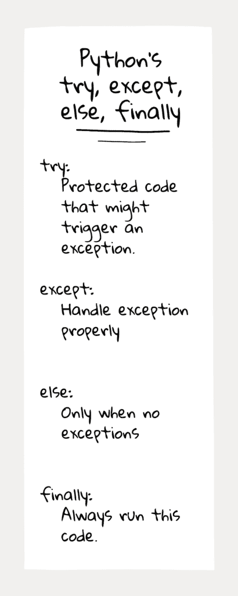

# Python Try Except:带示例代码的异常教程

> 原文:[https://python.land/deep-dives/python-try-except](https://python.land/deep-dives/python-try-except)

Python 异常处理是识别和响应程序中错误的过程。换句话说，这是一种处理程序中可能出现的错误的方法。在本文中，您将学习如何通过使用 Python 关键字`try`和`except`来处理 Python 中的错误。它还将教您如何创建自定义异常，这些异常可用于定义您自己的特定错误消息。

目录


*   什么是例外？
*   [Python 试除](#Python_try_except "Python try except")
*   [用 try except 捕获异常](#Catching_exceptions_with_try_except "Catching exceptions with try except")
*   [finally 和 else 块](#The_finally_and_else_blocks "The finally and else blocks")
*   [常见的 Python 异常](#Common_Python_exceptions "Common Python exceptions")
*   [例外最佳实践](#Exception_best_practices "Exception best practices")
*   [创建自定义异常](#Create_custom_exceptions "Create custom exceptions")
*   [引发(或抛出)异常](#Raising_or_throwing_exceptions "Raising (or throwing) exceptions")
*   [如何打印 Python 异常](#How_to_print_a_Python_exception "How to print a Python exception")
*   [继续学习](#Keep_learning "Keep learning")


## 什么是例外？

异常是在程序执行过程中出现的情况。这是意想不到的事情发生的信号。Python 通过某种类型的对象来表示异常。

在 Python 中，所有内置的、非系统退出的异常都是从`Exception`类派生的。异常有自己的描述性名称。例如，如果你试图将一个数除以零，你会得到一个`ZeroDivisionError`异常，它也是`Exception`类的子类。

对于所有异常的完整层次结构，如果您感兴趣，可以查看 [Python 手册](https://docs.python.org/3/library/exceptions.html#exception-hierarchy)。下面是这个层次结构的一小段摘录，只是为了说明:

```py
BaseException
 +-- SystemExit
 +-- KeyboardInterrupt
 +-- Exception
      +-- ArithmeticError
      |    +-- FloatingPointError
      |    +-- OverflowError
      |    +-- ZeroDivisionError
      .....
```

如果您对对象、类和继承的知识有点生疏，您可能想先阅读我关于[对象和类](https://python.land/objects-and-classes)的文章以及我关于[继承](https://python.land/objects-and-classes/python-inheritance)的文章。

## Python 试除

当一些意想不到的事情发生时，我们可以在错误点*引发*一个异常。当出现异常时，Python 会停止当前的执行流程，并开始寻找能够处理它的异常处理程序。那么什么是异常处理程序呢？这就是 try 和 except 语句发挥作用的地方。



尝试..除...之外..其他..最后

如图所示，我们可以从 try 语句开始创建一个代码块。这基本上意味着:*尝试运行这段代码，但是可能会发生异常*。

在我们的 try 块之后，必须跟随一个或多个 except 块。这就是奇迹发生的地方。这些 except 块可以*捕获*一个异常，正如我们通常所说的。事实上，许多其他编程语言都使用一个名为`catch`的语句，而不是`except`。每个`except`块可以处理特定类型的异常。

记住:类是分等级的。因此，例外也是如此。因此，except 块必须从最具体的(如`ZeroDivisionError`)到不太具体的(如`ArithmeticError`)。

为了演示这一点，想象一下当我们从捕获`Exception`的 except 块开始时会发生什么。第一个块将捕获基本上所有的东西，因为大多数异常都是从这个块继承的，使得除了块之外的其他块变得无用。

现在，让我们首先回到引发异常的问题。当出现异常时，能够处理异常的异常处理程序可以在附近，但也可以在不同的模块中。重要的是要认识到，Python 不会为了一个异常处理程序而随机扫描你的代码。相反，处理程序应该在*调用栈*的某个地方。

请暂时忘记`else`和`finally`。我将在本文后面详细解释它们。我们首先需要讨论调用堆栈，以真正理解异常是如何到达异常处理程序的。

### 调用栈

调用栈是当前正在执行的[函数](https://python.land/introduction-to-python/functions)的有序列表。例如，您可能会调用函数 A，函数 A 调用函数 B，函数 B 调用函数 C。我们现在有一个由 A、B 和 C 组成的调用堆栈。当 C 引发异常时，Python 将在这个调用堆栈中查找异常处理程序，从结束到开始进行回溯。它可以在函数 C 中(离异常最近)，在函数 B 中(稍微远一点)，在函数 A 中，甚至在我们调用函数 A 的程序的顶层。

如果 Python 找到了合适的 except 块，它就执行该块中的代码。如果没有找到，Python 会自己处理异常。这意味着它将打印异常并退出程序，因为它不知道如何处理它。

希望你还在我身边！如果没有，不用担心。本页的例子有望让这一切变得更加清晰。当你读完整篇文章后，你可能想重温这一节。

## 用 try except 捕获异常

让我们最后写一些实际的代码！为了处理一个异常，我们需要捕捉它。正如我们刚刚了解到的，我们可以通过使用`try`和`except`关键字来捕捉异常。当我们在`try`块中出现异常时，就会执行`except`块中的代码。

### 简单的例子

我们先来试一个简单的例子。你应该知道，我们不能被零整除。如果我们这样做，Python 将抛出一个名为`ZeroDivisionError`的异常，它是`ArithmeticError`的子类:

```py
try:
    print(2/0)
except ZeroDivisionError:
    print("You can't divide by zero!")
```

如果您在 try 块中调用了一个 [Python 函数](https://python.land/introduction-to-python/functions)，并且该函数中发生了异常，那么代码执行流程将在异常点处停止，并执行 except 块中的代码。试着再做一次，不要尝试和排除。您将看到 Python 为我们打印了异常。您可以在下面的代码片段中做到这一点:

[https://crumb.sh/embed/35QQzjrrKKY](https://crumb.sh/embed/35QQzjrrKKY)

另外，请注意，如果您没有自己处理异常，Python 会将错误输出到 stderr。在上面的片段中，这是可见的，因为输出出现在“错误”选项卡中，而不是“输出”选项卡中。

### 捕捉 IOError

让我们试试另一个更常见的例子。毕竟，谁会把一个数除以零呢，对吧？

与外界交互时可能会出现异常，例如处理文件或网络时。例如，如果你试图用 Python 的[打开一个文件，但是那个文件不存在，你会得到一个`IOError`异常。如果由于权限问题，您没有访问文件的权限，您将再次得到一个`IOError`异常。让我们看看如何处理这些异常。](https://python.land/operating-system/python-files)

### 分配

请执行以下操作:

1.  运行下面的代码，注意文件名(它不存在)。看看会发生什么。
2.  将文件名改为 myfile.txt 文件，然后再次运行代码。现在发生了什么？

[https://crumb.sh/embed/v8wppGhGAmi](https://crumb.sh/embed/v8wppGhGAmi)

Python try-except 赋值

或者，下面是要复制/粘贴的代码:

```py
try:
    # Open file in read-only mode
    with open("not_here.txt", 'r') as f:
        f.write("Hello World!")
except IOError as e:
    print("An error occurred:", e)
```

### 答案

在第一种情况下没有找到文件。您应该得到以下输出:

```py
An error occurred: [Errno 2] No such file or directory: 'not_here.txt'
```

在第二种情况下，创建文件后您仍然会得到一个错误。这一次是因为我们试图写入一个以只读模式打开的文件。有关这些模式的更多信息，请阅读关于使用 Python 打开、读取和写入文件的文章[。错误应该是这样的:](https://python.land/operating-system/python-files)

```py
An error occurred: not writable
```

虽然这是一个错误，但它不会写入操作系统的 stderr 输出。那是因为我们自己处理了异常。如果您取消了尝试..除非完全从代码中删除，然后尝试以只读模式写入文件，否则 Python 将捕获错误，强制程序终止，并显示以下消息:

```py
Traceback (most recent call last):
  File "tryexcept.py", line 3, in <module>
    f.write("Hello World!")
io.UnsupportedOperation: not writable
```

## finally 和 else 块

还记得我让你暂时忘记的另外两个街区吗？现在让我们看看这些，从`finally`块开始。

### try-except 中的 finally 块

无论是否发生异常，都会执行`finally`块。`Finally`块是有用的，例如，当你想不管发生什么都关闭一个文件或一个网络连接时。毕竟，您希望清理资源以防止内存泄漏。

Thank you for reading my tutorials. I write these in my free time, and it requires a lot of time and effort. I use ads to keep writing these *free* articles, I hope you understand! **Support me by disabling your adblocker on my website** or, alternatively, **[buy me some coffee](https://www.buymeacoffee.com/pythonland)**. It's much appreciated and allows me to keep working on this site!

这里有一个工作中的例子，我们打开一个文件而不使用 with `statement`，迫使我们自己关闭它:

```py
try:
    # Open file in write-mode
    f = open("myfile.txt", 'w')
    f.write("Hello World!")
except IOError as e:
    print("An error occurred:", e)
finally:
    print("Closing the file now")
    f.close()
```

你也可以试试这个互动的例子:

[https://crumb.sh/embed/9THbhdcbmWp](https://crumb.sh/embed/9THbhdcbmWp)

您应该会看到屏幕上显示“正在关闭文件”的消息。现在将书写模式从“w”改为“r”。你会得到一个错误，因为文件不存在。尽管有这个异常，但由于 finally 块，我们还是尝试关闭文件。这反过来也会出错:抛出一个`NameError`异常，因为文件从未打开过，因此`f`不存在。你可以用嵌套的`try.. except NameError`来解决这个问题。你自己试试。

### try-except 中的 else 块

除了`except`和`finally`块，您还可以添加一个 else 块。else 块仅在没有异常发生时执行。所以它不同于 finally 块，因为即使发生异常，finally 也会执行。

什么时候应该使用`else`块？为什么不在`try`块中添加额外的代码呢？好问题！

根据 Python 手册，使用 else 子句比在 try 子句中添加额外的代码要好。但是为什么呢？原因是它避免了意外地捕获一个不是由受 try 和 except 语句保护的代码首先引发的异常。我承认我自己不经常使用 else 块。此外，我发现它们有些令人困惑，尤其是对来自其他语言的人来说。

## 常见的 Python 异常

有些例外如此常见，以至于你不可避免地会遇到它们。以下是一些最常见的:

| **异常名称** | **当你遇到它的时候** | **引发异常的示例情况** |
| 句法误差 | 当 Python 语法中有错误时引发。如果没有被捕获，这个异常将导致 Python 解释器退出。 | `pritn('test')` |
| KeyError | 在字典中找不到键时引发。 | `d = { 'a': 1}
d['b']` |
| 索引错误 | 当索引超出范围时引发。 | `lst = [1, 2, 3]
lst[10]` |
| 键盘中断 | 当用户点击中断键(Ctrl+C)时引发 | 按下 control+c |

在你职业生涯的某个阶段，你会遇到一些常见的例外

如果你愿意，你可以试着有意唤起这些例外。我向你保证，在你的 Python 编程生涯中，这些你会遇到无数次。知道并理解它们的含义以及它们何时出现将极大地帮助您调试代码。

## 例外最佳实践

现在我们已经知道了处理异常的机制，我想与您分享一些最佳实践。

### 除了方块，不要使用空白

我以前在博客文章“[如何在 Python](https://python.land/how-not-to-handle-exceptions) 中不处理异常”中写过这个问题。当你想捕捉大范围的异常时，不要使用空白块。我的意思是这样的:

```py
try:
    ...
except:
    print("An error occurred:")
```

您可能会在网上的代码示例中遇到这种情况。如果你这样做了，那就养成改进异常处理的习惯。为什么应该这样做，以及如何像上面的例子那样改进代码？

包括系统异常在内的所有异常都继承自一个名为`BaseException`的类。如果一个`except`子句提到了一个特定的类，那么该子句也会处理从该类派生的任何异常类。一个空的`except`等价于`except BaseException`，因此它将捕捉*所有可能的*异常。

所以虽然语法允许，但我不推荐。例如，你还会捕捉到`KeyboardInterrupt`和`SystemExit`异常，它们会阻止你的程序退出。相反，使用一个 try 块，其中包含您知道可以处理的显式异常列表。或者，如果你真的需要，捕捉`Exception`基类来处理几乎所有的常规异常，而不是系统异常。

如果你想冒险，你可以试着捕捉所有的异常，看看会发生什么:

```py
from time import sleep

while True:
    try:
        print("Try and stop me")
        sleep(1)
    except:
        print("Don't stop me now, I'm having such a good time!")
```

你可能需要关闭你的终端来停止这个程序。现在改变 except 块来捕捉`Exception`。您仍然可以捕获几乎所有的异常，但是程序会在出现系统异常时退出，比如`KeyboardInterrupt`和`SystemExit`:

```py
from time import sleep

while True:
    try:
        print("Try and stop me")
        sleep(1)
    except Exception:
        print("Something went wrong")
```

### 最好请求原谅

在 Python 中，你会经常看到这样一种模式，人们只是简单地尝试一些事情是否可行，如果不可行，就捕捉异常。换句话说，请求原谅比请求允许更好。这与其他语言不同，在其他语言中，你更倾向于请求许可。例如，在 Java 中，异常会减慢你的程序，你通过检查对象而不是简单地尝试来“请求许可”。

更具体地说:在 Python 中，我们通常只是试图访问字典中的键。如果键不存在，我们将得到一个异常并处理它。假设我们刚刚将一些外部提供的 JSON 转换成了一个字典，现在开始使用它:

```py
import json

user_json = '{"name": "John", "age": 39}'
user = json.loads(user_json)

try:
    print(user['name'])
    print(user['age'])
    print(user['address'])
    ...
except KeyError as e:
    print("There are missing fields in the user object: ", e)
    # Properly handle the error
    ...
```

这将打印错误:

```py
There are missing fields in the user object: 'address'
```

我们本来可以添加三个检查(`if 'name' in user`、`if 'age' in user`等)。)以确保所有字段都在那里。但这不是一个好的做法。它可能会引入大量代码来检查键是否存在。相反，我们在 except 块中请求原谅一次，这样更干净，可读性更好。如果您担心性能:在 Python 中，异常不会占用太多 CPU 周期。大量的比较实际上比捕捉一个异常要慢(如果它发生的话！).

## 创建自定义异常

正如我们之前所学的，所有内置的、非系统退出的异常都是从`Exception`类派生的。所有用户定义的异常也应该从此类派生。所以如果我们想创建自己的异常，我们需要创建一个`Exception`类的子类。

例如，如果您想要创建一个异常来指示没有找到用户，那么您可以创建一个`UserNotFoundError`异常。最基本的形式是这样的:

```py
class UserNotFoundError(Exception):
    pass
```

它继承了`Exception`的所有属性和方法，但是我们给了它一个新的名字以区别于`Exception`类。这样，我们就能够用一个 except 块明确地捕捉它。

这个异常的名字清楚地告诉了我们遇到的问题的类型，所以作为一个额外的好处，它也可以作为一种代码文档。就像命名良好的变量和函数一样，在回读代码时，命名良好的异常会带来很大的不同。

我们将在下面的例子中使用这个类。

## 引发(或抛出)异常

我们知道一些内置异常以及如何创建自定义异常。我们还知道如何用 try 和 except 捕捉异常。剩下的就是所谓的引发或抛出异常。您可以使用 raise 关键字自己引发异常。

在下面的例子中，我们使用您之前定义的`UserNotFoundError`。我们调用函数`fetch_user`，它从一个虚拟的数据库中获取一些用户数据。如果找不到用户，该数据库将返回 None。我们决定不返回 None，这将迫使调用者每次都检查 None。相反，我们使用我们的习惯`UserNotFoundError`。

```py
class UserNotFoundError(Exception):
    pass

def fetch_user(user_id):
    # Here you would fetch from some kind of db, e.g.:
    # user = db.get_user(user_id)

    # To make this example runnable, let's set it to None
    user = None

    if user == None:
        raise UserNotFoundError(f'User {user_id} not in database')
    else:
        return user

users = [123, 456, 789]
for user_id in users:
    try:
        fetch_user(user_id)
    except UserNotFoundError as e:
        print("There was an error: ", e)
```

#### 分配

这有个小任务。我们可以使用一个常规的异常对象来代替。这样，我们不需要定义一个自定义的。为什么这是个坏主意？

#### 回答

事实上，你可以引发一个常规的异常，比如用`raise Exception('User not found')`。但是如果你这样做了，你需要捕捉所有类型异常。正如我们所知，有很多这样的例子。您可能会无意中捕捉到一些您无法处理的其他异常。例如，数据库客户端可能抛出一个`DatabaseAuthenticationError`，它也是`Exception`的子类。

## 如何打印 Python 异常

只要捕捉得当，就可以直接打印异常。你可能已经看过上面的例子了。为了清楚起见，下面是一个如何捕捉和打印异常的示例:

```py
try:
    ...
except Exception as e:
    print("There was an error: ", e)
```

如果您想打印调用堆栈，就像 Python 在自己没有捕捉到异常时所做的那样，您可以[导入](https://python.land/project-structure/python-modules)回溯模块:

```py
import traceback

try:
    ...
except Exception:
    traceback.print_exc()

```

## 继续学习

这里有更多的资源可以加深你的知识:

*   我的博客文章'[如何在 Python 中不处理异常](https://python.land/how-not-to-handle-exceptions)
*   [Python 函数介绍](https://python.land/introduction-to-python/functions)
*   [对象和类](https://python.land/objects-and-classes)，以及 [Python 继承](https://python.land/objects-and-classes/python-inheritance)
*   关于例外情况的[官方文件](https://docs.python.org/3/library/exceptions.html)。
*   关于错误的官方文件。