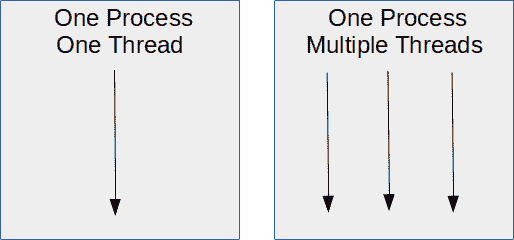
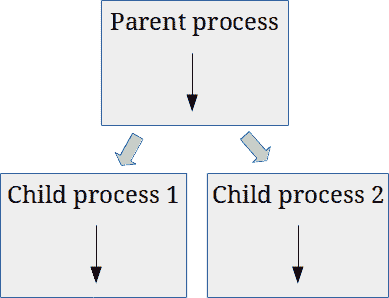

# Python 子流程:运行外部命令

> 原文:[https://python.land/operating-system/python-subprocess](https://python.land/operating-system/python-subprocess)

尽管 PyPI 上有许多库，但有时您需要从 Python 代码中运行一个外部命令。内置的 Python 子流程[模块](https://python.land/project-structure/python-modules)使这变得相对容易。在本文中，您将学习一些关于流程和子流程的基础知识。

我们将使用 Python 子流程模块安全地执行外部命令，捕获输出，并有选择地向它们提供来自标准 in 的输入。如果你熟悉流程和子流程的理论，你可以安全地跳过第一部分。

目录


*   [流程和子流程](#Processes_and_sub-processes "Processes and sub-processes")
*   [用 subprocess.run 创建一个 Python 子流程](#Create_a_Python_subprocess_with_subprocessrun "Create a Python subprocess with subprocess.run")
*   [捕获 Python 子流程的输出](#Capture_output_of_a_Python_subprocess "Capture output of a Python subprocess")
*   [标准输入的进给数据](#Feeding_data_from_standard_input "Feeding data from standard input")
*   [运行 shell 命令](#Running_shell_commands "Running shell commands")
*   [注意事项](#Caveats_to_look_out_for "Caveats to look out for")
*   [用户输入总是危险的](#User_input_is_always_dangerous "User input is always dangerous")
*   [继续学习](#Keep_learning "Keep learning")


## 流程和子流程

在计算机上执行的程序也称为进程。但是到底什么是过程呢？让我们更正式地定义它:

**Process**

A process is the instance of a computer program that is being executed by one or more [threads](https://python.land/python-concurrency/python-threads).

一个进程可以有多个 [Python 线程](https://python.land/python-concurrency/python-threads)，这叫做多线程。反过来，一台计算机可以同时运行多个进程。这些进程可以是不同的程序，但也可以是同一程序的多个实例。我们关于 Python 并发性的文章详细解释了这一点。以下图片也来自那篇文章:



一台计算机可以同时运行多个进程，一个进程可以有多个线程

如果您想要运行外部命令，这意味着您需要从您的 Python 进程创建一个新的进程。这种流程通常称为子流程或子流程。从视觉上看，这是一个流程产生两个子流程时发生的情况:



产生两个子流程的父流程

内部发生的事情(在操作系统内核内部)被称为分叉。流程会自行分叉，这意味着会创建并启动一个新的流程副本。如果您希望并行化代码并利用机器上的多个 CPU，这可能会很有用。这就是我们所说的[多重处理](https://python.land/python-concurrency/python-multiprocessing)。

不过，我们可以利用同样的技术来开始另一个过程。首先，该流程自行分叉，创建一个副本。反过来，这个副本会用另一个进程替换自己:您希望执行的进程。

### subprocess.run 函数

我们可以采用底层方式，使用 Python 子流程模块自己完成大部分工作，但幸运的是，Python 还提供了一个包装器，可以处理所有的细节，而且也很安全。多亏了包装器，运行一个外部命令可以归结为调用一个[函数](https://python.land/introduction-to-python/functions)。这个包装器是来自`subprocess`包的函数`run()`，这就是我们将在本文中使用的。

我认为让您知道内部发生了什么是很好的，但是如果您感到困惑，请放心，您不需要这些知识来做您想做的事情:使用 Python 子流程模块运行外部命令。

## 用 subprocess.run 创建一个 Python 子流程

理论已经讲得够多了，是时候动手编写一些代码来执行外部命令了。

首先，你需要[导入](https://python.land/project-structure/python-modules)子流程库。由于它是 Python 3 的一部分，所以不需要单独安装。从这个库中，我们将使用 run 命令。该命令是在 Python 3.5 中添加的。确保您至少拥有那个 Python 版本，但最好是运行最新版本。如果你需要帮助，请查看我们详细的 [Python 安装说明](https://python.land/installing-python)。

让我们从一个简单的 ls 调用开始，列出当前的目录和文件:

```py
>>> import subprocess
>>> subprocess.run(['ls', '-al'])

(a list of your directories will be printed)
```

事实上，我们可以从 Python 代码中调用 Python，即二进制代码。接下来，让我们请求系统上默认 python3 安装的版本:

```py
>>> import subprocess
>>> result = subprocess.run(['python3', '--version'])
Python 3.8.5
>>> result
CompletedProcess(args=['python3', '--version'], returncode=0)
```

逐行解释:

1.  我们导入子流程库
2.  用一个参数运行一个子进程，在本例中是 python3 二进制文件:`--version`
3.  检查结果[变量](https://python.land/introduction-to-python/variables)，其类型为`[CompletedProcess](https://docs.python.org/3/library/subprocess.html#subprocess.CompletedProcess)`

该进程返回代码 0，表示它已成功执行。任何其他返回代码都意味着存在某种错误。这取决于您调用的进程，不同的返回代码意味着什么。

正如您在输出中看到的，Python 二进制文件在标准输出(通常是您的终端)上打印了它的版本号。您的结果可能会有所不同，因为您的 Python 版本可能会有所不同。也许，您甚至会得到类似这样的错误:`FileNotFoundError: [Errno 2] No such file or directory: 'python3'`。在这种情况下，确保 Python 二进制文件在您的系统上也叫做 python3，并且它在 PATH 中。

## 捕获 Python 子流程的输出

如果您运行一个外部命令，您可能希望捕获该命令的输出。我们可以通过 capture_output=True 选项实现这一点:

```py
>>> import subprocess
>>> result = subprocess.run(['python3', '--version'], capture_output=True, encoding='UTF-8')
>>> result
CompletedProcess(args=['python3', '--version'], returncode=0, stdout='Python 3.8.5\n', stderr='')
```

如你所见，Python 这次没有把它的版本打印到我们的终端上。subprocess.run 命令重定向了标准输出和标准错误流，因此它可以捕获它们并为我们存储结果。在检查结果[变量](https://python.land/introduction-to-python/variables)之后，我们看到 Python 版本是从标准输出中捕获的。因为没有错误，所以 stderr 为空。

我还添加了选项编码='UTF-8 '。如果没有，`subprocess.run`假设输出是一个字节流，因为它没有这个信息。如果你想的话，试试看。因此，`stdout` 和`stderr` 将是字节数组。因此，如果您知道输出将是 ASCII 文本或 UTF-8 文本，您最好指定它，以便 run 函数也相应地编码捕获的输出。

Thank you for reading my tutorials. I write these in my free time, and it requires a lot of time and effort. I use ads to keep writing these *free* articles, I hope you understand! **Support me by disabling your adblocker on my website** or, alternatively, **[buy me some coffee](https://www.buymeacoffee.com/pythonland)**. It's much appreciated and allows me to keep working on this site!

或者，您也可以使用 text=True 选项，而不指定编码。Python 将输出捕捉为文本。如果您知道编码，我建议您明确指定编码。

## 标准输入的进给数据

如果外部命令需要标准输入上的数据，我们也可以使用 Python 的`subprocess.run`函数的`input`选项轻松实现。请注意，我不会在这里讨论流数据。我们将建立在前面的例子上:

```py
>>> import subprocess
>>> code = """
... for i in range(1, 3):
...   print(f"Hello world {i}")
... """

>>> result = subprocess.run(['python3'], input=code, capture_output=True, encoding='UTF-8')
>>> print(result.stdout)
>>> print(result.stdout)
Hello world 1
Hello world 2
```

我们刚刚使用 Python 执行了一些带有 python3 二进制代码的 Python 代码。完全没用，但是(希望)很有教育意义！

代码变量是一个[多行 Python 字符串](https://python.land/introduction-to-python/strings#Multiline_strings)，我们使用`input`选项将其作为输入分配给`subprocess.run`命令。

## 运行 shell 命令

如果您希望在类似 Unix 的系统上执行 shell 命令，我指的是您通常在类似 Bash 的 shell 中输入的任何命令，您需要认识到这些命令通常不是执行的外部二进制文件。例如，像`for`和`while`循环这样的表达式，或者管道和其他操作符，都是由 shell 自己解释的。

Python 通常有内置库形式的替代方案，这是您应该更喜欢的。但是如果您需要执行一个 shell 命令，不管出于什么原因，当您使用`shell=True`选项时，`subprocess.run`会很乐意这样做。它允许您输入命令，就像在 Bash 兼容的 shell 中输入命令一样:

```py
>>> import subprocess
>>> result = subprocess.run(['ls -al | head -n 1'], shell=True)
total 396
>>> result
CompletedProcess(args=['ls -al | head -n 1'], returncode=0)
```

但是有一个警告:使用这种方法容易受到命令注入攻击(参见:[警告](#caveats))。

## 注意事项

运行外部命令并非没有风险。请仔细阅读这一部分。

### os.system 与子进程. run

您可能会看到使用`os.system()`来执行命令的代码示例。然而，`subprocess`模块更强大，官方 Python 文档推荐使用它而不是`os.system()`。`os.system`的另一个问题是它更倾向于命令注入。

### 命令注入

一种常见的攻击或利用是注入额外的命令来获得对计算机系统的控制。例如，如果您要求用户输入，并在调用`os.system()`或`subprocess.run(...., shell=True)`时使用该输入，那么您就面临着命令注入攻击的风险。

为了演示，下面的代码允许我们运行任何 shell 命令:

```py
import subprocess
thedir = input()
result = subprocess.run([f'ls -al {thedir}'], shell=True)

```

因为我们直接使用用户输入，所以用户可以简单地通过添加分号来运行任何命令。例如，以下输入将列出/目录并回显文本。自己尝试一下:

`/; echo "command injection worked!";`

解决方案是*而不是*尝试清理用户输入。你可能会开始寻找分号，并拒绝输入你找到一个。不要；在这种情况下，黑客至少可以想出 5 种附加命令的方法。这是一场艰苦的战斗。

更好的解决方案是不使用`shell=True`，像我们在前面的例子中所做的那样，在一个列表中输入命令。这样的输入在这种情况下会失败，因为子进程模块将确保输入是您正在执行的程序的参数，而不是新命令。

使用相同的输入，但使用`shell=False`，您将得到以下结果:

```py
import subprocess
thedir = input()
>>> result = subprocess.run([f'ls -al {thedir}'], shell=False)
Traceback (most recent call last):
  File "<stdin>", line 1, in <module>
  File "/usr/lib/python3.8/subprocess.py", line 489, in run
    with Popen(*popenargs, **kwargs) as process:
  File "/usr/lib/python3.8/subprocess.py", line 854, in __init__
    self._execute_child(args, executable, preexec_fn, close_fds,
  File "/usr/lib/python3.8/subprocess.py", line 1702, in _execute_child
    raise child_exception_type(errno_num, err_msg, err_filename)
FileNotFoundError: [Errno 2] No such file or directory: 'ls -al /; echo "command injection worked!";'

```

该命令被视为`ls`的一个参数，这反过来告诉我们它找不到那个文件或目录。

## 用户输入总是危险的

事实上，使用用户输入总是危险的，不仅仅是因为命令注入。例如，假设您允许用户输入文件名。之后，我们读取文件并显示给用户。虽然这看起来无害，但是用户可以输入如下内容:`../../../../configuration/settings.yaml`

其中`settings.yaml`可能包含您的数据库密码…哎呀！您总是需要适当地清理和检查用户输入。如何正确地做到这一点，超出了本文的范围。

## 继续学习

以下相关资源将帮助您更深入地了解这一主题:

*   官方文档包含了关于子进程库的所有细节
*   我们关于 [Python 并发](https://python.land/python-concurrency)的文章解释了更多关于进程和线程的内容
*   我们关于使用 Unix shell 的章节可能会派上用场
*   学习一些基本的 Unix 命令