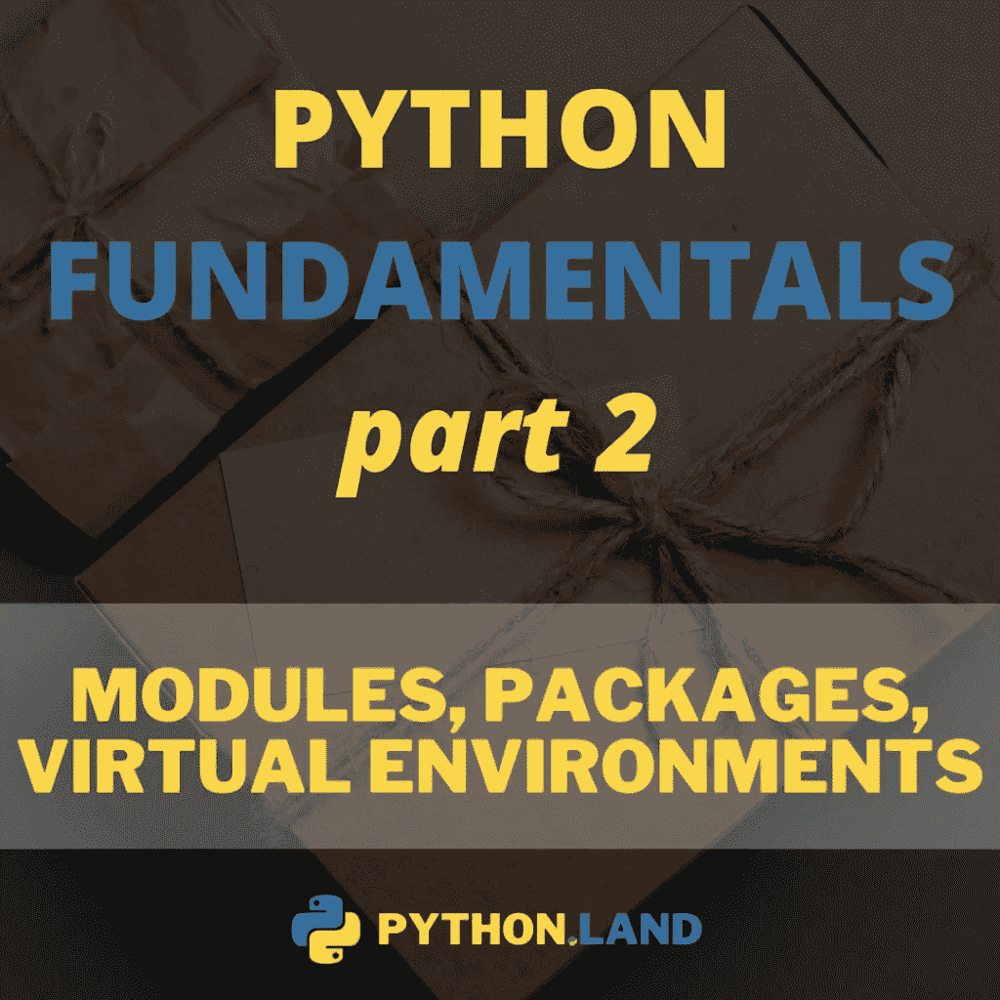
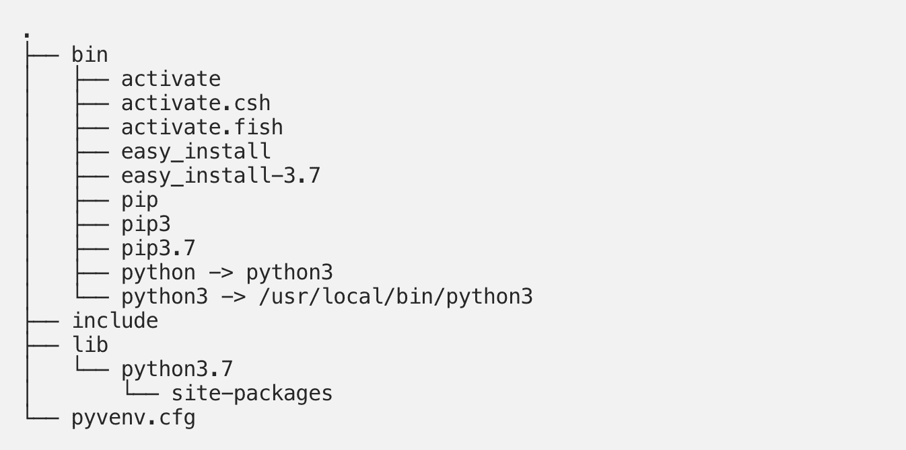

# Python venv:如何创建、激活、停用和删除

> 原文:[https://python.land/virtual-environments/virtualenv](https://python.land/virtual-environments/virtualenv)

Python 虚拟环境允许您在与系统其余部分隔离的位置安装 Python 包，而不是在系统范围内安装它们。我们来看看如何使用 Python venv，Python 虚拟环境的简称，也缩写为 *virtualenv* 。

在本文中，您将了解到:

*   使用虚拟环境的优势
*   如何创建 venv
*   如何激活和停用它
*   删除或移除 venv 的不同方法
*   venv 如何在内部工作

如果你想彻底了解虚拟环境并获得一些实际操作，请看看我的 [Python 基础 II 课程](https://python.land/product/python-fundamentals-2)。它深入探讨了模块、包、虚拟环境和包管理器。

目录


*   [为什么您需要虚拟环境](#Why_you_need_virtual_environments "Why you need virtual environments")
*   [虚拟环境与其他选择](#Virtual_environments_vs_other_options "Virtual environments vs. other options")
*   [如何创建 Python venv](#How_to_create_a_Python_venv "How to create a Python venv")
*   [Python venv 激活](#Python_venv_activation "Python venv activation")
*   [Python venv 如何工作](#How_a_Python_venv_works "How a Python venv works")
*   [关闭 Python venv](#Deactivate_the_Python_venv "Deactivate the Python venv")
*   [删除一个 Python venv](#Deleting_a_Python_venv "Deleting a Python venv")
*   [结论](#Conclusion "Conclusion")
*   [继续学习](#Keep_learning "Keep learning")


## 为什么您需要虚拟环境

虚拟环境是一个好主意的原因有很多，这也是我在我们继续开始安装第三方软件包之前向您介绍虚拟环境的原因。让我们一个一个地检查它们。

### 防止版本冲突

你可以说如果你在系统范围内安装第三方软件包，你会非常高效。毕竟，您只需要安装一次，就可以从多个 Python 项目中使用这个包，从而节省您宝贵的时间和磁盘空间。然而，这种方法有一个问题，可能会在几周或几个月后显现出来。

假设您的项目`Project A`是针对`library X`的特定版本编写的。将来，您可能需要升级库 X。比方说，您需要您启动的另一个项目(称为项目 B)的最新版本。您将库 X 升级到最新版本，项目 B 开始正常工作。太好了！但是一旦你这么做了，你的`Project A`代码就会崩溃。毕竟，在主要版本升级时，API 可能会发生重大变化。

虚拟环境通过将您的项目与其他项目和系统范围的包隔离开来解决了这个问题。您在这个虚拟环境中安装软件包，专门用于您正在处理的项目。

### 易于复制和安装

虚拟环境使得定义和安装特定于您的项目的包变得容易。使用一个 *requirements.txt* 文件，您可以为所需的包定义精确的版本号，以确保您的项目将始终使用一个经过代码测试的版本。这也有助于你的软件的其他用户，因为虚拟环境可以帮助其他人重现你的软件构建时的真实环境。

### 在任何地方都有效，即使不是 root

如果你在一个共享的主机上工作，比如大学或虚拟主机提供商，你将不能安装系统范围的软件包，因为你没有管理员权限这样做。在这些地方，虚拟环境允许您在项目中本地安装任何您想要的东西。

## 虚拟环境与其他选择

还有其他选项来隔离您的项目:

1.  在最极端的情况下，你可以买第二台电脑，在那里运行你的代码。问题已解决！虽然有点贵！
2.  虚拟机是一个便宜得多的选择，但仍然需要安装完整的操作系统——对于大多数用例来说，这也是一种浪费。
3.  接下来是集装箱化，比如 Docker 和 Kubernetes。这些可以是非常强大的，是一个很好的选择。

尽管如此，在很多情况下，我们只是创建小项目或一次性脚本。或者，您可能只是不想将您的应用程序容器化。毕竟，这是你需要学习和理解的另一件事。无论原因是什么，虚拟环境都是隔离项目依赖性的好方法。

## 如何创建 Python venv

有几种方法可以创建 Python 虚拟环境，具体取决于您运行的 Python 版本。

在你继续阅读之前，我想给你介绍另外两个工具， [Python 诗歌](https://python.land/virtual-environments/python-poetry)和 [Pipenv](https://python.land/virtual-environments/pipenv) 。这两个工具结合了您将要学习的工具的功能:virtualenv 和 pip。除此之外，它们还增加了几个额外的功能，最显著的是它们能够进行适当的依赖性解析。

为了更好地理解虚拟环境，我建议您先从本文开始学习基础知识。我只想确保您知道有更好的方法来管理您的包、依赖项和虚拟环境。

### Python 3.4 及以上版本

如果您运行的是 Python 3.4+版本，则可以使用 Python 中内置的 venv 模块:

```py
$ python -m venv [directory]
```

这个命令在指定的目录中创建一个 venv，并将 pip 复制到其中。如果你不确定该如何称呼这个目录:`venv`是一个常见的选项；它不会让任何人猜测它是什么。

在本文的后面，我们将仔细查看刚刚创建的目录。但是我们先来看看如何激活这个虚拟环境。

### 所有其他 Python 版本

适用于任何 Python 版本的替代方法是使用 virtualenv 包。您可能需要先用 [pip install](https://python.land/virtual-environments/installing-packages-with-pip) 安装它:

```py
$ pip install virtualenv
```

安装后，您可以创建一个虚拟环境，包括:

```py
$ virtualenv [directory]
```

## Python venv 激活

如何激活虚拟环境取决于您使用的操作系统。

Thank you for reading my tutorials. I write these in my free time, and it requires a lot of time and effort. I use ads to keep writing these *free* articles, I hope you understand! **Support me by disabling your adblocker on my website** or, alternatively, **[buy me some coffee](https://www.buymeacoffee.com/pythonland)**. It's much appreciated and allows me to keep working on this site!

### Windows venv 激活

要在 Windows 上激活 venv，您需要运行由 venv 安装的脚本。如果您在名为`myenv`的目录中创建了 venv，那么命令应该是:

```py
# In cmd.exe
venv\Scripts\activate.bat
# In PowerShell
venv\Scripts\Activate.ps1
```

### Linux 和 MacOS venv 激活

在 Linux 和 MacOS 上，我们用 source 命令激活我们的虚拟环境。如果您在`myvenv`目录中创建了 venv，那么命令应该是:

```py
$ source myvenv/bin/activate
```

就是这样！我们准备好摇滚了！你现在可以用 pip 安装包了，但是我建议你先继续阅读以更好地理解 venv。

**[模块、包和虚拟环境](https://python.land/product/python-fundamentals-2?mtm_campaign=sitewide&mtm_source=venvsarticle)**

我的课程 **Python 基础 II** 广泛涵盖了:

*   创建你自己的**模块和包**，
*   使用**虚拟环境**
*   利用 Python **包管理器**比如 poem 和 Pipenv，让程序员的生活变得更加轻松。

提高您作为 Python 程序员的工作效率，今天就加入我的课程吧！

[**Buy n**ow for $29 (from ~~$49~~)****](https://python.land/product/python-fundamentals-2?mtm_campaign=sitewide&mtm_source=venvsarticle)[](https://python.land/product/python-fundamentals-2?mtm_campaign=sitewide&mtm_source=venvsarticle)

## Python venv 如何工作

当你激活一个虚拟环境时，你的`PATH`变量被改变。在 Linux 和 MacOS 上，用`echo $PATH`打印路径就可以自己看了。在 Windows 上，使用`echo %PATH%`(在 cmd.exe)或`$Env:Path`(在 PowerShell)。在我的情况下，在 Windows 上，它看起来像这样:

`C:\Users\erik\Dev\venv\Scripts;C:\Program Files\PowerShell\7;C:\Program Files\AdoptOpen....`

这是一个很大的列表，我只展示了它的开始。正如您所看到的，我的 venv 的脚本目录放在所有其他东西的前面，有效地覆盖了所有系统范围的 Python 软件。

### 那么这个路径变量是做什么的呢？

当您输入一个在当前工作目录中找不到的命令时，您的操作系统会开始查找 PATH 变量中的所有路径。Python 也是一样。当您导入一个库时，Python 开始在您的路径中寻找库的位置。这就是我们的 venv 魔术发生的地方:如果你的 venv 在所有其他路径的前面，操作系统将在查看系统范围的目录之前首先查看它，比如`/usr/bin`。因此，在我们的 venv 中安装的任何东西都会首先被发现，这就是我们如何覆盖系统范围的包和工具。

### venv 里面有什么？

如果您查看 venv 的目录，您会在 Windows 上看到类似这样的内容:

```py
.
├── Include
├── Lib
│   └── site-packages
├── pyvenv.cfg
└── Scripts
    ├── activate
    ├── activate.bat
    ├── Activate.ps1
    ├── deactivate.bat
    ├── pip3.10.exe
    ├── pip3.exe
    ├── pip.exe
    ├── python.exe
    └── pythonw.exe
```

在 Linux 和 MacOS 上:



虚拟目录树

你可以看到:

*   Python 命令以`python`和`python3`的形式提供(在 Linux 和 MacOS 上)，并且通过创建到它的符号链接，版本被固定到您创建 venv 时使用的版本。
*   在 Windows 上，Python 二进制文件被复制到脚本目录。
*   您安装的所有软件包都位于站点软件包目录中。
*   我们有针对多种 shell 类型(bash、csh、fish、PowerShell)的激活脚本
*   Pip 可以以 pip 和 pip3 的名字获得，更具体地说是以`pip3.7`的名字获得，因为在写这篇文章的时候我已经安装了 Python 3.7。

## 关闭 Python venv

一旦你完成了你的项目，关闭它的 venv 是一个好习惯。通过停用，您基本上离开了虚拟环境。如果不停用 venv，所有其他执行的 Python 代码，即使在项目目录之外，也将在 venv 内部运行。

幸运的是，停用虚拟环境再简单不过了。只要输入这个:`deactivate`。它在所有操作系统上都是一样的。

## 删除一个 Python venv

您可以完全删除一个虚拟环境，但是如何删除取决于您用来创建该虚拟环境的内容。让我们看看最常见的选项。

### 删除用 Virtualenv 或 python -m venv 创建的 venv

正如本文所演示的，如果您使用`virtualenv`或`python -m venv`来创建您的虚拟环境，那么没有特殊的命令来删除虚拟环境。在创建 virtualenv 时，您给了它一个目录来创建这个环境。

如果您想要删除此虚拟目录，请先停用，然后删除该目录及其所有内容。在类似 Unix 的系统上和 Windows Powershell 中，您应该这样做:

```py
$ deactivate
# If your virtual environment is in a directory called 'venv':
$ rm -r venv
```

### 用 Pipenv 删除 venv

如果你使用 [Pipenv](https://python.land/virtual-environments/pipenv) 来创建 venv，那就简单多了。您可以使用以下命令删除当前的 venv:

```py
pipenv --rm
```

确保您在项目目录中。换句话说，`Pipenv`和`Pipenv.lock`文件所在的目录。这样，pipenv 知道它必须删除哪个虚拟环境。

如果这不起作用，你可以变得更糟，手动移除静脉。首先，使用以下命令询问 pipenv 实际的 virtualenv 位置:

```py
$ pipenv --env
/home/username/.local/share/virtualenvs/yourproject-IogVUtsM
```

它将输出虚拟环境及其所有文件的路径，看起来类似于上面的示例。下一步是删除整个目录，这样就完成了。

### 删除一个有诗的 venv

如果您使用[诗歌](https://python.land/virtual-environments/python-poetry)创建了 virtualenv，您可以使用以下命令列出可用的 venvs:

```py
poetry env list
```

您将得到如下列表:

```py
test-O3eWbxRl-py2.7
test-O3eWbxRl-py3.6
test-O3eWbxRl-py3.7 (Activated)
```

您可以使用`poetry env remove`命令删除您想要的环境。您需要从上面的输出中指定确切的名称，例如:

```py
poetry env remove test-O3eWbxRl-py3.7
```

## 结论

您学习了如何创建、激活、停用和删除虚拟环境。我们也透过窗帘来了解 venv 的工作原理和方式。现在你知道了如何创建 venv，你需要学习如何在它里面安装软件包。在那之后，我强烈建议你学习一下 [Pipenv](https://python.land/virtual-environments/pipenv) 或者诗歌。这些工具将虚拟环境的管理与适当的包和依赖关系管理相结合。

## 继续学习

*   接下来:[如何在你的 venv 中安装带有 pip](https://python.land/virtual-environments/installing-packages-with-pip) 的软件包
*   Pipenv 是管理您的 venv 和包的更好方式。
*   学习最常见的 Linux 命令(如 cd、mkdir、pwd 等)
*   官方 venv 文档:如果你想知道所有的细节和命令行选项