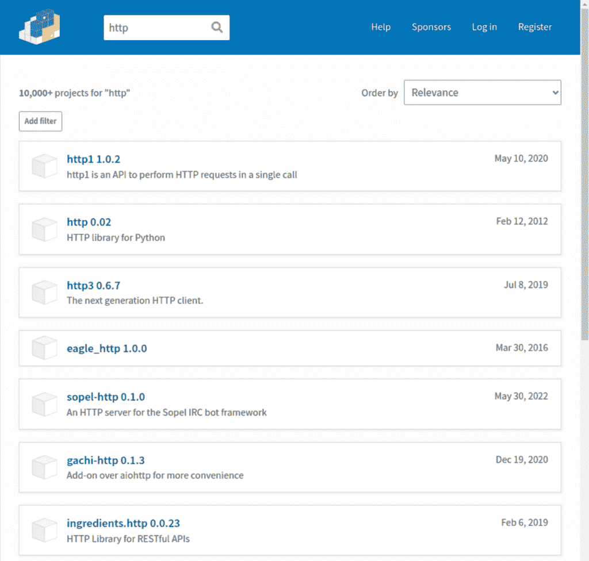

# Pip 安装:安装和删除 Python 包

> 原文:[https://python . land/virtual-environments/installing-packages-with-pip](https://python.land/virtual-environments/installing-packages-with-pip)

Pip install 是使用 Pip 包管理器安装 Python 包的命令。如果你想知道 Pip 代表什么，Pip 这个名字是“Pip Installs Packages”的递归缩写。使用 pip 安装 Python 包有两种方法:

1.  手动安装
2.  使用一个定义所需包及其版本号的`requirements.txt`文件。

但是在我们开始之前，让我们确保`pip`本身已经安装好了！

目录


*   [Python:安装 Pip](#Python_Install_Pip "Python: Install Pip")
*   [Pip 安装 Python 包](#Pip_Install_Python_packages "Pip Install Python packages")
*   [Pip 安装需求. txt 文件](#Pip_install_requirementstxt_file "Pip install requirements.txt file")
*   [带有 pip install -i 的自定义存储库](#Custom_repository_with_pip_install_-i "Custom repository with pip install -i")
*   [使用 pip install -e 进行可编辑安装](#Editable_install_with_pip_install_-e "Editable install with pip install -e")
*   [Pip 卸载](#Pip_uninstall "Pip uninstall")
*   [更多画中画命令](#More_pip_commands "More pip commands")
*   [Python 包索引](#The_Python_Package_Index "The Python Package Index")
*   [继续学习](#Keep_learning "Keep learning")


## Python:安装 Pip

首先:我们需要安装 pip 本身。好消息是 Pip 可能已经存在于您的系统中。大多数 Python 安装程序也会安装 Pip。如果您使用的是从[python.org](https://www.python.org/)下载的 Python 2 >=2.7.9 或 Python 3 >=3.4，则已经安装了 Python 的 pip。如果你在一个[虚拟环境](https://python.land/virtual-environments)中工作，pip 也会为你安装。

因此，在您尝试安装 Pip 之前，请确保您的系统上还没有安装它。打开终端(Linux/MacOS)或 Windows shell，键入以下命令:

```py
pip help
```

如果`pip`命令出错，请尝试`pip3`命令。Python 2 和 3 可以在某些系统上并排安装。在这些系统上，pip 通常以`pip3`的名字安装:

```py
pip3 help
```

如果这也不起作用，您可以尝试大多数现代 Python 安装中内置的 pip 模块:

```py
python3 -m pip help
```

如果这也失败了，您需要自己安装它，所以让我们来看看如何手动安装它。你应该只在万不得已时才这么做，我强烈建议你先检查一下你的 [Python 安装](https://python.land/installing-python)是否顺利。

### 在 Windows 和 Mac 上安装 Pip

在 Windows 和 Mac 上，可以下载一个 Python 脚本来安装 pip，名为 [get-pip.py](https://bootstrap.pypa.io/get-pip.py) 。从命令提示符或终端窗口下载文件并使用 Python 运行它:

```py
python3 get-pip.py
```

确保您位于下载脚本的目录中。

### 在 Linux 上安装 Pip(Ubuntu，Debian，Redhat)

您可以在 Debian、Ubuntu、Linux Mint 和其他 Debian 衍生工具上使用 apt 包管理器安装 pip。这是最值得推荐的方法，可以确保您的系统保持一致的状态。

```py
$ sudo apt install python3-pip
```

如果您的系统使用 yum 软件包管理器，您可以尝试以下方法:

```py
$ sudo yum install python-pip
```

Pip 是 EPEL(Enterprise Linux 的额外包)的一部分，所以您可能需要[启用第一个](https://www.liquidweb.com/kb/enable-epel-repository/)。

如果这些方法失败了，您还可以下载一个 Python 脚本，它将使用以下命令为您安装 pip:

```py
$ curl "https://bootstrap.pypa.io/get-pip.py" -o "get-pip.py"
....
$ python3 get-pip.py
```

## Pip 安装 Python 包

我必须强调这一点:最好是在虚拟环境中安装软件包。好消息是:默认情况下，pip 存在于您的虚拟环境中。因为我们 venv 中的所有东西都是本地安装的，所以你不需要成为拥有`sudo`或`su`的超级用户，也不会有软件包版本冲突的风险。

话虽如此，您也可以在 Python venv 之外安装软件包。这仅推荐用于您可能在许多脚本中需要的更通用的包，或者如果该包作为更通用的工具使用。一些符合这种描述的示例库将是 Numpy 和 Pandas，一个 REPL 的替代品，如 [ipython](https://python.land/using-ipython) ，或者完整的环境，如 [Jupyter Notebook](https://python.land/data-science/jupyter-notebook) 。

### 本地安装(无根用户或超级用户)

幸运的是，现在大多数操作系统上的 Python 安装以这样一种方式配置您的系统，即您不必成为管理员(或 Unix 系统上的 root)就可以在 venv 之外安装软件包。

然而，你并不总是拥有超级用户权限来安装系统范围内的软件包，例如，当在工作场所或学校的共享或锁定系统上工作时。

在这种情况下，您可以使用`--user`选项将包安装到您平台的 Python 用户安装目录中。这通常意味着软件包安装在以下位置:

*   在类 Unix 系统上。
*   `%APPDATA%\local\programs\python`在 Windows 上

事实上，在虚拟环境之外运行时，在本地安装目录中安装包通常是默认的。因此，让我们首先尝试升级我们的帐户范围的 pip 安装。确保您当前不在虚拟环境中，并输入:

```py
pip install --upgrade pip
```

根据您使用的 Python 安装程序和您所在的系统，pip 可能会尝试在系统范围内安装软件包。因此，如果您不使用 sudo 之类的东西或者没有成为管理员，您可能会遇到权限错误。如果您得到许可错误，这意味着 pip 试图安装它的系统范围。在这种情况下，您可以添加`--user`选项，强制将其安装在您的系统帐户中:

```py
pip install --user --upgrade pip
```

这些命令要求`pip`在你的用户帐户中安装`pip`，如果已经安装了就更新它。在我的系统上，这给了我一个信息，要求已经被满足，意味着 pip 已经是最新的了。

现在，作为一个练习，您可以尝试安装 [ipython](https://python.land/using-ipython) 。这是标准 Python REPL 的一个很好的替代品。

### 在 venv 中安装 Python 包

现在，让我们尝试在虚拟环境中安装一个包。对于这个例子，我选择了`simplejson`。首先，[激活您的虚拟环境](https://python.land/virtual-environments/virtualenv#Python_venv_activation)，然后键入:

```py
pip install simplejson
```

您刚刚在虚拟环境中安装了一个包，因此只有在您激活此 venv 时才能访问它。

### 在系统范围内安装 Python 包

我先重申一下，我不建议这样。如果您没有阅读该主题的其余部分就跳到这里，请先阅读上面关于在您的用户帐户或虚拟环境中安装软件包的部分。

在 Linux 上，您可以以 root 用户的身份在系统范围内安装软件包。我强烈建议你不要这样做，但下面是如何用`sudo`来做:

```py
sudo pip install --upgrade pip
```

## Pip 安装需求. txt 文件

在[虚拟环境](https://python.land/virtual-environments/virtualenv)中，安装特定版本的包是一个好习惯。它确保您从一开始就获得使用虚拟环境的全部好处。毕竟，我们这样做是为了通过确定特定的依赖版本来确保我们的软件总是按预期工作。

一个`requirements.txt`文件包含一个简单的依赖列表，每行一个。最简单的形式是这样的:

```py
simplejson
chardet
```

但是我们真正想要的是固定版本。这也不难:

```py
chardet==3.0.4
simplejson==3.17.0
```

您还可以通过使用> =和< =或者甚至是它们的组合来稍微放宽这些约束:

```py
chardet>=3.0.0,<=3.1.0
simplejson>=3.17.0
```

您可以使用这些说明符中的任何一个:`==`、`>`、`>=`、`<`、`<=`

### 选择什么版本范围

你怎么知道用什么范围？这是大多数教程和课程似乎都在回避的话题。不幸的是，对此没有硬性规定。你必须阅读发行说明以及相关软件包中的内容。

例如，让我们假设您正在使用两个包，A 和 b。也许您知道某个特性在包 A 版本 3.1.0 中可用，所以您至少需要那个版本。但是从新闻中，你了解到作者正计划在 4.0.0 版本中对包 A 的 API 进行大修。另外，B 包有点陈旧，维护不好。它多年来一直停留在 0.6.2 版本，需要 3.1.6 或更低版本的包 A(而 A 目前是 3.5.0)。您可以定义以下约束，以确保一切都很好地协同工作:

```py
A>=3.1.0,<=3.1.6
B==0.6.2
```

你看，有时需要一些杂耍来正确定义版本约束。这就是为什么许多开发人员使用 Pip 的替代品，如[poem](https://python.land/virtual-environments/python-poetry)或 [Pipenv](https://python.land/virtual-environments/pipenv) 。这些工具提供了高级的依赖关系管理，如果可能的话，会自动解决所有的依赖关系。在本课程中，我们将进一步深入了解包管理器。现在，我们要确保你了解基本知识。这样，包管理器看起来就不那么神奇了，而且你会更好地理解它们为你做了什么。这可不是什么有趣的事情

### Pip 冻结

使用 pip 的冻结选项创建您的需求文件可以让您的生活稍微轻松一些。首先，编写您的软件并安装您需要的所有需求。完成后，一切看起来都很好，使用下面的命令:

```py
$ pip freeze > requirements.txt
```

Pip 用所有当前安装的依赖项创建了一个`requirements.txt`文件，包括版本号。整洁！您可以选择稍微放宽版本，例如，允许对软件包进行较小的更新(错误修复、安全修复)。但是请记住，这也是一种风险:由于其中一个需求改变了它的 API 的行为或其他原因，项目总是有可能不按预期的那样运行。

### 从 requirements.txt 文件安装 Pip

最后，要安装该文件中列出的所有依赖项，请使用:

```py
$ pip install -r requirements.txt
```

这是您在阅读 Python 项目的安装说明时经常会看到的说明，现在您已经确切地知道它是做什么的以及它是如何工作的了！

## 带有 pip install -i 的自定义存储库

默认的 PyPI 存储库位于 https://pypi.org/simple.，但是您也可以使用一个替代的存储库。例如，如果您的公司仅允许来自内部镜像的已批准软件包的子集。或者，您的公司可能有一个自带的私人镜子。该存储库可以位于 HTTP(s) URL 或文件系统位置。

要指定自定义存储库，请使用`**-i**`或`**--index-url**`选项，如下所示:

```py
pip install -i https://your-custom-repo/simple <package name>

or

pip install -i /path/to/your/custom-repo/simple <package name>
```

URL 必须指向符合 PEP 503(简单存储库 API)的存储库或以相同格式布局的本地目录。

## 使用 pip install -e 进行可编辑安装

Pip 可以选择进行可编辑的安装，这意味着您可以从本地源安装软件包。但是 pip 并没有将包文件复制到系统中的某个位置，而是创建了到安装它的代码库的符号链接。通过这种方式，您可以在项目上工作并进行更改，并且能够直接测试这些更改，而无需不断地重新安装新版本的包。

您可能需要此选项的原因有很多:

*   当您创建自己的包时
*   如果你想修理别人的包裹
*   如果你想安装一个软件包的所谓的最新版本，就从它的源代码库中安装

可编辑安装选项通过`-e`选项或`--editable`选项调用。让我们看看 pip 对这个选项有什么看法:

```py
pip install --help

  ..
  -e, --editable Install a project in editable mode (i.e. setuptools "develop mode") from a local project path or a VCS url.
  ..
```

通常情况下，您将使用 git 这样的版本控制系统进行项目工作。当在存储库的根目录中时，您将安装带有以下内容的项目:

```py
pip install -e .
```

如果您不在项目根目录中，您可以简单地提供包源代码的路径，而不是使用点号。

## Pip 卸载

要使用 pip 卸载软件包，我们可以使用' uninstall '子命令，例如卸载`simplejson`:

```py
pip uninstall simplejson
```

按照使用需求文件的 pip install 命令，您也可以使用这样的文件来卸载软件包:

```py
pip uninstall -r requirements.txt
```

## 更多画中画命令

我们还可以使用 pip 来获得关于一个包或当前安装的包的更多信息。Pip 还提供搜索功能。让我们研究一下这些附加命令。

### Pip 列表:列出已安装的软件包

要使用 pip 列出所有当前安装的软件包，请使用以下命令:

```py
$ pip list

Package                 Version
----------------------- ---------------------
async-generator         1.10
attrs                   20.3.0
autopep8                1.5.7
...
```

它将显示软件包名称和版本。当您在虚拟环境中运行该命令时，只会显示 venv 的包。如果您在 venv 之外运行它，将列出所有帐户范围或系统范围的软件包。

### Pip 显示:获取软件包详细信息

现在您已经知道安装了哪些软件包，您可能需要更详细地检查其中一个。为此，我们有“显示”子命令:

```py
$ pip show attrs
Name: attrs
Version: 20.3.0
Summary: Classes Without Boilerplate
Home-page: https://www.attrs.org/
Author: Hynek Schlawack
Author-email: hs@ox.cx
License: MIT
Location: /usr/lib/python3/dist-packages
Requires: 
Required-by: 

```

这是一种快速查找包是什么和做什么的方法，以及谁创作了它。

### Pip 搜索:查找包

我们过去可以使用 pip 找到匹配某个字符串的所有包。虽然很方便，但这给 PyPI 的服务器带来了很大的负载。不幸的是，他们已经决定[禁用功能](https://www.theregister.com/2021/05/25/pypi_search_error/)。幸运的是，我们仍然有像 DuckDuckGo、Google 和 Bing 这样的搜索引擎来查找资料！

## Python 包索引

我们还没有广泛讨论 Python 包索引，它位于[pypi.org](https://pypi.org)。该网站为我们提供了一些信息:

*   您可以创建一个帐户，只有当您想要发布自己的包时才需要它
*   它提供了一个搜索功能(更多关于这一点)
*   它向我们展示了使用统计数据，如软件包和用户的总数
*   我们可以按类别浏览

老实说，Python 包索引有所欠缺，我认为没有多少人使用这个网站。

### PyPI 搜索功能

网站的功能没有提供太多价值的一个例子是搜索功能。如果你确切地知道你在寻找什么，那很好。让我们试着搜索一下非常受欢迎的请求包。它将首先显示，我们可以点击此处的[信息页面](https://pypi.org/project/requests/)，在这里我们可以看到以下内容:

*   包的描述
*   作者的姓名和电子邮件地址
*   项目主页、文档和源代码的链接
*   历史版本列表

所有这些信息都是由软件包作者提供的，所以请记住这一点。

现在假设我们不记得名称请求，而是搜索单词 HTTP:



PyPI.org 研究

如果你愿意的话，你可以试着自己看看:requests 包在哪里都找不到。因此，如果您需要发现一个库来做一件特定的事情，比如做 HTTP 请求，我强烈建议您使用 Google。

简单的 Google 搜索会发现 Python 有一个内置的 HTTP 库，这已经足够好了。然而，第一个结果页面也多次提到请求，这给了我们一个强烈的信号，表明这个包也被很多人使用。

### PyPI 类别

如果你决定浏览类别，你也会发现它们没什么帮助。幸运的是，Python 社区很强大，许多站点(比如 Python Land！)填补空白，并就使用哪些软件包提供好的建议。

所以简而言之:PyPI 站点对于发现来说不是很有用，但是它在给你提供包信息和到文档和源代码库之类的链接方面已经足够了。

## 继续学习

*   如果你想要一个功能更丰富的替代品，你应该检查一下 [Pipenv](https://python.land/virtual-environments/pipenv) 。
*   如果你还没有看我的虚拟环境教程的话，看看吧。
*   如果您想了解更多关于 pip 及其所有选项的信息，请访问官方 PyPI 文档。
*   阅读 pip 的[配置文件](https://pip.pypa.io/en/stable/topics/configuration/)
*   可编辑安装(也称为开发模式)的官方 Python.org 部分