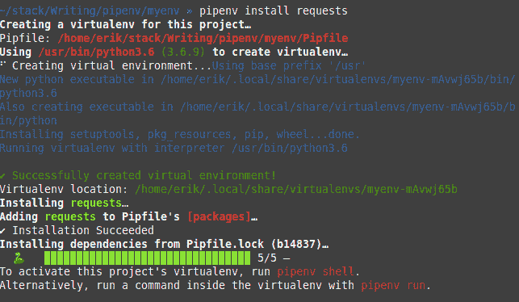

# Python Pipenv:另一个包管理器

> 原文:[https://python.land/virtual-environments/pipenv](https://python.land/virtual-environments/pipenv)

Pipenv 是做类似事情的 Python 诗歌的替代品。像诗歌一样，许多人更喜欢 Pipenv 而不是分别安装[pip](https://python.land/virtual-environments/installing-packages-with-pip)和 [virtualenv](https://python.land/virtual-environments/virtualenv) 。由你决定你更喜欢哪种方法。也许你开始在一个团队或开源项目中工作，在那里 pip + virtualenv 是标准；没关系。也许，看完这个，你想说服他们改用 pipenv！然而，如果你还没有这样做，我建议你先看看诗歌。如果你问我，这是更好的选择！

目录


*   [Pipenv vs virtualenv](#Pipenv_vs_virtualenv "Pipenv vs virtualenv")
*   [管道安装](#Pipenv_install "Pipenv install")
*   [如何使用 Python pipenv](#How_to_use_Python_pipenv "How to use Python pipenv")
*   [Pipenv 是如何工作的？](#How_does_Pipenv_work "How does Pipenv work?")
*   [附加 Pipenv 特性](#Additional_Pipenv_features "Additional Pipenv features")


## Pipenv vs virtualenv

与单独使用`pip`和`virtualenv `相比，使用 pipenv 作为 Python 包管理器有几个优点。这些是主要的:

*   你不再需要单独使用 pip 和 virtualenv。取而代之的是，你有一个工具可以做所有的事情甚至更多！
*   pipenv 将您的顶层依赖项与最后测试的组合(例如，pip 冻结输出)分开。对于开发人员来说，这使得依赖关系管理更加用户友好。
*   pipenv 鼓励使用最新版本的依赖项来最小化安全风险。它甚至可以扫描你的依赖已知的漏洞。
*   pipenv 通过`pipenv graph`让您深入了解依赖图。
*   pipenv 散列所有依赖项。它将检测在您最初将包作为依赖项包含进来之后被篡改的包。
*   `pipenv`也可以处理`requirements.txt`文件。如果有，它会自动检测并转换成一个`Pipfile`。

也许这些要点会让你感到困惑。别担心，他们都会解释的！

## 管道安装

我们可以简单地用`pip`来安装`pipenv`:

```py
$ pip install --user pipenv
```

`--user`选项只为本地用户安装 pipenv。如果您使用它，您将确保不会干扰系统范围的包。老实说，我只是全球安装，没有任何问题。如果你得到一个错误，没有找到画中画，尝试`pip3`或`python -m pip`。如果你还有问题，你可能还想查看一下 [Python 安装说明](https://python.land/installing-python)。

如果你在 MacOS 或者 Linux 上，我也可以推荐家酿。去[家酿](https://brew.sh/)网站安装。之后，事情就简单了:

```py
$ brew install pipenv
```

## 如何使用 Python pipenv

现在您已经安装了 pipenv，让我们来试试吧！

首先，创建一个目录。我把我的叫做`myenv`。现在，将 cd 放入目录，并安装您的第一个 pipenv 依赖项:

```py
$ pipenv install requests
```

接下来发生的是:

*   pipenv 检测到还没有虚拟环境，所以它创建了一个。
*   它安装请求。
*   它创建了两个文件:`Pipfile`和`Pipfile.lock`。

下面的截图显示了 pipenv 在我的系统上的运行。

Thank you for reading my tutorials. I write these in my free time, and it requires a lot of time and effort. I use ads to keep writing these *free* articles, I hope you understand! **Support me by disabling your adblocker on my website** or, alternatively, **[buy me some coffee](https://www.buymeacoffee.com/pythonland)**. It's much appreciated and allows me to keep working on this site!

Pipenv 在作者的系统上运行

完成后，您可以选择通过以下方式进入虚拟环境:

```py
$ pipenv shell
```

这是可选的，因为您可以像这样在虚拟环境中直接启动任何命令:

```py
$ pipenv run <your command>
```

例如，要在虚拟环境中启动 Python 脚本:

```py
$ pipenv run python3 myscript.py
```

## Pipenv 是如何工作的？

我不喜欢黑盒。我想知道发生了什么事。所以我们先来考察一下`Pipfile`。它应该是这样的:

```py
[[source]]
 name = "pypi"
 url = "https://pypi.org/simple"
 verify_ssl = true
 [dev-packages]
 [packages]
 requests = "*"
 [requires]
 python_version = "3.6"
```

如您所见，Pipfile 包含了我们的顶级需求，但没有指定版本号，因为我们没有指定版本号。现在看一下 Pipfile.lock。这是一个很大的文件，所以我在这里只展示一个片段来说明:

```py
...
"requests": {
  "hashes": [
    "sha256:43999036bfa82904....",
    "sha256:b3f43d496c6da..."
  ],
  "index": "pypi",
  "version": "==2.23.0"
},
...
```

列出了它的所有依赖项，包括版本号。基本上，这是 pip freeze 输出的高级版本。这些是我们合作过的版本。保证起作用的是一揽子计划的组合。

但是虚拟环境在哪里呢？如果你仔细看@fig:pipenv_in_action 中的截图，你会看到 virtualenv 是在`~/.local/share/virtualenvs/myenv-mAvwj65b/`中创建的。我们也可以用`pipenv --venv`问 pipenv。

因为我们已经熟悉了虚拟环境的结构，所以您会注意到这一个并没有什么不同。它只是位于其他地方，在你的项目结构之外。这样，您就不需要将它从您的版本控制系统中排除。

如果您在另一个位置创建另一个同名的虚拟环境，它将不会被重用。我认为，目录名中的散列是基于到 virtualenv 的路径的。Pipenv 使用它来查找正确的名称，尽管名称重复。

## 附加 Pipenv 特性

让我们看看 Pipenv 区别于普通 pip 和 virtualenvs 的更多特性。

### 分离开发包

使用`pip`，您只能通过使用第二个需求文件(例如`requirements-dev.txt`)将开发需求与生产需求分开。使用`pipenv`，您可以简单地使用`--dev`选项:

```py
$ pipenv install pytest --dev
```

开始为您的项目工作的另一个开发人员可以安装所有需求，包括开发人员需求，使用:

```py
$ pipenv install --dev
```

### 依赖性管理

尝试安装核心依赖项所需的所有子依赖项。不过，冲突可能会出现。如果包 A 至少需要包 B 的 1.10 版本，而包 C 需要 1.9 版本，那么您就有问题了。`pipenv`不能为你解决，但会就此警告你，默认拒绝继续。它还提供了对您与`pipenv graph`命令的依赖关系的深入了解:

```py
$ pipenv graph
pytest==5.3.5
  - attrs [required: >=17.4.0, installed: 19.3.0]
  - importlib-metadata [required: >=0.12, installed: 1.5.0]
    - zipp [required: >=0.5, installed: 3.1.0]
  - more-itertools [required: >=4.0.0, installed: 8.2.0]
  - packaging [required: Any, installed: 20.3]
    - pyparsing [required: >=2.0.2, installed: 2.4.6]
    - six [required: Any, installed: 1.14.0]
  - pluggy [required: >=0.12,&lt;1.0, installed: 0.13.1]
    - importlib-metadata [required: >=0.12, installed: 1.5.0]
      - zipp [required: >=0.5, installed: 3.1.0]
  - py [required: >=1.5.0, installed: 1.8.1]
  - wcwidth [required: Any, installed: 0.1.8]
requests==2.23.0
  - certifi [required: >=2017.4.17, installed: 2019.11.28]
  - chardet [required: >=3.0.2,&lt;4, installed: 3.0.4]
  - idna [required: >=2.5,&lt;3, installed: 2.9]
  - urllib3 [required: >=1.21.1,&lt;1.26,!=1.25.1,!=1.25.0, installed: 1.25.8]
```

### 安全漏洞的检测

`pipenv`可以扫描您的包中的安全漏洞。它通过使用`safety`包来实现。输入:

```py
$ pipenv check
```

并且`pipenv`会扫描你的依赖图，寻找有已知安全漏洞的包！