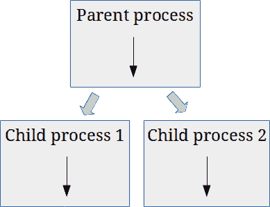

# Python 并发:分而治之

> 原文:[https://python.land/python-concurrency](https://python.land/python-concurrency)

并发是指同时处理多件事情。在 Python 中，可以通过几种方式实现并发性:

*   用 **[线程化](https://python.land/python-concurrency/python-threads)** ，通过让多个线程轮流。
*   有了 **[多重处理](https://python.land/python-concurrency/python-multiprocessing)，**我们正在使用多个进程。这样，我们就可以真正使用多个处理器内核一次完成多项任务。这就是所谓的并行。
*   使用**异步 IO** ，启动一个任务并继续做其他事情，而不是等待网络或磁盘的回答。
*   通过使用分布式计算，这基本上意味着同时使用多台计算机

目录

*   [Python 并发基础知识](#Python_concurrency_basics "Python concurrency basics")
*   [I/O 限制与 CPU 限制问题](#IO_bound_vs_CPU_bound_problems "I/O bound vs CPU bound problems")
*   我应该研究 Python 的并发性吗？

## Python 并发基础知识

尽管 Python 并发有时会很困难，但这也是值得的，是一项很好的技能。我们先从一些基础知识开始。接下来，我们会问自己这样一个问题:我真的需要(或想要)并发性吗，或者替代方案对我来说是一个足够好的解决方案吗？

### 线程和进程的区别

所以我们已经知道了在 Python 中有多种方法来创建并发性。第一种轻量级的方法是使用线程。

一个 [Python 线程](https://python.land/python-concurrency/python-threads)是一个独立的执行序列，但是它与属于你的程序的所有其他线程共享内存。默认情况下，Python 程序有一个主线程。您可以创建更多的它们，并让 Python 在它们之间切换。这种转换发生得如此之快，以至于看起来它们是同时并排运行的。

单线程与多线程

在 Python 中创建并发的第二种方式是使用[多个进程](https://python.land/python-concurrency/python-multiprocessing)。流程也是一个独立的执行序列。但是，与线程不同，进程有自己的内存空间，不与其他进程共享。一个进程可以克隆自己，创建两个或更多实例。下图说明了这一点:

多重处理

在此图中，父进程创建了自身的两个克隆，从而产生了两个子进程。所以我们现在总共有三个过程，同时工作。

创建并发程序的最后一种方法是使用异步 IO，简称 asyncio。异步 IO 不是线程化的，也不是多处理的。事实上，它是一个单线程、单进程的范例。在这一章中，我暂时不会讨论异步 IO，因为它对 Python 来说有点新，而且我感觉它还没有完全出现。我确实打算在将来扩展这一章，将 asyncio 也包括在内。

## I/O 限制与 CPU 限制问题

大多数软件受 I/O 限制，不受 CPU 限制。如果您对这些术语不熟悉:

**I/O bound  software**

Software that is mostly waiting for input/output operations to finish, usually when fetching data from the network or from storage media

**CPU bound  software**

Software that uses all CPU power to produce the needed results. It maxes out the CPU.

让我们再来看看在 Python 中实现并发的不同方法，但是现在是从 I/O 和 CPU 的角度。

### Python 线程并发

在等待来自网络或磁盘的回答时，您可以使用多线程保持其他部分运行。线程是一个独立的执行序列。默认情况下，Python 程序有一个主线程。但是您可以创建更多的它们，并让 Python 在它们之间切换。这种转换发生得如此之快，以至于看起来它们是同时并排运行的。

然而与其他语言不同的是， [Python 线程](https://python.land/python-concurrency/python-threads)不会同时运行；他们轮流代替。这是因为 Python 中有一种机制叫做 **[全局解释器锁(GIL)](https://python.land/python-concurrency/the-python-gil)** 。简而言之，GIL 确保总有一个线程在运行，所以线程不会互相干扰。下一页将详细解释这一点以及线程库。

结论是线程对于 I/O 绑定的软件有很大的不同，但是对于 CPU 绑定的软件没有用。这是为什么呢？很简单。当一个线程在等待网络回复时，其他线程可以继续运行。如果您发出大量网络请求，线程会带来巨大的不同。如果您的线程正在进行繁重的计算，它们只是在等待轮到自己继续。线程化只会带来更多的开销:不断地在线程间切换会涉及到一些管理。

### 使用 asyncio 的 Python 并发

Asyncio 是 Python 中相对较新的核心库。它解决了与线程相同的问题:它加快了 I/O 绑定软件的速度，但方式不同。我马上承认，直到最近，我还不是 Python 中 asyncio 的粉丝。这似乎相当复杂，尤其是对初学者来说。我遇到的另一个问题是，asyncio 库在过去的几年里发展了很多。网上的教程和示例代码经常是过时的。

不过，这并不意味着它毫无用处。这是人们在许多高性能应用程序中使用的强大范例，所以我计划在不久的将来在本教程中添加一篇 asyncio 文章。

Thank you for reading my tutorials. I write these in my free time, and it requires a lot of time and effort. I use ads to keep writing these *free* articles, I hope you understand! **Support me by disabling your adblocker on my website** or, alternatively, **[buy me some coffee](https://www.buymeacoffee.com/pythonland)**. It's much appreciated and allows me to keep working on this site!

### 多重处理的 Python 并发

如果你的软件是 CPU 受限的，你可以经常重写你的代码，这样你就可以同时使用更多的处理器。这样，您可以线性扩展执行速度。这种类型的并发就是我们所说的并行，尽管有 GIL，你也可以在 Python 中使用它。

不是所有的算法都可以并行运行。例如，并行化递归算法是不可能的。但是几乎总有一种替代算法可以并行工作。

使用更多处理器有两种方式:

*   在同一台机器上使用多个处理器和/或内核。在 Python 中，我们可以通过多重处理库做到这一点。
*   使用计算机网络来使用分布在多台机器上的许多处理器。我们称之为分布式计算。

[Python 的多处理库](https://python.land/python-concurrency/python-multiprocessing)，不同于 [Python 线程库](https://python.land/python-concurrency/python-threads)，绕过了 Python 全局解释器锁。这是通过实际生成多个 Python 实例来实现的。现在，多个 Python 进程同时运行多个代码副本，而不是线程在单个 Python 进程中轮流运行。

就用途而言，多处理库与线程库非常相似。可能出现的一个问题是:为什么要考虑线程？你可以猜到答案。线程更“轻”:它需要更少的内存，因为它只需要一个运行的 Python 解释器。产生新进程也有开销。因此，如果您的代码是 I/O 绑定的，线程可能就足够好了，而且更加高效和轻量级。

## 我应该研究 Python 的并发性吗？

在您考虑 Python 中的并发性(这可能相当棘手)之前，请务必先好好看看您的代码和算法。许多速度和性能问题可以通过实现更好的算法或添加缓存来解决。整本书都是关于这个主题的，但是有一些通用的指导方针可以遵循:

*   **衡量，不要猜测**。衡量代码的哪些部分运行时间最长。先关注那些部分。
*   实现**缓存**。如果您从磁盘、网络和数据库中执行多次重复查找，这将是一个很大的优化。
*   重用对象而不是在每次迭代中创建一个新的。Python 必须清理你创建的每个对象来释放内存。这就是我们所说的垃圾收集。对许多未使用的对象进行垃圾收集会大大降低软件的速度。
*   如果可能的话，减少代码中的迭代次数，减少迭代中的操作次数。
*   **避免(深度)递归**。Python 解释器需要大量的内存和内务处理。用生成器和迭代之类的东西来代替。
*   **减少内存使用**。一般来说，尽量减少内存的使用。例如:逐行解析一个巨大的文件，而不是先把它加载到内存中。
*   **不做**。你真的需要做那个手术吗？以后还能做吗？或者可以做一次，它的结果可以存储而不是反复计算吗？
*   **使用 PyPy 或 Cython** 。您还可以考虑替代的 Python 实现。有一些速度很快的 Python 变种。更多信息见下文。

### PyPy

您可能正在使用 Python 的参考实现 CPython。大多数人都这样。它被称为 CPython，因为它是用 c 编写的。如果你确定你的代码是 CPU 受限的，这意味着它正在进行大量的计算，你应该看看 [PyPy](https://www.pypy.org/) ，CPython 的一个替代方案。这是一个潜在的快速解决方案，不需要你修改任何一行代码。

[PyPy](https://www.pypy.org/) 声称，平均来说，它比 CPython 快 4.4 倍。它是通过使用一种叫做**的技术来实现的。Java 和。NET 框架是 JIT 编译的其他值得注意的例子。相比之下，CPython 使用**解释**来执行你的代码。虽然这提供了很大的灵活性，但它也非常慢。**

使用 JIT，您的代码在运行程序时被编译。它结合了**提前编译**(C 和 C++等语言使用)的速度优势和解释的灵活性。另一个好处是，JIT 编译器可以在运行时不断优化您的代码。您的代码运行的时间越长，它就变得越优化。

PyPy 在过去的几年里取得了长足的进步，通常可以作为 Python 2 和 3 的替代产品。它也可以与像 [Pipenv](https://python.land/virtual-environments/pipenv) 这样的工具完美配合。试试看！

### Cython

Cython 提供了类似 C 的性能，其代码大部分是用 Python 编写的，但可以将部分 Python 代码编译成 C 代码。这样，您可以将算法的关键部分转换成 C 语言，这通常会提供巨大的性能提升。

它是 Python 语言的超集，这意味着它为 Python 语法增加了额外的内容。不是 PyPY 那样的顺带替换。它需要适应您的代码，并了解 Cython 添加到语言中的额外内容。

使用 Cython，也可以利用 C++语言，因为 C++标准库的一部分可以直接从 Cython 代码中导入。Cython 在 Python 的科学用户中特别受欢迎。几个值得注意的例子:

*   SageMath 计算机代数系统在性能和与其他库的接口方面都依赖于 Cython
*   SciPy、pandas 和 scikit-learn 库的重要部分都是用 Cython 编写的
*   XML 工具包 lxml 主要是用 Cython 编写的