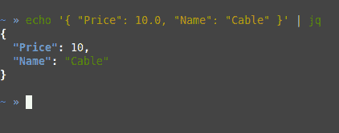

# 用 jq 处理并突出显示 JSON

> 原文:[https://python.land/the-unix-shell/process-json-with-jq](https://python.land/the-unix-shell/process-json-with-jq)

一旦你掌握了足够的命令行基础知识，是时候实际学习一些可以在日常工作中应用的有用的东西了！由于 JSON 超级无处不在，我想先教你一些有用的命令行 JSON 处理 voodoo。

目录


*   [jq 命令行工具](#The_jq_command-line_tool "The jq command-line tool")
*   [基于 Python 的替代品](#Python-based_alternatives "Python-based alternatives")


## jq 命令行工具

默认情况下，通常不安装`jq`工具。如果没有，请为您的操作系统安装。如果你在苹果电脑上，你可能会想看看家酿啤酒。

`jq`用法的一个非常基本的例子是:

```py
$ echo '{ "Price": 10.0, "Name": "Cable" }' | jq
```

结果是您输入的 JSON 的一个格式良好的彩色版本:



用 jq 着色 JSON

为此，我实际上经常使用它。如果您只想查看 JSON 文件的内容，一个简单的`cat filename.json | jq`将立即帮助您。但是`jq`可以做得更多——它是一个成熟的命令行 JSON 处理器。

Thank you for reading my tutorials. I write these in my free time, and it requires a lot of time and effort. I use ads to keep writing these *free* articles, I hope you understand! **Support me by disabling your adblocker on my website** or, alternatively, **[buy me some coffee](https://www.buymeacoffee.com/pythonland)**. It's much appreciated and allows me to keep working on this site!

比如说，你只对价格领域感兴趣。您可以使用以下命令简单地获得价格:

```py
$ echo '{ "Price": 10.0, "Name": "Cable" }' | jq ".Price"
```

试试看！结果应该是 10。这仍然只是触及最基本的问题。只要记住`jq`是存在的，用它你可以从你的 JSON 文件中得到几乎任何东西。阅读手册页或使用搜索引擎来查找更高级的示例。

## 基于 Python 的替代品

### 使用 Python 的 JSON 库

[Python 的 JSON 库](https://python.land/data-processing/working-with-json)也可以从命令行使用，以验证和美化您的 JSON:

```py
$ echo "{ \"name\": \"Monty\", \"age\": 45 }" | \
python3 -m json.tool
{
    "name": "Monty",
    "age": 45
}
```

### Python 中的高级 JSON 查询

如果您正在寻找在 Python 中查询 JSON 的高级方法，请访问我们的[页面，使用 JmesPath](https://python.land/data-processing/working-with-json/jmespath) 在 Python 中查询 JSON。