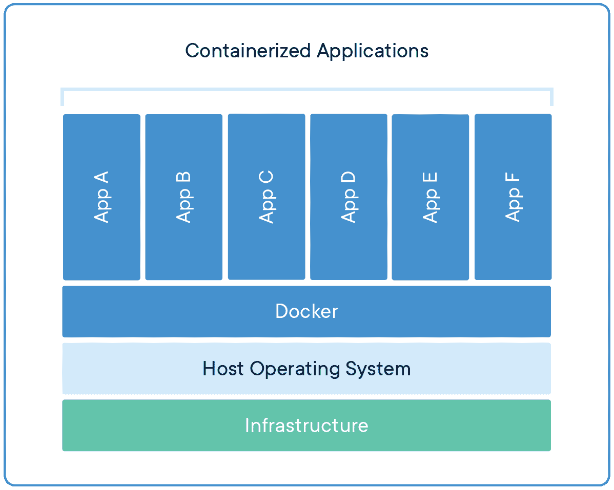
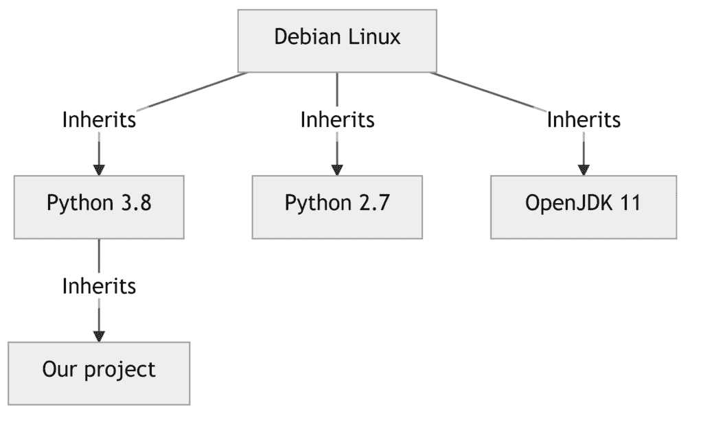

# 如何使用 Docker 来容器化您的 Python 项目

> 原文:[https://python.land/deployment/containerize-your-project](https://python.land/deployment/containerize-your-project)

您的 Python 项目是否难以从源代码构建，难以与同事共享，或者难以部署到生产环境中？Docker 是为您的 Python 项目解决这一问题的理想工具。

对于那些难以部署的项目，存在几个原因，这里只是几个:

*   该项目需要大量的依赖。
*   该项目需要一些库的过时版本或一个过时的编译器。一旦您安装了它，其他项目可能会依次中断。
*   你运行的是 Windows 或 Mac，但该软件是为构建和运行 Linux 而设计的

出于类似的原因，在生产环境中运行您的软件也很困难！

如果你正面临这些问题，最好知道有一个简单的解决方法。它不需要虚拟化，而是使用一种叫做容器化的原理。简而言之，容器化是虚拟化的一个非常轻量级的替代方案。容器化世界中的事实标准是 Docker，所以我们将用它来容器化一个示例 Python 项目。

* * *

目录


*   [什么是容器？](#What_is_a_container "What is a container?")
*   [什么是图像？](#What_is_an_image "What is an image?")
*   [将您的 Python 项目归档](#Dockerize_your_Python_project "Dockerize your Python project")
*   [使用我预先构建的图像](#Use_my_pre-built_image "Use my pre-built image")
*   [继续学习](#Keep_learning "Keep learning")


## 什么是容器？

容器是一个拥有运行软件所需的一切的实体。它包括:

*   你的软件
*   所有依赖项
*   可能需要的所有系统工具和库

容器就像虚拟机，但是更轻量级。例如，他们几乎立即开始。容器只虚拟化操作系统，而 VM 虚拟化整个机器及其所有硬件。如果你想知道这到底是如何工作的，请阅读优秀的官方文档。



Docker 容器有点像虚拟机，但是它们不需要运行整个操作系统

码头集装箱已经成为一种标准。它们可以在任何地方运行:从您的开发 PC 到自托管服务器，再到像 Amazon、Google 和 Azure 这样的云托管服务。容器使得打包和运输你的软件变得容易，并且为它的运行提供了一个定义良好的环境。

* * *

## 什么是图像？

Docker 容器总是基于图像。首先定义一个图像，然后基于它启动一个或多个容器。您可以在一个文件(称为`Dockerfile`)中定义一个图像，这个文件可以和您的代码一起被签入一个像 git 这样的 VCS。这允许您记录和创建运行代码所需的确切环境。

你不必从头开始建立一个形象。许多软件项目提供了将软件容器化的映像。对于几乎所有的计算机语言，包括 Python，都有多种基本映像可供选择。

就像 Python 类一样，您可以用自己的细节来扩展这样的图像，我将在下面演示。通过这样做，您可以在现有图像上添加一个新层。由于这种分层，Docker 图像可以非常高效地存储和构建。例如，许多映像可能都共享同一个 Debian Linux 基本映像，并使用它们自己特定的软件需求来扩展它:



Docker 图像由多个层构建而成

* * *

## 将您的 Python 项目归档

为你的软件创建一个容器是非常容易的。做了第一个 Docker 形象后，我的想法大致是这样的:*“就这些？我一定是跳过了一步！”*

在这里，我将创建一个 Python 项目作为示例，但这对于其他语言来说同样简单。此外，我将有意在 Windows 上工作，尽管我是一个真正的 Linux 迷。最重要的是，我根本不打算在 Windows 上安装 Python，只是为了证明容器化的强大。

Thank you for reading my tutorials. I write these in my free time, and it requires a lot of time and effort. I use ads to keep writing these *free* articles, I hope you understand! **Support me by disabling your adblocker on my website** or, alternatively, **[buy me some coffee](https://www.buymeacoffee.com/pythonland)**. It's much appreciated and allows me to keep working on this site!

如果你愿意，你可以跟着去。这篇文章包含你需要的一切。或者，您也可以从 [Github](https://github.com/eriky/docker-python-example) 中克隆这段代码。

### 一个简单的网络应用

假设我们想使用 Flask 创建一个 web 服务。它有一些依赖关系，在`Pipfile`中定义，与 [Pipenv](https://python.land/virtual-environments/pipenv) 一起使用。

我从简单的开始，下面的`Pipfile`:

```py
[packages]
Flask = "*"
```

现在，我们将创建一个 Python 文件，只是为了证明事情按预期运行。我称之为`app.py`:

```py
print("Hello world")
```

### 创建自己的 Docker Python 映像

接下来，我们需要创建一个定义容器的`Dockerfile`。如今，大多数项目都以 Docker 容器的形式提供软件的官方版本。在谷歌上快速搜索后，发现 Python 也是如此。他们甚至给了我们一个开始的例子。

他们的例子是基于 virtualenv 的，我们更喜欢 Pipenv，所以它需要一些修改。这是我想到的:

```py
FROM python:3
WORKDIR /usr/src/app
COPY Pipfile ./
RUN pip install --no-cache-dir pipenv && pipenv install
COPY *.py .
CMD [ "python", "./app.py" ]
```

要了解更多关于`Dockerfile`的语法，最好直接去 Dockerfiles 上的[官方文档。](https://docs.docker.com/engine/reference/builder/)

要构建您的容器，您需要运行`docker build`命令。如果您使用的是高级 IDE，如 VSCode，您将能够安装 Docker 扩展，允许您简单地右键单击`Dockerfile`，给它一个名称(称为标记)，然后开始构建。在这种情况下，我更喜欢命令行，因为它能准确地显示我们在做什么，并让我们控制所有选项。因此，我们将在命令行上构建我们的映像:

```py
C:\dev\python-docker> docker build -t my_webservice:latest .
```

让我们来分解一下:

*   我们正在构建一个映像，并用名称 my_service 和版本`latest`对其进行标记(这是默认的，所以您可以忽略它)
*   这个点仅仅意味着 Docker 需要在当前目录中查找 Docker 文件

第一次运行时，会有很多活动:

*   Docker 首先开始提取 python docker 图像
*   接下来，我们将工作目录设置为/usr/src/app
*   我们将 zip 文件复制到工作目录中
*   我们运行 pip install 来安装 pipenv
*   紧接着，我们运行 pipenv install 来安装我们的依赖项
*   最后，我们将所有 python 文件复制到工作目录中

您应该会看到类似下面截图的内容:


Docker 正在运行，提取图像

我们的图像完成了，我们可以用 docker run 运行它。让我们试试:

```py
PS C:\dev\python-docker> docker run my_webservice
Hello world
PS C:\dev\python-docker>
```

### 改善我们的 Python Docker 映像

我们已经做好了基础工作，现在让我们创建一个实际的 web 服务。修改`app.py`使其看起来像这个基本的烧瓶示例:

```py
from flask import Flask
app = Flask(__name__)
@app.route('/')
def hello_world():
    return 'Hello, World!'
```

因为我们现在正在运行 Flask 应用程序，所以我们也需要修改 docker 文件中的 CMD:

```py
CMD [ "pipenv", "run", "python", "-m", "flask", "run", "--host=0.0.0.0" ]
```

如您所见，我们需要 Flask 来监听所有网络接口。否则，它将只是监听 docker 容器内的 localhost，外部世界将无法访问它。

使用与之前相同的命令重建 Docker 映像:

```py
C:\dev\python-docker> docker build -t my_webservice:latest .
```

因为我们将在端口 5000 (Flask 的默认端口)上运行实际的服务器，所以我们需要公开这个端口。为了额外的安全和防止端口重叠，Docker 默认情况下不会暴露端口。Docker 提供了强大的隔离，这也更安全！您可以使用`-p`命令行选项将一个端口从容器映射到 PC 上的一个端口:

```py
C:\dev\python-docker> docker run -p 5000:5000 my_webservice
 * Environment: production
 * Debug mode: off
 * Running on http://0.0.0.0:5000/ (Press CTRL+C to quit)
```

现在转到 http://127.0.0.1:5000/来看看这个服务的运行情况。您应该得到一个显示“Hello world”的页面，并且应该在命令行上看到一个日志条目。

## 使用我预先构建的图像

如果您不想经历所有的步骤，但是仍然想测试运行这个例子，您可以通过使用下面的命令从我的 [public Docker Hub account](https://hub.docker.com/r/eriky/hello_world) 中提取图像:

```py
docker pull eriky/hello_world:latest
```

之后就可以用:`docker run -p 5000:5000 eriky/hello_world`开始镜像了。

如果你想从 GitHub 查看源代码，请点击这里的进入附带的库[。](https://github.com/eriky/docker-python-example)

## 继续学习

*   了解如何使用持续集成自动构建和部署您的 Python 项目。
*   如果你的应用程序成功了，这里有一些游击战术可以在不花费数百万的情况下扩展应用程序。