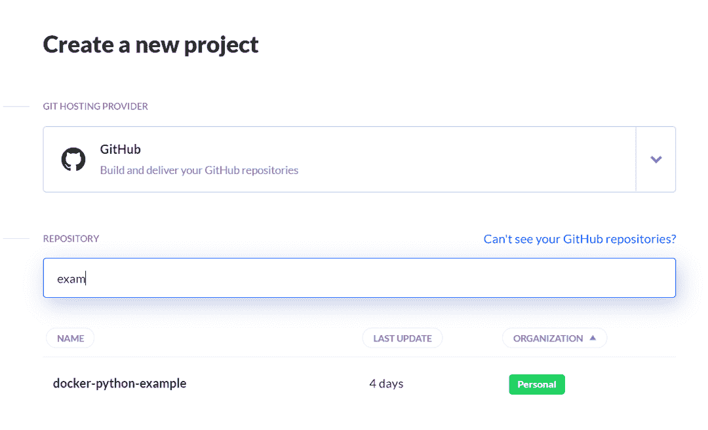

# 使用 CI/CD 自动构建和部署 Python 应用程序

> 原文:[https://python . land/deployment/ci-CD-automatically-build-and-deploy-your-python-application](https://python.land/deployment/ci-cd-automatically-build-and-deploy-your-python-application)

目录


*   [什么是持续集成/持续交付？](#What_is_Continuous_IntegrationContinuous_Delivery "What is Continuous Integration/Continuous Delivery?")
*   [要求](#Requirements "Requirements")
*   [选择哪个 CI/CD 系统？](#Which_CICD_system_to_choose_from "Which CI/CD system to choose from?")
*   [应用程序](#The_application "The application")
*   [第一步。创建一个账户和项目](#Step_1_Create_an_account_and_project "Step 1\. Create an account and project")
*   [第二步。添加源库](#Step_2_Add_the_source_repository "Step 2\. Add the source repository")
*   [第三步。创建新管道并添加动作](#Step_3_Create_a_new_pipeline_and_add_actions "Step 3\. Create a new pipeline and add actions")
*   [第四步。运行完整的管道](#Step_4_Run_the_complete_pipeline "Step 4\. Run the complete pipeline")


## 什么是持续集成/持续交付？

当你完成一个新版本的 Python 应用程序时，你如何构建和部署它？您是否会更改版本号，将新文件上传到生产环境，然后就此结束？有一个更好的方法，叫做持续集成和持续交付。

除了手动执行所有繁琐的步骤来将软件投入生产，您还可以自动执行这些步骤。幸运的是，您不必自己构建这个自动化。相反，您可以使用许多可用的持续集成/持续交付(CI/CD)系统中的一个。

CI/CD 是良好软件工程实践的顶峰。这是所有其他良好实践汇集的地方。CI/CD 在开发和操作之间架起了一座桥梁，因为它自动化并加强了构建和部署软件的重要步骤。它确保了质量，并排除了人为错误。

我们将采用一个现有的应用程序，并为它创建一个 CI/CD 管道。您将看到如何在 15 分钟内建立一个专业的 CI/CD 管道！

* * *

## 要求

要建立一个良好的 CI/CD 渠道，我们首先需要有一些其他的实践:

*   我们必须使用像 Git 这样的代码版本管理系统。
*   我们的应用程序应该有自动化测试(单元测试，集成测试)。
*   我们应该至少有一个软件的开发、测试和生产场所。
*   我们需要一个 CI/CD 系统。

设置 CI/CD 可能看起来像是一次令人生畏的冒险，但实际上并非如此。事实上，你可以在开始的时候给自己留一些捷径。要快速开始:

*   我们的测试和开发地点将是我们自己的电脑。
*   我们将从一个单元测试开始。
*   我们将使用 GitHub 托管我们的代码，我们将使用 Docker Hub 托管我们完成的应用程序。

这给我们留下了最后的选择:使用哪个 CI/CD 系统？

* * *

## 选择哪个 CI/CD 系统？

一些供应商提供 CI/CD 系统。我过去用过的一个著名的开源系统是 Jenkins。它已经存在很长时间了。缺点:它需要知识和时间来设置和运行。我也曾在过去工作过的一家公司被迫使用 Atlassian，但我从未喜欢过该产品。

为了快速启动并运行，并向您展示这有多简单，我将在本文中使用 [Buddy](https://buddy.works/?utm_source=python3guide&utm_medium=referral&utm_campaign=erikvanbaaren_rp&utm_content=python_4steps) 。它是以云服务的形式提供的，他们的免费层仍然允许你创建 5 个项目。他们的界面是荒谬的直观；它甚至在最初分析代码后向您建议合适的操作。

* * *

## 应用程序

对于这个管道，我将使用现有的“hello world”应用程序。可以在我的 GitHub 账号上查看[来源。它具有以下特点:](https://github.com/eriky/docker-python-example)

*   这是一个使用 Pipenv 的 Python 项目。
*   它有基本的单元测试。
*   它包括一个 docker 文件来[创建一个 docker Python 图像](https://python.land/deployment/containerize-your-project)并发布到我的公共 Docker Hub 帐户。

* * *

## 第一步。创建一个账户和项目

开始吧！如果您没有 GitHub 帐户，请先创建一个。然后使用您的 Github 登录名[创建一个好友帐户](https://buddy.works/sign-up?utm_source=python3guide&utm_medium=referral&utm_campaign=erikvanbaaren_rp&utm_content=python_4steps)。这样，Buddy 可以直接访问您的存储库。

* * *

## 第二步。添加源库

在 GitHub 中，您应该派生我的" [docker-python-example](https://github.com/eriky/docker-python-example) "存储库，这样在下一步中它就可以作为您自己的存储库之一。

完成后，点按 Buddy 中的“创建新项目”大按钮。您可以选择一个 GitHub 存储库。如果一切顺利，那么“docker-python-example”回购也应该存在:



选择“docker-python-example”项目

单击该项目。您应该会看到以下屏幕:


我们已经准备好自动化建筑或我们的应用程序

Buddy 检测到这是一个 Python 应用程序。太棒了。一旦完成了完整管道的设置，就可以下载 buddy.yml 文件来存储管道和代码。我强烈建议您为自己的项目这样做。

Thank you for reading my tutorials. I write these in my free time, and it requires a lot of time and effort. I use ads to keep writing these *free* articles, I hope you understand! **Support me by disabling your adblocker on my website** or, alternatively, **[buy me some coffee](https://www.buymeacoffee.com/pythonland)**. It's much appreciated and allows me to keep working on this site!

* * *

## 第三步。创建新管道并添加动作

我们准备建造一条新管道。点击“添加新管道”按钮，并填写如下表格:


创建新管道

我们将运行这条管道，将所有东西推送到主分支。或者，您也可以循环或手动构建您的应用程序。单击蓝色大按钮添加新管道。Buddy 已经看过了我们的代码，并将提出一些建议:


巴迪建议采取几项行动

选择 Python 操作，并填写下一个表单。如果您想跟进，您可以复制/粘贴以下内容:

```py
pip install pipenv
pipenv install
pipenv run python3 tests.py
```

这些行动:

*   使用 [pip 安装](https://python.land/virtual-environments/installing-packages-with-pip)命令安装 pipenv。
*   安装所有要求，
*   最后在我们新创建的环境中运行单元测试。


创建 Python 操作

您也可以在这里选择 Python 版本。Buddy 在 Docker 容器中运行每个步骤，因此如果需要，您甚至可以使用自己的自定义 Docker 容器。对我们来说，默认的 Python 容器就可以了。我选择了 3.8.6 版本，因为我知道这是这个项目可以使用的版本。如果您愿意，现在就可以尝试构建步骤，只是为了确保在继续之前一切正常。正如你在下面看到的，我需要 4 次尝试，因为我忘了将一些文件签入 Github repo。那没问题。我们可以继续尝试，直到成功:


我们的 CI/CD 构建步骤有效！

现在回到你的管道，点击你的第一个动作下面的小+号。它允许您添加更多的动作。默认情况下，只有在前一个操作没有错误地完成时，下一个操作才会运行。

下一个要添加的动作是另一个建议:Dockerfile linter。它检查我们的 docker 文件的错误。这是一个很好的额外。所有的默认设置都没问题，所以我们需要做的就是点击**“添加这个动作”**

现在是时候构建 Docker 映像并将其推送到 Docker Hub 了。添加另一个操作，并再次从建议的操作中选择。这次是那个叫**“构建映像”**(里面有 docker 图标的那个)。

**“设置”**选项卡上的默认设置是正确的。前往**“选项”**选项卡，填写您的 Docker Hub 详细信息。这也是您可以定义图像标签的地方。

我们将做一些简单的事情:我们总是将图像标记为`latest`。为了保持版本历史，我们添加了一个使用 Buddy 变量的附加标签。

一个什么？！Buddy 会自动定义一个您可以在项目中使用的环境变量列表。完整的名单和更多细节可以在[这里](https://buddy.works/docs/pipelines/environment-variables?utm_source=python3guide&utm_medium=referral&utm_campaign=erikvanbaaren_rp&utm_content=python_4steps)找到。其中之一是简写的 git 修订号，可以在`${BUDDY_EXECUTION_REVISION_SHORT}`下访问。我们可以用它给我们的图像一个唯一的 id:


设置 Docker 映像构建

您要添加的最后一个操作是通知，这样您就会收到成功构建的通知。我将用一封不错的旧电子邮件来演示，但还有许多其他选项，例如:

*   松弛的
*   电报
*   MS 团队
*   不调和
*   短信

过程又简单了。单击最后一个操作下的小加号按钮，滚动浏览可用的操作，然后单击电子邮件。您将看到这样的屏幕:


添加电子邮件通知

如您所见，您可以使用所有可用的环境变量来定制您喜欢的消息。在更高级的设置中，您可能希望用版本号标记您的 git repo，并创建一个在新标记上触发的构建触发器。这是将开发版本与发布版本分开的好方法，因为这个标签也可以用作标记 docker 映像的变量。

* * *

## 第四步。运行完整的管道

你都准备好了。当您将一些东西推送到主分支时，您的管道将开始运行。或者，您也可以手动触发构建。让我们现在就开始吧:


我们的持续集成和持续交付渠道正在运行

如果一切顺利，您应该会看到一个绿色条，上面写着:**“通过。”**

为了确保这一点，你可以访问你的 Docker Hub 账户，确认是否有新的图片可用。如您所见，我们的图像有正确的标签:latest 和一个短散列，基于最后一次 git 提交:


我们的 Python 应用程序，构建并推送到 Docker Hub

恭喜，您建立了一个 CI/CD 渠道。这并不太难，是吗？