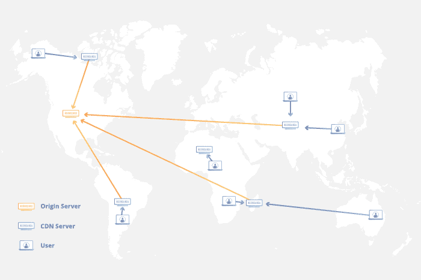
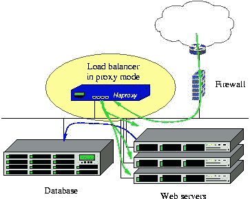

# 游击式扩展您的 Web 应用

> 原文:[https://python . land/deployment/guerrilla-scaling-your-web-application-to-million-users](https://python.land/deployment/guerrilla-scaling-your-web-application-to-millions-of-users)

你正在运行一个网站或网络应用程序，它正在迅速流行起来。问题是:你在用一个便宜的 VPS 运行你的网站。它使用典型的组件，如 MySQL 或 MongoDB，一个 web 服务器，如 Apache 或 Nginx，一些存储，以及一个 web 框架，如 Python Django 或使用 web 服务的单页面应用程序。现在您需要扩展您的 web 应用程序，因为事情正在迅速分崩离析。怎么办？

> 你在廉价的 VPS 上运行你的网站，而事情正在分崩离析。怎么办？

这篇文章讨论了游击式的选择来扩展你的网站，服务更多的用户，而不需要花费数百万，从极其简单和便宜的策略开始。从那里，我们将逐步继续更先进和更昂贵的解决方案。

目录

*   [使用 CDN 扩展您的 web 应用](#Scale_your_web_application_Using_a_CDN "Scale your web application Using a CDN")
*   [扩展您的 web 应用](#Scaling_up_your_web_application "Scaling up your web application")
*   [扩展您的 web 应用](#Scaling_out_your_web_application "Scaling out your web application")
*   [云原生开发](#Cloud-native_development "Cloud-native development")
*   [继续学习](#Keep_learning "Keep learning")

## 使用 CDN 扩展您的 web 应用

CDNs 或内容交付网络非常棒，应该是你扩大规模的第一步。你可能对 CDN 有一个概念，但是让我们更详细地看看它。

### CDN 如何工作

CDN 提供商操作大量的计算机，这些计算机在地理上分布在世界各地。这些通常被称为边缘节点。通常，他们在所有战略上最好的地方都有服务器，这意味着靠近互联网主干网。这些服务器协同工作，向全球用户提供互联网内容。

CDN 通过 DNS 透明地做到这一点，所以你需要让 CDN 为你的网站管理 DNS。现在，如果一个用户在你的网站上请求一个页面，CDN 会确定该用户的位置，并把他指向地理上邻近的服务器的 IP 地址。这个附近的 CDN 服务器识别哪个域地址请求了哪个页面，如果这个页面被缓存，它就向用户提供一个缓存版本。

图片由 [cloudflare](https://www.cloudflare.com/learning/cdn/what-is-a-cdn/)

这是对事物如何工作的一个简化但仍然准确的描述。当然，事实上，幕后还有更多的事情要做。

### CDN 优势

这种方法有几个明显的优点:

*   它**减少了原始服务器(你的廉价 VPS)上的负载**,因为 CDN 将直接从缓存中提供大多数资产，而不会命中原始服务器
*   原始服务器上的**带宽减少**是显著的
*   你将有更快的加载时间，因为缓存的页面和资产就在附近，因此每个人的加载速度都更快，不管他们在哪里。另外，cdn 应用了最先进的传输算法、压缩和(可选的)文件缩小。
*   如今，一个更快的网站意味着更好的谷歌排名，当然也意味着更好的用户体验。

此外，还有一些不太明显的好处:

*   cdn 非常擅长检测 DDoS 攻击，并将保护您的站点免受攻击。
*   一个好的 CDN 就像一个应用防火墙，阻止可疑的请求或要求验证码，以减少未知和可疑机器人的负载。
*   CDN 可以为你提供离线保护:当你的网站宕机或速度太慢时，它仍然会向用户显示网站的缓存副本。
*   最后，CDN 充当你的站点的代理，所以如果配置得好，用户永远不会知道你的站点实际托管在哪里。事实上，您可以禁止 CDN 以外的任何 IP 访问您的 web 服务器，从而大大减少对原始服务器的攻击。

### 什么时候 CDN 是正确的选择？

从 CDN 中获利的关键是缓存。如果每个网站页面都是为每个访问者单独构建的，那么它通常是不可缓存的。或者说，至少，所谓的缓存命中率会很低。因此，一个大部分是静态的网站是一个理想的候选。

然而，许多网站的页面大部分是静态内容，只有一部分是动态的。有了这样一个网站，您仍然可以通过单独提供可缓存部分并使用 JavaScript 异步加载动态部分来从 CDN 中获益。这种设置的一个很好的例子是当一个网站允许评论时。主要的文章、视频或图像是 HTML 页面的一部分，可以很容易地缓存，但是只有当用户一直滚动到最后时，评论才会通过 JavaScript 加载。这对你的服务器*和*用户都有好处，因为他需要提前获取更少的数据。

我个人只有使用 Cloudflare 的经验。Cloudflare 的优点在于，他们提供了一个免费层，在带宽和网站页面数量方面没有限制。这非常符合我们的游击队员攀登网站的目标。如果您使用更高级的选项，如特定的防火墙规则或分析，您将开始付费。

如果你在运行 WordPress(像 40%的网站一样)，他们也有一个插件[，旨在有效地缓存 WordPress](https://www.cloudflare.com/pg-lp/speed-up-wordpress-with-cloudflare-apo) 网站，每月 5 美元，这是我用来托管我的 [Python 教程](https://python.land/python-tutorial)的插件。我可以用这种方式缓存大约 70%的网络请求。虽然不需要，但我仍然可以用一个便宜的 VPS，谷歌和网站测量工具如[灯塔](https://developers.google.com/web/tools/lighthouse)明显提高了加载速度。

*需要澄清的是:我与 Cloudflare 没有任何关系，也没有任何报酬。他们太棒了。*

## 扩展您的网络应用

CDN 可以减轻原始服务器的负载；这是毫无疑问的。但是在某些时候，源服务器仍然会达到它的极限。幸运的是，我们还有另一个简单的诀窍:扩大规模。

我所说的纵向扩展是指为您的应用程序投入更多的硬件，如 CPU 能力和内存。大多数 web 应用程序要么运行在 VPS 上，要么运行在物理硬件上。如果你在一个共享的主机环境中运行，升级到一个专用的 VPS 或服务器将是一个很好的开端。

如果你已经在使用 VPS 或专用硬件，你可以考虑升级它。任何服务器最重要的方面是:

*   CPU 能力:CPU 有多快，更重要的是，有多少个内核？
*   内存:有多少工作内存(RAM)可用？
*   磁盘存储:通常您需要高速固态硬盘

因此，要纵向扩展，您可以寻找更快的 SSD 类型的磁盘、更多的内存和更多的 CPU。此外，您可以考虑在不添加更多服务器的情况下分散负载。例如，您可能希望从不同的磁盘提供静态文件(图像、HTML、CSS)和数据库文件，以提高吞吐量。您可能还想将日志写入单独的磁盘。

如果您想做好这一点，您需要分析您的服务器使用情况，以便首先找到瓶颈。是内存、磁盘速度、CPU 速度，还是这些因素的组合导致速度变慢？或者，如果赶时间，你可以扩大规模，然后期待最好的结果。

Thank you for reading my tutorials. I write these in my free time, and it requires a lot of time and effort. I use ads to keep writing these *free* articles, I hope you understand! **Support me by disabling your adblocker on my website** or, alternatively, **[buy me some coffee](https://www.buymeacoffee.com/pythonland)**. It's much appreciated and allows me to keep working on this site!

### 将服务分散到更多硬件上

同样，这是一个简单的问题。您可以将 web 服务器、数据库、缓存、邮件、搜索引擎和其他服务分散在多台机器上，而不是托管在一台机器上。

大多数 VPS 主机提供虚拟网络，允许您创建专用的后端网络，使用私有 IP 地址连接多个 VPS。通过将您的数据库分离到一台或多台机器上，并将您的网站逻辑托管在另一台机器上，您可以走得更远。

在这种情况下，您可以使用的另一个技巧是寻找负载平衡器。大多数情况下，VPS 提供商提供开箱即用的服务，设置起来并不困难。负载平衡器将负载均匀地分布在多台服务器上，让您可以为更多的访问者提供服务。例如，这些服务器可以是 web 服务器，也可以是数据库的副本服务器。

HAProxy 平衡到多个 web 服务器的连接

如果你使用专用硬件或想要更多的控制，你可能想看看 [HAProxy](https://www.haproxy.org/) 。它是事实上的标准开源负载平衡器，可以平衡 HTTP 和 TCP 连接。

到目前为止，我们已经讨论了一些相对简单的方法来扩展您的 web 应用程序，这些方法可以为您提供一些帮助。然而，当你的流量以每周两倍的速度增长时，它们不会带来很大的不同。你可以扩展的范围是有限的，但是如果你不需要太多的努力就可以做到，这是一种为自己争取时间的廉价方式。同时，您可以制定一个计划，开始从 ***向外扩展*** 。

## 扩展您的 web 应用

当所有其他选项都用尽时，您就到达了扩展的终极方式，称为**水平扩展**，或**向外扩展**。我们不是增强单个服务器，而是开始添加更多的相同的服务器来做大致相同的事情。因此，我们不再使用几台大型服务器，而是使用数十台甚至数百台普通服务器。从理论上讲，您可以向外扩展的范围是无限的。像谷歌、脸书和亚马逊这样的大型科技公司就是这种方式运转良好的活生生的例子。这些公司向整个世界提供服务，显然是根据它们获得的负载量无缝地扩大和缩小服务规模。

放大和缩小的区别([图像源](https://codopia.wordpress.com/tag/scale-up/)

最大的技巧是将负载和数据分散到这些服务器上。它需要分布式算法来允许数据库水平扩展。大量数据的并行处理也是如此。除非你有分布式计算的硕士学位，否则你自己实现它的可能性很小。即使你做到了，你自己或一个小团队也很难做到，如果不是不可能的话。这需要很多知识和很多人。

幸运的是，我们生活在云计算时代，这让我们能够站在巨人的肩膀上。使用微软、谷歌和亚马逊提供的服务来构建水平可伸缩的系统变得相对容易。问题是:它并不便宜！因此，为了忠于文章的标题，在完全求助于云提供商之前，我将提供更多的建议供您考虑。

### 复制和集群

首先成为瓶颈的通常是你的数据库。幸运的是，所有主要的数据库系统都允许某种集群和/或复制。使用这些选项，您可以将数据库负载和存储分布在多台机器上。结合负载均衡器，这可以让你走得更远。

不利的一面是，这样的设置需要大量的工作和系统管理员技能来维护。好处是您可以执行滚动升级之类的操作，这样您就可以在不停机的情况下维护集群。这是可行的，但你需要扎实的 Linux 和网络技能，以及大量的时间来学习和执行，或者花钱雇人来帮你做这件事。

### NoSQL

您可能还想考虑从 SQL 类型的数据库切换到 NoSQL 数据库。后者通常具有更好、更容易的可伸缩性。我个人非常喜欢 Elasticsearch，它可以从小型、廉价的单节点系统无缝扩展到拥有一百个节点的系统。它可以用作文档存储和搜索引擎，甚至可以在其中存储小文件。几种流行的编程语言都有官方客户端，它们将负载分散到整个集群中，因此您不需要负载平衡器。

如果你想了解更多关于 Elasticsearch 的知识，一定要看看我关于它的文章:

*   " [Elasticsearch 教程:动手操作](https://medium.com/tech-explained/getting-hands-on-with-elasticsearch-9969a2894f8a)"
*   "【Elasticsearch 可以存储数据吗？

### 使用混合模型

作为节省时间的替代方案，您可以考虑混合模式。一旦您的数据库开始成为瓶颈，您可以研究许多数据库即服务产品。这些都很贵，但是它们扩展性很好，并且不需要您进行任何维护。这很可能是最好的选择。或者，您可能想冒险改用完全云原生的解决方案。

## 云原生开发

对于云原生开发，我的意思是从底层构建您的应用程序时要考虑到云。基于云的 web 应用程序往往伸缩性很好。在构建云计算时，您可以充分利用云计算的可伸缩性、灵活性和弹性。

### 容器和微服务

云中的大多数应用程序都是使用容器打包的，所以在为云开发时，您会很快发现您需要使用容器。

本质上，容器包含了应用程序及其所有需求，比如系统包和软件依赖。这种容器可以在任何地方运行，从您自己的 PC 到私有云，到大型云提供商，如 Amazon、Azure、Google、Digital Ocean 等等。

为了使这一点更加明确，让我们来看看 Python Django 应用程序是如何打包到容器中的。这种应用程序的容器将包含:

*   一组最小的 Linux 系统文件
*   Python 3 安装
*   Django 和其他必需的包
*   代码本身

类似地，另一个容器或一组容器将运行数据库。或许你会有一整套运行微服务的容器，它们都提供特定的功能。

许多大公司都出现了微服务的分离。好处是小团队可以各自处理单独的服务，在团队和代码库之间创建自然的界限。我只会向大公司推荐微服务方法，有多个团队。如果你是一个小的，只有一个团队，甚至只有一个人的公司，创建所谓的“独石”实际上是一个明智的选择。它们更容易管理，也更容易推理。您总是可以在稍后阶段分离功能。

### 码头工人和库柏工人

Docker 和 Kubernetes 是集装箱领域最著名的品牌。尽管这些系统的使用需要一个学习过程，但这是值得的，因为所有主要的提供商都支持它们，尤其是 Kubernetes。

我以前写过关于容器以及如何[创建容器化的 Python REST API](https://python.land/deployment/containerize-your-project) 。

### 利用云服务

云原生应用通常也使用基于云的服务，比如文件存储和基于云的数据库。一个众所周知的文件存储系统是亚马逊的 S3，也称为云对象存储系统。亚马逊上一个流行的 NoSQL 数据库是 DynamoDB。其他云提供商也提供类似的产品。这些产品具有极强的可扩展性，使用起来非常方便。它们允许真正快速的开发，但是它们也会非常迅速地从你的钱包里抢钱。然而，在许多用例中，成本并不是大问题。例如，当你的收入随着访客数量线性增长时，你可能更喜欢增长和降低复杂性，而不是降低成本。

### 云的优势

对于云解决方案来说，将功能分成容器和微服务是很典型的。基于云的对象存储和数据库的使用也是如此。这样做的好处是，应用程序的所有部分都可以根据需要进行伸缩。每个容器可以作为单个副本运行，但是您可以轻松地添加更多副本，并在所有副本之间平衡负载。

微服务的另一个优势是，它们可以很容易地与新版本交换，只改变整个系统的一部分，从而降低风险。另一个优势是，团队可以各自处理自己的服务，而不会妨碍彼此，从而在团队之间创建自然的界限。例如，一个团队可能更喜欢 Java 栈，而另一个团队更喜欢 Python。只要他们提供一个定义良好的 REST 接口，一切都很好！

## 继续学习

现在，您应该对如何扩展 web 应用程序有了大致的了解。我们从廉价、简单的黑客技术开始，以全面的云原生开发结束。要了解更多，看看大型科技公司能提供什么，以下是一些帮助你入门的链接(排名不分先后):

*   [谷歌云](https://cloud.google.com/)
*   [亚马逊网络服务](https://aws.amazon.com/)
*   [微软 Azure](https://azure.microsoft.com/)

此外，红帽还有一页解释[云原生开发](https://www.redhat.com/en/topics/cloud-native-apps)。最后，还有维基百科。从关于[云计算](https://en.wikipedia.org/wiki/Cloud_native_computing)的文章开始。