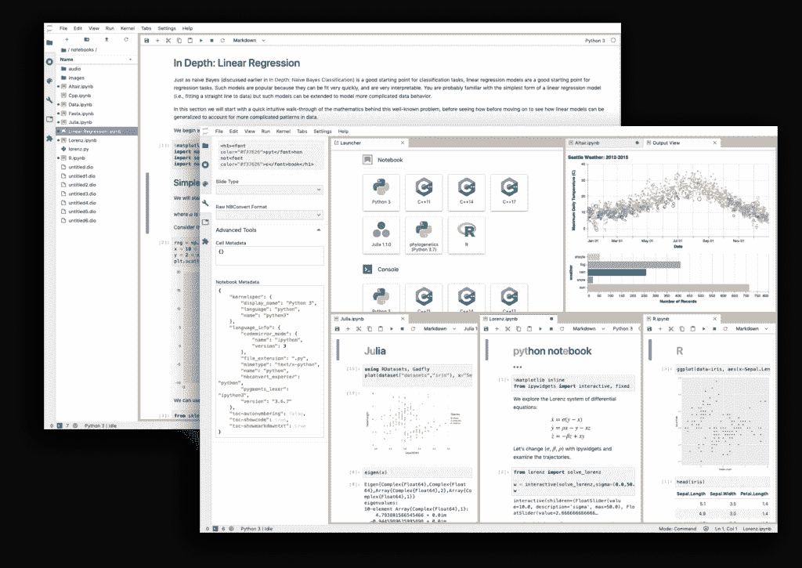

# 用于数据科学的 Python:学习路线图

> 原文:[https://python.land/data-science](https://python.land/data-science)

Python 是大部分数据科学社区选择的语言。本文是学习 Python 用于数据科学的路线图。它适合刚起步的数据科学家，也适合那些已经想学习更多关于使用 Python 进行数据科学的人。

我们将浏览数据科学家使用的所有基本元素，同时提供更全面解释的链接。这样，你可以跳过你已经知道的东西，直接进入你不知道的东西。在这个过程中，我将向您介绍数据科学社区使用的基本 Python 包。

我建议你把这一页加入书签，这样你就可以很容易地返回。最后但同样重要的是:这一页是一个持续的工作进展。我会添加内容和链接，我也希望得到您的反馈。所以，如果你在旅途中发现了你认为也属于这里的东西，不要犹豫，给我发信息。

目录


*   [什么是数据科学？](#What_is_Data_Science "What is Data Science?")
*   [学习 Python](#Learn_Python "Learn Python")
*   [学习命令行](#Learn_the_command-line "Learn the command-line")
*   [数据科学工作环境](#A_Data_Science_Working_environment "A Data Science Working environment")
*   [读取数据](#Reading_data "Reading data")
*   [捣鼓数据](#Crunching_data "Crunching data")
*   [可视化](#Visualization "Visualization")
*   [继续学习](#Keep_learning "Keep learning")


## 什么是数据科学？

不过，在我们开始之前，我想更正式地描述一下我所看到的数据科学。虽然我假设您对什么是数据科学有一个大致的概念，但更具体地定义它仍然是一个好主意。它还会帮助我们定义一个清晰的学习路径。

您可能知道，很难给数据科学家下一个单一的、包罗万象的定义。如果我们问十个人，我肯定会得出至少十一种不同的数据科学定义。所以这是我的看法。

### 使用数据

成为一名数据科学家意味着对几个领域了如指掌。但最重要的是，你必须熟悉数据。数据有哪些种类，如何存储，如何检索？是实时数据还是历史数据？可以用 SQL 查询吗？是文本、图像、视频，还是这些的组合？

您如何管理和处理您的数据取决于许多属性或质量，这使我们能够更准确地描述它。这些也称为数据的五个 V:

*   **卷**:有多少数据？
*   **速度**:数据流动的速度有多快？它的时效性如何(例如，它是实时数据吗？)
*   **多样性**:数据有不同的类型和来源，还是只有一种类型？
*   **准确性**:数据质量；是否完整，是否容易解析，是否源源不断？
*   **Value** :在所有处理结束时，数据给表带来了什么价值？思考对管理有用的见解。

尽管在数据工程和大数据领域，你会更经常地听到这五个 V，但我坚信它们适用于所有专业领域，是看待数据的一种好方法。

### 编程/脚本

为了读取、处理和存储数据，您需要具备基本的编程技能。你不需要成为一名软件工程师，你可能也不需要了解软件设计之类的知识，但是你需要一定水平的脚本技能。

对于数据科学家来说，有很多奇妙的库和工具。对于许多数据科学工作来说，你需要做的就是结合正确的工具和库。但是，要做到这一点，您需要了解一种或多种编程语言。Python 已经证明了自己是数据科学的理想语言，原因有几个:

*   这很容易学
*   您可以交互地使用它，也可以以脚本的形式使用它
*   有(字面上的)大量有用的库

数据科学界最初接受 Python 是有原因的。然而，在过去几年中，许多新的超级有用的 Python 库专门针对数据科学而出现。

### 数学和统计学

如果上述技能本身还不够难，你还需要相当好的数学、统计学和科学工作的知识。

### 形象化

最终，你想要向你的团队、你的经理或全世界展示你的成果！为此，你需要将你的结果可视化。您需要了解如何在地图上创建基本的图表、饼图、直方图和封装数据。

### 专家知识

每个工作领域都有或要求:

*   特定术语，
*   它自己的规章制度，
*   专家知识。

一般来说，你需要深入了解一个领域是如何形成的。不了解基本术语和规则，就无法分析特定专业领域的数据。

### 那么什么是数据科学家呢？

回到我们最初的问题:什么是数据科学？或者:是什么让一个人成为数据科学家？你至少需要具备上述所有学科领域的基本技能。每位数据科学家都有不同程度的这些技能。你可以在一个方面很强，在另一个方面很弱。没关系。

例如，如果你有数学背景，你会在数学方面表现出色，但也许你最初会在处理数据时遇到困难。另一方面，一些数据科学家来自人工智能/机器学习领域，将倾向于这部分工作，而不是其他部分。没太大关系:最后，我们都需要学习，需要补缺。这种差异正是这个领域令人兴奋并充满学习机会的原因！

## 学习 Python

想用 Python 做数据科学的第一站:学习 Python。如果您对 Python 完全陌生，首先开始学习语言本身:

*   从我的[免费 Python 教程](https://python.land/python-tutorial)或高级 [Python 初学者课程](https://python.land/product/python-course)开始
*   查看我们的 [Python 学习资源](https://python.land/python-resources)页面，获取书籍和其他有用的网站

## 学习命令行

如果您习惯使用命令行，这会很有帮助。这是你必须开始并习惯的事情之一。一旦你这样做了，你会发现你会越来越多地使用它，因为它比任何事情都使用图形用户界面要有效得多。使用命令行将使您成为一个更加多才多艺的计算机用户，并且您将很快发现，一些命令行工具可以完成否则将是一个庞大、丑陋的脚本和一整天的工作。

Thank you for reading my tutorials. I write these in my free time, and it requires a lot of time and effort. I use ads to keep writing these *free* articles, I hope you understand! **Support me by disabling your adblocker on my website** or, alternatively, **[buy me some coffee](https://www.buymeacoffee.com/pythonland)**. It's much appreciated and allows me to keep working on this site!

好消息是:这并不像你想象的那么难。我们在这个网站上有一个相当广泛的章节，关于使用 Unix 命令行、[你需要知道的基本 shell 命令](https://python.land/the-unix-shell/basic-unix-commands)、[创建 shell 脚本](https://python.land/the-unix-shell/creating-bash-scripts)，甚至 Bash 多重处理！我强烈建议你去看看。

## 数据科学工作环境

将 Python 用于数据科学大致有两种方式:

1.  创建和运行脚本
2.  使用交互式外壳，如 REPL 或笔记本



Jupyter Lab

交互式笔记本在数据科学社区中已经变得非常流行，但是您当然不应该排除使用简单的 Python 脚本来完成一些繁重工作的可能性。两者都有自己的位置。

查看我们关于 [Jupyter 笔记本](https://python.land/data-science/jupyter-notebook)优势的详细文章。您将了解将它用于数据科学的优势、它的工作原理以及如何安装它。在那里，您还将了解什么时候笔记本是正确的选择，什么时候写脚本更好。

## 读取数据

有很多方法可以得到你需要分析的数据。我们将快速浏览获取数据的最常见方法，我将向您推荐一些最好的库来完成这项工作。

### 来自本地文件的数据

通常，数据会存储在一个文件系统中，所以你需要能够用 Python 打开和读取文件。如果数据是 JSON 格式的，你需要一个 [Python JSON 解析器](https://python.land/data-processing/working-with-json)。Python 本身就可以做到这一点。如果你需要读取 YAML 数据，还有一个 [Python YAML 解析器](https://python.land/data-processing/python-yaml)。

### 来自 API 的数据

数据通常会通过 REST API 提供给你。在 Python 的世界中，通过 HTTP 获取数据的最常用和最用户友好的库之一叫做 Requests。对于请求，从 API 获取数据可以像这样简单:

```py
>>> import requests
>>> data = requests.get('https://some-weather-service.example/api/historic/2020-04-06')
>>> data.json()
[{'ts':'2020-04-06T00:00:00', 'temperature': 12.5, .... }]
```

这是绝对基本的用例，但是当你需要发布数据，当你需要登录一个 API，等等时，请求也包括在内。在[请求网站](https://docs.python-requests.org/en/master/user/quickstart/)本身和 StackOverflow 这样的网站上会有很多例子。

### 从万维网抓取数据

有时，数据无法通过易于解析的 API 获得，只能从网站获得。如果数据只能从网站上获得，您将需要从原始的 HTML 和 JavaScript 中检索它。这样做就叫刮，可能会很辛苦。但是就像所有事情一样，Python 生态系统已经覆盖了你！

但是，在考虑收集数据之前，您需要了解一些事情:

*   一个网站的结构可以在没有通知的情况下改变。没有任何保证，所以你的铲运机随时可能坏掉。
*   不是所有的网站都允许你刮。有些网站会主动尝试检测抓取器并屏蔽。
*   即使一个网站允许抓取(或者不关心)，你也有责任以一种有序的方式这样做。仅仅通过在短时间内发出许多请求，用一个简单的 Python 脚本关闭一个站点并不困难。请意识到你这样做可能会触犯法律。一个不太极端的结果是，你的 IP 地址将被终身禁止出现在该网站上(也可能出现在其他网站上)
*   大多数网站都提供了一个 [robots.txt](https://en.wikipedia.org/wiki/Robots_exclusion_standard) 文件。你应该尊重这样的文件。

好的抓取器会有选项来限制所谓的抓取率，并会选择尊重 robots.txt 文件。理论上，你可以创建你自己的 scraper，例如，Requests 库，但是我强烈建议不要这样做。工作量很大，而且很容易搞砸，被封杀。

相反，你应该看看 [Scrapy](https://scrapy.org/) ，这是一个成熟的，易于使用的库，用于构建高质量的 web scraper。

## 捣鼓数据

Python 在数据科学领域如此受欢迎的原因之一是以下两个库:

1.  [NumPy](https://python.land/data-science/numpy) :“用 Python 进行科学计算的基础包。”
2.  Pandas:“一个快速、强大、灵活且易于使用的开源数据分析和操作工具。”

让我们更详细地看看这两个！

### NumPy

NumPy 的优势在于处理数据数组。这些可以是一维数组、多维数组和矩阵。NumPy 还提供了许多可以应用于这些数据结构的数学运算。

NumPy 的核心功能大部分是用 C 实现的，这使得它比普通的 Python 代码快得多。因此，只要您使用 NumPy 数组和操作，您的代码就可以和用快速编译语言做同样操作的人一样快，甚至更快。你可以在我的[NumPy](https://python.land/data-science/numpy)介绍中了解更多。

### 熊猫

像 NumPy 一样，Pandas 为我们提供了高效处理内存数据的方法。这两个库在功能上有重叠。一个重要的区别是熊猫为我们提供了一种叫做数据框架的东西。数据框类似于电子表格的工作方式，您可能知道其他语言的数据框，比如 r。

Pandas 是处理表格数据的合适工具，比如存储在电子表格或数据库中的数据。熊猫将帮助你探索、清理和处理你的数据。

## 可视化

每个 Python 数据科学家都需要在某个时候可视化他或她的结果，有许多方法可以用 Python 可视化您的工作。然而，如果只允许我推荐一个库，那将是一个相对较新的库:Streamlit。

### 细流

Streamlit 如此强大，值得单独撰写一篇文章来展示它所提供的功能。总结一下:Streamlit 允许您将任何脚本转换成成熟的交互式 web 应用程序，而无需了解 HTML、CSS 和 JavaScript。所有这些只需要几行代码。它真的很强大。去看看 Streamlit 吧！

Streamlit 在内部使用了许多众所周知的包。你可以选择使用它们，但是 Streamlit 让使用它们变得更加容易。Streamlit 的另一个很酷的特性是，大多数图表允许您轻松地将它们导出为图像或 CSV 文件。

### 破折号

另一个比较成熟的产品是 Dash。像 Streamlit 一样，它允许您创建和托管 web 应用程序来快速可视化数据。要了解 Dash 能做什么，请阅读他们的文档。

## 继续学习

你可以在这里免费阅读 Jake Vanderplas 的《数据科学的 Python》一书。这本书是 2016 年的，所以有点过时了。比如当时，Streamlit 还不存在。此外，这本书解释了 [IPython](https://python.land/using-ipython) ，它是现在 [Jupyter 笔记本](https://python.land/data-science/jupyter-notebook)的核心。功能基本相同，所以还是有用的。