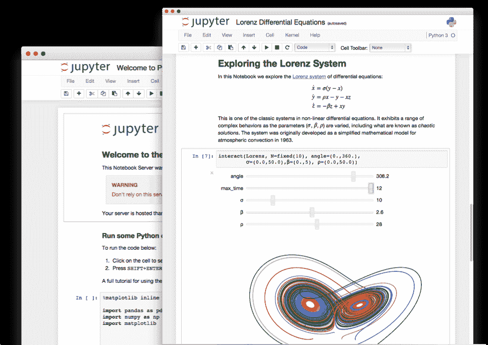
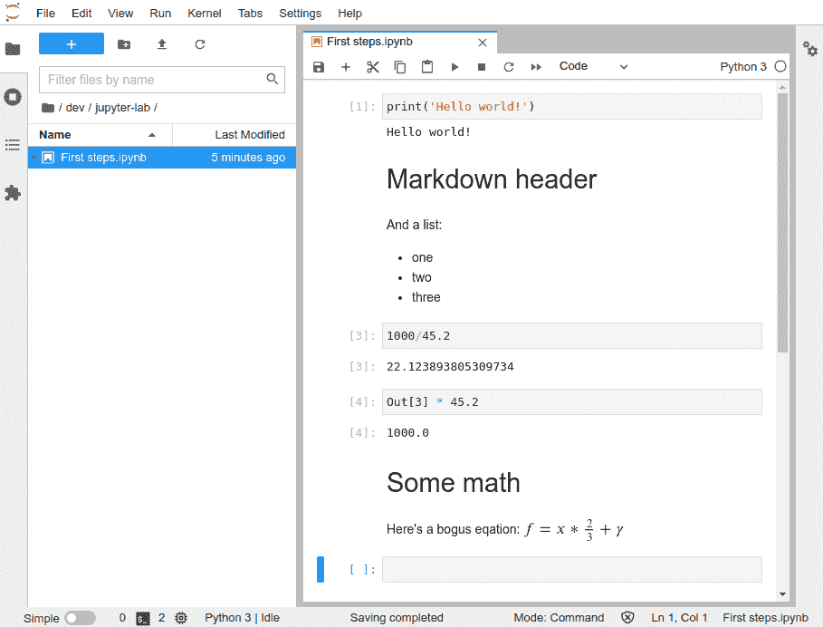
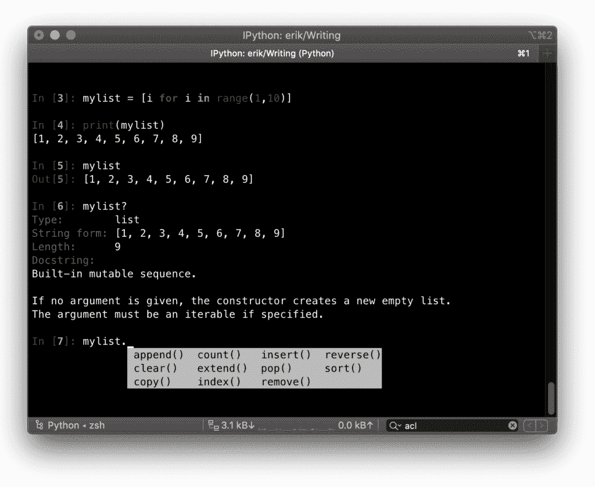
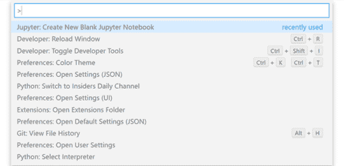

# Jupyter 笔记本:如何安装和使用

> 原文:[https://python.land/data-science/jupyter-notebook](https://python.land/data-science/jupyter-notebook)

了解 Jupyter Notebook，它是 Jupyter 实验室交互式 IDE 的一部分，是数据科学的理想选择。我们将探索使用它优于常规 IDE 的优势，向您展示如何安装 Jupyter Notebook 和 Jupyter Lab，并演示它的功能。

目录


*   [Jupyter 实验室 vs Jupyter 笔记型电脑](#Jupyter_Lab_vs_Jupyter_Notebook "Jupyter Lab vs Jupyter Notebook")
*   [使用 Jupyter Lab 和笔记本的优势](#Advantages_of_using_Jupyter_Lab_and_Notebook "Advantages of using Jupyter Lab and Notebook")
*   [如何安装 Jupyter 笔记本和实验室](#How_to_install_Jupyter_Notebook_and_Lab "How to install Jupyter Notebook and Lab")
*   [开始探索木星实验室](#Start_and_explore_JupyterLab "Start and explore JupyterLab")
*   [你在笔记本上的第一步](#Your_first_steps_in_a_Notebook "Your first steps in a Notebook")
*   [JupyterLab plugins](#JupyterLab_plugins "JupyterLab plugins")
*   [IPython](#IPython "IPython")
*   [vscode](#Jupyter_Notebook_in_VSCode "Jupyter Notebook in VSCode")中的 Jupyter 笔记本电脑
*   [继续学习](#Keep_learning "Keep learning")


## Jupyter 实验室 vs Jupyter 笔记型电脑

JupyterLab 是一个基于 web 的交互式开发环境。它最出名的是提供了一种叫做 Jupyter Notebook 的所谓笔记本，但你也可以用它来创建和编辑其他文件，如代码、文本文件和 [markdown](https://markdown.land/) 文件。此外，它允许您像大多数 ide 一样打开一个 Python 终端来进行试验和修补。

JupyterLab 非常灵活:您可以配置和安排用户界面，以支持[数据科学](https://python.land/data-science)、科学计算和机器学习中的广泛工作流。它也是可扩展的:每个人都可以编写插件来添加新组件并与现有组件集成。

JupyterLab 支持 40 多种其他编程语言，比如 Java、Scala、Julia 和 r。

另一方面，Jupyter Notebook 是一个类似 REPL 的环境，融合了代码、数据和文档。所以简而言之，JupyterLab 就是基于浏览器的 IDE，而 Jupyter Notebook 就是里面的笔记本组件。如果你愿意，你可以单独安装 Jupyter Notebook，我将在本文中向你展示如何安装。

## 使用 Jupyter Lab 和笔记本的优势

Python 应用程序开发人员通常更喜欢使用像 VSCode 这样的常规 Python IDE，它有助于调试、单元测试、部署和版本管理。相比之下，(数据)科学家和数据分析师有不同的关注点，通常更喜欢笔记本风格的 IDE。让我们来看看这些笔记本电脑提供的一些优势。

### 组合并记录代码和结果

使用笔记本电脑的最大优势在于，它允许您将三样东西结合到一个环境中:

1.  文档，
2.  代码，
3.  结果

同时提供一个互动的环境，你或你的同伴可以修补和实验。下图完美地展示了这一点:



结合了文档、输出和代码的 Jupyter 笔记本

### 互动探索

笔记本允许您以交互方式浏览数据。在这样做的时候，笔记本是你做了什么和你如何做的日志。配合 [NumPy](https://python.land/data-science/numpy) 和熊猫使用最理想。所以笔记本比普通的 ide 更适合那些处理和分析数据的人。然而，一些 ide，比如 VSCode，将提供一个内置的 Jupyter Notebook(参见本文后面的内容)。

### 这是其他人用的

有时候顺其自然会有帮助。在这种情况下，你会注意到[数据科学](https://python.land/data-science)中的许多其他人使用 Jupyter 笔记本。这本身有几个优点:

*   很容易交流分享自己的作品。
*   许多插件是由数据科学家同事创建的，专门针对像你这样的人。

## 如何安装 Jupyter 笔记本和实验室

像所有 Python 软件一样，安装 Jupyter Lab 轻而易举。我将演示如何安装 Pip 和 Conda。事先要注意一件事:我建议在系统范围内安装这个。对于大多数软件包，我强调使用虚拟环境的重要性。然而，像这样的工具你想安装一次。

### 用 Pip 安装 Jupyter 实验室和/或笔记本电脑

如上所述，您希望在系统范围内安装 Jupyter Lab，或者至少在您的本地 bin 文件夹中。使用 Pip 全局安装软件包需要`**-g**`选项。然而，在许多 Linux 系统上，如果您没有指定 **-g** ，并且如果您没有使用[虚拟环境](https://python.land/virtual-environments/virtualenv)，Pip 会将软件包安装在一个`.local/bin`文件夹中。您可以通过使用`--user`选项来强制这种行为。这样做的好处是，您不需要 root 权限就可以访问您正在使用的系统。

因此，安装 Jupyter Lab 最推荐的方法是使用 [pip install](https://python.land/virtual-environments/installing-packages-with-pip) 命令:

```py
$ pip install --user jupyterlab
```

如果你只想要 Jupyter 笔记本，用这个代替:

```py
$ pip install --user notebook
```

### 用 Conda 安装 JupyterLab

JupyterLab 也可以安装`mamba`和`conda`:

```py
$ mamba install -c conda-forge jupyterlab

or...

$ conda install -c conda-forge jupyterlab

```

与 Pip 一样，如果您只想安装 Jupyter 笔记本，请使用以下命令:

```py
$ mamba install -c conda-forge notebook

or...

$ conda install -c conda-forge notebook

```

## 开始探索木星实验室

### 如何从命令行打开 Jupyter 实验室

如果您按照安装说明进行操作，您应该能够使用以下命令启动 Jupyter Lab:

```py
$ jupyter-lab

(a bunch of log message will follow)
```

### 如何从命令行打开 Jupyter 笔记本

如果您只想启动一个笔记本，请使用:

```py
$ jupyter-notebook

(a bunch of log message will follow)
```

### 添加到您的路径

如果您得到一个类似“命令未找到”的错误，不要惊慌。不幸的是，有些系统在`$PATH`变量中没有`.local/bin`目录。在 Linux 和 OS X 上，一个快速的解决方法是像这样临时添加它:

`PATH="$HOME/.local/bin:$PATH"`

但是，这只有在您保持终端窗口打开的情况下才有效。因此，为了永久保存，我建议在您的`~/.profile`文件末尾添加以下代码片段:

```py
# set PATH so it includes user's private bin if it exists
if [ -d "$HOME/.local/bin" ] ; then
    PATH="$HOME/.local/bin:$PATH"
fi
```

它所做的只是将`.local/bin`文件夹添加到路径中，但前提是它确实存在。

当您登录到您的系统时，`.profile`文件被加载一次。您可能需要注销并登录才能应用更改。如果您使用 zsh 而不是 Bash(目前 zsh 是 MacOS 上的缺省值)，您可能想尝试将 about 的代码片段添加到一个名为`.zprofile`的文件中。

## 你在笔记本上的第一步

如果你启动 Jupyter Lab 或 Notebook，它会自动打开你的浏览器。如果没有，可以手动转到 http://localhost:8888/打开。在那里，创建一个新的笔记本，例如通过点击**文件- >新建- >笔记本**。

在下面的截图中，我创建了一个名为“第一步”的新笔记本。有几件值得注意的事情:

*   你输入放在一个“单元格”里，每个单元格都有编号
*   您可以通过使用`In`和`Out`数组来访问之前的单元格。例如，下面示例中的`Out[3]`给出了`In[3]`单元格中表达式的输出
*   您还可以将单元格类型更改为 Markdown，有关这方面的更多信息，请参见下文
*   如果你想应用或执行你的单元格，按 **Shift + Enter** 。



一个简单的 Jupyter 笔记本

### 细胞类型

在笔记本的顶部，有一个下拉菜单，允许您更改单元格类型。现在你需要关心的是“Python”和“Markdown”类型。

#### 计算机编程语言

Python 单元格包含 Python 代码。这可以是任何有效的代码，因此所有这些都是允许的:

*   一行简单的代码
*   一个 [Python 导入](https://python.land/project-structure/python-modules)语句
*   一个[功能定义](https://python.land/introduction-to-python/functions#Creating_a_Python_function)
*   完整的类定义
*   等等！

#### 降价

Markdown 是一种创建格式化文本的轻量级标记语言。您可以使用它来创建标题、列表、代码片段和您能想到的大多数其他东西。例如，如果您曾经在 GitHub 上创建过 README.md 文件，您可能会对它很熟悉。

Markdown 非常适合在笔记本上添加文档。对大多数人来说，使用[减价备忘单](https://markdown.land/markdown-cheat-sheet)就足以快速入门。

#### 公式

您也可以使用 Markdown 输入好看的公式。在内部，Jupyter 使用 [MathJax](https://docs.mathjax.org/en/latest/) 来格式化和显示公式。公式以单美元符号或双美元符号开始和结束:

*   `$ .... $`:内嵌；该公式与当前句子的其余部分一致
*   `$$ .. $$`:显示模式；这个公式在正文的其余部分中很突出

在里面，你需要输入一个基于 TeX 的等式。如果你想看到所有的选项并玩这些方程，我推荐这个[网站，它提供了一个 Tex 方程编辑器](http://atomurl.net/math/)。

## JupyterLab plugins

如果你点击屏幕左边的拼图图标，你会得到一个可以直接安装的插件列表。有许多插件，其中许多会增加额外的可视化功能或与 Tableau 等产品的集成。

## IPython

在内部，Jupyter 笔记本使用了一个名为 [IPython](https://python.land/using-ipython) 的项目。如果你倾向于经常使用 [Python REPL](https://python.land/introduction-to-python/the-repl) ，我推荐你阅读我们在 IPython 上的[页面，因为它是常规 REPL 的一个很好的替代品。我个人用的很多，怎么推荐都不够！例如，仅仅因为它出色的自动完成功能，它就是值得的，如果你习惯于 Jupyter 笔记本，显然你会有宾至如归的感觉。](https://python.land/using-ipython)



IPython 在运行

## vscode 中的 Jupyter 笔记本电脑

如果你和我一样是 VSCode 的粉丝，你需要看看 VSCode 的扩展，它允许你直接在 VSCode 标签中创建和使用笔记本。如果您打开命令托盘，例如使用 **ctrl + shift + p** ，开始输入“Jupyter”来创建、打开和导出笔记本。



从 VSCode 创建新的 Jupyter 笔记本

## 继续学习

访问[官方项目网站](https://jupyter.org/)，获取关于 Jupyter Lab 和 Jupyter Notebook 的最新新闻和文档总是值得的。