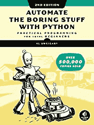
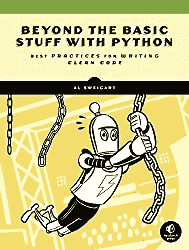
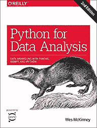

# Python 学习资源

> 原文:[https://python.land/python-resources](https://python.land/python-resources)

这是个人挑选的 Python 学习资源的集合，按知识水平排序。他们都很棒，所以一定要探索这些！这些链接大多是免费(无报酬)资源。甚至这里的一些书都有免费版本。

目录

*   [初学者学习资源](#Beginner_learning_resources "Beginner learning resources")
*   [中级 Python 资源](#Intermediate_level_Python_resources "Intermediate level Python resources")
*   [学习 Python 的书籍](#Books_for_learning_Python "Books for learning Python")
*   [数据分析 Python 书籍](#Data_Analysis_Python_books "Data Analysis Python books")

## 初学者学习资源

以下链接都是免费的 Python 学习资源，针对初学者。如果你刚刚开始使用 Python，这些是给你的！

*   [**我们的 Python 初学者教程**](https://python.land/python-tutorial)——这是开始学习 Python 的最好地方！
*   ——一本伟大的书，被许多人推荐，如果你想的话，可以免费阅读(知识共享许可)。还有一个付费版本；参见下面的书籍部分。
*   **[官方 Python 文档](https://docs.python.org/3/)**——这些文档是按版本组织的，是一个很棒的、相当完整的资源，我发现自己要回顾的比我想承认的还要多。

## 中级 Python 资源

这些 Python 学习资源是针对中级水平的。如果你能写一个 Python 程序并知道基础知识，这些对提高你的技能和加深你的知识是非常好的。

Thank you for reading my tutorials. I write these in my free time, and it requires a lot of time and effort. I use ads to keep writing these *free* articles, I hope you understand! **Support me by disabling your adblocker on my website** or, alternatively, **[buy me some coffee](https://www.buymeacoffee.com/pythonland)**. It's much appreciated and allows me to keep working on this site!

*   [**全栈 Python**](https://www.fullstackpython.com/)——了解创建、部署和操作 Python 驱动的应用所需的一切。这个网站也有书的形式！
*   [**Python 风格的元素**](https://github.com/amontalenti/elements-of-python-style)——本文超越了 PEP8，涵盖了伟大 Python 风格的核心。它有点固执己见，超越了简单的语法和模块布局问题，进入了范例、组织和架构领域。

## 学习 Python 的书籍

这是我推荐给所有 Python 初学者的精选书籍。如果你决定使用下面的链接购买这本书，Python Land 会从亚马逊获得一小笔佣金，不需要你额外付费。如果你想支持我们，请使用链接！

在这本全面修订的畅销经典*的第二版中，你将学习如何使用 Python 编写程序，在几分钟内完成手工需要几个小时才能完成的事情——不需要任何编程经验。您将学习 Python 的基础知识，并探索 Python 丰富的模块库来执行特定的任务，如从网站上抓取数据、阅读 PDF 和 Word 文档，以及自动执行点击和键入任务。*

不仅仅是编写干净代码的高级语法和熟练技巧的集合，您将学习如何通过使用命令行和其他专业工具(如代码格式化程序、类型检查器、linters 和版本控制)来提高您的 Python 编程技能。Sweigart 带您了解设置开发环境、命名变量和提高可读性的最佳实践，然后处理文档、组织和性能测量，以及面向对象的设计和编码面试中常用的 Big-O 算法分析。

## 数据分析 Python 书籍

获取在 Python 中操作、处理、清理和处理数据集的完整说明。针对 Python 3.6 进行了更新，该实践指南的第二版包含大量实际案例研究，向您展示如何有效地解决一系列数据分析问题。在这个过程中你会学到熊猫、NumPy、IPython、Jupyter 的最新版本。

这本书由 Python 熊猫项目的创始人 Wes McKinney 撰写，是对 Python 中的数据科学工具的实用、现代介绍。它非常适合刚接触 Python 的分析师和刚接触数据科学和科学计算的 Python 程序员。