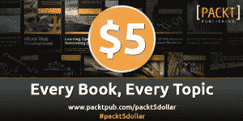

# 来自 Packt 的 5 美元 Python 书籍

> 原文：<https://www.blog.pythonlibrary.org/2014/12/19/5-python-books-from-packt/>

Packt Publishing 最近联系我，让我知道他们的网站上所有的电子书和视频都以 5 美元的价格出售。因为他们有很多不同的 Python 和 Python 相关的书籍，我想我的读者可能想知道那次销售。这是他们的新闻稿:

继去年的节日促销活动取得成功后，Packt Publishing 将推出更大的 5 美元促销活动来庆祝节日。从**12 月 18 日星期四**开始，每本电子书和视频都将在出版商的网站上出售，价格仅为 5 美元。顾客被邀请在 1 月 6 日星期二的**优惠结束前尽可能多地购买，这是在 2015 年开始之际尝试新事物或让你的技能更上一层楼的绝佳机会。由于所有 5 美元的产品都有多种格式和无数字版权管理，客户将在今年圣诞节和新年期间在 Packt 的网站上找到他们想要的超值内容。**

在 www.packtpub.com/packt5dollar 了解更多信息