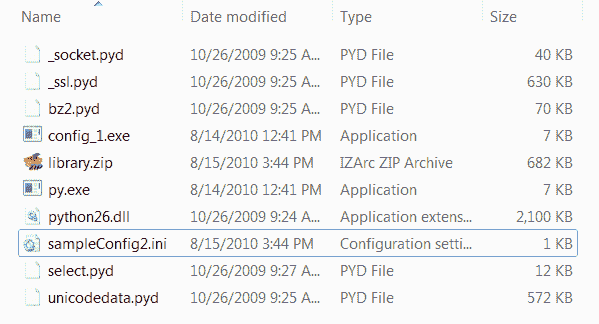

# 一个 bbfreeze 教程——构建二进制系列！

> 原文：<https://www.blog.pythonlibrary.org/2010/08/19/a-bbfreeze-tutorial-build-a-binary-series/>

bbfreeze 包也允许我们创建二进制文件，但是只能在 Linux 和 Windows 上。这只是一个简单的安装工具，所以如果您打算按照本文中的示例进行操作，您应该去获取它。bbfreeze 包包含 egg 支持，因此它可以在二进制文件中包含 egg 依赖项，这与 py2exe 不同。你也可以一次冻结多个脚本，包括 Python 解释器等等。根据 bbfreeze 的 PyPI 条目，它只在 Python 2.4-2.5 中测试过，所以要记住这一点。然而，我能够在 Python 2.6 中使用它，没有明显的问题。

## bbfreeze 入门

您可以使用 easy_install 下载并安装 bbfreeze，也可以直接从 [Python 包索引](http://pypi.python.org/pypi/bbfreeze/) (PyPI)下载它的源代码或 egg 文件。在本文中，我们将尝试在一个简单的配置文件生成器脚本中使用它，我们还将在一个蹩脚的 wxPython 程序中使用它。我的测试机器是一台 Windows 7 家庭版 32 位笔记本电脑，安装了 bbfreeze 0.96.5 和 Python 2.6.4。让我们从配置脚本开始:

```py

# config_1.py
import configobj

#----------------------------------------------------------------------
def createConfig(configFile):
    """
    Create the configuration file
    """
    config = configobj.ConfigObj()
    inifile = configFile
    config.filename = inifile
    config['server'] = "http://www.google.com"
    config['username'] = "mike"
    config['password'] = "dingbat"
    config['update interval'] = 2
    config.write()

#----------------------------------------------------------------------
def getConfig(configFile):
    """
    Open the config file and return a configobj
    """    
    return configobj.ConfigObj(configFile)

def createConfig2(path):
    """
    Create a config file
    """
    config = configobj.ConfigObj()
    config.filename = path
    config["Sony"] = {}
    config["Sony"]["product"] = "Sony PS3"
    config["Sony"]["accessories"] = ['controller', 'eye', 'memory stick']
    config["Sony"]["retail price"] = "$400"
    config.write()

if __name__ == "__main__":
    createConfig2("sampleConfig2.ini")

```

这个脚本有几个没有意义的函数，但是为了便于说明，我们将把它们留在这里。根据 bbfreeze 文档，我们应该能够在命令行中键入以下字符串来创建二进制文件:

 `bb-freeze config_1.py` 

这假设您的路径上有“C:\Python26\Scripts”。否则，您需要键入完整的路径(例如“C:\ python 26 \ Scripts \ b B- freeze config _ 1 . py”)。当我运行这个时，我得到了一个错误。这是:

```py

Traceback (most recent call last):
  File "C:\Python26\Scripts\bb-freeze-script.py", line 8, in load_entry_point('bbfreeze==0.96.5', 'console_scripts', 'bb-freeze')()
  File "C:\Python26\lib\site-packages\bbfreeze-0.96.5-py2.6-win32.egg\bbfreeze\__init__.py", line 18, in main
    f()
  File "C:\Python26\lib\site-packages\bbfreeze-0.96.5-py2.6-win32.egg\bbfreeze\freezer.py", line 474, in __call__
    self.addModule("encodings.*")
  File "C:\Python26\lib\site-packages\bbfreeze-0.96.5-py2.6-win32.egg\bbfreeze\freezer.py", line 411, in addModule
    self.mf.import_hook(name[:-2], fromlist="*")
  File "C:\Python26\lib\site-packages\bbfreeze-0.96.5-py2.6-win32.egg\bbfreeze\modulegraph\modulegraph.py", line 256, in import_hook
    modules.update(self.ensure_fromlist(m, fromlist))
  File "C:\Python26\lib\site-packages\bbfreeze-0.96.5-py2.6-win32.egg\bbfreeze\modulegraph\modulegraph.py", line 345, in ensure_fromlist
    fromlist.update(self.find_all_submodules(m))
  File "C:\Python26\lib\site-packages\bbfreeze-0.96.5-py2.6-win32.egg\bbfreeze\modulegraph\modulegraph.py", line 369, in find_all_submodules
    for (path, mode, typ) in ifilter(None, imap(moduleInfoForPath, names)):
NameError: global name 'ifilter' is not defined 
```

“modulegraph.py”文件似乎缺少从 Python 中包含的 [itertools](http://docs.python.org/library/itertools.html) 库中导入的内容。我编辑了我的“modulegraph.py”副本，在文件的顶部添加了下面一行:“从 itertools 导入 ifilter”。这消除了追溯，但也带来了另一个问题，因为“imap”也没有定义。为了修复第二个错误，我将导入改为“从 itertools 导入 ifilter，imap ”,然后它运行起来没有任何问题，并在“dist”文件夹中生成了一个二进制文件以及其他九个文件(见下面的截图)。

[](https://www.blog.pythonlibrary.org/wp-content/uploads/2010/08/bbfreeze_dir.png)

## 使用 bbfreeze 的高级配置

bbfreeze 的 PyPI 页面(也是它的主页)几乎没有文档。然而，页面上确实说使用 bbfreeze 的首选方式是使用小脚本。我们将尝试使用前面提到的蹩脚的 wxPython 创建一个二进制文件。以下是 wx 代码:

```py

import wx

########################################################################
class DemoPanel(wx.Panel):
    """"""

    #----------------------------------------------------------------------
    def __init__(self, parent):
        """Constructor"""
        wx.Panel.__init__(self, parent)

        labels = ["Name", "Address", "City", "State", "Zip",
                  "Phone", "Email", "Notes"]

        mainSizer = wx.BoxSizer(wx.VERTICAL)
        lbl = wx.StaticText(self, label="Please enter your information here:")
        lbl.SetFont(wx.Font(12, wx.SWISS, wx.NORMAL, wx.BOLD))
        mainSizer.Add(lbl, 0, wx.ALL, 5)
        for lbl in labels:
            sizer = self.buildControls(lbl)
            mainSizer.Add(sizer, 1, wx.EXPAND)
        self.SetSizer(mainSizer)
        mainSizer.Layout()

    #----------------------------------------------------------------------
    def buildControls(self, label):
        """"""
        sizer = wx.BoxSizer(wx.HORIZONTAL)
        size = (80,40)
        font = wx.Font(12, wx.SWISS, wx.NORMAL, wx.BOLD)

        lbl = wx.StaticText(self, label=label, size=size)
        lbl.SetFont(font)
        sizer.Add(lbl, 0, wx.ALL|wx.CENTER, 5)
        if label != "Notes":
            txt = wx.TextCtrl(self, name=label)
        else:
            txt = wx.TextCtrl(self, style=wx.TE_MULTILINE, name=label)
        sizer.Add(txt, 1, wx.ALL, 5)
        return sizer

########################################################################
class DemoFrame(wx.Frame):
    """
    Frame that holds all other widgets
    """

    #----------------------------------------------------------------------
    def __init__(self):
        """Constructor"""        
        wx.Frame.__init__(self, None, wx.ID_ANY, 
                          "cxFreeze Tutorial",
                          size=(600,400)
                          )
        panel = DemoPanel(self)        
        self.Show()

#----------------------------------------------------------------------
if __name__ == "__main__":
    app = wx.App(False)
    frame = DemoFrame()
    app.MainLoop()

```

现在让我们创建一个简单的冻结脚本！

```py

# bb_setup.py
from bbfreeze import Freezer

f = Freezer(distdir="bb-binary")
f.addScript("sampleApp.py")
f()

```

首先，我们从 bbfreeze 包中导入*冷冻器*类。Freezer 接受三个参数:一个目标文件夹、一个 includes iterable 和一个 excludes iterable(即一个元组或列表)。为了看看 bbfreeze 只使用它的缺省值有多好，我们省略了包含和排除元组/列表。一旦你有了一个冻结对象，你可以通过调用冻结对象名的 *addScript* 方法来添加你的脚本。然后你只需要调用对象(即 f())。如果你这样做了，你应该得到一个 14.5 MB 的文件夹，里面有 18 个文件。当我运行 sampleApp.exe 文件时，它运行得很好，主题也很恰当，但是它还有一个控制台屏幕。为了找出正确的语法，我使用了 [GUI2Exe](http://code.google.com/p/gui2exe/) 。下面是新代码:

```py

# bb_setup2.py
from bbfreeze import Freezer

includes = []
excludes = ['_gtkagg', '_tkagg', 'bsddb', 'curses', 'email', 'pywin.debugger',
            'pywin.debugger.dbgcon', 'pywin.dialogs', 'tcl',
            'Tkconstants', 'Tkinter']

bbFreeze_Class = Freezer('dist', includes=includes, excludes=excludes)

bbFreeze_Class.addScript("sampleApp.py", gui_only=True)

bbFreeze_Class.use_compression = 0
bbFreeze_Class.include_py = True
bbFreeze_Class()

```

如果您运行这个，您应该会得到一个“dist”文件夹，其中包含 18 个文件，大小为 16.6 MB。注意，我们向 *addScript* 方法添加了第二个参数:gui_only=True。这使得那个烦人的控制台消失了。我们还将压缩设置为零(我认为没有压缩)，并包含 Python 解释器。不过，打开压缩只会将结果减少到 14.3 MB。

bbfreeze 包也处理“食谱”,并包括几个例子，但是它们也没有很好地记录，我不知道如何将它们包含在我当前的例子中。你可以自己想办法解决！

## 包扎

好了，现在你应该知道使用 bbfreeze 从你的程序中创建二进制文件的基本知识了。我希望这能对你有所帮助。本系列的最后一篇文章将讨论 GUI2Exe。快去找吧！