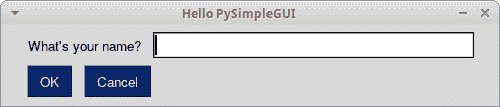
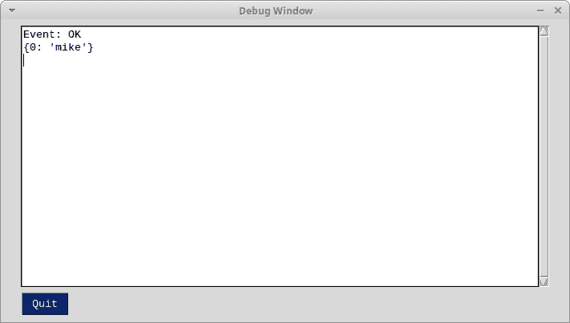

# PySimpleGUI 简介

> 原文：<https://www.blog.pythonlibrary.org/2019/10/23/a-brief-intro-to-pysimplegui/>

创建图形用户界面(GUI)可能很困难。有许多不同的 Python GUI 工具包可供选择。您可能会看到最常提到的前三个是 Tkinter、wxPython 和 PyQt(或 PySide2)。然而，有一个更新的工具包叫做 [PySimpleGUI](https://pysimplegui.readthedocs.io) ，旨在使创建 GUI 更容易。

PySimpleGUI 的强大之处在于它是 Tkinter、wxPython 和 PyQt 之上的一个抽象层。您可以将 PySimpleGUI 看作一个包装器。PySimpleGUI 背后的开发人员最近还添加了第四个包装器，它是一个“Python 应用程序的 GUI 库，将应用程序的界面转换成 HTML，以便在 web 浏览器中呈现”。

PySimpleGUI 的一个出名之处是你不需要使用类来创建你的用户界面。这是一种有趣的做事方式，但可能会让该库的一些用户失去兴趣。

* * *

### 安装 PySimpleGUI

如果您知道如何使用 pip，安装 PySimpleGUI 是轻而易举的事情。下面是您应该运行的命令:

```py

pip install pysimplegui

```

注意，这将把 PySimpleGUI 安装到您的系统 Python 中。您可能希望将其安装到虚拟 Python 环境中。你可以使用 Python 的 [venv](https://docs.python.org/3/library/venv.html) 模块来实现。看看吧！

* * *

### Hello PySimpleGUI

当涉及到使用 GUI 时，更容易看到如何自己组装一个 GUI。让我们编写一个小的表单，它有一个字符串和两个按钮:一个 OK 按钮和一个 Cancel 按钮。

这个例子基于 [PySimpleGUI 用户手册](https://pysimplegui.readthedocs.io/en/latest/)中的一个例子:

```py

import PySimpleGUI as sg

# Create some elements
layout = [[sg.Text("What's your name?"), sg.InputText()],
          [sg.Button('OK'), sg.Button('Cancel')]]

# Create the Window
window = sg.Window('Hello PySimpleGUI', layout)

# Create the event loop
while True:
    event, values = window.read()
    if event in (None, 'Cancel'):
        # User closed the Window or hit the Cancel button
        break
    print(f'Event: {event}')
    print(str(values))

window.close()

```

在这里，您导入 PySimpleGUI，然后创建一系列小部件，它们在 PySimpleGUI 中被称为“元素”:**文本**、**输入文本**和两个**按钮**。要按行布局元素，您可以将它们添加到列表中。因此，对于第一行元素，您创建一个包含 Text 元素的列表，后跟 InputText 元素。元素从左向右水平添加。要添加第二行，需要添加第二个元素列表，其中包含两个按钮。

在嵌套列表中包含所有元素后，可以创建**窗口**。这是包含所有其他元素的父元素。它有一个标题，并接受您的嵌套元素列表。

最后，创建一个 **while** 循环，并调用窗口的 **read()** 方法来提取用户设置的事件和值。如果用户按下 Cancel 按钮或关闭窗口，您会捕捉到这一点并跳出循环。否则，您将打印出事件和用户输入的任何值。

运行代码时，GUI 应该是这样的:



假设您在文本输入小部件中输入字符串“mike ”,然后点击 OK 按钮。您应该在终端中看到以下输出:

 `Event: OK
{0: 'mike'}`

如果可以将 stdout 重定向到 GUI 中的调试窗口，那不是很好吗？PySimpleGUI 实际上有一个简单的方法来做到这一点。您只需将上面代码中的 print 语句更新为以下内容:

```py

sg.Print(f'Event: {event}')
sg.Print(str(values))

```

现在，当您运行代码并输入一个字符串，然后按 OK，您应该会看到下面的调试窗口:



* * *

### PySimpleGUI Elements

没有足够的时间来检查 PySimpleGUI 支持的每个元素。然而，您可以通过转到文档的这一部分来查看支持哪些元素。文档中有一个[注释](https://pysimplegui.readthedocs.io/en/latest/#table-element)提到表格小部件目前有问题。暗示树小部件也有问题，但并没有真正谈到原因。

请注意，PySimpleGUI 已经包装了 Tkinter 中所有可用的小部件，所以您确实有很多小部件可以使用。然而，ttk 中的小部件目前还不被支持。

**更新**:在与软件包的维护者交谈后，我被告知表格和树元素实际上工作得相当好。

* * *

### 创建多个窗口

我看到许多新程序员都在为在他们选择的 GUI 工具包中打开多个窗口而苦恼。幸运的是，PySimpleGUI 清楚地标明了如何做的方向。他们实际上有两种不同的“设计模式”来做这类事情。

为简洁起见，我将只展示如何操作两个活动窗口:

```py

import PySimpleGUI as sg

# Create some Elements
ok_btn = sg.Button('Open Second Window')
cancel_btn = sg.Button('Cancel')
layout = [[ok_btn, cancel_btn]]

# Create the first Window
window = sg.Window('Window 1', layout)

win2_active = False

# Create the event loop
while True:
    event1, values1 = window.read(timeout=100)

    if event1 in (None, 'Cancel'):
        # User closed the Window or hit the Cancel button
        break

    if not win2_active and event1 == 'Open Second Window':
        win2_active = True
        layout2 = [[sg.Text('Window 2')],
                   [sg.Button('Exit')]]

        window2 = sg.Window('Window 2', layout2)

    if win2_active:
        events2, values2 = window2.Read(timeout=100)
        if events2 is None or events2 == 'Exit':
            win2_active  = False
            window2.close()

window.close()

```

前几行与本文中的第一个例子非常相似。这一次，您将创建只有两个按钮的主应用程序。其中一个按钮用于打开第二个窗口，而另一个按钮用于关闭程序。

接下来，将标志 **win2_active** 设置为 False，然后开始您的“事件循环”。在事件循环内部，检查用户是否按下了“打开第二个窗口”按钮。如果有，那么你打开第二个窗口，观察它的事件。

就我个人而言，我觉得和这种人一起工作很笨拙。我认为，通过为窗口使用一些类并抽象出主循环，很多事情都可以得到改善。我不想用这种模式创建大量的窗口，因为对我来说这看起来很快就会变得非常复杂。但是我还没有充分使用这个包，不知道是否已经有好的解决方法。

* * *

### 包扎

PySimpleGUI 是一个简洁的库，我喜欢它比 wxPython 和 PyQt 更“Python 化”。当然，如果你正在寻找另一个 GUI 工具包，它使用更 Python 化的方法，而不是 PyQt 和 wxPython 使用的 C++方法，你可能想看看[托加](https://toga.readthedocs.io/en/latest/)或[基维](https://kivy.org/#home)。

无论如何，我认为 PySimpleGUI 看起来有很多有趣的功能。小部件集与 Tkinter 相匹配，甚至有所超越。PySimpleGUI 在他们的 Github 上也有很多很酷的演示应用程序。他们还提供了使用 PyInstaller 将您的应用程序转换成 Windows 和 Mac 上的可执行文件的信息，这是您在 GUI 工具包的文档中通常看不到的。

如果您正在寻找一个简单的 GUI 工具包，PySimpleGUI 可能正合您的胃口。