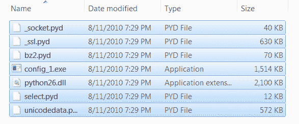

# 一个 cx_Freeze 教程——构建二进制系列！

> 原文：<https://www.blog.pythonlibrary.org/2010/08/12/a-cx_freeze-tutorial-build-a-binary-series/>

在本文中，我们将学习 cx_Freeze，这是一组跨平台的脚本，旨在以类似于 py2exe、PyInstaller 等的方式将 Python 脚本“冻结”成可执行文件。我们将冻结一个控制台脚本和一个窗口(即 GUI)脚本，使用本系列前一篇文章中的例子。如果你还没有这样做，你可以在这里得到 CX _ Freeze。我们开始派对吧，好吗？

## cx_Freeze 入门

正如 cx_Freeze 网站上提到的，有三种方法可以使用这个脚本。第一种是只使用附带的 cxfreeze 脚本；第二种方法是创建一个 distutils 安装脚本(比如 py2exe ),您可以保存它以备将来使用；第三是使用 cxfreeze 的内部。我们将关注使用 cx_Freeze 的前两种方式。我们将从控制台脚本开始:

```py

import configobj

#----------------------------------------------------------------------
def createConfig(configFile):
    """
    Create the configuration file
    """
    config = configobj.ConfigObj()
    inifile = configFile
    config.filename = inifile
    config['server'] = "http://www.google.com"
    config['username'] = "mike"
    config['password'] = "dingbat"
    config['update interval'] = 2
    config.write()

#----------------------------------------------------------------------
def getConfig(configFile):
    """
    Open the config file and return a configobj
    """    
    return configobj.ConfigObj(configFile)

def createConfig2(path):
    """
    Create a config file
    """
    config = configobj.ConfigObj()
    config.filename = path
    config["Sony"] = {}
    config["Sony"]["product"] = "Sony PS3"
    config["Sony"]["accessories"] = ['controller', 'eye', 'memory stick']
    config["Sony"]["retail price"] = "$400"
    config.write()

if __name__ == "__main__":
    createConfig2("sampleConfig2.ini")

```

这个脚本所做的就是使用 Michael Foord 的 [configobj](http://www.voidspace.org.uk/python/configobj.html) 模块创建一个非常简单的配置文件。您也可以设置它来读取配置，但是对于这个例子，我们将跳过它。让我们来看看如何用 cx_Freeze 构建一个二进制文件！根据文档，只需在命令行中输入以下字符串(假设您位于正确的目录中):

 `cxfreeze config_1.py --target-dir dirName` 

这假设您的路径上有“C:\PythonXX\Scripts”。如果没有，您要么修复它，要么输入完全限定的路径。无论如何，如果 cxfreeze 脚本正确运行，您应该有一个包含以下内容的文件夹:

[](https://www.blog.pythonlibrary.org/wp-content/uploads/2010/08/cx_freeze_dir.png)

正如您所看到的，总文件大小应该是 4.81 MB 或者差不多 MB。这很简单。它甚至在我们没有告诉它的情况下就选择了 configobj 模块，这是 PyInstaller 没有做到的。有 18 个命令行参数可以传递给 cx_Freeze 来控制它如何工作。这些功能包括包含或排除哪些模块、优化、压缩、包含 zip 文件、路径操作等等。现在让我们尝试一些更高级的东西。

## “高级”cx_Freeze -使用 setup.py 文件

首先，我们需要一个脚本来使用。对此，我们将使用 PyInstaller 文章中的简单 wxPython 脚本:

```py

import wx

########################################################################
class DemoPanel(wx.Panel):
    """"""

    #----------------------------------------------------------------------
    def __init__(self, parent):
        """Constructor"""
        wx.Panel.__init__(self, parent)

        labels = ["Name", "Address", "City", "State", "Zip",
                  "Phone", "Email", "Notes"]

        mainSizer = wx.BoxSizer(wx.VERTICAL)
        lbl = wx.StaticText(self, label="Please enter your information here:")
        lbl.SetFont(wx.Font(12, wx.SWISS, wx.NORMAL, wx.BOLD))
        mainSizer.Add(lbl, 0, wx.ALL, 5)
        for lbl in labels:
            sizer = self.buildControls(lbl)
            mainSizer.Add(sizer, 1, wx.EXPAND)
        self.SetSizer(mainSizer)
        mainSizer.Layout()

    #----------------------------------------------------------------------
    def buildControls(self, label):
        """"""
        sizer = wx.BoxSizer(wx.HORIZONTAL)
        size = (80,40)
        font = wx.Font(12, wx.SWISS, wx.NORMAL, wx.BOLD)

        lbl = wx.StaticText(self, label=label, size=size)
        lbl.SetFont(font)
        sizer.Add(lbl, 0, wx.ALL|wx.CENTER, 5)
        if label != "Notes":
            txt = wx.TextCtrl(self, name=label)
        else:
            txt = wx.TextCtrl(self, style=wx.TE_MULTILINE, name=label)
        sizer.Add(txt, 1, wx.ALL, 5)
        return sizer

########################################################################
class DemoFrame(wx.Frame):
    """
    Frame that holds all other widgets
    """

    #----------------------------------------------------------------------
    def __init__(self):
        """Constructor"""        
        wx.Frame.__init__(self, None, wx.ID_ANY, 
                          "cxFreeze Tutorial",
                          size=(600,400)
                          )
        panel = DemoPanel(self)        
        self.Show()

#----------------------------------------------------------------------
if __name__ == "__main__":
    app = wx.App(False)
    frame = DemoFrame()
    app.MainLoop()

```

现在让我们以 cx_Freeze 风格创建一个 **setup.py** 文件:

```py

from cx_Freeze import setup, Executable

setup(
    name = "wxSampleApp",
    version = "0.1",
    description = "An example wxPython script",
    executables = [Executable("sampleApp.pyw")]
    )

```

如你所见，这是一个非常简单的问题。我们从 cx_Freeze 导入了几个类，并向它们传递了一些参数。在这种情况下，我们给*设置*类一个名称、版本、描述和*可执行文件*类。可执行类还获得一个参数，即它将用来创建二进制文件的脚本名。为了构建二进制文件，您需要在命令行上执行以下操作:

 `python setup.py build` 

运行此程序后，您应该会看到以下文件夹:“build\exe.win32-2.6”。最后一个文件夹中有 17 个文件，总共 15.3 MB。当你运行 sampleApp.exe 的文件时，你会注意到我们搞砸了一些事情。除了我们的 GUI 之外，还有一个控制台窗口正在加载！！！为了纠正这一点，我们需要稍微修改一下我们的设置文件。看看我们的新产品:

```py

from cx_Freeze import setup, Executable

exe = Executable(
    script="sampleApp.pyw",
    base="Win32GUI",
    )

setup(
    name = "wxSampleApp",
    version = "0.1",
    description = "An example wxPython script",
    executables = [exe]
    )

```

首先，我们将*可执行类*从*设置类*中分离出来，并将可执行类分配给一个变量。我们还向可执行类添加了第二个参数，这是一个关键参数。那个参数叫做“基数”。通过设置 **base="Win32GUI"** ，我们能够抑制控制台窗口。了解 cx_Freeze 可以使用的许多其他选项的一个好方法是使用 GUI2Exe 为我们生成 setup.py 文件。cx_Freeze 网站上的文档显示了可执行类采用的许多其他选项。奇怪的是，除了源代码本身之外，我找不到任何关于 *setup* 类接受什么参数的信息，源代码本身几乎没有注释。祝你好运搞清楚这一点。

## 包扎

现在你应该知道如何用 cx_Freeze 创建二进制文件了。这很容易做到，而且他们创造了一种跨平台创建二进制文件的方法，这很好。玩得开心！

## 进一步阅读

*   [堆栈溢出](http://stackoverflow.com/questions/2880316/hide-console-window-with-wxpython-and-cxfreeze)
*   cx_Freeze [官方网站](http://cx-freeze.sourceforge.net/)，[邮件列表](https://lists.sourceforge.net/lists/listinfo/cx-freeze-users)
*   GUI2Exe [网站](http://code.google.com/p/gui2exe/)