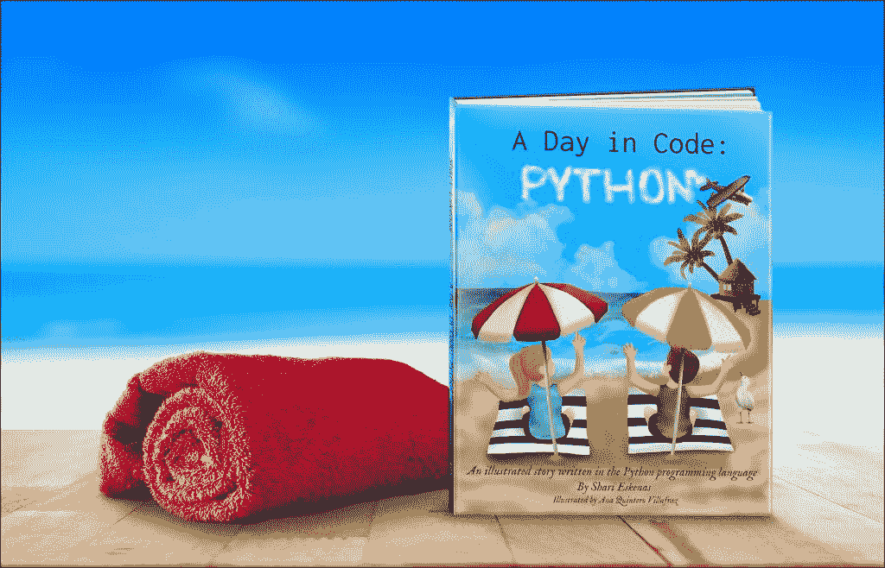

# 代码的一天:Python Kickstarter

> 原文：<https://www.blog.pythonlibrary.org/2020/12/09/a-day-in-code-python-kickstarter/>

最近偶然看到一个有趣的 Python Kickstarter，叫做《代码中的一天[:Python——用代码](https://www.kickstarter.com/projects/914595512/a-day-in-code-python)写的绘本。

我个人不了解作者或他们的作品，但我真的很喜欢这个想法。我也完全支持独立的内容创作者。你应该去看看这个 Kickstarter，看看它是否是你可能喜欢的东西，或者是你可以为你认识的人得到的东西。