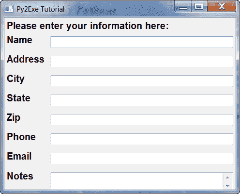
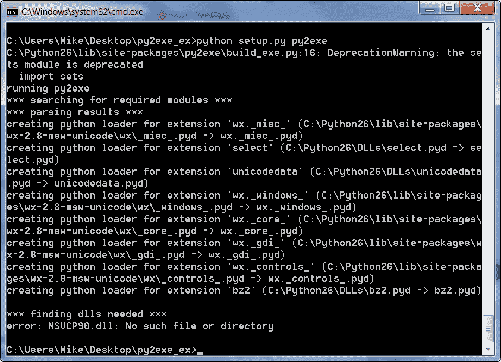
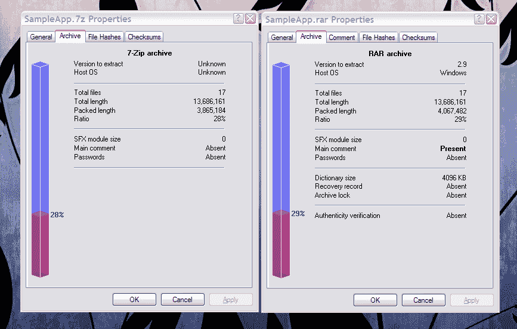

# 一个 py2exe 教程——构建二进制系列！

> 原文：<https://www.blog.pythonlibrary.org/2010/07/31/a-py2exe-tutorial-build-a-binary-series/>

我收到了一个请求，要求我写一篇关于如何使用 py2exe 和 wxPython 创建可执行文件的文章。我决定做一个关于包装的系列。亲爱的读者，我打算介绍一下主要的 Windows 二进制构建实用程序，并向您展示如何使用它们来创建可以分发的二进制文件。一旦这些文章完成，我将展示如何使用 Inno 和 NSIS。首先，我们将讨论如何使用 py2exe，这可能是最流行的 Windows 可执行软件包。

## 我们开始吧

对于本教程，我们将使用一个不做任何事情的 wxPython 脚本。这是一个虚构的例子，但是我们使用 wx 使它比仅仅做一个控制台“Hello World”程序在视觉上更有趣。还要注意我用的是 py2exe 0.6.9，wxPython 2.8.11.0 和 Python 2.6。运行时，最终产品应该是这样的:

[](https://www.blog.pythonlibrary.org/wp-content/uploads/2010/07/py2exe_wx.png)

现在我们知道了它的样子，下面来看看代码:

```py

import wx

########################################################################
class DemoPanel(wx.Panel):
    """"""

    #----------------------------------------------------------------------
    def __init__(self, parent):
        """Constructor"""
        wx.Panel.__init__(self, parent)

        labels = ["Name", "Address", "City", "State", "Zip",
                  "Phone", "Email", "Notes"]

        mainSizer = wx.BoxSizer(wx.VERTICAL)
        lbl = wx.StaticText(self, label="Please enter your information here:")
        lbl.SetFont(wx.Font(12, wx.SWISS, wx.NORMAL, wx.BOLD))
        mainSizer.Add(lbl, 0, wx.ALL, 5)
        for lbl in labels:
            sizer = self.buildControls(lbl)
            mainSizer.Add(sizer, 1, wx.EXPAND)
        self.SetSizer(mainSizer)
        mainSizer.Layout()

    #----------------------------------------------------------------------
    def buildControls(self, label):
        """"""
        sizer = wx.BoxSizer(wx.HORIZONTAL)
        size = (80,40)
        font = wx.Font(12, wx.SWISS, wx.NORMAL, wx.BOLD)

        lbl = wx.StaticText(self, label=label, size=size)
        lbl.SetFont(font)
        sizer.Add(lbl, 0, wx.ALL|wx.CENTER, 5)
        if label != "Notes":
            txt = wx.TextCtrl(self, name=label)
        else:
            txt = wx.TextCtrl(self, style=wx.TE_MULTILINE, name=label)
        sizer.Add(txt, 1, wx.ALL, 5)
        return sizer

########################################################################
class DemoFrame(wx.Frame):
    """
    Frame that holds all other widgets
    """

    #----------------------------------------------------------------------
    def __init__(self):
        """Constructor"""        
        wx.Frame.__init__(self, None, wx.ID_ANY, 
                          "Py2Exe Tutorial",
                          size=(600,400)
                          )
        panel = DemoPanel(self)        
        self.Show()

#----------------------------------------------------------------------
if __name__ == "__main__":
    app = wx.App(False)
    frame = DemoFrame()
    app.MainLoop()

```

这相当简单，所以我让读者自己去解决。这篇文章说的毕竟是 py2exe。

## py2exe setup.py 文件

任何 py2exe 脚本的关键是 *setup.py* 文件。这个文件控制包含或排除什么，压缩和打包多少，等等！下面是我们可以在上面的 wx 脚本中使用的最简单的设置:

```py

from distutils.core import setup
import py2exe

setup(windows=['sampleApp.py'])

```

如你所见，我们从 *distutils.core* 导入 *setup* 方法，然后导入 *py2exe* 。接下来，我们用一个 *windows* 关键字参数调用 setup，并向它传递 python 列表对象中主文件的名称。如果您正在创建一个非 GUI 项目，那么您将使用*控制台*键而不是*窗口*。要运行它，打开命令提示符并导航到适当的位置。然后输入“python setup.py py2exe”运行它。这是我第一次运行时得到的结果:

[](https://www.blog.pythonlibrary.org/wp-content/uploads/2010/07/py2exe_firstrun.png)

看起来 wxPython 需要“MSVCP90.dll ”,而 Windows 找不到它。快速的谷歌搜索产生了共识，我需要“微软 Visual C++ 2008 可再发行软件包”，在这里找到了。我下载了它，安装了它，并再次尝试 py2exe。同样的错误。如果我使用 Visual Studio 来创建一个 C#程序的 exe，这可能会有效。无论如何，诀窍是在硬盘上搜索文件，然后将其复制到 Python 的 DLL 文件夹中，在我的机器上，该文件夹位于以下位置:C:\ Python 26 \ DLL(根据需要在您的机器上进行调整)。一旦 DLL 在正确的位置，setup.py 文件就可以正常运行了。结果被放入“dist”文件夹，该文件夹包含 17 个文件，重 15.3 MB。我双击“sampleApp.exe”文件，看看我闪亮的新二进制文件是否能工作，它确实工作了！在旧版本的 wxPython 中，您可能需要包含一个清单文件来获得正确的外观(即主题)，但在 2.8.10 中(我认为)这一点已经解决了，就像过去需要的并行(SxS)程序集清单文件一样。

注意，对于非 wxPython 脚本，您可能仍然需要弄乱 SxS 清单和其中包含的所有环。你可以在 [py2exe 教程](http://py2exe.org/index.cgi/Tutorial)中了解更多。

## 创建高级 setup.py 文件

让我们通过创建一个更复杂的 setup.py 文件来看看 py2exe 为我们创建二进制文件提供了哪些其他选项。

```py

from distutils.core import setup
import py2exe

includes = []
excludes = ['_gtkagg', '_tkagg', 'bsddb', 'curses', 'email', 'pywin.debugger',
            'pywin.debugger.dbgcon', 'pywin.dialogs', 'tcl',
            'Tkconstants', 'Tkinter']
packages = []
dll_excludes = ['libgdk-win32-2.0-0.dll', 'libgobject-2.0-0.dll', 'tcl84.dll',
                'tk84.dll']

setup(
    options = {"py2exe": {"compressed": 2, 
                          "optimize": 2,
                          "includes": includes,
                          "excludes": excludes,
                          "packages": packages,
                          "dll_excludes": dll_excludes,
                          "bundle_files": 3,
                          "dist_dir": "dist",
                          "xref": False,
                          "skip_archive": False,
                          "ascii": False,
                          "custom_boot_script": '',
                         }
              },
    windows=['sampleApp.py']
)

```

这是相当不言自明的，但无论如何让我们解开它。首先，我们设置几个列表，并将其传递给 set up 函数的 options 参数。

*   *包含*列表是针对您需要特别包含的特殊模块。有时 py2exe 找不到某些模块，所以您需要在这里手动指定它们。
*   *排除*列表是从程序中排除哪些模块的列表。在这种情况下，我们不需要 Tkinter，因为我们正在使用 wxPython。这个排除列表是 GUI2Exe 默认排除的内容。
*   *包*列表是要包含的特定包的列表。还是那句话，有时候 py2exe 就是找不到东西。我以前必须在这里包括 email、PyCrypto 或 lxml。请注意，如果排除列表包含您试图包含在包或包含列表中的内容，py2exe 可能会继续排除它们。
*   *dll_excludes* -排除我们项目中不需要的 dll。

在*选项*字典中，我们还有一些其他的选项可以查看。 *compressed* 键告诉 py2exe 是否压缩 zip 文件，如果设置了的话。*优化*键设置优化级别。零表示没有优化，2 表示最高。 *bundle_files* 键将 dll 捆绑在 zipfile 或 exe 中。 *bundle_files* 的有效值为:3 =不捆绑(默认)2 =捆绑除 Python 解释器之外的所有内容 1 =捆绑所有内容，包括 Python 解释器。几年前，当我第一次学习 py2exe 时，我在他们的邮件列表上询问最佳选项是什么，因为我对捆绑选项 1 有疑问。有人告诉我，3 可能是最稳定的。我照着做了，不再有随机的问题，所以这是我目前的建议。如果你不喜欢分发多个文件，把它们压缩或者创建一个安装程序。我在这个列表中使用的另外一个选项是 *dist_dir* 选项。当我不想覆盖我的主要构建时，我用它来试验不同的构建选项或创建自定义构建。你可以在 [py2exe 网站](http://py2exe.org/index.cgi/ListOfOptions)上阅读所有其他选项(包括这里没有列出的选项)。通过将 optimize 设置为 2，我们可以将文件夹的大小减少大约一兆字节。

## 减少 wxPython 脚本的二进制文件大小

wxPython 邮件列表上有一个关于减小二进制文件大小的[主题](http://bit.ly/bwIDNd)。我联系了 Steven Sproat，其中的一个人，关于他做了什么，这里的诀窍是:设置“bundle_files”选项为 1，zipfile 为 None。结果在你的 dist 文件夹中会有三个文件:MSVCR71.dll，sampleApp.exe 和 w9xpopen.exe。在我的机器上，该文件夹的大小为 5.94 MB(在 Windows XP 机器上测试)。正如我前面提到的，将 bundle_files 设置为 1 会导致一些用户在运行您的应用程序时遇到问题，但这可能已经在 py2exe 的新版本中得到解决。以下是设置了新选项的 setup.py 文件的外观:

```py

from distutils.core import setup
import py2exe

includes = []
excludes = ['_gtkagg', '_tkagg', 'bsddb', 'curses', 'email', 'pywin.debugger',
            'pywin.debugger.dbgcon', 'pywin.dialogs', 'tcl',
            'Tkconstants', 'Tkinter']
packages = []
dll_excludes = ['libgdk-win32-2.0-0.dll', 'libgobject-2.0-0.dll', 'tcl84.dll',
                'tk84.dll']

setup(
    options = {"py2exe": {"compressed": 2, 
                          "optimize": 2,
                          "includes": includes,
                          "excludes": excludes,
                          "packages": packages,
                          "dll_excludes": dll_excludes,
                          "bundle_files": 1,
                          "dist_dir": "dist",
                          "xref": False,
                          "skip_archive": False,
                          "ascii": False,
                          "custom_boot_script": '',
                         }
              },
    zipfile = None,
    windows=['sampleApp.py']
)

```

另一种减小文件夹大小的方法是使用压缩程序，这是我的一位读者 ProgMan 指出的。以下是他的结果:

[](https://www.blog.pythonlibrary.org/wp-content/uploads/2010/07/sampleapps.png)

## 包扎

现在，您已经了解了使用 py2exe 创建二进制文件的基础知识。我希望这对您当前或未来的项目有所帮助。如果有，请在评论中告诉我！

## 进一步阅读

*   py2exe [教程](http://py2exe.org/index.cgi/Tutorial)
*   [打包 wxPyMail 进行分发](https://www.blog.pythonlibrary.org/2008/08/27/packaging-wxpymail-for-distribution/)
*   [GUI2Exe](http://code.google.com/p/gui2exe/)
*   py2exe 上的 wxPython [wiki 页面](http://wiki.wxpython.org/py2exe)