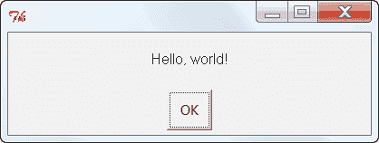
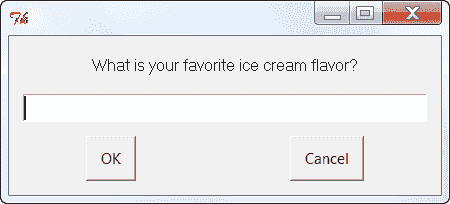
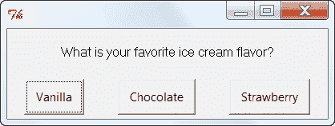

# 快速 EasyGui 教程

> 原文：<https://www.blog.pythonlibrary.org/2010/05/22/a-quick-easygui-tutorial/>

本周早些时候，我正在阅读沃伦·d·桑德和卡特·桑德所写的《Hello World 》,在关于图形用户界面的章节中，我提到了一个名为 [EasyGui](http://easygui.sourceforge.net/) 的库。这是我见过的第一个也是唯一一个非事件驱动的 Python GUI 项目。相反，EasyGui 基本上是一组可以按需打开的对话框。这个包对于需要使用对话框从用户那里获取信息的命令行程序来说是很方便的，或者对于教新程序员简单的 GUI 来说也是很方便的。让我们快速看一下 EasyGui 能做什么。我们将使用书中的一些例子。

EasyGui 基于 Tkinter，内置于 Python 中。它也只是一个小的 python 脚本，你可以把它放在 python 路径的某个地方，这样你就可以使用它了。我把我的放在站点包文件夹中。让我们来看几个例子。

## easyui msgbox

[](https://www.blog.pythonlibrary.org/wp-content/uploads/2010/05/msgbox.png)

消息框对于让用户了解他们的程序状态非常有用。这是你做一个的方法:

```py

import easygui
easygui.msgbox("Hello, world!")

```

## EasyGui enterbox

[](https://www.blog.pythonlibrary.org/wp-content/uploads/2010/05/enterbox.png)

enterbox 对话框允许程序员提示用户输入一串文本。

```py

import easygui
flavor = easygui.enterbox("What is your favorite ice cream flavor?")
easygui.msgbox ("You entered " + flavor)

```

## easyui 按钮盒

[](https://www.blog.pythonlibrary.org/wp-content/uploads/2010/05/buttonbox.png)

向 buttonbox 对话框传递一个字符串列表，以创建一组表示为按钮的选项。

```py

import easygui
flavor = easygui.buttonbox("What is your favorite ice cream flavor?",
                           choices = ['Vanilla', 'Chocolate', 'Strawberry'] )
easygui.msgbox ("You picked " + flavor)

```

## 包扎

EasyGui 提供了更多这里没有涉及的对话框。查看它的文档以获得更多信息。