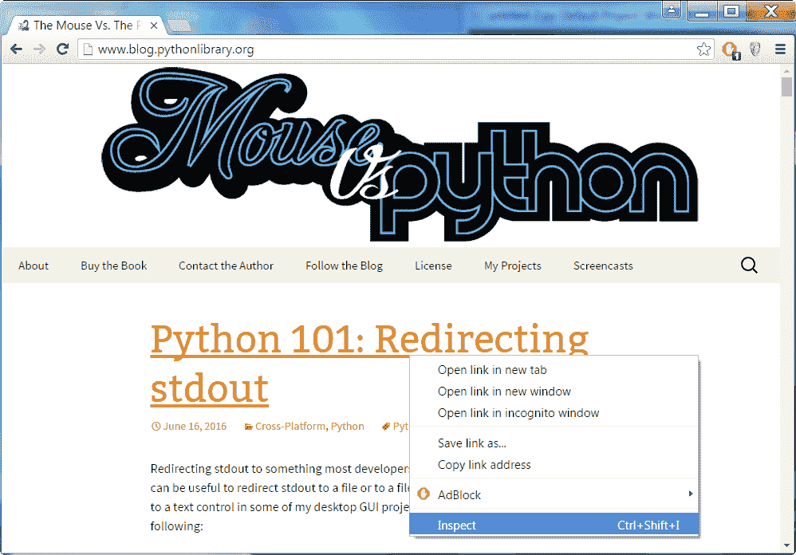
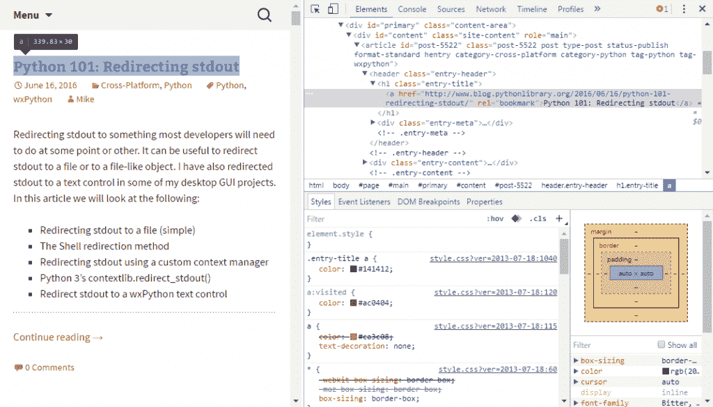

# Python 网页抓取的简单介绍

> 原文：<https://www.blog.pythonlibrary.org/2016/08/04/a-simple-intro-to-web-scraping-with-python/>

Web 抓取是程序员编写应用程序来下载网页并从中解析出特定信息的地方。通常当你抓取数据时，你需要让你的应用程序以编程的方式导航网站。在这一章中，我们将学习如何从互联网上下载文件，并在需要时解析它们。我们还将学习如何创建一个简单的蜘蛛，我们可以用它来抓取网站。

* * *

### 刮痧技巧

在我们开始刮之前，有几个提示我们需要复习一下。

*   在你刮之前，一定要检查网站的条款和条件**。他们通常有条款限制你刮的频率或者你能刮多少**
*   因为你的脚本运行的速度会比人类浏览的速度快得多，所以确保你不要用大量的请求来敲打他们的网站。这甚至可能包含在网站的条款和条件中。
*   如果你让一个网站过载了你的请求，或者你试图以违反你同意的条款和条件的方式使用它，你会陷入法律麻烦。
*   网站一直在变，所以你的刮刀总有一天会坏掉。知道这一点:如果你想让你的铲运机继续工作，你必须维护它。
*   不幸的是，你从网站上获得的数据可能会很混乱。与任何数据解析活动一样，您需要清理它以使它对您有用。

解决了这个问题，我们开始刮吧！

* * *

### 准备刮

在我们开始刮之前，我们需要弄清楚我们想要做什么。我们将使用我的博客作为这个例子。我们的任务是抓取这个博客首页上的文章的标题和链接。你可以使用 Python 的 **urllib2** 模块下载我们需要解析的 HTML，或者你可以使用**请求**库。对于这个例子，我将使用请求。

如今大多数网站都有相当复杂的 HTML。幸运的是，大多数浏览器都提供了一些工具来找出网站元素的琐碎之处。例如，如果你在 chrome 中打开我的博客，你可以右击任何文章标题，然后点击**检查**菜单选项(如下所示):



点击后，你会看到一个侧边栏，突出显示包含标题的标签。看起来是这样的:



Mozilla Firefox 浏览器有开发者工具，你可以在每页的基础上启用，包括一个检查器，你可以像在 Chrome 中一样使用它。无论您最终使用哪种浏览器，您都会很快发现 **h1** 标签是我们需要寻找的。现在我们知道了我们想要解析什么，我们可以学习如何这样做！

*2021 年 8 月更新:最初，鼠标 vs Python 使用 **h1** 标签作为文章标题，但现在它使用 **h2** 。*

* * *

### 美丽的声音

Python 最流行的 HTML 解析器之一叫做 **BeautifulSoup** 。它已经存在了一段时间，并以能够很好地处理畸形的 HTML 而闻名。要为 Python 3 安装它，您只需做以下事情:

```py
pip install beautifulsoup4

```

如果一切正常，您现在应该已经安装了 BeautifulSoup。当传递 BeautifulSoup 一些 HTML 来解析时，可以指定一个树构建器。对于这个例子，我们将使用 **html.parser** ，因为它包含在 Python 中。如果你想要更快的，你可以安装 lxml。

让我们来看看一些代码，看看这一切是如何工作的:

```py
import requests
from bs4 import BeautifulSoup

url = 'https://www.blog.pythonlibrary.org/'

def get_articles():
    """
    Get the articles from the front page of the blog
    """
    req = requests.get(url)
    html = req.text
    soup = BeautifulSoup(html, 'html.parser')
    pages = soup.findAll('h2')

    articles = {i.a['href']: i.text.strip()
                for i in pages if i.a}
    for article in articles:
        s = '{title}: {url}'.format(
            title=articles[article],
            url=article)
        print(s)

    return articles

if __name__ == '__main__':
    articles = get_articles()

```

在这里，我们进行导入，并设置我们将要使用的 URL。然后我们创建一个函数，魔法就在这里发生。我们使用请求库获取 URL，然后使用请求对象的 **text** 属性将 HTML 作为字符串提取出来。然后我们将 HTML 传递给 BeautifulSoup，后者将它转换成一个漂亮的对象。之后，我们要求 BeautifulSoup 找到所有的 **h1** 的实例，然后使用字典理解来提取标题和 URL。然后，我们将该信息打印到 stdout 并返回字典。

我们试着再刮一个网站。这次我们将看看 Twitter，并使用我的博客的帐户:mousevspython。我们会努力收集我最近发的微博。你需要像以前一样，通过右键点击一条推文并检查它来找出我们需要做什么。在这种情况下，我们需要寻找‘Li’标记和 js-stream-item 类。让我们来看看:

```py
import requests

from bs4 import BeautifulSoup

url = 'https://twitter.com/mousevspython'
req = requests.get(url)
html = req.text
soup = BeautifulSoup(html, 'html.parser')
tweets = soup.findAll('li', 'js-stream-item')
for item in range(len(soup.find_all('p', 'TweetTextSize'))):
    tweet_text = tweets[item].get_text()
    print(tweet_text)
    dt = tweets[item].find('a', 'tweet-timestamp')
    print('This was tweeted on ' + dt)  

```

和以前一样，我们使用 BeautifulSoup 的 **findAll** 命令获取所有符合我们搜索标准的实例。然后，我们还寻找段落标签(即“p”)和 **TweetTextSize** 类，并循环结果。你会注意到我们在这里使用了 **find_all** 。我们要明确的是，findAll 是 find_all 的别名，所以它们做完全相同的事情。无论如何，我们循环这些结果，获取 tweet 文本和 tweet 时间戳并打印出来。

你可能会认为可能有一种更简单的方法来做这类事情，而且确实有。一些网站提供了开发者 API，您可以使用它来访问他们网站的数据。Twitter 有一个很好的要求消费者密钥和秘密的方法。实际上，我们将在下一章研究如何使用这个 API 和其他一些 API。

让我们继续学习如何写一个蜘蛛！

* * *

### Scrapy

Scrapy 是一个框架，你可以用它来抓取网站和提取(即抓取)数据。它还可以用于通过网站的 API 提取数据，或者作为通用网络爬虫。要安装 Scrapy，您需要的只是 pip:

```py
pip install scrapy

```

根据 Scrapy 的文档，您还需要安装 lxml 和 OpenSSL。我们将使用 Scrapy 来做与我们使用 BeautifulSoup 相同的事情，即抓取我博客首页上文章的标题和链接。首先，你需要做的就是打开一个终端，将目录切换到你想要存储我们项目的目录。然后运行以下命令:

```py
scrapy startproject blog_scraper

```

这将在当前目录中创建一个名为 **blog_scraper** 的目录，其中包含以下项目:

*   另一个嵌套的 blog_scraper 文件夹
*   scrapy.cfg

第二个 blog_scraper 文件夹里面是好东西:

*   蜘蛛文件夹
*   __init__.py
*   items.py
*   pipelines.py
*   settings.py

除了 **items.py** 之外，我们可以使用默认设置。因此，在您最喜欢的 Python 编辑器中打开 **items.py** ，并添加以下代码:

```py
import scrapy

class BlogScraperItem(scrapy.Item):
    title = scrapy.Field()
    link = scrapy.Field()

```

我们在这里所做的是创建一个类来模拟我们想要捕获的内容，在这个例子中是一系列的标题和链接。这有点像 SQLAlchemy 的模型系统，其中我们会创建一个数据库模型。在 Scrapy 中，我们创建一个我们想要收集的数据的模型。

接下来我们需要创建一个蜘蛛，因此将目录更改为**spider**目录，并在那里创建一个 Python 文件。姑且称之为 **blog.py** 。将以下代码放入新创建的文件中:

```py
from scrapy.spider import BaseSpider
from scrapy.selector import Selector
from ..items import BlogScraperItem

class MyBlogSpider(BaseSpider):
    name = 'mouse'
    start_urls = ['https://www.blog.pythonlibrary.org']

    def parse(self, response):
        selector = Selector(response)
        blog_titles = selector.xpath("//h1[@class='entry-title']")
        selections = []

        for data in blog_titles:
            selection = BlogScraperItem()
            selection['title'] = data.xpath("a/text()").extract()
            selection['link'] = data.xpath("a/@href").extract()
            selections.append(selection)

        return selections

```

这里我们只导入了 **BaseSpider** 类和一个**选择器**类。我们还导入了之前创建的 **BlogScraperItem** 类。然后我们子类化 BaseSpider 并将我们的蜘蛛命名为鼠标，因为我的博客的名字是鼠标 Vs Python。我们还给它一个开始 URL。请注意，这是一个列表，这意味着你可以给这个蜘蛛多个开始网址。最重要的部分是我们的**解析**函数。它将从网站获取响应并解析它们。

Scrapy 支持使用 CSS 表达式或 XPath 来选择 HTML 文档的某些部分。这基本上告诉 Scrapy 我们想要刮的是什么。XPath 有点难懂，但是它也是最强大的，所以我们将在这个例子中使用它。为了获取标题，我们可以使用 Google Chrome 的 Inspector 工具找出标题位于一个类名为 **entry-title** 的 **h1** 标签中。

选择器返回一个我们可以迭代的 a **SelectorList** 实例。这允许我们继续对这个特殊列表中的每一项进行 xpath 查询，因此我们可以提取标题文本和链接。我们还创建了 BlogScraperItem 的一个新实例，并将提取的标题和链接插入到这个新对象中。最后，我们将新收集的数据添加到一个列表中，完成后返回该列表。

要运行此代码，请返回到包含嵌套 blog_scraper 文件夹和配置文件的顶级文件夹，并运行以下命令:

```py
scrapy crawl mouse

```

你会注意到我们告诉 Scrapy 使用我们创建的**鼠标**蜘蛛爬行。该命令将导致大量输出打印到您的屏幕上。幸运的是，Scrapy 支持将数据导出为各种格式，如 CSV、JSON 和 XML。让我们使用 CSV 格式导出我们收集的数据:

```py
scrapy crawl mouse -o articles.csv -t csv

```

您仍然会看到许多输出被生成到 stdout，但是标题和链接将被保存到磁盘上一个名为 **articles.csv** 的文件中。

大多数爬虫被设置为跟随链接并爬行整个网站或一系列网站。这个网站的爬虫并不是这样创建的，但是这将是一个有趣的增强，你可以自己添加。

* * *

### 包扎

从互联网上搜集数据既有挑战性又很有趣。Python 有许多库可以让这项工作变得非常简单。我们了解了如何使用 BeautifulSoup 从博客和 Twitter 上收集数据。然后我们了解了用 Python 创建网络爬虫/抓取器最流行的库之一:Scrapy。我们仅仅触及了这些库的皮毛，所以我们鼓励您花些时间阅读它们各自的文档以了解更多的细节。

* * *

### 相关阅读

*   白痴在里面- [从谷歌 Play 商店获得安卓应用下载量和评分](http://www.idiotinside.com/2016/05/23/get-android-app-download-count-google-play-store/)
*   Scrapy Hub-[用 Scrapy 和 Python 3 进行数据提取](https://blog.scrapinghub.com/2016/05/25/data-extraction-with-scrapy-and-python-3/)
*   Dan Nguyen - [Python 3 公共数据网络抓取示例](http://blog.danwin.com/examples-of-web-scraping-in-python-3-x-for-data-journalists/)
*   第一次刮网[教程](https://first-web-scraper.readthedocs.io/en/latest/)
*   [Python 网页抓取入门指南(使用 BeautifulSoup)](http://www.analyticsvidhya.com/blog/2015/10/beginner-guide-web-scraping-beautiful-soup-python/)
*   Greg Reda - [使用 Python 的网络抓取 101](http://www.gregreda.com/2013/03/03/web-scraping-101-with-python/)
*   Miguel Grinberg - [使用 Python 轻松抓取网页](http://blog.miguelgrinberg.com/post/easy-web-scraping-with-python)
*   Python 的搭便车指南- [HTML 抓取](http://docs.python-guide.org/en/latest/scenarios/scrape/)
*   真正的 Python - [用 Scrapy 和 MongoDB 进行网页抓取和抓取](https://realpython.com/blog/python/web-scraping-and-crawling-with-scrapy-and-mongodb/)