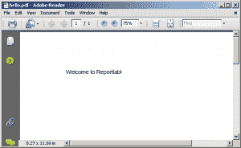
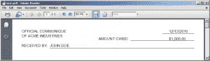
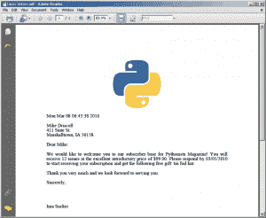

# 一个简单的分步报告实验室教程

> 原文：<https://www.blog.pythonlibrary.org/2010/03/08/a-simple-step-by-step-reportlab-tutorial/>

这篇文章的副标题很可能是“如何用 Python 创建 pdf”，但是 WordPress 不支持这个。无论如何，Python 中首要的 PDF 库是 [Reportlab](http://www.reportlab.com/software/opensource/rl-toolkit/download/) 。它没有随标准库一起发布，所以如果您想运行本教程中的示例，您需要下载它。还会有至少一个如何将图像放入 PDF 的例子，这意味着你还需要[枕头包](https://pillow.readthedocs.io/en/stable/) (PIL)。

| [](https://leanpub.com/reportlab) | 想了解更多关于使用 Python 处理 pdf 的信息吗？
**ReportLab:用 Python 处理 PDF**
**[Leanpub](https://leanpub.com/reportlab)**立即购买 |

## 装置

Reportlab 支持大多数常规 Python 安装方法。对于旧的 **Reportlab 2.x** 版本，您可以选择下载源代码并运行“python setup.py install”或运行二进制安装程序(在 Windows 上)。

对于较新的 **Reportlab 3.x** ，您现在可以在所有平台上使用 pip:

 `pip install reportlab` 

注意，Reportlab 3.x 只支持 **Python 2.7** 和 **Python 3.3+** 。如果您使用的是旧版本的 Python 2，那么您必须使用 Reportlab 2.x。

## 创建简单的 PDF

Reportlab 有不错的文档。我的意思是，文档给了你足够的开始，但是当你发现有一些稍微复杂的事情要做的时候，你可以自己解决。就在最近，他们在自己的网站上增加了一个[代码片段](http://www.reportlab.com/snippets/)部分，有望成为一本很酷的技巧和诀窍的食谱，也有助于改善这个问题。不过，说够了。让我们来看看如何实际创造一些东西！

在 Reportlab 中，最底层的组件是来自 *pdfgen* 包的 *canvas* 对象。这个包中的函数允许你用你的文本、图像、线条或任何东西来“画”一个文档。我听过有人形容这是写后记。我怀疑真的有那么糟糕。根据我的经验，这实际上很像使用 GUI 工具包在特定位置布局小部件。让我们看看画布对象是如何工作的:

```py
from reportlab.pdfgen import canvas

c = canvas.Canvas("hello.pdf")
c.drawString(100,750,"Welcome to Reportlab!")
c.save()

```

您应该最终得到一个看起来像这样的 PDF:

[](https://www.blog.pythonlibrary.org/wp-content/uploads/2010/03/hello-pdf-screenshot.png)

关于这段代码要注意的第一件事是，如果我们想要保存 PDF，我们需要为 Canvas 对象提供一个文件名。这可以是绝对路径，也可以是相对路径。在本例中，它应该在运行脚本的同一位置创建 PDF。下一个难题是*拉绳*方法。这将绘制文本，无论你告诉它。当使用 canvas 对象时，它从页面的左下方开始，因此对于本例，我们告诉它从左边距 100 磅，从页面底部 750 磅(1 磅= 1/72 英寸)处绘制字符串。您可以在 Canvas 构造函数中通过向 *bottomup* 关键字参数传递一个零来更改这个默认值。然而，我不确定如果你这样做将会发生什么，因为 Reportlab 用户指南在这个主题上并不清楚。我认为它会改变起点到左上角。上面代码的最后一部分是保存您的 PDF。

那很容易！您刚刚创建了一个非常简单的 PDF！注意，默认的画布大小是 A4，所以如果你碰巧是美国人，你可能会想把它改成 letter 大小。这在 Reportlab 中很容易做到。你只需要做以下事情:

```py
from reportlab.lib.pagesizes import letter
from reportlab.pdfgen import canvas

canvas = canvas.Canvas('myfile.pdf', pagesize=letter)
width, height = letter

```

获取宽度和高度的主要原因是，您可以使用它们进行计算，以决定何时添加分页符或帮助定义边距。让我们快速看一下 Canvas 对象的构造函数，看看我们还有哪些其他选项:

```py
def __init__(self,filename,
    pagesize=letter,
    bottomup = 1,
    pageCompression=0,
    encoding=rl_config.defaultEncoding,
    verbosity=0
    encrypt=None):

```

以上内容直接摘自 [Reportlab 用户指南](http://www.reportlab.com/docs/reportlab-userguide.pdf)，第 11 页。如果你想了解全部细节，你可以阅读他们指南中的其他选项。

现在让我们做一些稍微复杂和有用的事情。

## 一点形式，一点功能

[](https://www.blog.pythonlibrary.org/wp-content/uploads/2010/03/pdf-partial-form.png)

在本例中，我们将创建一个部分可打印的表单。据我所知，Reportlab 不支持几年前添加到 Adobe 产品中的可填充表单。无论如何，让我们来看看一些代码！

```py
from reportlab.lib.pagesizes import letter
from reportlab.pdfgen import canvas

canvas = canvas.Canvas("form.pdf", pagesize=letter)
canvas.setLineWidth(.3)
canvas.setFont('Helvetica', 12)

canvas.drawString(30,750,'OFFICIAL COMMUNIQUE')
canvas.drawString(30,735,'OF ACME INDUSTRIES')
canvas.drawString(500,750,"12/12/2010")
canvas.line(480,747,580,747)

canvas.drawString(275,725,'AMOUNT OWED:')
canvas.drawString(500,725,"$1,000.00")
canvas.line(378,723,580,723)

canvas.drawString(30,703,'RECEIVED BY:')
canvas.line(120,700,580,700)
canvas.drawString(120,703,"JOHN DOE")

canvas.save()

```

这是基于我在工作中创建的实际收据。这个例子和上一个例子的主要区别是 *canvas.line* 代码。通过传递两个 X/Y 对，您可以使用它在文档上画线。我已经用这个功能创建了网格，尽管它很乏味。这段代码中其他有趣的地方包括 setLineWidth(.3)命令，它告诉 Reportlab 线条应该有多粗或多细；以及 setFont('Helvetica '，12)命令，它允许我们指定特定的字体和磅值。

我们的下一个例子将建立在我们到目前为止所学的基础上，但是也向我们介绍了“流动”的概念。

## 随波逐流

[](https://www.blog.pythonlibrary.org/wp-content/uploads/2010/03/pdf-form-letter.png)

如果你从事广告或任何与格式信函有关的工作，那么 Reportlab 是你的一个很好的补充。我们用它来为有过期停车罚单的人创建套用信函。以下示例基于我为该应用程序编写的一些代码，尽管这封信有很大不同。(注意，如果没有 Python 图像库，下面的代码将无法运行)

```py
import time
from reportlab.lib.enums import TA_JUSTIFY
from reportlab.lib.pagesizes import letter
from reportlab.platypus import SimpleDocTemplate, Paragraph, Spacer, Image
from reportlab.lib.styles import getSampleStyleSheet, ParagraphStyle
from reportlab.lib.units import inch

doc = SimpleDocTemplate("form_letter.pdf",pagesize=letter,
                        rightMargin=72,leftMargin=72,
                        topMargin=72,bottomMargin=18)
Story=[]
logo = "python_logo.png"
magName = "Pythonista"
issueNum = 12
subPrice = "99.00"
limitedDate = "03/05/2010"
freeGift = "tin foil hat"

formatted_time = time.ctime()
full_name = "Mike Driscoll"
address_parts = ["411 State St.", "Marshalltown, IA 50158"]

im = Image(logo, 2*inch, 2*inch)
Story.append(im)

styles=getSampleStyleSheet()
styles.add(ParagraphStyle(name='Justify', alignment=TA_JUSTIFY))
ptext = '%s' % formatted_time

Story.append(Paragraph(ptext, styles["Normal"]))
Story.append(Spacer(1, 12))

# Create return address
ptext = '%s' % full_name
Story.append(Paragraph(ptext, styles["Normal"]))       
for part in address_parts:
    ptext = '%s' % part.strip()
    Story.append(Paragraph(ptext, styles["Normal"]))   

Story.append(Spacer(1, 12))
ptext = 'Dear %s:' % full_name.split()[0].strip()
Story.append(Paragraph(ptext, styles["Normal"]))
Story.append(Spacer(1, 12))

ptext = 'We would like to welcome you to our subscriber base for %s Magazine! \
        You will receive %s issues at the excellent introductory price of $%s. Please respond by\
        %s to start receiving your subscription and get the following free gift: %s.' % (magName, 
                                                                                                issueNum,
                                                                                                subPrice,
                                                                                                limitedDate,
                                                                                                freeGift)
Story.append(Paragraph(ptext, styles["Justify"]))
Story.append(Spacer(1, 12))

ptext = 'Thank you very much and we look forward to serving you.'
Story.append(Paragraph(ptext, styles["Justify"]))
Story.append(Spacer(1, 12))
ptext = 'Sincerely,'
Story.append(Paragraph(ptext, styles["Normal"]))
Story.append(Spacer(1, 48))
ptext = 'Ima Sucker'
Story.append(Paragraph(ptext, styles["Normal"]))
Story.append(Spacer(1, 12))
doc.build(Story)

```

这比我们之前的例子包含的代码要多得多。我们需要慢慢看一遍，以了解正在发生的一切。当你准备好了，就继续读。

我们需要了解的第一部分是新的导入:

```py
from reportlab.lib.enums import TA_JUSTIFY
from reportlab.platypus import SimpleDocTemplate, Paragraph, Spacer, Image
from reportlab.lib.styles import getSampleStyleSheet, ParagraphStyle
from reportlab.lib.units import inch

```

从 enums 中，我们导入“TA_JUSTIFY ”,这允许我们的字符串具有*对齐的*格式。我们可以导入许多其他的常量，让我们可以左右对齐文本，还可以做其他有趣的事情。接下来是 platypus(代表使用脚本的页面布局和排版)模块。它包含了很多模块，但可能其中最重要的是可流动的，比如段落。一个流动者通常有以下能力:*缠绕*，*绘制*，有时*分割*。它们用来使在多页上写段落、表格和其他结构变得更容易。

SimpleDocTemplate 类允许我们在一个地方为文档设置边距、页面大小、文件名和一系列其他设置。间隔符适用于添加一行空格，如段落分隔符。Image 类利用 Python 图像库在 PDF 中轻松插入和操作图像。

getSampleStyleSheet 获得了一组我们可以在 PDF 中使用的默认样式。在这个例子中，ParagraphStyle 用于设置段落的文本对齐方式，但是它可以做更多的事情(参见用户指南第 67 页)。最后，*英寸*是一个测量单位，有助于在 PDF 上定位项目。你可以在我们放置 logo: Image(logo，2*inch，2*inch)的地方看到这一点。这意味着徽标将离顶部两英寸，离左侧两英寸。

我不记得 Reportlab 的示例使用故事列表的原因，但这也是我们在这里要做的。基本上，你可以创建一行文本、一个表格、一幅图片或者其他任何东西，然后把它添加到故事列表中。你会在整个例子中看到。我们第一次使用它是在添加图像的时候。在我们看下一个实例之前，我们需要看看如何向 styles 对象添加样式:

```py
styles.add(ParagraphStyle(name='Justify', alignment=TA_JUSTIFY))

```

这一点很重要，因为您可以使用样式列表将各种段落对齐设置(以及更多)应用到文档中的文本。在上面的代码中，我们创建了一个名为“Justify”的 ParagraphStyle。它所做的只是证明我们的文本。在本文后面你会看到一个例子。现在，让我们看一个简单的例子:

```py
ptext = '%s' % formatted_time
Story.append(Paragraph(ptext, styles["Normal"]))

```

对于我们的第一行文本，我们使用段落类。如您所见，Paragraph 类接受一些类似 HTML 的标签。在这种情况下，我们将字体的磅值设置为 12，并使用正常样式(除其他外，它是左对齐的)。这个例子的其余部分基本相同，只是在这里和那里加入了间隔。最后，我们调用 *doc.build* 来创建文档。

## 包扎

现在您已经了解了使用 Reportlab 在 Python 中创建 pdf 的基础知识。我们甚至还没有触及 Reportlab 的皮毛。一些例子包括表格、图表、分页、彩色套印、超链接、图形等等。我强烈建议您下载该模块及其用户指南，并尝试一下！

**延伸阅读**

*   [Reportlab 主页](http://www.reportlab.com/software/opensource/)
*   [生成带有图表的报告](http://www.protocolostomy.com/2008/10/22/generating-reports-with-charts-using-python-reportlab/)
*   [Reportlab 上的一个系列](http://stochasticgeometry.wordpress.com/2009/01/06/reportlab/)
*   [报告实验室入门](http://www.magitech.org/2006/05/05/getting-started-with-reportlab/)