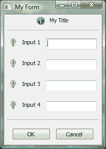

# wxPython Sizers 教程

> 原文：<https://www.blog.pythonlibrary.org/2008/05/18/a-wxpython-sizers-tutorial/>

我自愿在 [wxPython](http://www.wxpython.org) 中写一些关于常见 GUI 布局的教程。下面的例子来自 Malcolm， [wxPython 用户组](http://www.wxpython.org/maillist.php)的成员之一。

示例:简单的数据收集表单，其中图标和文本沿冒号的纵轴右对齐。

 `icon - title
separator
icon - text: - single line input control
icon - text: - single line input control
icon - text: - single line input control
icon - text: - multi-line text/list control that stretches vertically
separator
ok - cancel` 

首先，我们将创建一个 wx。框架来包含所有的部件，我们将创建一个 wx。面板来“修饰”框架，使其在所有平台上看起来都正常。

```py

import wx

class MyForm(wx.Frame):

    def __init__(self):
        wx.Frame.__init__(self, None, wx.ID_ANY, title='My Form')

        # Add a panel so it looks correct on all platforms
        self.panel = wx.Panel(self, wx.ID_ANY)

if __name__ == '__main__':
    app = wx.PySimpleApp()
    frame = MyForm().Show()
    app.MainLoop()

```

下一步是弄清楚如何创建一个图标。我将使用 wx。因为它提供了通用的跨平台位图/图标，我将把位图放在一个 wx 中。StaticBitmap 小工具。查看下面的示例代码:

bmp = wx。ArtProvider.GetBitmap(wx。艺术 _ 信息，wx。ART_OTHER，(16，16))
titleIco = wxStaticBitmap(self.panel，wx。ID_ANY，bmp)

我们来看看这里发生了什么。GetBitmap 的第一个参数是 art id，第二个是客户端(比如 wx。ART_TOOLBAR 或 wx。ART_MENU)第三个是图标的大小。StaticBitmap 的参数几乎是不言自明的。您也可以在 [wxPython 演示](http://www.wxpython.org/download.php)中看到两者的运行。

接下来，我们将把所有的代码放在一起，并把它们放在 sizers 中。我将只在这个例子中使用 BoxSizer。

```py

import wx

class MyForm(wx.Frame):

    def __init__(self):
        wx.Frame.__init__(self, None, wx.ID_ANY, title='My Form') 

        # Add a panel so it looks correct on all platforms
        self.panel = wx.Panel(self, wx.ID_ANY)

        bmp = wx.ArtProvider.GetBitmap(wx.ART_INFORMATION, wx.ART_OTHER, (16, 16))
        titleIco = wx.StaticBitmap(self.panel, wx.ID_ANY, bmp)
        title = wx.StaticText(self.panel, wx.ID_ANY, 'My Title')

        bmp = wx.ArtProvider.GetBitmap(wx.ART_TIP, wx.ART_OTHER, (16, 16))
        inputOneIco = wx.StaticBitmap(self.panel, wx.ID_ANY, bmp)
        labelOne = wx.StaticText(self.panel, wx.ID_ANY, 'Input 1')
        inputTxtOne = wx.TextCtrl(self.panel, wx.ID_ANY, '')

        inputTwoIco = wx.StaticBitmap(self.panel, wx.ID_ANY, bmp)
        labelTwo = wx.StaticText(self.panel, wx.ID_ANY, 'Input 2')
        inputTxtTwo = wx.TextCtrl(self.panel, wx.ID_ANY, '')

        inputThreeIco = wx.StaticBitmap(self.panel, wx.ID_ANY, bmp)
        labelThree = wx.StaticText(self.panel, wx.ID_ANY, 'Input 3')
        inputTxtThree = wx.TextCtrl(self.panel, wx.ID_ANY, '')

        inputFourIco = wx.StaticBitmap(self.panel, wx.ID_ANY, bmp)
        labelFour = wx.StaticText(self.panel, wx.ID_ANY, 'Input 4')
        inputTxtFour = wx.TextCtrl(self.panel, wx.ID_ANY, '')

        okBtn = wx.Button(self.panel, wx.ID_ANY, 'OK')        
        cancelBtn = wx.Button(self.panel, wx.ID_ANY, 'Cancel')
        self.Bind(wx.EVT_BUTTON, self.onOK, okBtn)
        self.Bind(wx.EVT_BUTTON, self.onCancel, cancelBtn)

        topSizer        = wx.BoxSizer(wx.VERTICAL)
        titleSizer      = wx.BoxSizer(wx.HORIZONTAL)
        inputOneSizer   = wx.BoxSizer(wx.HORIZONTAL)
        inputTwoSizer   = wx.BoxSizer(wx.HORIZONTAL)
        inputThreeSizer = wx.BoxSizer(wx.HORIZONTAL)
        inputFourSizer  = wx.BoxSizer(wx.HORIZONTAL)
        btnSizer        = wx.BoxSizer(wx.HORIZONTAL)

        titleSizer.Add(titleIco, 0, wx.ALL, 5)
        titleSizer.Add(title, 0, wx.ALL, 5)

        inputOneSizer.Add(inputOneIco, 0, wx.ALL, 5)
        inputOneSizer.Add(labelOne, 0, wx.ALL, 5)

        inputOneSizer.Add(inputTxtOne, 1, wx.ALL|wx.EXPAND, 5)

        inputTwoSizer.Add(inputTwoIco, 0, wx.ALL, 5)
        inputTwoSizer.Add(labelTwo, 0, wx.ALL, 5)
        inputTwoSizer.Add(inputTxtTwo, 1, wx.ALL|wx.EXPAND, 5)

        inputThreeSizer.Add(inputThreeIco, 0, wx.ALL, 5)
        inputThreeSizer.Add(labelThree, 0, wx.ALL, 5)
        inputThreeSizer.Add(inputTxtThree, 1, wx.ALL|wx.EXPAND, 5)

        inputFourSizer.Add(inputFourIco, 0, wx.ALL, 5)
        inputFourSizer.Add(labelFour, 0, wx.ALL, 5)
        inputFourSizer.Add(inputTxtFour, 1, wx.ALL|wx.EXPAND, 5)

        btnSizer.Add(okBtn, 0, wx.ALL, 5)
        btnSizer.Add(cancelBtn, 0, wx.ALL, 5)

        topSizer.Add(titleSizer, 0, wx.CENTER)
        topSizer.Add(wx.StaticLine(self.panel), 0, wx.ALL|wx.EXPAND, 5)
        topSizer.Add(inputOneSizer, 0, wx.ALL|wx.EXPAND, 5)
        topSizer.Add(inputTwoSizer, 0, wx.ALL|wx.EXPAND, 5)
        topSizer.Add(inputThreeSizer, 0, wx.ALL|wx.EXPAND, 5)
        topSizer.Add(inputFourSizer, 0, wx.ALL|wx.EXPAND, 5)
        topSizer.Add(wx.StaticLine(self.panel), 0, wx.ALL|wx.EXPAND, 5)
        topSizer.Add(btnSizer, 0, wx.ALL|wx.CENTER, 5)

        self.panel.SetSizer(topSizer)
        topSizer.Fit(self)

    def onOK(self, event):
        # Do something
        print 'onOK handler'

    def onCancel(self, event):
        self.closeProgram()

    def closeProgram(self):
        self.Close()

# Run the program
if __name__ == '__main__':
    app = wx.PySimpleApp()
    frame = MyForm().Show()
    app.MainLoop()

```

如果您运行这段代码，您应该会看到类似这样的内容:

[](https://www.blog.pythonlibrary.org/wp-content/uploads/2008/05/screenshot.jpg)

那么，这些分级器到底是如何工作的呢？让我们来看看。这是基本风格:

mySizer。添加(窗口、比例、标志、边框、用户数据)

第一个参数可以是窗口/小部件、sizer 或 size。第二个是比例，它允许开发人员指定当父窗口调整大小时一个项目拉伸多少。第三个是控制对齐、边框和调整大小的一个或一系列标志。第四个参数是边框，它是已经添加的小部件周围空白的像素数量。最后一个是 userData，我从来不用。然而，根据“wxPython in Action”一书的说法，它被用来为 sizer 的算法传递额外的数据。

我使用的三个位标志是 wx。全部，wx。展开和 wx。中心:wx。ALL 用于在小工具的所有边上放置 x 个像素；wx。EXPAND 告诉 sizer 当父窗口被拉伸时允许小部件扩展或拉伸；wx。居中将使小部件在小部件内水平和垂直居中。

如您所见，我为任何两个或更多需要水平对齐的小部件创建了一个单独的 BoxSizer。我还创建了一个垂直方向的主 BoxSizer，以便我可以在其中“堆叠”其他 Sizer。我也卡在了两个 wx 里。StaticLine 小部件在适当的位置作为分隔符。

最后，我使用 SetSizer()方法将面板连接到 topSizer。我还决定使用 sizer 的 Fit()方法来告诉 sizer 根据窗口(即框架)计算大小。您还可以通过使用 SetMinSize()方法设置包含小部件的最小大小来设置它。

现在您已经学习了使用 BoxSizers 设置表单的基本知识。

**下载:** [wxPythonSizer 教程](https://www.blog.pythonlibrary.org/wp-content/uploads/2008/05/wx_layout.txt)

**延伸阅读:**

*   [wx。ArtProvider 文档](http://wxpython.org/docs/api/wx.ArtProvider-class.html)
*   [学习尺码](http://spinecho.ze.cx/)
*   [使用分度器](http://wiki.wxpython.org/UsingSizers)