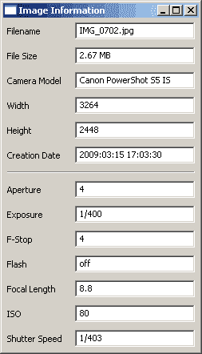
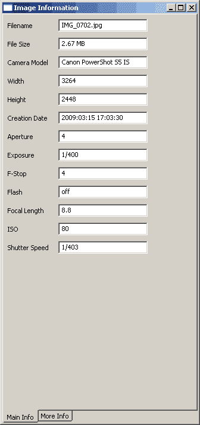
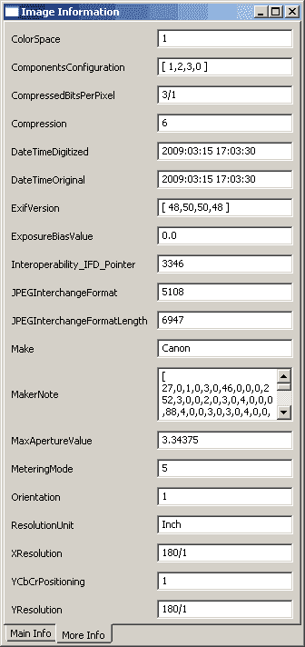

# 将 EXIF 浏览器添加到图像浏览器

> 原文：<https://www.blog.pythonlibrary.org/2010/04/10/adding-an-exif-viewer-to-the-image-viewer/>

前几天，我们创建了一个简单的图像查看器。今天，我们将创建一个辅助对话框来显示图像的 EXIF 数据，如果有的话。我们将这样做，当我们使用酷的[发布模块改变图片时，这个窗口将会更新。对于这个应用程序，我们将使用 wxPython 中包含的版本，但是也可以随意使用独立版本。](http://pypi.python.org/pypi/PyPubSub/)

## 展示 EXIF:简单的方式

[](https://www.blog.pythonlibrary.org/wp-content/uploads/2010/04/simple_exif.png)

首先，我们将创建一个非常简单的新框架，用于显示图像的 EXIF 数据。它只有 11 条数据，包括文件名和文件大小。一旦我们了解了代码的工作原理，我们将添加显示从 EXIF 解析器返回的所有数据的功能。我们开始吧！

```py

import os
import wx
from wx.lib.pubsub import Publisher

pil_flag = False
pyexif_flag = False

try:
    import exif
    pyexif_flag = True
except ImportError:
    try:
        from PIL import Image
        from PIL.ExifTags import TAGS
        pil_flag = True
    except ImportError:
        pass

#----------------------------------------------------------------------
def getExifData(photo):
    """
    Extracts the EXIF information from the provided photo
    """
    if pyexif_flag:
        exif_data = exif.parse(photo)
    elif pil_flag:
        exif_data  = {}
        i = Image.open(photo)
        info = i._getexif()
        for tag, value in info.items():
            decoded = TAGS.get(tag, tag)
            exif_data[decoded] = value
    else:
        raise Exception("PyExif and PIL not found!")
    return exif_data

#----------------------------------------------------------------------
def getPhotoSize(photo):
    """
    """
    photo_size = os.path.getsize(photo)
    photo_size = photo_size / 1024.0
    if photo_size > 1000:
        # photo is larger than 1 MB
        photo_size = photo_size / 1024.0
        size = "%0.2f MB" % photo_size
    else:
        size = "%d KB" % photo_size
    return size

########################################################################
class Photo:
    """"""

    #----------------------------------------------------------------------
    def __init__(self, photo):
        """Constructor"""
        self.exif_data = getExifData(photo)
        self.filename = os.path.basename(photo)
        self.filesize = getPhotoSize(photo)

########################################################################
class MainPanel(wx.Panel):
    """"""

    #----------------------------------------------------------------------
    def __init__(self, parent, photo):
        """Constructor"""
        wx.Panel.__init__(self, parent)

        # dict of Exif keys and static text labels
        self.photo_data = {"ApertureValue":"Aperture", "DateTime":"Creation Date",
                           "ExifImageHeight":"Height", "ExifImageWidth":"Width",
                           "ExposureTime":"Exposure", "FNumber":"F-Stop",
                           "Flash":"Flash", "FocalLength":"Focal Length", 
                           "ISOSpeedRatings":"ISO", "Model":"Camera Model", 
                           "ShutterSpeedValue":"Shutter Speed"}

        # TODO: Display filesize too!
        self.exif_data = photo.exif_data
        self.filename = photo.filename
        self.filesize = photo.filesize
        Publisher().subscribe(self.updatePanel, ("update"))

        self.mainSizer = wx.BoxSizer(wx.VERTICAL)
        self.layoutWidgets()
        self.SetSizer(self.mainSizer)

    #----------------------------------------------------------------------
    def layoutWidgets(self):
        """
        """
        ordered_widgets = ["Model", "ExifImageWidth", "ExifImageHeight",
                           "DateTime", "static_line",
                           "ApertureValue", "ExposureTime", "FNumber",
                           "Flash", "FocalLength", "ISOSpeedRatings",
                           "ShutterSpeedValue"
                           ]

        self.buildRow("Filename", self.filename, "Filename")
        self.buildRow("File Size", self.filesize, "FileSize")
        for key in ordered_widgets:
            if key not in self.exif_data and key != "static_line":
                continue
            if (key != "static_line"):
                self.buildRow(self.photo_data[key], self.exif_data[key], key)
            else:
                print "Adding staticLine"
                self.mainSizer.Add(wx.StaticLine(self), 0, wx.ALL|wx.EXPAND, 5)

    #----------------------------------------------------------------------
    def buildRow(self, label, value, txtName):
        """"""

        sizer = wx.BoxSizer(wx.HORIZONTAL)
        lbl = wx.StaticText(self, label=label, size=(75, -1))
        txt = wx.TextCtrl(self, value=value, size=(150,-1),
                          style=wx.TE_READONLY, name=txtName)
        sizer.Add(lbl, 0, wx.ALL|wx.CENTER, 5)
        sizer.Add(txt, 0, wx.ALL, 5)
        self.mainSizer.Add(sizer)

    #----------------------------------------------------------------------
    def updatePanel(self, msg):
        """"""
        photo = msg.data
        self.exif_data = photo.exif_data

        children = self.GetChildren()
        for child in children:
            if isinstance(child, wx.TextCtrl):
                self.update(photo, child)

    #----------------------------------------------------------------------
    def update(self, photo, txtWidget):
        """"""
        key = txtWidget.GetName()

        if key in self.exif_data:
            value = self.exif_data[key]
        else:
            value = "No Data"

        if key == "Filename":
            txtWidget.SetValue(photo.filename)
        elif key == "FileSize":
            txtWidget.SetValue(photo.filesize)
        else:
            txtWidget.SetValue(value)

########################################################################
class PhotoInfo(wx.Frame):
    """"""

    #----------------------------------------------------------------------
    def __init__(self, photo_path):
        """Constructor"""
        wx.Frame.__init__(self, None, title="Image Information")
        photo = Photo(photo_path)
        panel = MainPanel(self, photo)

        sizer = wx.BoxSizer(wx.VERTICAL)
        sizer.Add(panel, 1, wx.EXPAND)
        self.SetSizer(sizer)
        sizer.Fit(self)

        Publisher().subscribe(self.updateDisplay, ("update display"))
        self.Show()

    #----------------------------------------------------------------------
    def updateDisplay(self, msg):
        """
        """
        photo = msg.data
        new_photo = Photo(photo)
        Publisher().sendMessage(("update"), new_photo)

#----------------------------------------------------------------------
if __name__ == "__main__":
    import wx.lib.inspection
    app = wx.PySimpleApp()
    photo = "path/to/test/photo.jpg"
    frame = PhotoInfo(photo)
    wx.lib.inspection.InspectionTool().Show()
    app.MainLoop()

```

有很多代码需要检查，所以我们只讨论感兴趣的部分。首先，我们需要导入一些 Python EXIF 库。我更喜欢 pyexif，因为它很容易上手，但如果失败了，我会检查 Python 图像库(PIL)并导入它。如果您有其他喜欢的库，可以根据需要随意修改代码。一旦我们得到了想要加载的库，我们就设置一个标志，我们将在我们的 *getExifData* 函数中使用它。这个函数所做的就是解析传入的照片以获取其 EXIF 数据(如果有的话)，然后将该数据作为一个 **dict** 返回。我们还有一个 *getPhotoSize* 函数，用来计算照片的文件大小。最后，在我们进入 wxPython 代码之前的最后一部分是 *Photo* 类。我们使用这个类来使照片数据的传递变得更加容易。每个照片实例将具有以下三个属性:

*   exif_data
*   文件名
*   filesize

当我第一次开始编写这段代码时，我试图传递一堆关于文件的数据，这变得非常烦人和混乱。这要干净得多，尽管如果我们将这些函数放在 Photo 类本身中可能会更好。不过，我将把它留给读者作为练习。

在我们的 *MainPanel* 类中，我们创建了一个 *photo_data* 字典，其中保存了可能对用户最有用的 EXIF 数据。如果你认为应该有更多的，你可以根据需要修改字典。总之，dict 的键对应于从 exif 转储中返回的一些键。这些值将成为标签。在 *layoutWidgets* 方法中，我们迭代 dict 的键并创建由两个小部件组成的“行”:一个标签(wx。StaticText)和一个文本控件(wx。TextCtrl)。我们使用 TextCtrls 的 name 参数的键。这在用户切换图片时更新数据时很重要。

*updatePanel* 和 *update* 方法显然是用来在用户更改主控件中的照片时更新面板的小部件。这通过我们在主面板的 __init__ 中创建的 pubsub 接收器来实现。在这种情况下，我们实际上使用了 *PhotoInfo* frame 对象中的 pubsub 接收器来调用主面板的接收器。这主要是为了确保我们在正确的点上创建了一个新的照片实例，但是再看一下代码，我认为我们可以去掉框架中的第二个接收器，在面板的方法中做所有的事情。亲爱的读者，你还有一个有趣的学习项目。

## 显示 EXIF 数据:使用笔记本！

[](https://www.blog.pythonlibrary.org/wp-content/uploads/2010/04/exif_viewer.png)

如果我们就此打住，就会忽略很多数据。然而，有太多的额外数据，它不太适合这种大小的对话框。一个简单的解决方案是将数据放在一个可滚动的面板上，但是我们打算用一个笔记本小部件来代替，因为很多人不喜欢滚动。当然，您可以自由地进行一次冒险，单独使用 ScrolledPanel 小部件或将其与 notebook 的想法结合使用。不过现在，让我们来看看这个复杂的野兽:

```py

import os
import wx
from wx.lib.pubsub import Publisher

pil_flag = False
pyexif_flag = False

try:
    import exif
    pyexif_flag = True
except ImportError:
    try:
        from PIL import Image
        from PIL.ExifTags import TAGS
        pil_flag = True
    except ImportError:
        pass

#----------------------------------------------------------------------
def getExifData(photo):
    """
    Extracts the EXIF information from the provided photo
    """
    if pyexif_flag:
        exif_data = exif.parse(photo)
    elif pil_flag:
        exif_data  = {}
        i = Image.open(photo)
        info = i._getexif()
        for tag, value in info.items():
            decoded = TAGS.get(tag, tag)
            exif_data[decoded] = value
    else:
        raise Exception("PyExif and PIL not found!")
    return exif_data

#----------------------------------------------------------------------
def getPhotoSize(photo):
    """
    Takes a photo path and returns the size of the photo
    """
    photo_size = os.path.getsize(photo)
    photo_size = photo_size / 1024.0
    if photo_size > 1000:
        # photo is larger than 1 MB
        photo_size = photo_size / 1024.0
        size = "%0.2f MB" % photo_size
    else:
        size = "%d KB" % photo_size
    return size

########################################################################
class Photo:
    """
    Class to hold information about the passed in photo
    """

    #----------------------------------------------------------------------
    def __init__(self, photo):
        """Constructor"""
        self.exif_data = getExifData(photo)
        self.filename = os.path.basename(photo)
        self.filesize = getPhotoSize(photo)

########################################################################
class NBPanel(wx.Panel):
    """"""

    #----------------------------------------------------------------------
    def __init__(self, parent, photo, panelOne=False):
        """Constructor"""
        wx.Panel.__init__(self, parent)

        self.panelOne = panelOne
        # dict of Exif keys and static text labels
        self.photo_data = {"ApertureValue":"Aperture", "DateTime":"Creation Date",
                           "ExifImageHeight":"Height", "ExifImageWidth":"Width",
                           "ExposureTime":"Exposure", "FNumber":"F-Stop",
                           "Flash":"Flash", "FocalLength":"Focal Length", 
                           "ISOSpeedRatings":"ISO", "Model":"Camera Model", 
                           "ShutterSpeedValue":"Shutter Speed"}

        self.exif_data = photo.exif_data
        self.filename = photo.filename
        self.filesize = photo.filesize
        Publisher().subscribe(self.updatePanel, ("update"))

        self.mainSizer = wx.BoxSizer(wx.VERTICAL)
        self.layoutWidgets()
        self.SetSizer(self.mainSizer)

    #----------------------------------------------------------------------
    def layoutWidgets(self):
        """
        Create and layout the various widgets on the panel
        """
        ordered_widgets = ["Model", "ExifImageWidth", "ExifImageHeight",
                           "DateTime", "static_line",
                           "ApertureValue", "ExposureTime", "FNumber",
                           "Flash", "FocalLength", "ISOSpeedRatings",
                           "ShutterSpeedValue"
                           ]
        if self.panelOne:
            self.buildRow("Filename", self.filename, "Filename")
            self.buildRow("File Size", self.filesize, "FileSize")
            for key in ordered_widgets:
                if key not in self.exif_data:
                    continue
                if key != "static_line":
                    self.buildRow(self.photo_data[key], self.exif_data[key], key)
        else:
            keys = self.exif_data.keys()
            keys.sort()
            print "keys for second panel:"
            print keys
            for key in keys:
                if key not in self.exif_data:
                    continue
                if key not in ordered_widgets and "Tag" not in key:
                    self.buildRow(key, self.exif_data[key], key)

    #----------------------------------------------------------------------
    def buildRow(self, label, value, txtName):
        """
        Build a two widget row and add it to the main sizer
        """

        sizer = wx.BoxSizer(wx.HORIZONTAL)
        if self.panelOne:
            lbl = wx.StaticText(self, label=label, size=(75, -1))
        else: 
            lbl = wx.StaticText(self, label=label, size=(150, -1))
        txt = wx.TextCtrl(self, value=value, size=(150,-1),
                          style=wx.TE_READONLY, name=txtName)
        sizer.Add(lbl, 0, wx.ALL|wx.CENTER, 5)
        sizer.Add(txt, 0, wx.ALL, 5)
        self.mainSizer.Add(sizer)

    #----------------------------------------------------------------------
    def updatePanel(self, msg):
        """
        Iterate over the children widgets in the panel and update the 
        text control's values via the "update" method
        """
        photo = msg.data
        self.exif_data = photo.exif_data

        children = self.GetChildren()
        for child in children:
            if isinstance(child, wx.TextCtrl):
                self.update(photo, child)

    #----------------------------------------------------------------------
    def update(self, photo, txtWidget):
        """
        Updates the text control's values
        """
        key = txtWidget.GetName()

        if key in self.exif_data:
            value = self.exif_data[key]
        else:
            value = "No Data"

        if self.panelOne:
            if key == "Filename":
                txtWidget.SetValue(photo.filename)
            elif key == "FileSize":
                txtWidget.SetValue(photo.filesize)
            else:
                txtWidget.SetValue(value)
        else:
            txtWidget.SetValue(value)

########################################################################
class InfoNotebook(wx.Notebook):
    """"""

    #----------------------------------------------------------------------
    def __init__(self, parent, photo):
        """Constructor"""
        wx.Notebook.__init__(self, parent, style=wx.BK_BOTTOM)

        self.tabOne = NBPanel(self, photo, panelOne=True)
        self.tabTwo = NBPanel(self, photo)
        self.AddPage(self.tabOne, "Main Info")
        self.AddPage(self.tabTwo, "More Info")
        Publisher().subscribe(self.updateDisplay, ("update display"))

    #----------------------------------------------------------------------
    def updateDisplay(self, msg):
        """
        Catches the PubSub's "event", creates a new photo instance and
        passes that info to the panel so it can update
        """
        photo = msg.data
        new_photo = Photo(photo)
        Publisher().sendMessage(("update"), new_photo)

########################################################################
class PhotoInfo(wx.Frame):
    """"""

    #----------------------------------------------------------------------
    def __init__(self, photo_path):
        """Constructor"""
        wx.Frame.__init__(self, None, title="Image Information")
        photo = Photo(photo_path)
        panel = wx.Panel(self)
        notebook = InfoNotebook(panel, photo)

        mainSizer = wx.BoxSizer(wx.VERTICAL)
        sizer = wx.BoxSizer(wx.VERTICAL)
        sizer.Add(notebook, 1, wx.EXPAND)
        panel.SetSizer(sizer)

        mainSizer.Add(panel)
        self.SetSizer(mainSizer)
        mainSizer.Fit(self)
        self.Show()

#----------------------------------------------------------------------
if __name__ == "__main__":
    app = wx.PySimpleApp()
    photo = r'path/to/photo.jpg'
    frame = PhotoInfo(photo)
    app.MainLoop()    

```

这段代码可以做一个很好的重构，但它工作得很好。让我们来看看这个版本和上一个版本之间的区别。首先，我们将*主面板*改为*次面板*，因为它现在将是一个笔记本面板/选项卡。我们还向 init 添加了一个额外的参数，以允许我们使第一个面板不同于第二个面板(即 *panelOne* )。然后在 *layoutWidgets* 方法中，我们使用 panelOne 标志将 *ordered_widgets* 放在第一个选项卡上，将剩余的 EXIF 数据放在第二个选项卡上。我们还以大致相同的方式更改了*更新*方法。最后，我们添加了 *InfoNotebook* 类来创建笔记本小部件，并将它的一个实例放在框架上。如果您经常处理 EXIF 数据，那么您会知道有几个字段相当长。我们应该把它们放在多行文本控件中。这里有一种方法，通过稍微改变我们的 *buildRow* 方法:

```py

def buildRow(self, label, value, txtName):
    """
    Build a two widget row and add it to the main sizer
    """

    sizer = wx.BoxSizer(wx.HORIZONTAL)
    if self.panelOne:
        lbl = wx.StaticText(self, label=label, size=(75, -1))
    else: 
        lbl = wx.StaticText(self, label=label, size=(150, -1))
    if len(value) < 40:
        txt = wx.TextCtrl(self, value=value, size=(150,-1),
                          style=wx.TE_READONLY, name=txtName)
    else:
        txt = wx.TextCtrl(self, value=value, size=(150,60),
                          style=wx.TE_READONLY|wx.TE_MULTILINE,
                          name=txtName)
    sizer.Add(lbl, 0, wx.ALL|wx.CENTER, 5)
    sizer.Add(txt, 0, wx.ALL, 5)
    self.mainSizer.Add(sizer)

```

在这个代码片段中，我们只是添加了一个 IF 语句来检查值的长度是否少于 40 个字符。如果是这样，我们创建了一个普通的文本控件；否则我们创建了一个多行文本控件。这不是很容易吗？下面是第二个选项卡现在的样子:

[](https://www.blog.pythonlibrary.org/wp-content/uploads/2010/04/exif_viewer21.png)

## 包扎

我们需要查看的最后一部分是主程序中需要更改的内容。基本上，我们只需要添加一个信息按钮，实例化我们的 EXIF 浏览器，并在按钮的事件处理程序中显示它。类似这样的事情会起作用:

```py

frame = photoInfo.PhotoInfo(self.currentPicturePath)
frame.Show()

```

要更新 EXIF 浏览器，我们需要向它发送一条 Pubsub 消息。我们可以在 previous 和 next 按钮事件中发送消息，但是我们必须在两个地方维护代码。相反，我们将把新代码放在 *loadImage* 方法中，并像这样发送消息:

```py

Publisher().sendMessage("update display", self.currentPicturePath)

```

这就是全部了。我在下面的下载小节中包含了完整的源代码。希望这有助于您了解向 GUI 项目添加新特性是多么容易，以及如何使用 wxPython 显示 EXIF 数据。

## 下载

*   [exif_viewer.zip](https://www.blog.pythonlibrary.org/wp-content/uploads/2010/04/exif_viewer.zip)
*   [exif_viewer.tar](https://www.blog.pythonlibrary.org/wp-content/uploads/2010/04/exif_viewer.tar)