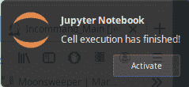
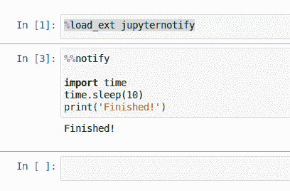

# 向长期运行的 Jupyter 笔记本单元格添加通知

> 原文：<https://www.blog.pythonlibrary.org/2019/12/04/adding-notifications-to-long-running-jupyter-notebook-cells/>

如果您使用 Jupyter Notebook 运行长时间运行的流程，如机器学习培训，那么您可能想知道细胞何时完成执行。有一个很棒的浏览器插件可以帮助你解决这个问题，它叫做 [jupyter-notify](https://github.com/ShopRunner/jupyter-notify) 。它将允许您在单元格执行完毕时让浏览器发送一条弹出消息。

通知将类似于以下内容:



让我们了解一下如何将此通知添加到您的 Jupyter 笔记本中！

* * *

### 装置

你需要做的第一件事是安装 Jupyter 笔记本，如果你还没有这样做。下面是如何使用 pip 实现这一点:

```py

pip install jupyter

```

一旦安装完毕，您将需要安装 **jupyter-notify** :

```py

pip install jupyternotify

```

现在你已经安装了所有的包，让我们来试试吧！

* * *

### 使用 Jupyter-Notify

要使用 jupyter-notify，您需要运行 Jupyter Notebook。在终端中，运行这个命令: **jupyter notebook**

现在，在笔记本的第一个单元格中输入以下文本:

```py

%load_ext jupyternotify

```

这将加载 jupyter-notify 扩展。运行那个单元。您可能会看到浏览器要求您允许笔记本发出通知。您将希望允许通知程序正常工作。

现在，您需要将以下代码添加到笔记本的下一个单元格中:

```py

%%notify

import time
time.sleep(10)
print('Finished!')

```

您的笔记本现在应该看起来像这样:



现在运行第二个单元。它将调用 **time.sleep()** ，这将使代码暂停执行您指定的秒数。在这种情况下，您希望暂停执行 10 秒钟，然后打印出一条消息，说明该单元“已完成！”。当单元格完成执行时，您应该会看到一个弹出通知，如下所示:


如果您想定制 jupyter-notify 发出的消息，那么您可以将第二个单元格更改为:

```py

%%notify -m "The cell has finished running"

import time
time.sleep(10)
print('Finished!')

```

请注意，第一行已经更改为接受一个标志和一个消息字符串。如果您愿意，您可以在单元格内发送多条消息。只需在代码中多次放置 **%%notify -m "some message"** 。

例如，您可以将上面的代码改为:

```py

import time
time.sleep(10)
%notify -m "The cell finished sleeping"
print('Finished!')
%notify -m "All done!"

```

为了让这段代码工作，您需要确保 **%notify** 只有百分之一(%)符号，而不是两个，因为这是 Jupyter 笔记本中的**线条魔术**。

* * *

### 包扎

jupyter-notify 包非常简洁，但是如果你被同事打断，很容易错过通知。一个解决方案是你可以使用它 [py-toolbox](https://py-toolbox.readthedocs.io/en/latest/) ，它有一个 [Notify](https://py-toolbox.readthedocs.io/en/latest/modules/notification.html#setup-monitoring-for-your-long-running-tasks) 对象，当一个函数或单元格完成时，你可以用它给自己发电子邮件。

无论哪种方式，如果您想让 Jupyter 笔记本在处理完成时通知您，都有解决方案可供您使用。

就个人而言，如果我有一个长时间运行的进程，我可能会将它放入 Python 脚本文件中，而不是放入 Jupyter 笔记本中，因为这样会使我的代码更容易测试和调试。但是，如果你喜欢使用 Jupyter 笔记本，这些软件包可能是正确的选择！