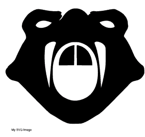
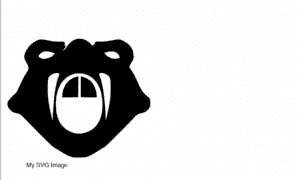
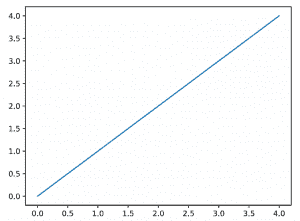

# 使用 Python 和 ReportLab 向 pdf 添加 SVG

> 原文：<https://www.blog.pythonlibrary.org/2018/04/12/adding-svg-files-in-reportlab/>

ReportLab 支持生成 SVG，但不支持在 pdf 中嵌入 SVG。幸运的是，Dinu Gherman 创建了 **[svglib](https://pypi.python.org/pypi/svglib/)** 包，这是一个纯 Python 包，可以读取 SVG 文件并将其转换为 ReportLab 可以使用的其他格式。svglib 的官方网站在 [Github](https://github.com/deeplook/svglib) 上。

svglib 包可以在 Linux、Mac OS 和 Windows 上运行。该网站声称它适用于 Python 2.7 - 3.5，但也应该适用于较新版本的 Python。

您可以使用 svglib 读取现有的 SVG giles，并将它们转换为 ReportLab **Drawing** 对象。svglib 包还有一个命令行工具， **svg2pdf** ，可以将 svg 文件转换成 pdf。

* * *

### 属国

svglib 包依赖于 **ReportLab** 和 **lxml** 。您可以使用 pip 安装这两个软件包:

```py

pip install reportlab lxml

```

* * *

### 装置

svglib 软件包可以使用三种方法之一进行安装。

#### 安装最新版本

如果您想安装 Python 打包索引的最新版本，那么您可以按正常方式使用 pip:

```py

pip install svglib

```

* * *

#### 从源代码管理的最新版本安装

如果您想使用最新版本的代码(例如，bleeding edge / alpha builds)，那么您可以使用 pip 直接从 Github 安装，如下所示:

```py

pip install git+https://github.com/deeplook/svglib

```

* * *

#### 手动安装

大多数时候，使用 pip 是可行的方法。但是如果您愿意，也可以从 Python 打包索引下载 tarball 并自动完成 pip 为您完成的所有步骤。只需在您的终端中依次运行以下三个命令:

```py

tar xfz svglib-0.8.1.tar.gz
cd svglib-0.8.1
python setup.py install

```

现在我们已经安装了 svglib，让我们来学习如何使用它！

* * *

### 使用

在 ReportLab 中使用 svglib 实际上相当容易。你所需要做的就是从 **svglib.svglib** 导入 **svg2rlg** ，并给它你的 svg 文件的路径。让我们来看看:

```py

# svg_demo.py

from reportlab.graphics import renderPDF, renderPM
from svglib.svglib import svg2rlg

def svg_demo(image_path, output_path):
    drawing = svg2rlg(image_path)
    renderPDF.drawToFile(drawing, output_path)
    renderPM.drawToFile(drawing, 'svg_demo.png', 'PNG')

if __name__ == '__main__':
    svg_demo('snakehead.svg', 'svg_demo.pdf')

```

在给 **svg2rlg** 你的路径到 svg 文件后，它将返回一个绘图对象。然后你可以用这个对象把它写成 PDF 或者 PNG。您可以继续使用这个脚本来创建您自己的 SVG 到 PNG 转换实用程序！

* * *

### 在画布上画画

就我个人而言，我不喜欢像前面的例子那样创建只有一个图像的一次性 pdf。相反，我希望能够插入图像，并写出文本和其他东西。幸运的是，您可以通过使用绘图对象在画布上绘画来非常容易地做到这一点。这里有一个例子:

```py

# svg_on_canvas.py

from reportlab.graphics import renderPDF
from reportlab.pdfgen import canvas
from svglib.svglib import svg2rlg

def add_image(image_path):
    my_canvas = canvas.Canvas('svg_on_canvas.pdf')
    drawing = svg2rlg(image_path)
    renderPDF.draw(drawing, my_canvas, 0, 40)
    my_canvas.drawString(50, 30, 'My SVG Image')
    my_canvas.save()

if __name__ == '__main__':
    image_path = 'snakehead.svg'
    add_image(image_path)

```

这里我们创建一个**画布。画布**对象，然后创建我们的 SVG 绘图对象。现在您可以使用 **renderPDF.draw** 在画布上的特定 x/y 坐标处绘制您的图形。我们在图片下面画出一些小的文字，然后保存下来。结果应该是这样的:



* * *

### 将 SVG 添加到可流动的

ReportLab 中的绘图通常可以作为可流动列表添加，并使用文档模板构建。svglib 的网站上说，它的绘图对象与 ReportLab 的可流动系统兼容。让我们在这个例子中使用一个不同的 SVG。我们将使用维基百科上的古巴国旗。svglib 测试在他们的测试中下载了大量的 flag SVGs，所以我们将尝试他们使用的一个图像。您可以在此处获得:

https://upload.wikimedia.org/wikipedia/commons/b/bd/Flag_of_Cuba.svg

一旦保存了图像，我们就可以看看代码了:

```py

# svg_demo2.py

import os

from reportlab.graphics import renderPDF, renderPM
from reportlab.platypus import SimpleDocTemplate
from svglib.svglib import svg2rlg

def svg_demo(image_path, output_path):
    drawing = svg2rlg(image_path)

    doc = SimpleDocTemplate(output_path)

    story = []
    story.append(drawing)

    doc.build(story)

if __name__ == '__main__':
    svg_demo('Flag_of_Cuba.svg', 'svg_demo2.pdf')

```

这工作得很好，虽然旗帜在右边被切掉了。以下是输出结果:


实际上，我在这个例子中遇到了一些麻烦。ReportLab 或 svglib 似乎对 SVG 的格式或大小非常挑剔。根据我使用的 SVG，我会以一个 **AttributeError** 或一个空白文档结束，或者我会成功。所以你的里程可能会有所不同。我要说的是，我与一些核心开发人员交谈过，他们提到**SimpleDocTemplate**不能让您对绘图进入的框架进行足够的控制，因此您可能需要创建自己的**框架**或**页面模板**来使 SVG 正确显示。让 **snakehead.svg** 工作的一个变通方法是将左右边距设置为零:

```py

# svg_demo3.py

from reportlab.platypus import SimpleDocTemplate
from svglib.svglib import svg2rlg

def svg_demo(image_path, output_path):
    drawing = svg2rlg(image_path)

    doc = SimpleDocTemplate(output_path,
                            rightMargin=0,
                            leftMargin=0)

    story = []
    story.append(drawing)

    doc.build(story)

if __name__ == '__main__':
    svg_demo('snakehead.svg', 'svg_demo3.pdf')

```

* * *

### 在 ReportLab 中缩放 SVG

默认情况下，使用 svglib 创建的 SVG 绘图不会缩放。所以你需要写一个函数来帮你做这件事。让我们来看看:

```py

# svg_scaled_on_canvas.py

from reportlab.graphics import renderPDF
from reportlab.pdfgen import canvas
from svglib.svglib import svg2rlg

def scale(drawing, scaling_factor):
    """
    Scale a reportlab.graphics.shapes.Drawing()
    object while maintaining the aspect ratio
    """
    scaling_x = scaling_factor
    scaling_y = scaling_factor

    drawing.width = drawing.minWidth() * scaling_x
    drawing.height = drawing.height * scaling_y
    drawing.scale(scaling_x, scaling_y)
    return drawing

def add_image(image_path, scaling_factor):
    my_canvas = canvas.Canvas('svg_scaled_on_canvas.pdf')
    drawing = svg2rlg(image_path)
    scaled_drawing = scale(drawing, scaling_factor=scaling_factor)
    renderPDF.draw(scaled_drawing, my_canvas, 0, 40)
    my_canvas.drawString(50, 30, 'My SVG Image')
    my_canvas.save()

if __name__ == '__main__':
    image_path = 'snakehead.svg'
    add_image(image_path, scaling_factor=0.5)

```

这里我们有两个函数。第一个函数将使用缩放因子来缩放我们的图像。在这种情况下，我们使用 0.5 作为缩放因子。然后我们对我们的绘图对象做一些数学运算，并告诉它自己缩放。最后，我们用和上一个例子一样的方法把它拉出来。

结果如下:



* * *

### 在 ReportLab 中使用 matplotlib 中的 SVG 图

在之前的[文章](https://www.blog.pythonlibrary.org/2016/02/18/reportlab-how-to-add-charts-graphs/)中，我们学习了如何仅使用 ReportLab 工具包来创建图表。不过，最流行的 2D Python 绘图包之一是 **matplotlib** 。你可以在这里阅读所有关于 matplotlib 的内容:【https://matplotlib.org/[。我在本文中提到 matplotlib 的原因是它支持 SVG 作为其输出格式之一。因此，我们将了解如何使用 matplotlib 创建一个图，并将其插入 ReportLab。](https://matplotlib.org/)

要安装 matplotlib，最流行的方法是使用 pip:

```py

pip install matplotlib

```

现在我们已经安装了 matplotlib，我们可以创建一个简单的绘图并将其导出为 SVG。让我们看看这是如何工作的:

```py

import matplotlib.pyplot as pyplot

def create_matplotlib_svg(plot_path):
    pyplot.plot(list(range(5)))
    pyplot.title = 'matplotlib SVG + ReportLab'
    pyplot.ylabel = 'Increasing numbers'
    pyplot.savefig(plot_path, format='svg')

if __name__ == '__main__':
    from svg_demo import svg_demo
    svg_path = 'matplot.svg'
    create_matplotlib_svg(svg_path)
    svg_demo(svg_path, 'matplot.pdf')

```

在这段代码中，我们从 matplotlib 导入了 **pyplot** 子库。接下来，我们创建一个简单的函数，它采用我们想要保存绘图的路径。对于这个简单的图，我们为其中一个轴创建了一个简单的五个数字的范围。当我们添加标题和 y 标签时。最后，我们将绘图作为 SVG 保存到磁盘。

最后一步是在代码底部的 **if** 语句中。这里我们导入了本文前面的 **svg_demo** 代码。我们创建 oru SVG 图像，然后通过我们的演示代码将它转换成 PDF。

结果看起来像这样:



* * *

### 使用 svg2pdf

当您安装 svglib 时，您还会得到一个名为 **svg2pdf** 的命令行工具。顾名思义，您可以使用该工具将 SVG 文件转换为 PDF 文件。让我们看几个例子:

```py

svg2pdf /path/to/plot.svg

```

这个命令只接受您想要转换成 PDF 的 SVG 文件的路径。它会自动将输出重命名为与输入文件相同的名称，但带有 PDF 扩展名。不过，您可以指定输出名称:

```py

svg2pdf -o /path/to/output.pdf /path/to/plot.svg

```

**-o** 标志告诉 svg2pdf 要求您传入输出 pdf 路径，后跟输入 svg 路径。

该文档还提到，您可以使用如下命令将所有 SVG 文件转换为 pdf:

```py

svg2pdf -o "%(base)s.pdf" path/to/file*.svg

```

这将为指定文件夹中的每个 SVG 文件将输出 PDF 重命名为与输入 SVG 文件相同的名称。

* * *

### 包扎

在写这本书的时候，svglib 是向 ReportLab 添加 SVG 的主要方法。虽然它不是全功能的，但它工作得很好，API 也很好。我们还学习了如何插入通过流行的 matplotlib 包创建的 plot SVG。最后，我们看了如何使用 svg2pdf 命令行工具将 svg 转换成 pdf。

* * *

### 相关阅读

*   简单的分步报告实验室[教程](https://www.blog.pythonlibrary.org/2010/03/08/a-simple-step-by-step-reportlab-tutorial/)
*   ReportLab 101: [文本对象](https://www.blog.pythonlibrary.org/2018/02/06/reportlab-101-the-textobject/)
*   ReportLab - [如何添加图表和图形](https://www.blog.pythonlibrary.org/2016/02/18/reportlab-how-to-add-charts-graphs/)
*   [用 Python 提取 PDF 元数据](https://www.blog.pythonlibrary.org/2018/04/10/extracting-pdf-metadata-and-text-with-python/)和文本